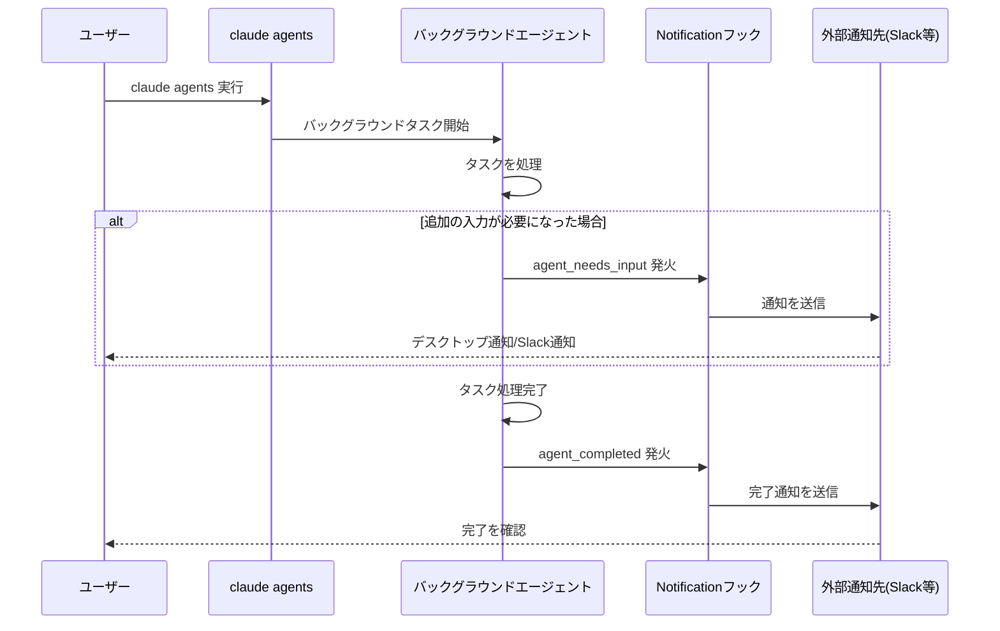
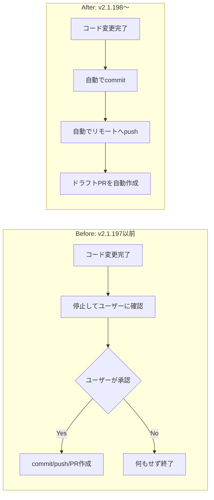
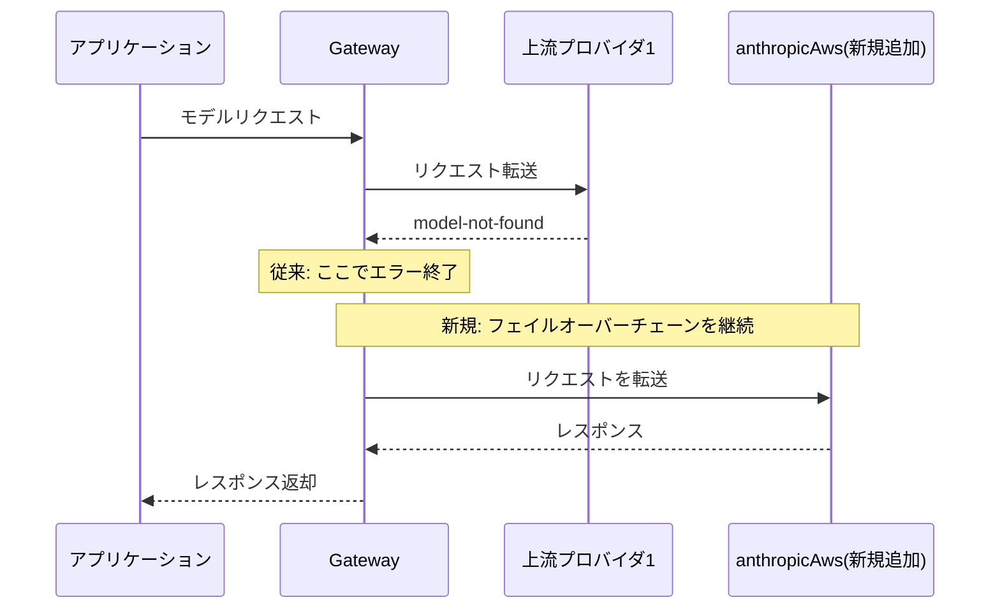

## はじめに

2026年7月、Claude Code の最新バージョン **v2.1.198** がリリースされました。今回の目玉は Chrome 拡張機能「**Claude in Chrome**」の一般提供（GA）開始ですが、それ以上に注目すべきは**バックグラウンドエージェントの自律運用がさらに一歩進んだ**ことです。

具体的には、エージェントの状態変化を検知する Notification フックが追加され、さらに**作業完了後の確認なしで自動的に commit / push / ドラフト PR 作成まで行う**ようになりました。これは開発ワークフローに直接影響するデフォルト挙動の変更であり、CI/CD やブランチ保護ルールを運用しているチームは特に注意が必要です。

加えて、対話型の `/agents` ウィザードが廃止されるなど、既存の運用手順書やドキュメントの見直しが必要な変更も含まれています。本記事では、これらの変更点を「何が変わったか」だけでなく「なぜ重要か」「どう対応すべきか」の観点で整理します。

> **📌 影響を受ける人**
> - Claude Code の `claude agents`（バックグラウンドエージェント）を業務フローに組み込んでいる開発者・チーム
> - `/agents` ウィザードを使ってサブエージェントを作成・管理していた人
> - Gateway 経由で複数の LLM プロバイダをフェイルオーバー構成している人
> - Chrome 拡張版 Claude をプレビューで試していた、あるいはこれから使いたい人

## 変更の全体像

v2.1.198 の変更は大きく「エージェント自律化の強化」「エコシステムの拡大」「非推奨対応」の3系統に分類できます。

```mermaid
graph TD
    A[Claude Code v2.1.198] --> B[エージェント自律化強化]
    A --> C[エコシステム拡大]
    A --> D[非推奨対応]

    B --> B1[Notificationフック追加<br/>agent_needs_input / agent_completed]
    B --> B2[完了時 自動commit/push/ドラフトPR]
    B --> B3[Exploreエージェントの<br/>モデル継承]
    B --> B4[サブエージェント/圧縮の<br/>拡張思考設定継承]

    C --> C1[Claude in Chrome<br/>一般提供(GA)開始]
    C --> C2[Gateway に AWS上の<br/>Claude Platform を上流追加]

    D --> D1[/agents ウィザード廃止]

    style B2 fill:#ffdddd,stroke:#cc0000
    style D1 fill:#ffdddd,stroke:#cc0000
    style C1 fill:#ddeeff,stroke:#0066cc
```

赤枠は特に**運用フローへの影響が大きい変更**、青枠は**利用範囲が広がるポジティブな変更**です。以降、severity が high の変更を中心に、影響度の高いものから解説します。

## 変更内容

### 1. Claude in Chrome が一般提供（GA）開始【severity: high】

ブラウザ拡張「Claude in Chrome」がプレビューを経て正式提供となりました。これまで一部ユーザーのみが利用できたブラウザ内 Claude 連携が、全ユーザーに開放されます。ブラウザ操作の自動化やページ内容を踏まえた質問応答などのユースケースが、より多くの開発者にとって利用可能になります。

### 2. バックグラウンドエージェントの通知フック追加【severity: medium】

`claude agents` で起動したセッションが「入力待ち」または「完了」状態になったタイミングで、`agent_needs_input` / `agent_completed` という2種類の Notification フックが発火するようになりました。



これにより、複数のバックグラウンドエージェントを並行稼働させても、詰まっているセッションや完了したセッションを能動的に監視する必要がなくなります。

### 3. 完了時に自動で commit・push・ドラフトPR作成【severity: high・要対応】

今回のリリースで**最も運用インパクトが大きい変更**です。従来、バックグラウンドエージェントは worktree でのコード変更が完了すると、そこで停止しユーザーに確認を求めていました。v2.1.198 以降は、確認なしで自動的に commit → push → ドラフト PR 作成まで実行します。



> **⚠️ Breaking Change**
> ユーザーの明示的な承認なしにリモートリポジトリへの push が発生するようになりました。ブランチ保護ルールや PR レビュー体制を運用しているチームは、意図しないブランチへの push やドラフト PR の乱立が起きないか確認してください。

### 4. Gateway に AWS 上の Claude Platform を上流プロバイダとして追加【severity: medium】

Gateway の上流プロバイダとして `anthropicAws`（AWS 上の Claude Platform）が追加されました。従来はモデルが見つからない（model-not-found）応答を受けるとそこでエラー停止していましたが、今後はフェイルオーバーチェーンの次のプロバイダへ自動的に切り替わります。



マルチクラウド構成や AWS 経由での Claude 利用を組み合わせている場合、可用性が向上します。

### 5. /agents ウィザードの廃止【severity: medium・破壊的変更】

対話型の `/agents` ウィザードが削除されました。

| 項目 | 旧（〜v2.1.197） | 新（v2.1.198〜） |
|---|---|---|
| サブエージェント作成 | `/agents` ウィザードで対話的に作成 | Claude に依頼 または `.claude/agents/` を直接編集 |
| 管理・編集 | ウィザード内で完結 | ファイルベースでの直接編集 |
| ドキュメント記載 | `/agents` の手順を前提とした記述が有効 | 該当箇所の書き換えが必要 |

> **⚠️ Breaking Change**
> `/agents` を前提とした社内ドキュメントやオンボーディング資料がある場合は更新が必要です。

### その他の改善・修正（severity: low〜medium）

| 変更 | 概要 |
|---|---|
| Explore エージェントのモデル継承 | 従来 haiku 固定だったが、メインセッションのモデル（上限 opus）を継承 |
| 拡張思考設定の継承 | サブエージェント・コンテキスト圧縮が extended thinking 設定を継承し出力品質が向上 |
| ネットワーク断の自動リトライ | 応答中の ECONNRESET 等の一時エラーをバックオフ付きリトライで継続 |
| 安定性・UI バグ修正 | エージェントチームの障害報告、`/diff` パネル更新漏れ、STS トークン失効時の `/login` 詰まりなど計17件 |
| UX 改善 | フォーカスモードでのサブエージェント表示、highlight.js 11 化によるシンタックスハイライト精度向上など計6件 |

## 影響と対応

- **ブランチ保護・PRレビュー体制の確認**: バックグラウンドエージェントの自動 push / ドラフト PR 作成がチームのブランチ保護ポリシーと衝突しないか確認する
- **Notification フックの設定**: `agent_needs_input` / `agent_completed` を活用し、Slack やデスクトップ通知と連携する仕組みを整備すると、複数エージェントの並行運用がしやすくなる
- **`/agents` 関連ドキュメントの棚卸し**: 社内 Wiki やオンボーディング資料に `/agents` ウィザードの手順が残っていないか確認し、`.claude/agents/` の直接編集手順に置き換える
- **Gateway 構成の見直し**: 複数プロバイダを利用している場合、`anthropicAws` を上流に追加することでフェイルオーバーの信頼性を高められる
- **Chrome 拡張の展開検討**: これまでプレビュー待ちだったチームは、GA 化に伴い本格導入を検討できる

## コード例

### Notification フックの設定例（`settings.json`）

```json
{
  "hooks": {
    "Notification": [
      {
        "matcher": "agent_needs_input",
        "hooks": [
          {
            "type": "command",
            "command": "notify-send 'Claude Agent' '入力待ちのセッションがあります'"
          }
        ]
      },
      {
        "matcher": "agent_completed",
        "hooks": [
          {
            "type": "command",
            "command": "curl -X POST -H 'Content-type: application/json' --data '{\"text\":\"バックグラウンドエージェントが完了しました\"}' $SLACK_WEBHOOK_URL"
          }
        ]
      }
    ]
  }
}
```

### サブエージェント定義（`/agents` ウィザードの代替）

Before（廃止された手順）:

```
$ /agents
> ウィザードに従って対話的に作成...
```

After（`.claude/agents/` を直接編集）:

```markdown
---
name: code-reviewer
description: コード変更のレビューを専門に行うサブエージェント
tools: Read, Grep, Bash
---

変更差分を確認し、バグ・セキュリティリスク・簡素化の余地を指摘してください。
```

もしくはメインセッションで Claude に直接依頼することでも作成できます。

```
このリポジトリ用に、コードレビュー専門のサブエージェントを
.claude/agents/code-reviewer.md として作成して
```

## まとめ

Claude Code v2.1.198 は、Chrome 拡張の GA 化という表向きの大きなニュースの裏で、**バックグラウンドエージェントの自律運用を大きく前進させたリリース**です。特に「完了時の自動 commit/push/ドラフト PR 作成」はデフォルト挙動の変更であり、既存の開発フローに与える影響を事前に確認しておくことを強く推奨します。

また `/agents` ウィザードの廃止は小さな変更に見えて、ドキュメントやオンボーディング資料の更新漏れにつながりやすいため、忘れずに棚卸ししておきましょう。Gateway への AWS プロバイダ追加や Explore エージェントのモデル継承など、地味ながら可用性・品質面の改善も着実に積み重ねられています。

チームでの導入・運用ルールを見直すよいタイミングとして、今回のアップデート内容を確認してみてください。
