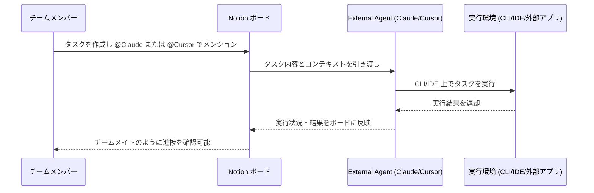

## はじめに

2026年7月1日、Notionのメジャーアップデート「Notion 3.6」がリリースされました。今回の目玉は、単発のチャットや個別ツールに閉じていたAIエージェントを、チーム全体で共有・実行できる基盤へと進化させた点です。

具体的には、**Claude・Cursorといった外部エージェントをNotion上のボードから直接呼び出せる「External Agents」**の導入、Custom Agents向けMCP接続の5つ追加、Microsoft Office/Outlookとの統合、そしてOpus 4.8・Grok 4.3・GLM 5.2など新モデル群への対応が含まれます。

これは単なる機能追加ではなく、Notionを「ドキュメントツール」から「チーム横断のAIエージェント・オーケストレーション基盤」へと位置づけ直す動きだと言えます。本記事では特に影響の大きい変更を中心に、開発者・チーム管理者が取るべき対応も含めて解説します。

## 変更の全体像

Notion 3.6における主要な変更の関係性を図示します。

```mermaid
graph TD
    A[Notion 3.6] --> B[External Agents]
    A --> C[Custom Agents 強化]
    A --> D[Microsoft連携]
    A --> E[AI Meeting Notes]
    A --> F[開発者/運用]

    B --> B1[Claude 統合]
    B --> B2[Cursor 統合]
    B --> B3[チーム共有ボードから@メンション実行]

    C --> C1[MCP接続 +5<br/>Mercury/Mixpanel/Miro/Box/ClickHouse]
    C --> C2[新モデル対応<br/>Opus 4.8 / Grok 4.3 / GLM 5.2]
    C --> C3[監査ログ対応 Enterprise]
    C --> C4[Custom Agent 複製機能]

    D --> D1[PPTX/XLSX/DOCX/PDF 読み書き]
    D --> D2[Outlook Mail/Calendar 操作]

    E --> E1[話者ラベル自動識別]
    E --> E2[外部音声ファイルの文字起こし]

    F --> F1[Windows で Notion Workers 開発]
    F --> F2[クレジットダッシュボードに Workers 追加]
```

特に **External Agents** と **MCP接続拡張** は、Notionを起点にした社内ツールチェーン全体の自動化に直結するため、影響範囲が広い変更です。

外部エージェントを呼び出す際の流れは以下のようになります。



## 変更内容

今回のアップデートのうち、影響度（severity）が high または medium の変更を中心に整理します。

| ID | 変更内容 | severity | 概要 |
|---|---|---|---|
| change-001 | External Agents（Claude/Cursor） | high | チーム共有ボードから外部エージェントを割り当て・@メンションで実行 |
| change-006 | Custom Agents向けMCP接続 +5 | high | Mercury・Mixpanel・Miro・Box・ClickHouse を標準搭載 |
| change-007 | 新モデル対応 | high | Opus 4.8、Grok 4.3、GLM 5.2 を選択可能に |
| change-003 | インタラクティブHTMLブロック | medium | ROI計算機やクイズなど対話型コンテンツをドキュメント内に作成 |
| change-004 | Office/PDF 読み書き対応 | medium | PPTX・XLSX・DOCX・PDFの読み込みと生成 |
| change-005 | Outlook連携 | medium | メール整理・返信下書き・会議スケジューリングを代行 |
| change-002 | AI Meeting Notes 話者ラベル | medium | マイクのアクティブ状況から発言者を識別し要約精度向上 |
| change-008 | 監査ログでCustom Agent追跡 | medium | Enterprise向け。実行内容・変更・トリガー元を可視化 |
| change-011 | Windows での Workers 開発 | medium | npm経由でNotion CLIをWindowsにインストール可能に |

その他、Slack Enterprise Grid対応（change-009）、クレジットダッシュボードへのWorkers追加（change-010）、会議音声のアップロード対応（change-012）、Custom Agentの複製機能（change-013）、People Directoryへのエージェントアクセス付与（change-014）といった低〜中程度の改善も含まれています。

> **📌 影響を受ける人**
> - 複数チームでAIエージェントを運用しているチームリーダー・PjM
> - Claude CodeやCursorをCLI/IDEで日常的に使う開発者
> - 財務・法務・人事などOfficeファイルを多用する部門
> - Microsoft 365環境（Outlook）を使う組織
> - Enterprise プランでガバナンス・監査要件を持つセキュリティ/IT管理者

## 影響と対応

### External Agents（Claude / Cursor）を使うチーム

これまでClaude CodeやCursorでの作業はローカル・個人単位で完結しがちでしたが、Notionのボードから@メンションでタスクを割り当てられるようになったことで、**エージェントの実行状況をチーム全体で追跡できる**ようになります。エンジニアリングチームでは、タスク管理とAIエージェントの実行ログを一元化する運用フローの見直しを検討すると良いでしょう。

> **💡 Tips**
> External Agentsは現時点でClaude・Cursorのみ対応です。今後追加予定とのことなので、既存の個人ワークフロー（CLIエイリアスやIDE設定）をチーム共有ボード経由の運用に段階的に移行する準備をしておくと、対応モデルが増えたときにスムーズです。

### MCP接続を利用しているチーム

Notion MCPの利用が1か月で10倍に増加しているとのことで、MCPエコシステムへの依存が急速に高まっています。Mercury（財務）、Mixpanel（プロダクト分析）、Miro（ボード）、Box（ストレージ）、ClickHouse（分析基盤）が標準搭載されたことで、これまでカスタム設定が必要だった連携が不要になります。**設定 > 接続タブから有効化するだけ**で使えるため、既存のカスタムMCP設定と重複がないか確認しておくことをおすすめします。

### Microsoft Office / Outlook 利用組織

PPTX・XLSX・DOCX・PDFの読み書きとOutlook連携は、Microsoft 365中心の組織にとって特に効果が大きい変更です。従来Notion外で行っていた「議事録をPowerPoint化」「データベースをExcelモデル化」といった作業がエージェントに委任できるようになるため、業務フロー自体を見直す価値があります。

### Enterprise管理者

監査ログにCustom Agentのアクティビティが含まれるようになったことで、「いつ・誰が・何を実行したか」を追跡できます。AIガバナンスやコンプライアンス対応を進めているセキュリティチームは、既存の監査プロセスにCustom Agentのログレビューを組み込むタイミングです。

## コード例

コード自体の変更ではありませんが、代表的な利用シーンをイメージしやすいよう、Before/Afterで運用フローを比較します。

**Before: External Agents導入前**

```text
1. チームメンバーがタスク内容をSlackやドキュメントに書く
2. 担当者が個別にClaude CodeやCursorをローカルで起動
3. 実行結果をスクリーンショットやコピペで共有
4. 進捗はチームに見えない（属人化）
```

**After: External Agents導入後**

```text
1. Notionボード上でタスクを作成
2. @Claude または @Cursor でメンションして割り当て
3. エージェントがCLI/IDE上でタスクを実行
4. 実行状況・結果がボードにリアルタイム反映され、チーム全員が確認可能
```

Custom AgentsのMCP接続設定は、イメージとして以下のように「接続タブ」から選択するだけで有効化できます（実際のUI操作を模式化した例です）。

```yaml
# Custom Agent の MCP 接続設定イメージ
custom_agent:
  name: "product-analytics-agent"
  mcp_connections:
    - figma
    - github
    - zapier
    - mercury      # 新規: 財務データ取得
    - mixpanel     # 新規: プロダクト分析
    - miro         # 新規: ボード更新
    - box          # 新規: ファイルストレージ
    - clickhouse   # 新規: 分析基盤クエリ
  model: "opus-4.8"   # Grok 4.3 / GLM 5.2 も選択可能
```

## まとめ

Notion 3.6は、単体のAI機能追加というより「Notionをチーム全体のAIエージェント運用基盤にする」ことを明確に志向したアップデートです。

- **External Agents**でClaude・Cursorをチーム共有ボードから呼び出し可能に
- **Custom Agents**がMercury・Mixpanel・Miro・Box・ClickHouseなど5つのMCP接続を標準搭載、Notion MCPの利用は1か月で10倍に急増
- **Opus 4.8・Grok 4.3・GLM 5.2**など新モデルにロックインなしで対応
- **Office/PDF/Outlook連携**で財務・法務・Microsoft 365組織の業務を代行
- **監査ログ**でEnterpriseのガバナンス要件にも対応

破壊的変更は含まれていませんが、External AgentsやMCP接続拡張は既存のAI運用フローを大きく変えるポテンシャルを持っています。特にClaude Code/Cursorを日常的に使うチームやMCPを活用している組織は、早めに新機能を試して自分たちのワークフローにどう組み込めるか検討することをおすすめします。
