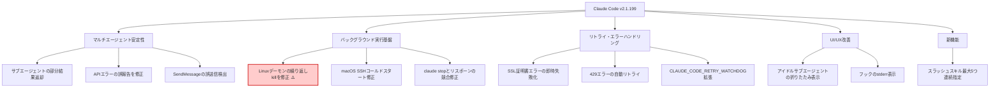
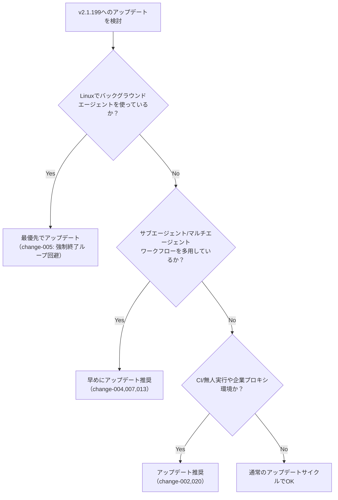
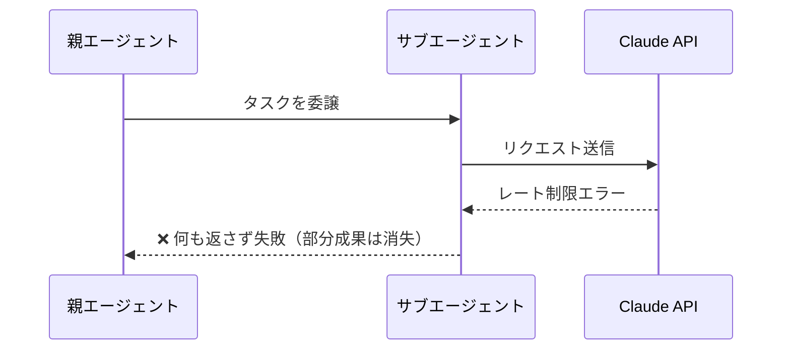
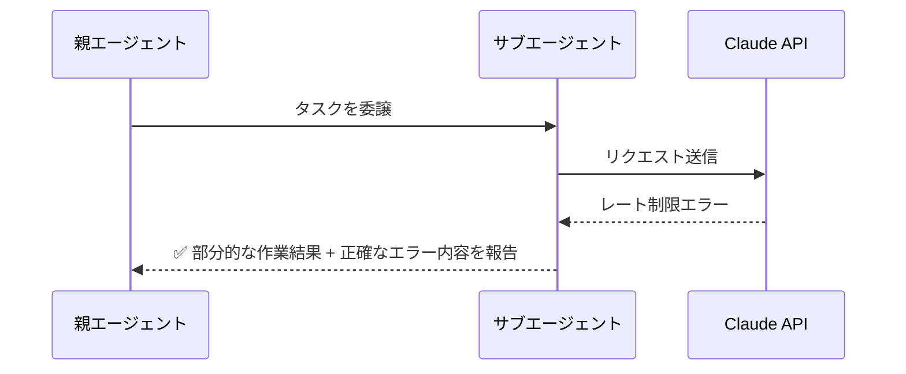

## はじめに

2026年7月、Claude Code の v2.1.199 がリリースされました。今回は新機能よりも**安定性強化**に重点を置いたリリースで、特にマルチエージェント（サブエージェント）運用時の信頼性に関わる修正が多く含まれています。

中でも見逃せないのが、Linux環境で発生していた「バックグラウンドエージェントデーモンが約50秒ごとに全エージェントを強制終了する」という重大な不具合の修正です。バックグラウンドエージェントやサブエージェントを日常的に活用している開発者は、本記事で変更点を確認した上でのアップデートを強くおすすめします。

また、スラッシュスキルの連続指定対応や、一時的な429エラーの自動リトライなど、日々の開発体験を改善する変更も含まれています。

## 変更の全体像

今回のリリースを影響領域ごとに整理すると、以下のようになります。



## 変更内容

### 🔴 特に重要な修正（High Severity）

| ID | タイトル | 内容 | 対応要否 |
|---|---|---|---|
| change-005 | Linuxバックグラウンドデーモンの繰り返しkill修正 | 不正終了で破損したワーカーレコードが残ると、デーモンが自身と全エージェントを約50秒周期で強制終了し続ける深刻な不具合 | **要アップデート** |
| change-004 | サブエージェントのエラー処理修正 | レート制限/サーバーエラーで中断されたサブエージェントが部分結果を返すように。APIエラーを成功として誤報告する問題も修正 | 推奨 |

### 🟡 マルチエージェント関連の修正

| ID | タイトル | 概要 |
|---|---|---|
| change-007 | `claude stop` とリスポーンの競合修正 | 停止コマンドがエージェント再起動処理と競合して黙って無効化される問題を解消 |
| change-013 | SendMessage の名前再利用検出 | 再スポーンされたエージェントが旧名を再利用した際の誤送信を検出し、再指定を要求 |
| change-009 | アイドルサブエージェントの表示改善 | パネルから消える代わりに展開可能なサマリー行に折りたたみ表示 |
| change-010 | `/model` `/fast` 実行時の通知 | サブエージェント表示中の実行がリードエージェントに適用される旨を明示 |

### 🟢 リトライ・エラーハンドリングの改善

| ID | タイトル | 概要 |
|---|---|---|
| change-002 | SSL証明書エラーの即時失敗化 | TLS検査プロキシ等によるエラーをリトライせず即座に失敗させ、対処ヒントを表示 |
| change-003 | ストリーミング途中エラーで部分出力を保持 | mid-streamエラーで応答を丸ごと破棄せず、不完全応答の通知付きで保持 |
| change-019 | 429エラーの自動リトライ（サブスクライバー向け） | 使用量上限と無関係な一時的429エラーをバックオフ付きで自動リトライ |
| change-020 | `CLAUDE_CODE_RETRY_WATCHDOG` 拡張 | デフォルトリトライ回数を300に引き上げ、`CLAUDE_CODE_MAX_RETRIES` の上限15を撤廃 |

### その他の修正・新機能

| ID | タイトル | 概要 |
|---|---|---|
| change-001 | スラッシュスキルの連続指定対応 | 先頭のスキル呼び出しを最大5つまでロード（従来は1つのみ） |
| change-006 | macOS SSHコールドスタート修正 | v2.1.196のリグレッションを修正 |
| change-011 | フックのstderr表示 | `exit code 2` 時のstderrがトランスクリプトに表示されるように |
| change-016 | 設定リセット時のバックアップ作成 | リカバリーダイアログでのリセットが復元不能になる問題を修正 |
| change-017 | Claude in Chrome の再接続ページ問題修正 | 複数ビルド/設定ディレクトリ利用時の繰り返し表示を解消 |
| change-018 | プランモードのブラウザツール権限修正 | 状態変更を伴う操作に確認プロンプトを表示、読み取り専用操作は自動許可 |
| change-012 | `--dangerously-skip-permissions daemon` の誤解釈修正 | サブコマンドがチャットプロンプトとして誤処理される問題を修正 |
| change-014 | セッション再開時のトランスクリプト肥大化を修正 | 新規メッセージなしでもファイルが成長する無駄を解消 |
| change-015 | `/color` 設定消失を修正 | セッションのバックグラウンド化操作での設定消失を解消 |
| change-008 | バックグラウンドジョブ表示の複数修正 | 進捗停滞・低メモリ通知・状態フラッピングを修正 |
| change-021 | PRリンク表示の簡素化 | `claude agents` でのPRリンクを `#N` 表記にシンプル化 |

## 影響と対応

> **📌 影響を受ける人**
> - **Linux上でバックグラウンドエージェントを利用している開発者**：change-005の対象。アップデートしないと、不正終了後にデーモンが全エージェントを繰り返しkillし続ける可能性があります。
> - **サブエージェント／マルチエージェントワークフローを組んでいる開発者**：change-004, 007, 013など複数の信頼性修正の恩恵を受けます。
> - **CI/無人実行でClaude Codeを長時間動かしている開発者**：change-020の `CLAUDE_CODE_RETRY_WATCHDOG` 拡張が有用です。
> - **企業プロキシ環境（TLS検査あり）でClaude Codeを使っている開発者**：change-002によりエラー診断が速くなります。
> - **macOSホストへSSH接続してバックグラウンドエージェントを使う開発者**：change-006（v2.1.196のリグレッション修正）の対象です。

> **⚠️ Breaking Change**
> 破壊的変更はありませんが、change-005は放置すると実運用上の重大な支障（全エージェントの強制終了ループ）につながるため、実質的に**必須アップデート**として扱うべきです。

### アップデート要否の判断フロー



## コード例

### 1. スラッシュスキルの連続指定（change-001）

**Before（v2.1.198まで）**: 先頭のスキルしかロードされない

```bash
# skill-b が無視され、skill-a のみロードされる
> /review-code /summarize-diff このPRをレビューして要約して
```

**After（v2.1.199〜）**: 先頭の連続スキルを最大5つまでロード

```bash
# review-code と summarize-diff の両方がロードされ、
# 1コマンドで組み合わせワークフローが実行可能に
> /review-code /summarize-diff このPRをレビューして要約して
```

### 2. 無人実行向けリトライ設定の拡張（change-020）

**Before**: `CLAUDE_CODE_MAX_RETRIES` は最大15回までしか設定できなかった

```bash
export CLAUDE_CODE_MAX_RETRIES=15  # これ以上は無視される
claude -p "長時間の自動タスクを実行"
```

**After**: `CLAUDE_CODE_RETRY_WATCHDOG` を有効化すると上限が撤廃され、デフォルトも300回に

```bash
# 非キャパシティ系の一時エラーに対してデフォルト300回リトライ
# CLAUDE_CODE_MAX_RETRIES の15回上限も撤廃される
export CLAUDE_CODE_RETRY_WATCHDOG=1
export CLAUDE_CODE_MAX_RETRIES=100  # 上限なく設定可能に

claude -p "夜間バッチでの長時間自動実行タスク"
```

> **💡 Tips**
> CI環境や夜間バッチなど「人が見ていない間に長時間動かす」ケースでは、`CLAUDE_CODE_RETRY_WATCHDOG` を有効にしておくと、一時的なサーバーエラーでタスク全体が失敗するリスクを大きく減らせます。

### 3. サブエージェントのエラー処理（change-004）

**Before**: レート制限やサーバーエラーで中断されたサブエージェントは、成果を返さず黙って失敗していた



**After**: 中断されても、それまでの部分的な成果と正確なエラー情報が返るように



## まとめ

Claude Code v2.1.199は、派手な新機能よりも**マルチエージェント運用の信頼性**にフォーカスしたリリースです。要点を整理すると以下の通りです。

- **最重要**: Linuxでバックグラウンドエージェントの強制終了ループが起きる不具合（change-005）を修正。該当環境では速やかなアップデートを推奨
- **マルチエージェント信頼性向上**: サブエージェントの部分結果返却・エラー正確報告（change-004）、`claude stop`との競合修正（change-007）、SendMessage誤送信検出（change-013）など
- **無人実行の耐障害性強化**: `CLAUDE_CODE_RETRY_WATCHDOG`のリトライ上限撤廃（change-020）、一時的429エラーの自動リトライ（change-019）
- **新機能**: スラッシュスキルの最大5つ連続指定に対応（change-001）
- そのほか、SSL証明書エラーの即時失敗化、設定リセット時のバックアップ作成など、細かな安定性・安全性改善が多数含まれる

バックグラウンドエージェントやサブエージェントを活用したワークフローを組んでいる開発者ほど、今回のアップデートの恩恵は大きいはずです。まだアップデートしていない場合は、特にLinux環境のユーザーは優先的な対応を検討してください。
