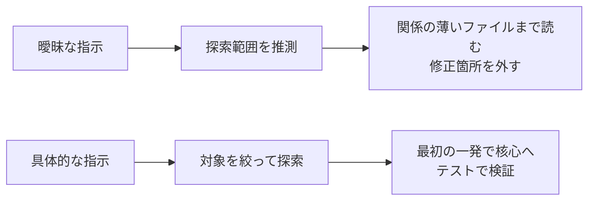
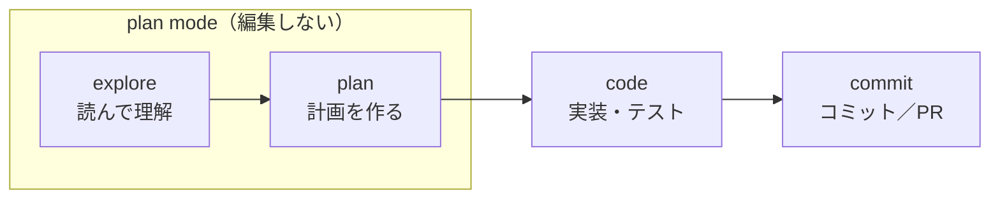

# Claude Codeで失敗しない指示の出し方 — 曖昧な依頼を「動くプロンプト」に変える5点チェック

> **対象読者**: Claude Code を触り始めた人／すでに使っているが、指示の出し方を見直したい開発者
> **前提知識**: Claude Code がインストール済みであること。それ以外の特別な知識は不要です
> **この記事でできること**: 曖昧な依頼を「5点チェック」で動くプロンプトに書き換え、plan mode と `/effort` で出力をコントロールできる

同じ作業を頼むのに、次の2つはまったく別の結果になります。

```text
ログインのバグを直して
```

```text
セッションタイムアウト後にログインが失敗します。src/auth/ のトークン更新まわりを
確認し、まず再現する失敗テストを書いてから直して。
```

この差が結果を分けるのは、Claude Code がチャットボットではなく、**ファイルを実際に読み書きするエージェント**だからです。1つのプロンプトは、ファイルの読み取り・編集・コマンド実行・テスト実行といった数十回のツール操作に連鎖します。



つまり曖昧な指示が生むのは「曖昧な答え」ではなく「予測しにくい操作」です。具体的に書くことは、品質対策であると同時に**安全対策**でもあります。

この記事は、基準日時点の Claude Code 2.1.198 を前提に、曖昧な依頼を「動くプロンプト」に変えるコツを実例でまとめます（バージョンはほぼ毎日上がるため、番号が違っていても問題ありません）。

## 結論：効く指示は5点入れるだけ

理屈の前に、結論からお見せします。

```text
効く指示は、次の5点を入れるだけで安定します。
1. 症状・目的（何がどうなってほしいか）
2. 関係しそうな場所（ファイル・ディレクトリ）
3. 倣ってほしい既存実装（手本になる既存ファイル）
4. やってほしくないこと（禁止事項）
5. 完了条件・検証コマンド（テスト・期待値）
```

核心は、**文脈・既存パターン・検証基準**の3つを渡すことです。実際の依頼では、これを上の5点に広げると過不足なく伝わります。とくに5番目の検証基準（テスト・期待値）を添えると、Claude の出力は「できたように見える」から「実際にできた」に変わります。

## コピペできる依頼テンプレート（★保存用）

毎回ゼロから考えなくていいように、そのまま貼って埋められる雛形を置いておきます。

```text
以下の条件で対応してください。

目的:
- （何を・なぜ）
対象:
- 関係しそうなファイル:
- 参考にする既存実装:
制約:
- 新しいライブラリは追加しない
- 公開APIの互換性は壊さない
- まず計画を出し、承認後に実装する
検証:
- 先に失敗するテストを書く
- 実装後に <テストコマンド> を実行する
- 失敗したら原因を説明して直す
```

埋める情報がないところは消して構いません。「まず計画を出し、承認後に実装する」を入れておくと、後で扱う plan mode と自然につながります。

## よくある失敗と直し方

つまずきの大半は、文脈を省いた一言を投げてしまうことから起きます。よくある3パターンを、改善前後で比べます。

| ありがちな指示 | なぜ危ういか | 効く書き方 |
|---|---|---|
| ログインのバグを直して | 文脈ゼロ。関係ないファイルを読み回り、見当違いを直す | セッションタイムアウト後にログインが失敗。`src/auth/` のトークン更新を確認し、再現する失敗テストを書いてから直して |
| カレンダーウィジェットを追加して | 既存パターンを無視してゼロから自己流で作る | ホーム画面の既存ウィジェットの実装を見て、そのパターンに倣って実装して。既存で使っているライブラリ以外は足さないで |
| validateEmail 関数を実装して | 検証基準がない。「できたように見える」で終わる | validateEmail を書いて。テストケースは `user@example.com`→true、`invalid`→false、`user@.com`→false。実装後にテストを実行して |

どの改善版も、結論の5点から1つ以上を足しているだけです。コードに限らず、文章の校正でも調査でも「どんな文脈で・何に倣って・何をもって完成とするか」を渡すほど結果は安定します。制約は走り出してから足すより、**プロンプトの先頭に積んでおく**ほうが安く済みます。エージェントは途中の結果を見て次の動きを決めるからです。

## 文脈の与え方

Claude に情報を渡す経路は3つあります。

| 経路 | 寿命 | 向いている情報 |
|---|---|---|
| **CLAUDE.md** | 永続（セッション開始時に毎回読み込み） | ビルドコマンド・規約・テストの回し方など「常に渡したい前提」 |
| **`@file`** | そのプロンプト限り | いま見てほしいファイル |
| **画像・パイプ** | その場限り | UIバグの画面・デザイン・エラーログ |

- **CLAUDE.md** は「毎回チャットに書き直したくないルール」の置き場です。ただし強制設定ではなく、Claude に渡されるコンテキストです。禁止・許可を確実に制御したいときは `/permissions` や hooksを使います。
- **`@file`**（例: `@src/auth/token.ts`）は中身まで読み込みます。`@dir/` はディレクトリ構造・ファイル情報だけで、中身は読みません。複数指定（`@a.ts と @b.ts`）もできます。
- **画像**は `Ctrl+V`（WSL は `Alt+V`）で貼り付けられます。`cat error.log | claude` のようなパイプ入力も使えます。

迷ったら `/init` で叩き台の CLAUDE.md を生成するところから始めると楽です。すでに CLAUDE.md があれば、`/init` は上書きせず改善案を出します。

## plan mode：作る前に見せる

plan mode は、Claude に**読む・調べる・計画を出すことだけ**をさせ、編集はさせないモードです。いきなりコードを触られる不安がありません（読み取りや read-only な調査コマンドは実行され、権限の確認プロンプトも通常どおり出ます）。

入り方は3通りです。

- `Shift+Tab` で `default → acceptEdits → plan` を循環（基準日時点で3段階）。
- `/plan [タスクの説明]` で即座に入る（説明を添えるとそのタスクの計画から始まります）。
- 起動時に `claude --permission-mode plan`。

計画ができると、次から選んで進めます。

- 「auto モードで承認」「編集だけ自動承認」「1件ずつ確認」「計画を続ける」（環境によっては、ブラウザでレビューする「Ultraplan」も表示されます）
- **`Ctrl+G`** — 提示された計画を自分のエディタで直接編集してから進める。Claude の探索力と人間の判断を組み合わせられる、いちばん手軽なステアリング手段です

公式が薦める流れは **explore → plan → code → commit** の4段階です。



```text
# explore（plan modeで）
src/auth を読んで、セッションとログインの扱い方を理解して。

# plan（plan modeのまま。Ctrl+Gで手直しできる）
Google OAuth を足したい。変更が必要なファイルは？計画を作って。

# code（plan modeを抜けて実装）
その計画どおりにOAuthを実装して。コールバックのテストも書き、
テストを通して、失敗があれば直して。

# commit
わかりやすいメッセージでコミットし、PRを開いて。
```

不慣れなコードベース、複数ファイルにまたがる変更、やり方が固まっていないとき向きです。明らかな1ファイル修正なら省いて構いません。コストと品質を両立したいときは `/model opusplan` で「計画は賢いモデル（Opus）、実行は速いモデル（Sonnet）」と分担させる手もあります。

## 思考の深さ：`/effort` と `ultrathink` の使い分け

難しい問題ほど「もっと深く考えてほしい」場面があります。基準日時点での公式の制御は **`/effort` コマンド**です。

```text
/effort          # 引数なしでスライダーを開く
/effort high     # レベルを直接指定
/effort max
/effort auto     # モデル既定に戻す
```

セッションの残りに即時反映されます。レベルが上がるほど、思考に使う**トークン**（処理の最小単位。多いほど時間と費用がかかります）が増えます。

| レベル | 位置づけ | 使いどころ |
|---|---|---|
| `low` | 最も省トークン | 単純作業・速度優先・サブエージェント |
| `medium` | 速度/コスト/品質のバランス | ツールを多用するコーディング |
| `high` | 多くのモデルの既定（指定を省いたときの値） | 複雑な推論・難しいコーディング |
| `xhigh` | 長時間タスク向けの拡張 | 対応モデルでの30分超のコーディング |
| `max` | 上限なしの最大 | 難問。簡単な作業では考えすぎることも |
| `ultracode` | Claude Code専用の設定 | 大規模コードベースの変更（動的ワークフローを起動） |

押さえておきたい点を並べます。

- **`xhigh` は一部の上位モデルでのみ使えます**（基準日時点では Fable 5・Sonnet 5・Opus 4.8 など）。対応していないモデルでは、自動的に `high` として動きます。使用中のモデルは `/model` で確認できます。
- **`ultracode` は API のレベルではなく Claude Code 側の設定**です。モデルには `xhigh` を送り、さらに動的なワークフロー（dynamic workflows）を自動で組み立てます。セッション限定で、`/effort` メニューのほか `--settings`（`"ultracode": true`）や Agent SDK から有効化できます。起動フラグの `--effort` や `effortLevel`、環境変数 `CLAUDE_CODE_EFFORT_LEVEL` では指定できません。
- **思考のオン/オフだけ切り替えたいとき**は `Alt+T`（Windows/Linux）／`Option+T`（macOS）でトグルできます。ただし常に思考を使う設計のモデル（Fable 5 など）には効きません。

では `ultrathink` はどうなったか。今でも有効で、**プロンプトのどこかに書くと、その1ターンだけ深い推論を要求します**。ただし **API に送る effort レベル自体は変わらない**ため、セッション全体の制御は `/effort` で行います。なお `think` や `think hard` は特別なキーワードではなく、ただのプロンプト文として扱われます。

```text
迷ったら:
- 普段: 指定しない（既定の high）
- 複雑な設計・難問: /effort max
- 長時間のコードベース調査: 対応モデルで /effort xhigh
- その1回だけ深く考えさせたい: プロンプトに ultrathink
- 大規模変更をまとめて任せる: /effort ultracode
```

> 開発者向けの一行：API から使うときは `output_config` の `effort` で指定します。古い `budget_tokens` 方式は、新しめのモデルでは非推奨または非対応（指定するとエラー）です。

## 慣れてきたら

ここまでが、最初に身につけたい指示の出し方です。慣れてきたら、よく使う手順を**スキル**にして使い回せます。

毎回同じ手順を打ち直す代わりに、`.claude/skills/fix-issue/SKILL.md`（または従来の `.claude/commands/fix-issue.md`）に手順を書くと、`/fix-issue` として呼び出せます。コマンド名の後ろに打ったテキストは `$ARGUMENTS` で受け取れます。

デプロイや送信のような副作用のあるスキルには `disable-model-invocation: true` を付けると、Claude が自動で呼ばず手動起動だけに限定できます（ツールの権限そのものを制限する設定ではありません）。

スキルの本格的な作り込みは後で作成する予定です。ここでは「再利用の入口」として押さえておけば十分です。

### 最初に覚える5つ

| やりたいこと | コマンド／キー |
|---|---|
| CLAUDE.md の叩き台を作る | `/init` |
| plan mode に入る | `Shift+Tab`（default → acceptEdits → plan） |
| 文脈をリセットする | `/clear` |
| ファイルを読ませる | `@file` |
| 難問を深く考えさせる | `/effort max` |

### さらに慣れてきたら

| やりたいこと | コマンド／キー |
|---|---|
| 計画を出す／手直し | `/plan [タスク]` ／ `Ctrl+G` |
| 思考のオン/オフ | `Alt+T`（mac: `Option+T`） |
| いますぐ止める | `Esc` |
| 巻き戻す | `Esc` `Esc` ／ `/rewind` |
| 会話を要約する | `/compact [focus …]` |
| 文脈の使用量を見る | `/context` |
| 横道の質問（履歴に残さない） | `/btw [質問]` |
| ディレクトリ情報を渡す | `@dir/` |
| 画像を貼り付け | `Ctrl+V`（WSL: `Alt+V`） |

## まとめ

- Claude Code はチャットボットではなく、ファイルを実際に操作する**エージェント**です。曖昧な指示は予測しにくい操作を生むので、具体性は品質と安全の両方の対策になります。
- 効く指示の核は**文脈・既存パターン・検証基準**の3つ。実際の依頼では、冒頭の**5点チェック**に広げると過不足なく伝わります。とくに検証基準（テスト・期待値）を添えると「できたように見える」から脱せます。
- 不安なときは plan mode（`Shift+Tab`）で**作る前に計画を見る**。`Ctrl+G` で計画を手直ししてから実行できます。
- 思考の深さは `/effort` が公式。難問は `/effort max`、長時間の調査は対応モデルで `/effort xhigh`。その1回だけ深掘りしたいなら `ultrathink` を1語添えます。

入門者の方の次の一歩は、`/init` で CLAUDE.md を作り、迷ったら plan mode で計画を見てから進める習慣をつけることです。開発者の方の次の一歩は、`/effort` の使い分けと、よく使う手順を1つスキル化することです。

## 参考リンク

- [Claude Code Best Practices](https://code.claude.com/docs/en/best-practices) — 2026-06-28 確認
- [How Claude Code Works](https://code.claude.com/docs/en/how-claude-code-works) — 2026-06-28 確認
- [Model configuration（effort / opusplan）](https://code.claude.com/docs/en/model-config) — 2026-07-02 確認
- [Permission Modes（plan mode）](https://code.claude.com/docs/en/permission-modes) — 2026-07-02 確認
- [Commands Reference](https://code.claude.com/docs/en/commands) — 2026-07-02 確認
- [Effort parameter](https://platform.claude.com/docs/en/build-with-claude/effort) — 2026-07-02 確認
- [Memory / CLAUDE.md](https://code.claude.com/docs/en/memory) — 2026-06-28 確認
- [Skills](https://code.claude.com/docs/en/skills) — 2026-06-28 確認
- [Common Workflows](https://code.claude.com/docs/en/common-workflows) — 2026-07-02 確認
- [Interactive Mode](https://code.claude.com/docs/en/interactive-mode) — 2026-07-02 確認
- [Changelog](https://code.claude.com/docs/en/changelog) — 2026-07-02 確認
- [Effective Context Engineering for AI Agents](https://www.anthropic.com/engineering/effective-context-engineering-for-ai-agents) — 2026-06-28 確認

---
### シリーズナビ
- ◀ 前: [W1 セットアップ](https://qiita.com/ujunja/items/05a2c163921ab3e1ea96)
