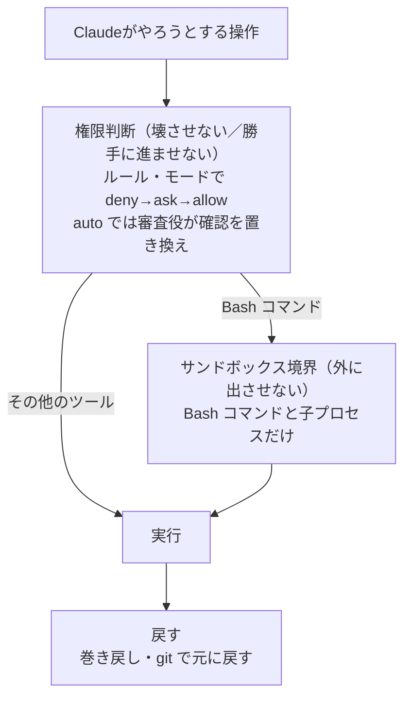
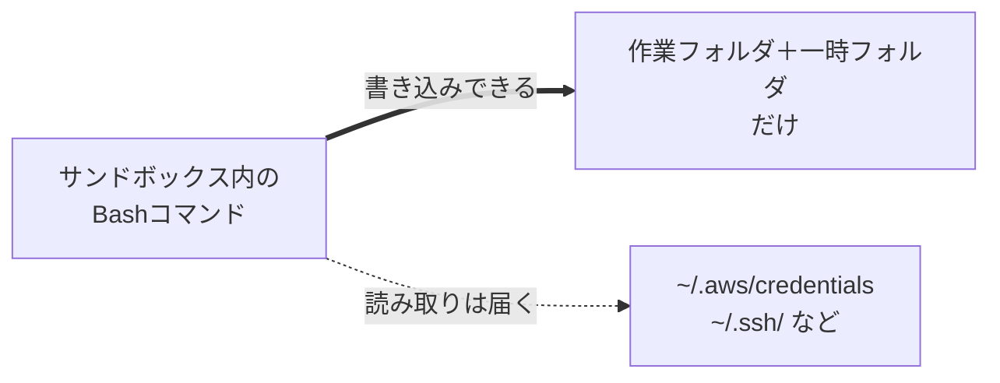

# Claude Codeのサンドボックスだけでは秘密情報を守れない — 権限ルール・巻き戻しまで含めた安全設定

> **対象読者**: AIエージェントにファイルやコマンドを触らせるのが不安な入門者／権限ルールやサンドボックスで挙動を厳密に制御したい開発者
> **前提知識**: Claude Code がインストール済みであること。それ以外の特別な知識は不要です
> **この記事でできること**: 権限ルール・サンドボックス・巻き戻しの仕組みを理解し、秘密情報を守る最小限の設定を書ける

「AIにファイルやコマンドを触らせるのは、正直こわい。うっかり `rm -rf` されたら…」Claude Code を使い始めるとき、多くの人が最初にこう感じます。

Claude Code の安全装置は**1つではなく何層も**あり、重ねてリスクを下げます。ただしどの層も万能ではなく、特にサンドボックスは設定次第で境界が弱くなります。

見落としやすいのが、後半の「外に出させない：サンドボックス」で扱う**「書き込みは狭く、読み取りは広い」という非対称**です。サンドボックスをオンにしても、`~/.aws/credentials` や SSH 鍵のような**資格情報**（ログインやアクセスに使う鍵。本記事では秘密情報の一部として扱います）の読み取りは止まりません。

以下は2026年7月3日時点の Claude Code 2.1.199 が前提です（バージョンはほぼ毎日上がるので、番号が違っても読み替えてください）。

## まず、これだけ

細かい仕組みは後回しでも、この4つで大きな事故はほぼ防げます。

1. `default` か `plan` モードで始める（最初から自動承認しない）
2. 秘密情報の deny を `.claude/settings.json` に入れる（後述の「秘密情報を守る最小の deny」）
3. 作業を始める前に `git commit` して、いつでも戻れる状態にしておく
4. macOS・Linux・WSL2 なら `/sandbox` の状態を確認する

## 安全装置の全体像

安全装置は役割の違う層が重なり、操作を**やる前**に止める層と、万一のとき**あとから戻す**層に分かれます。



権限ルール・保護パス・サーキットブレーカー（危険な操作を止める安全弁）は、何もしなくても最初から効いています。サンドボックスと auto mode は、自分でオンにして足す層です。これらは**互いに独立して積み重なり**、どれか1つに頼る必要はありません。

## 壊させない：権限ルール

Claude Code の権限（パーミッション）には「モード」と「ルール」があります。モードはセッション全体の基本姿勢で（`plan` は計画だけ、`acceptEdits` は編集を自動承認、など）、`Shift+Tab` で切り替えられます。基本の6モードは [W1](https://qiita.com/ujunja/items/05a2c163921ab3e1ea96#%E6%A8%A9%E9%99%90%E3%83%91%E3%83%BC%E3%83%9F%E3%83%83%E3%82%B7%E3%83%A7%E3%83%B3%E3%81%AE%E4%BB%95%E7%B5%84%E3%81%BF) で扱いました。

注意したいのは `acceptEdits` です。名前の印象より範囲が広く、ファイル編集だけでなく、作業フォルダ（や `--add-dir` で足したフォルダ）内の `mkdir`・`touch`・`rm`・`rmdir`・`mv`・`cp`・`sed` などのファイル操作コマンドも自動承認します（保護パスは対象外）。「編集だけ」のつもりが、確認なしにファイルが消えることもあります。

### ルールの書き方

ルールは `settings.json` に書き、`Tool`（そのツール全部）か `Tool(具体指定)`（細かい一致）の形を取ります（`Bash` はコマンド実行、`Read` はファイル読み取りなど、Claude が使う道具の名前です）。

| ルール | 意味 |
|---|---|
| `Bash(npm run build)` | このコマンドと完全一致 |
| `Bash(npm run test *)` | 前方一致（`*` は任意の位置に置け、複数の引数にまたがる） |
| `Read(./.env)` | カレントディレクトリの `.env` を読む |
| `WebFetch(domain:example.com)` | このドメインへの取得 |

### 評価の順番：deny → ask → allow

ルールには拒否（deny）・確認（ask）・許可（allow）の3種類があり、評価は必ず **deny → ask → allow の順**で、最初に一致したものが勝ちます。

一番大事なのは、**広い deny は具体的な allow に勝つ**点です。`Bash(aws *)` の deny があれば、より細かい `Bash(aws s3 ls)` の allow を足してもそのコマンドは実行されません。ルールの細かさ（specificity）は順番を変えません。

さらにこの評価は**設定スコープをまたいでマージ**されます。PC 全体（ユーザー）にかける設定と、このプロジェクトだけの設定があり、ユーザー側の deny はプロジェクト側の allow では回避できません。

- 入門者の方: 誰かが引いた deny の線を、あとから allow でくぐることはできません。
- 開発者の方: 「なぜまだ止まるのか」を調べるときは、一番具体的なルールだけでなく**全スコープの deny/ask** を見ます。

### 秘密情報を守る最小の deny（コピペ可）

入門者の方に一番おすすめなのがこれです。置き場所は2種類あります。

- **このプロジェクトだけ**に効かせる → プロジェクト直下の `.claude/settings.json`
- **どのプロジェクトでも**効かせる → ホームの `~/.claude/settings.json`

ファイルがなければ新しく作って構いません（`.claude` フォルダごとでOK）。手で書くのが不安なら `/permissions` の画面から追加してもよく、保存先は同じ `settings.json` です。優先順位など詳しくは [W1](https://qiita.com/ujunja/items/05a2c163921ab3e1ea96) にまとめました。下の内容だけで、`.env` や SSH 鍵の読み取りをブロックできます。

```json
{
  "permissions": {
    "deny": ["Read(.env)", "Read(./secrets/**)", "Read(~/.ssh/**)"]
  }
}
```

この deny が効くのは、Claude の内蔵 Read/Grep/Glob と、Claude Code が認識する Bash の読み取りコマンド（`cat`・`head` など）です。一方、Python や Node のスクリプトが自分でファイルを開くような**任意のプロセス**の読み取りは、この設定では止まりません。そこまで OS レベルで止めるには、後述のサンドボックス（`sandbox.credentials`）を併用します。

`Read(.env)` は**現在のディレクトリ以下**の `.env` に一致します（`Read(**/.env)` と同値）。親ディレクトリや別プロジェクトの `.env` は対象外で、ファイルシステム全体を対象にするなら `Read(//**/.env)` のように絶対ルート基準で書きます。

### 保護パス：設定ファイルは勝手に書き換えられない

権限ルールとは別に、**保護パス（protected paths）**という仕組みがあります。`.git` や `.claude`、シェルの設定ファイル（`.bashrc`・`.zshrc` など）といった大事なファイルを、`bypassPermissions` を除く**どのモードでも**勝手に書き換えさせません。`Edit(.claude/**)` のような allow ルールを書いても外れません——保護パスのチェックは allow より**先**に走ります。

代表的な保護対象（一部）です。

- ディレクトリ: `.git`, `.claude`（`.claude/worktrees` を除く）, `.vscode`, `.idea` など
- ファイル: `.bashrc`・`.zshrc`・`.profile` などのシェル設定, `.npmrc`, `.gitconfig`, `.mcp.json` など

つまり保護対象を**無断で自動承認しない**仕組みです。通常モード（`default`・`acceptEdits`・`plan`）では必ず確認が出るので、あなたが承認しない限り書き換わりません。例外は `bypassPermissions` で、この保護も外れます。

<details>
<summary>開発者向け：手書きの Bash 許可リストが危ういわけ</summary>

- **ワイルドカードの単語境界**: `Bash(ls *)`（スペースあり）は `ls -la` に一致しますが `lsof` には一致しません。`Bash(ls*)`（スペースなし）は両方に一致します。
- **複合コマンドは分解される**: `&&`・`||`・`;`・`|` などでつないだ各コマンドは、それぞれ独立に一致が必要です。`safe-cmd *` の許可は、`safe-cmd && other-cmd` を許可しません。
- **URL をパターンで縛るのは安全境界にならない**: `Bash(curl http://github.com/ *)` のような指定は、フラグ順・`https` への差し替え・リダイレクト・シェル変数などで簡単にすり抜けます。公式は、`curl`/`wget` は deny で丸ごと止め、代わりに `WebFetch(domain:...)` の allow を使うことを勧めています。
- 一部のラッパー（`timeout`, `time`, `nice`, `nohup`, `stdbuf`）は照合前に外されるので、`Bash(npm test *)` は `timeout 30 npm test` にも一致します。一方 `npx`・`docker exec` などは外されません。

Bash の文字列パターンだけで安全を担保しようとせず、実際の強制は次のサンドボックスに任せます。

</details>

## 外に出させない：サンドボックス

**サンドボックス（sandbox）**は、Bash ツールとそこから呼び出される子プロセスを**OSレベルで隔離**する仕組みです。権限ルールが「Claude が操作を試みるか」を制御するのに対し、サンドボックスは「試みても OS が範囲外へ出さない」層で、両者は重ねて使えます。

- **対応OS**: macOS は標準機能（Seatbelt）で追加インストール不要。Linux と WSL2 は `bubblewrap` と `socat` が必要（`apt`/`dnf` で導入）。**ネイティブ Windows・WSL1 は非対応**です。
- **有効化**: `/sandbox` コマンドでパネルを開いて設定します。

### 書き込みは狭く、読み取りは広い

サンドボックスの範囲は、**書き込みと読み取りで非対称**です。



| | 既定の範囲 |
|---|---|
| **書き込み** | 作業フォルダとそのサブフォルダ＋一時フォルダ（`$TMPDIR`）**だけ**。`~/.bashrc` や `/bin/` は変更できない |
| **読み取り** | **マシンほぼ全体**（一部の拒否ディレクトリを除く）。`~/.aws/credentials` や `~/.ssh/` も**既定で読める** |

⚠️ **サンドボックスをオンにしただけでは、秘密情報は隠れません。** 防げるのは「作業フォルダの外への書き込み」までで、読み取りは広く効いたままです。**Bash コマンドから**資格情報を読めなくするには、`sandbox.credentials` を足します。

```json
{
  "sandbox": {
    "enabled": true,
    "credentials": {
      "files": [{ "path": "~/.aws/credentials", "mode": "deny" }],
      "envVars": [{ "name": "GITHUB_TOKEN", "mode": "deny" }]
    }
  }
}
```

組み込みの資格情報ブロックリストはなく、**自分で列挙したファイル・変数だけ**が守られます。ただし `sandbox.credentials` が効くのは**サンドボックス化された Bash コマンド**に対してだけです。内蔵 Read ツールが同じファイルを読むのは、権限ルールの `permissions.deny`（例: `Read(~/.aws/credentials)`）で別途止めます。

### ネットワークと、正直な限界

- **ネットワーク**: 既定で許可ドメインはなく、新しいドメインへの初回アクセスで確認が出ます（`allowedDomains`/`deniedDomains` で設定）。ただし通信の中身までは検査しないので、**許可ドメインを広げすぎない**のが安全です。
- **除外が要るもの**: `docker` はサンドボックスと相性が悪く、`excludedCommands` での除外が必要です。

なお `bubblewrap` などの依存が足りない環境や非対応環境では、サンドボックスは既定で**警告を出したうえで、隔離なしにコマンドを実行**します。常にサンドボックス経由を強制したいときは、次の設定を使います。

<details>
<summary>開発者向け：サンドボックスを厳格ゲートにする</summary>

隔離なし実行にフォールバックさせず、コマンドを必ずサンドボックス経由にする管理者向けの設定です。

```json
{
  "sandbox": {
    "enabled": true,
    "failIfUnavailable": true,
    "allowUnsandboxedCommands": false
  }
}
```

`failIfUnavailable` を `true` にすると、サンドボックスを起動できないときはコマンドを実行せずエラーにします。`allowUnsandboxedCommands` を `false` にすると、`/sandbox` の Overrides タブで「Strict sandbox mode」と表示され、コマンドは必ずサンドボックス経由（または `excludedCommands` に明示したもの）で実行されます。

</details>

<details>
<summary>開発者向け：TLS 非検査とドメインフロンティングのリスク</summary>

既定の内蔵プロキシは外向き通信の TLS を復号・検査せず、接続先をクライアントが名乗ったホスト名だけで判断します。そのため広いドメイン（例: `github.com`）を許可すると、理論上はドメインフロンティング（別の許可ドメインを装って実際は別の宛先へ迂回する手口）ですり抜けられる余地が残ります。`allowedDomains` は「通信の中身を見て止めるフィルタ」ではありません。Anthropic はより強い TLS 対応の隔離を「開発中の領域」としています。

</details>

## 勝手に進ませない：auto mode の審査役

`auto` モードは名前に反して「なんでも自動実行」ではありません。実際は**別の審査用モデル（classifier）**が実行前に一つひとつの操作をチェックする research preview（試験提供）で、依頼の範囲を超えて影響が広がる操作を既定でブロックします。以下は開発でよく使う操作なので、ピンとこなければ読み飛ばして大丈夫です。

既定で**止める**操作の例:

- `curl | bash` のような取得即実行
- 本番へのデプロイやマイグレーション
- `main` への push や force-push
- `git reset --hard` や `terraform destroy` のような破壊的な操作

既定で**通す**操作の例:

- 作業フォルダ内のローカルなファイル操作
- 宣言済み依存のインストール
- **`.env` を読んで、対応する API に送ること**

⚠️ 最後の1つが要注意です。**auto mode をオンにしても、既定では秘密情報は守られません。** サンドボックスと同じく、`.env` を守りたいなら deny ルールが別途必要です。

- 審査役が**3回連続、または合計20回**操作を止めると、auto mode は一時停止して通常の確認プロンプトに戻ります（この閾値は変更できません）。
- 会話で伝えた制約（例:「まだ push しないで」）は強い停止シグナルとして効きますが、**ルールとして保存はされません**。会話が長くなったときの要約（コンテキストの圧縮＝compaction。自動または `/compact` で起きる）で、その一文が失われることがあります。確実に守らせたいなら deny ルールにします。

なお最も緩い `bypassPermissions` でも、`rm -rf /` や `rm -rf ~` のような**ルート／ホーム直下の削除**は必ず確認が出ます（モデルの誤りに対する安全弁）。この基本的なサーキットブレーカーは [W1](https://qiita.com/ujunja/items/05a2c163921ab3e1ea96) で扱いました。auto mode は、それより広く新しい審査を上乗せする層です。公式もこれを「確認プロンプトは減らすが、安全を保証するものではない」research preview と位置づけています。

<details>
<summary>auto mode の対応モデル・プロバイダについて</summary>

対応するモデルやプロバイダ、既定でブロックされる操作のカテゴリは、バージョンごとに頻繁に増減します。数週間で古くなる情報なので、ここには一覧を載せません。最新の対応状況は公式の [Permission Modes](https://code.claude.com/docs/en/permission-modes) で確認してください。ブロック/許可の既定ルール全体は、`claude auto-mode defaults` で JSON として出力できます。

</details>

## 戻す：止める・巻き戻す、そして git

やってしまってからでも、取り戻す手段があります。

### Esc で止める

実行中に **`Esc`** を押すと、その場で操作を中断できます。ここまでの作業は保持され、方向を修正して続けられます。中断であって、変更を元に戻すわけではありません。

### Esc Esc / `/rewind` で巻き戻す

入力欄が**空**の状態で **`Esc` を2回**押すか、`/rewind`（別名 `/checkpoint`・`/undo`）と打つと、**巻き戻し（rewind）メニュー**が開きます。プロンプトごとに**チェックポイント**が自動作成されていて、そこへ戻せます。選択肢は次のとおりです。

- コードと会話を両方戻す
- 会話だけ戻す（コードはそのまま）
- コードだけ戻す（会話はそのまま）
- ここから要約 / ここまで要約
- 何もしない

（入力欄に文字が残っているときの `Esc Esc` は下書きを消すだけで、巻き戻しメニューは開きません。）

### 巻き戻せないもの：本当の安全網は git

⚠️ 巻き戻しには重要な限界があります。**Bash コマンドで変更したファイルは追跡されません。** Claude が Bash ツールで `rm file.txt` や `mv old new` を実行しても、**巻き戻しでは元に戻せません**。追跡されるのは組み込み編集ツール（Edit/Write）による変更だけです。

公式もチェックポイントを「ローカルな取り消し」、git を「恒久的な履歴」と表現しています。だからこそ、**こまめな git コミット**が本当の安全網になります（git が初めてなら、この機会に触れてみる価値があります）。

## 早見表

安全運用でよく使うコマンドをまとめます。

### スラッシュコマンド

| コマンド | 用途 |
|---|---|
| `/permissions` | 権限ルール（allow/ask/deny）をスコープ別に確認・追加・削除 |
| `/sandbox` | サンドボックスの切り替え・設定 |
| `/rewind` | 巻き戻しメニューを開く |
| `/doctor` | インストールや設定を診断（`f` で自動修正） |
| `/add-dir <path>` | このセッションで参照できるフォルダを追加 |

### CLI フラグ（起動時）

| フラグ | 用途 |
|---|---|
| `--permission-mode <mode>` | 起動モードを指定（`plan` など） |
| `--add-dir <path>` | 参照フォルダを追加して起動 |
| `--allowedTools` / `--disallowedTools` | セッション限定の allow / deny ルール |
| `--settings <path>` | このセッションだけ設定を上書き |
| `--dangerously-skip-permissions` | `bypassPermissions` 相当（root/sudo では拒否） |

### キーボードショートカット

| キー | 効果 |
|---|---|
| `Esc` | 実行中の操作を中断（作業は保持） |
| `Esc` `Esc`（空入力） | 巻き戻しメニューを開く |
| `Shift+Tab` | 権限モードを循環（`default → acceptEdits → plan`。有効化した他モードも加わる） |

### よくある誤解 / 守備範囲

| 誤解しやすい点 | 実際の守備範囲 |
|---|---|
| サンドボックス＝秘密情報の境界 | 書き込みは狭いが**読み取りは広い**。資格情報も既定で読めます |
| `Read(.env)` はどこの `.env` にも効く | **カレントディレクトリ以下**のみ。親・別プロジェクトは対象外 |
| `sandbox.credentials` で読み取りは全部止まる | **サンドボックス化された Bash 専用**。内蔵 Read は `permissions.deny` で別途 |
| 巻き戻しで何でも戻せる | **Bash で変えたファイルは戻せない** → git コミット |
| `acceptEdits` は編集だけ | 作業フォルダ内の `rm`・`mv` なども自動承認 |

## まとめ

**入門者の方へ**

- 安全装置は何層も重なっています（モード・ルール・保護パス・サンドボックス・サーキットブレーカー・巻き戻し）。どれか1つに頼らなくて大丈夫です。
- `.git`・`.claude`・シェル設定は `bypassPermissions` 以外のどのモードでも保護され、あなたが承認しない限り書き換わりません。
- `Esc` で止まり、`Esc Esc` で戻せます。ただし Bash で消したものは戻らないので、**こまめな git コミット**が本当の安全網です。

**開発者の方へ**

- 権限ルールは全スコープをマージし deny が最優先。想定外のブロックは全スコープを見ます。
- Bash の文字列パターンは安全境界になりません。複合コマンドやラッパーですり抜けるので、強制はサンドボックスに任せます。
- **サンドボックスも auto mode も、既定では秘密情報を守りません。** しかも守る対象が違い、内蔵 Read は `permissions.deny`、サンドボックス化 Bash は `sandbox.credentials` で両方を併用します。

次の一歩です。

- 入門者の方: `default` のまま、必要なら plan モードで計画を確認し、git をこまめにコミット。巻き戻しの存在を知っておくだけでも安心が違います。
- 開発者の方: 上の secrets deny スニペットを `settings.json` に入れ、対応OS（macOS/Linux/WSL2）なら `/sandbox` を試してみてください。

## 参考リンク

- [Permissions](https://code.claude.com/docs/en/permissions) — 2026-07-03 確認
- [Permission Modes](https://code.claude.com/docs/en/permission-modes) — 2026-07-03 確認
- [Sandboxing](https://code.claude.com/docs/en/sandboxing) — 2026-07-03 確認
- [Security](https://code.claude.com/docs/en/security) — 2026-07-03 確認
- [Checkpointing](https://code.claude.com/docs/en/checkpointing) — 2026-07-03 確認
- [Interactive Mode](https://code.claude.com/docs/en/interactive-mode) — 2026-07-03 確認
- [Commands Reference](https://code.claude.com/docs/en/commands) — 2026-07-03 確認
- [CLI Reference](https://code.claude.com/docs/en/cli-reference) — 2026-07-03 確認

---
### シリーズナビ
- ◀ 前: [W2 Claude Codeで失敗しない指示の出し方](https://qiita.com/ujunja/items/577019cd04fed7bfabec)
