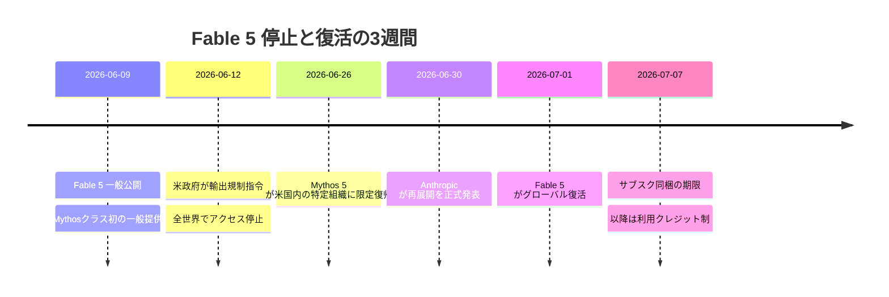
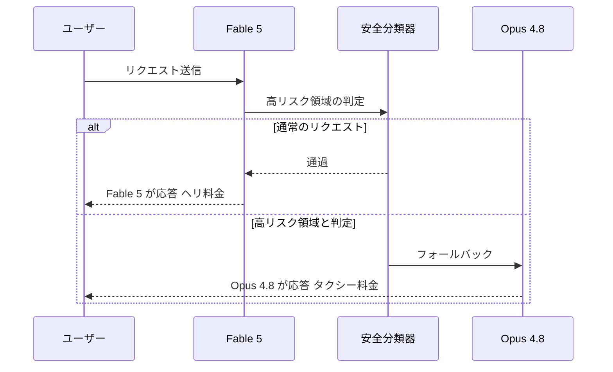
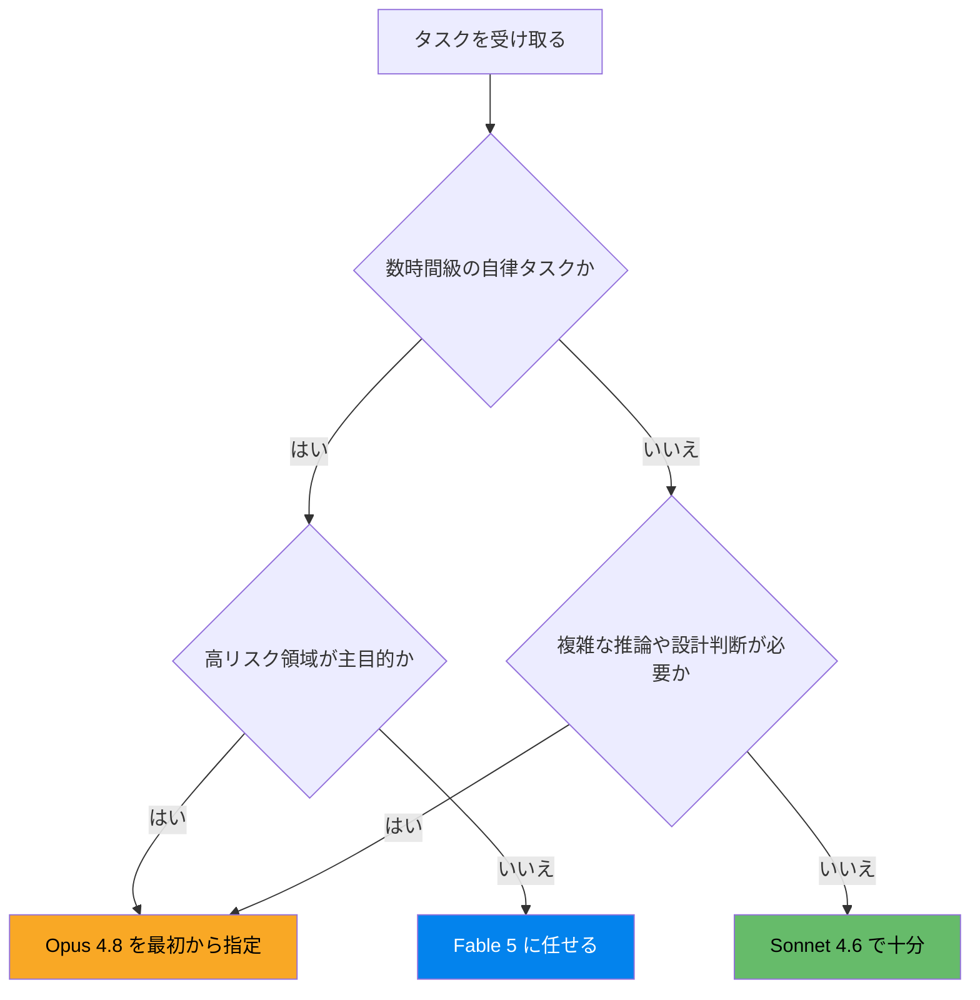
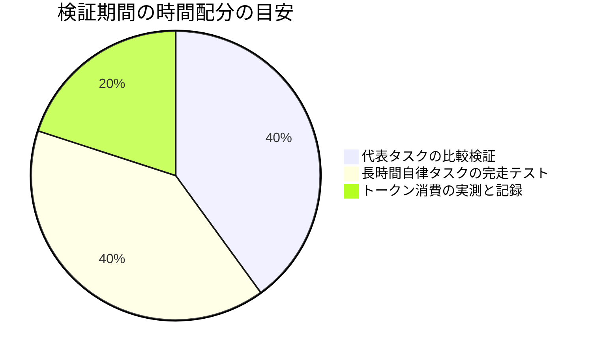

<font color="#0383ED">**この記事の対象読者**</font>

- Claude Fable 5 の復活を知って「使いたいけど高そう」と身構えている人
- Pro / Max プランで **7月7日までの同梱期間** に何を試すべきか知りたい人
- API 利用で「気づいたら請求が倍」を絶対に回避したい人
- Fable 5 と Opus 4.8 / Sonnet 4.6 の使い分け基準が欲しい人

**この記事で得られること**

- 停止から復活までのタイムラインと、いま何が使えるのかの整理
- Fable 5 の料金構造と、請求が膨らむ仕組みの理解
- やりがちな無駄遣いパターン5選と、その回避策
- タスク別モデル選定ガイドと、コスト概算用の Python スクリプト

**この記事で扱わないこと**

- Fable 5 の内部アーキテクチャの詳細な考察
- Mythos 5 の審査制プログラムへの参加方法
- ベンチマークの網羅的な検証（性能の話は要点のみ）

---

## 1. おかえりFable 5 ─ 3週間の空白に何があったのか

2026年7月1日、Claude のモデル一覧に <font color="#0383ED">**Claude Fable 5**</font> が帰ってきました。6月12日に突然消えてから、およそ3週間ぶりの復活です。

初報を見たときの正直な感想は (;ﾟдﾟ)ﾎﾟｶｰﾝ でした。「米政府の輸出規制で世界中から使えなくなったAIモデル」なんて、SF小説の設定かと思ったら現実だったわけで。

まずは時系列を整理します。



経緯をかいつまむと、Amazon の研究者が Fable 5 のセーフガードを回避してソフトウェア脆弱性を特定させる手法を報告し、これを受けて米商務省が6月12日に輸出規制指令を発出。API 側に利用者の国籍を判別する仕組みがないため、Anthropic は全顧客向けに提供を停止せざるを得なかった、という流れです。

その後の検証で、報告された脆弱性の特定は Opus 4.8 や GPT-5.5 など他の多くのモデルでも可能だったことが確認され、Anthropic は該当手法を99%以上ブロックする新しい分類器を追加。政府との合意を経て、7月1日の再展開に至りました。

一次情報は Anthropic 公式の発表記事です。

https://www.anthropic.com/news/redeploying-fable-5

この中で個人ユーザーに一番効く一文がこれです。

> Fable 5 will be included for up to 50% of weekly usage limits through July 7

和訳: <font color="#0383ED">**7月7日まで、Fable 5 は週間使用上限の50%を上限として追加料金なしで利用できる**</font>（対象は Pro / Max / Team / 一部の Enterprise プラン）。

つまり今この瞬間は、最上位モデルを月額プランの範囲内で試せる期間限定ウィンドウが開いている状態です。そして7月8日以降は利用クレジット制、すなわち実質 [API](https://qiita.com/GeneLab_999/items/26c3998e243fce3df3f2) 従量課金と同じ扱いになります。

:::note warn
本記事の料金・提供条件は2026年7月2日時点の情報です。Anthropicは「キャパシティが確保でき次第、プラン内提供の拡大を目指す」としており、条件は今後変わる可能性があります。利用前に公式の最新情報を確認してください。
:::

Fable 5 がどんなモデルなのか、停止前の初回リリース時の詳細は以下の記事でまとめています。本記事は「復活後にどう付き合うか」に集中します。

[Claude Fable 5](https://qiita.com/GeneLab_999/items/a7a491035d0177c5512c) / [ClaudeMythos](https://qiita.com/GeneLab_999/items/2d1948b5f6d424798960)

さて、復活を喜んだところで本題です。このモデル、性能は間違いなく最強クラスですが、<font color="#FF4056">**料金も最強クラス**</font>なのです。

---

## 2. 運賃表を見よ ─ Fable 5 の料金構造

本記事では一貫して **移動手段のたとえ** で説明します。Claudeのモデルファミリーを乗り物に置き換えると、こうなります。

| モデル | 入力 / 1Mトークン | 出力 / 1Mトークン | たとえるなら |
|--------|------------------|------------------|-------------|
| Claude Fable 5 | $10 | $50 | チャーターヘリ |
| Claude Opus 4.8 | $5 | $25 | タクシー |
| Claude Sonnet 4.6 | $3 | $15 | 電車 |

Fable 5 は Opus 4.8 の **ちょうど2倍** の運賃です。ヘリコプターは山奥の現場にも一直線に飛べますが、近所のコンビニに行くのに使う乗り物ではありません。この感覚が本記事の全てです。

コストの計算式はシンプルです。

```math
Cost_{USD} = \frac{T_{in} \times 10 + T_{out} \times 50}{10^6}
```

ここで厄介なのが、**単価2倍だけでは済まない** という点です。ヘリは運賃が高いだけでなく、燃料の消費量そのものも多い。Fable 5 には請求を押し上げる構造的な要因が3つあります。

### 2.1 メーターの刻みが細かくなった ─ 新トークナイザ

Opus 4.7 以降の系統では新しいトークナイザが採用されており、**同じテキストでも従来より最大35%ほど多くトークンをカウントする場合がある** と公式に注意されています。タクシーからヘリに乗り換えたら、運賃メーターの刻み自体も細かくなっていた、という話です。

<font color="#FF4056">**単価2倍 × トークン数の増加**</font> で、体感の請求は2倍を超えてきます。「同じ作業なのに月額が跳ねた」と感じたら、まずここを疑ってください。

### 2.2 思考は常時フル稼働 ─ Adaptive thinking

Fable 5 は思考プロセスが常時有効の設計で、従来のような拡張思考のオン・オフ切り替えはありません。ヘリのエンジンは飛んでいる間ずっと回り続けます。深い思考に頼る場面が多いほど出力トークンの消費が増える傾向が指摘されており、出力単価 $50 と掛け算になるのが痛いところです。

思考の深さは **Effort パラメータ** で制御できます。これはヘリの巡航高度のようなもので、低空で済むタスクに高高度飛行をさせる意味はありません。タスクに応じて調整するのがコスト設計の基本です。

### 2.3 断られてもタクシー代はかかる ─ 安全フォールバック

Fable 5 にはサイバーセキュリティ・生物・化学・モデル蒸留といった高リスク領域のリクエストを検知すると、自動的に Opus 4.8 へ処理を切り替える安全機構が組み込まれています。ヘリを呼んだのに飛行禁止区域だったので、代わりにタクシーが来るイメージです。



課金面では良心的で、出力生成前にブロックされた場合は **Opus レートのみが課金** され、ヘリ料金は発生しません。ただし裏を返すと、セキュリティ研究など該当領域が主戦場の人は「2倍払う設定でタクシーに乗り続ける」ことになりかねません。<font color="#FF4056">**その領域が主目的なら、最初から Opus 4.8 を指定する方が合理的**</font>です。

料金構造がわかったところで、次は実際にやりがちな「ヘリの無駄遣い」パターンを見ていきます。

---

## 3. 無駄遣いパターン5選 ─ コンビニにヘリで行くな

筆者の周辺やコミュニティの反応を眺めていると、請求を溶かすパターンはだいたい共通しています。心当たりがあったら今すぐ運用を見直しましょう。

### パターン1: 全タスクをFable 5に一本化する

「せっかく最強モデルが来たんだから全部これでいいでしょ」は最も高くつく判断です。Fable 5 の強みは **長時間・複雑・自律的なタスク** で最大化される設計で、短い質問応答や小さな修正では下位モデルとの体感差が小さいという報告が復活前から多数ありました。

第三者集計の llm-stats によれば [SWE-bench Verified](https://qiita.com/GeneLab_999/items/a557780347f52a7cda49) で Fable 5 は 95.0%、Opus 4.8 は 88.6%。差は確かにありますが、この差が効くのは難問側の領域です。30分で終わる小タスクにヘリを飛ばし続ければ、月末の請求書を見て orz となるのは必然です。

### パターン2: 指示の小出し

Fable 5 系のモデルは、**仕様・意図・制約を最初の1ターンでまとめて渡すほど効率が上がる** と公式ガイドが一貫して推奨しています。ヘリで一番燃料を食うのは離着陸です。「あ、あとこれも」「やっぱりこう直して」と何度も離着陸を繰り返せば、そのたびに会話履歴という荷物を全部積み直して再飛行することになり、入力トークンが雪だるま式に膨らみます。

### パターン3: 巨大コンテキストの毎回フル搭載

Fable 5 のコンテキストウィンドウは100万トークン。リポジトリ丸ごと積める大型ヘリです。しかし入力単価 $10/1M ということは、<font color="#FF4056">**100万トークンを1回積むだけで約$10**</font>。毎リクエストでフル搭載する運用は自殺行為です。後述するプロンプトキャッシュを使うか、必要なファイルだけ積みましょう。

### パターン4: フォールバック領域への突撃

パターンとしては地味ですが、セキュリティ系の検証を Fable 5 でやろうとして延々 Opus 4.8 の応答を受け取っていた、という報告も見かけます。応答モデルは確認できるので、フォールバックが頻発する用途なら最初からモデル指定を変えるべきです。

### パターン5: 7月7日の期限を忘れる

これは無駄遣いというより機会損失です。今は週間上限の50%までヘリ乗り放題のフリーパス期間。<font color="#0383ED">**7月8日以降は利用クレジット制**</font>に切り替わるので、乗り換え判断のための検証はこの期間に済ませるのが圧倒的にお得です（検証項目は第6章で）。

:::note alert
サブスクプランでも、7月8日以降にクレジット未設定のままだとFable 5自体が選択できなくなります。継続利用の予定がある人は利用クレジットの設定を確認しておいてください。
:::

やってはいけないことがわかったら、次は「では、いつヘリに乗るべきか」です。

---

## 4. タスク別モデル選定ガイド ─ ヘリ・タクシー・電車の乗り分け

結論から言うと、判断基準は **タスクの所要時間と自律性** です。以下のフローで9割は迷わなくなります。



具体的なタスクに落とすとこうなります。

| タスク | 推奨モデル | 理由 |
|--------|-----------|------|
| 大規模リファクタリング | Fable 5 | 長時間の自律実行で性能差が最大化。ヘリの独壇場 |
| レガシーコードの移行作業 | Fable 5 | 丸1日級の作業が半日で終わるなら単価2倍でも黒字 |
| 新機能の設計と実装 | Opus 4.8 | 複雑だが数時間級ではない。タクシーで十分届く |
| バグ修正・小さな変更 | Sonnet 4.6 | 電車で行ける距離にヘリを呼ばない |
| コードレビュー・要約 | Sonnet 4.6 | 定型作業。差額を払う理由がない |
| セキュリティ検証 | Opus 4.8 | Fable 5はフォールバックするため最初から指定 |
| ドキュメント生成 | Sonnet 4.6 | 出力量が多い作業ほど単価差が効く |

判断に迷ったら「このタスク、ヘリじゃないと現場に届かないか？」と自問してください。タクシーで届くならタクシーです。

:::note info
Claude Code では設定からモデルを切り替えられます。デフォルトを下位モデルにしておき、重いタスクのときだけ明示的にFable 5へ切り替える運用が、うっかり課金の最も確実な防止策です。
:::

乗り分けができたら、次はヘリに乗るとき自体のコストを下げるテクニックです。

---

## 5. ヘリ代を下げる3つのテクニック

どうしても Fable 5 を使うタスクでも、運賃を下げる正攻法が3つあります。

### 5.1 定期券を買う ─ プロンプトキャッシュ

同じコンテキスト（システムプロンプト、リポジトリの主要ファイルなど）を繰り返し使うなら、プロンプトキャッシュが最強です。キャッシュの読み込みは <font color="#0383ED">**入力単価の10%**</font>。毎回切符を買うのをやめて定期券に切り替えるイメージで、リポジトリを1日中触る用途なら入力コストを大幅に削減できます。

書き込み時は入力単価の1.25倍（5分キャッシュ）〜2倍（1時間キャッシュ）のコストがかかるので、**2回以上再利用する見込みがあるコンテキストにだけ** 適用するのが鉄則です。

### 5.2 深夜の乗合便に乗る ─ Batch API

リアルタイム性が不要なタスク（大量の分類、要約、テスト生成など）は Batch API で **50%オフ** です。急ぎでない荷物は、専用ヘリではなく深夜の乗合便で送りましょう。単価が高いモデルほど、この50%の絶対額は大きくなります。

### 5.3 巡航高度を下げる ─ Effortパラメータ

前述の通り、Fable 5 の思考は常時オンで、深さは Effort で制御します。定型寄りのサブタスクまで最高高度で飛ぶ必要はありません。タスクの難度に応じて Effort を調整するだけで、出力トークンの消費、つまり $50/1M の部分を直接削れます。

### コスト概算スクリプト

「で、結局うちの使い方だと月いくらなの？」を概算する [Python](https://qiita.com/GeneLab_999/items/d2910c3c6dc1f4d78fb9) スクリプトを用意しました。モデル別レートを一元管理し、計算ロジックを単一の関数に集約したDRY構成です。手元の想定値を入れて回してみてください。

<details>
<summary>クリックでソースコードを展開</summary>

```python
"""Claude モデル別の月間コスト概算シミュレータ.

レート定義・単発計算・シナリオ集計を分離した単一責任構成。
料金は2026年7月2日時点の公表値（USD / 1Mトークン）。
"""

from dataclasses import dataclass


@dataclass(frozen=True)
class ModelRate:
    """モデルの料金レート（1Mトークンあたり USD）."""
    name: str
    input_usd: float
    output_usd: float


@dataclass(frozen=True)
class TaskProfile:
    """月間タスクの想定プロファイル."""
    label: str
    model_key: str
    requests_per_month: int
    input_tokens: int          # 1リクエストあたり
    output_tokens: int         # 1リクエストあたり
    cache_hit_ratio: float = 0.0   # 入力のうちキャッシュ命中する割合
    use_batch: bool = False        # Batch API 利用（50%オフ）


RATES: dict[str, ModelRate] = {
    "fable-5": ModelRate("Claude Fable 5", 10.0, 50.0),
    "opus-4.8": ModelRate("Claude Opus 4.8", 5.0, 25.0),
    "sonnet-4.6": ModelRate("Claude Sonnet 4.6", 3.0, 15.0),
}

CACHE_READ_DISCOUNT = 0.1   # キャッシュ読み込みは入力単価の10%
BATCH_DISCOUNT = 0.5        # Batch APIは50%オフ
MTOK = 1_000_000


def estimate_request_cost(profile: TaskProfile) -> float:
    """1リクエストの概算コスト（USD）を返す。計算責務はこの関数に集約."""
    rate = RATES[profile.model_key]
    cached_in = profile.input_tokens * profile.cache_hit_ratio
    fresh_in = profile.input_tokens - cached_in

    input_cost = (
        fresh_in * rate.input_usd
        + cached_in * rate.input_usd * CACHE_READ_DISCOUNT
    ) / MTOK
    output_cost = profile.output_tokens * rate.output_usd / MTOK

    total = input_cost + output_cost
    return total * BATCH_DISCOUNT if profile.use_batch else total


def estimate_monthly_cost(profiles: list[TaskProfile]) -> None:
    """タスクプロファイル群の月間コストを集計して表示する."""
    grand_total = 0.0
    for p in profiles:
        monthly = estimate_request_cost(p) * p.requests_per_month
        grand_total += monthly
        print(f"{p.label:<28} {RATES[p.model_key].name:<20} ${monthly:>8.2f}/月")
    print("-" * 62)
    print(f"{'合計':<49} ${grand_total:>8.2f}/月")


if __name__ == "__main__":
    # シナリオA: 全部Fable 5に一本化した場合
    all_fable = [
        TaskProfile("大規模リファクタ", "fable-5", 4, 400_000, 60_000),
        TaskProfile("日常のコーディング補助", "fable-5", 200, 30_000, 4_000),
        TaskProfile("レビュー・要約", "fable-5", 100, 20_000, 2_000),
    ]

    # シナリオB: 使い分け + キャッシュ + バッチを効かせた場合
    optimized = [
        TaskProfile("大規模リファクタ", "fable-5", 4, 400_000, 60_000,
                    cache_hit_ratio=0.7),
        TaskProfile("日常のコーディング補助", "sonnet-4.6", 200, 30_000, 4_000),
        TaskProfile("レビュー・要約", "sonnet-4.6", 100, 20_000, 2_000,
                    use_batch=True),
    ]

    print("=== シナリオA: 全部ヘリ ===")
    estimate_monthly_cost(all_fable)
    print()
    print("=== シナリオB: 乗り分け + 定期券 + 乗合便 ===")
    estimate_monthly_cost(optimized)
```
</details>

手元で実行すると、同じ仕事量でもシナリオAとBで月額が数分の一まで変わることが確認できます。重要なのは、**Fable 5を削るのではなく、Fable 5が活きる4件のリファクタにはちゃんとヘリを使っている** 点です。無駄遣いの回避とケチることは別物です。

テクニックが揃ったところで、最後に「今週やるべきこと」に落とし込みます。

---

## 6. 7月7日までにやるべき3つの検証

フリーパス期間の正しい使い方は「遊ぶ」ではなく「検証」です。7月8日以降に実費で使うかどうかを判断するため、以下の3つを回しておくことをおすすめします。

**検証1: 自分の代表タスクでOpus 4.8と比較する**

普段の業務から重い・普通・軽いの3タスクを選び、Fable 5 と Opus 4.8 の両方に同じ指示で投げて出力を比較します。差が出たタスクだけが、7月8日以降にヘリ代を払う価値のあるタスクです。

**検証2: 長時間自律タスクの完走率を見る**

Fable 5 の真価は数時間級の自律実行です。普段なら細かく分割して指示している作業を、仕様をまとめた1ターンで丸ごと任せてみてください。介入なしでどこまで正しく完走するかが、単価2倍の対価を測る一番のものさしになります。

**検証3: トークン消費量を実測する**

同じタスクでの消費トークンを Opus 4.8 と比べて記録します。新トークナイザと常時思考の影響がどの程度かは用途によって差が出るため、**自分のワークロードでの実測値** が7月8日以降の予算計画の土台になります。



---

## 7. トラブルシューティング

| 症状 | 原因 | 対処 |
|------|------|------|
| 請求が想定の2倍を超える | 新トークナイザ + 常時思考でトークン消費が増加 | Effort調整、下位モデルへの振り分け、実測での見積もり直し |
| Fable 5がモデル一覧に出ない | 対象外プラン、または7月8日以降でクレジット未設定 | プラン確認と利用クレジットの有効化 |
| Opus 4.8の応答が返ってくる | 高リスク領域と判定されフォールバックが発動 | 該当用途なら最初からOpus 4.8を指定。課金はOpusレートのみ |
| AWSやGoogle Cloud経由で使えない | マルチクラウド側の再開が7月2日時点で未完了 | Anthropic API直接接続へ切り替えるか再開告知を待つ |
| 応答が体感で遅い | 深い思考による処理時間の増加 | Effortを下げる、速度重視タスクはSonnet 4.6へ |
| 会話途中でモデルが切り替わった | 会話中のブロック発動 | 最初のトークンはFable料金、後続はOpus料金で課金される仕様 |

---

## 8. 用語集

| 用語 | 意味 |
|------|------|
| Mythosクラス | Opusの上位に新設された最上位モデル層。Fable 5はその初の一般公開版 |
| Mythos 5 | Fable 5と同一基盤でセーフガードを一部解除した審査制モデル |
| 利用クレジット | サブスク上限とは別枠の従量課金残高。7月8日以降のFable 5利用に必要 |
| Adaptive thinking | 常時有効の適応的思考。オン・オフの切り替えは存在しない |
| Effortパラメータ | 思考の深さを制御するAPIパラメータ。コストと品質のトレードオフを調整する |
| プロンプトキャッシュ | 再利用するコンテキストの読み込みを入力単価の10%にする仕組み |
| Batch API | 非同期処理と引き換えに50%オフになる一括処理API |
| フォールバック | 高リスク領域の要求をOpus 4.8へ自動転送する安全機構 |
| Project Glasswing | 米政府と連携したサイバー防御向けのMythos限定提供プログラム |

---

## 9. 学習ロードマップ

**初級: まず乗ってみる**
7月7日までの同梱期間中に、普段のタスクをFable 5に投げて体感差を確認する。本記事の検証1だけでも回しておく。

**中級: 運賃を設計する**
API経由での利用に移行し、プロンプトキャッシュとBatch APIを導入。タスク別のモデル振り分けルールを自分の中で明文化する。コスト概算スクリプトを自分のワークロードの実測値で更新する。

**上級: 配車を自動化する**
タスクの性質からモデルを自動選択するルーティング層を実装し、トークン消費のロギングとコスト監視ダッシュボードを整備する。モデルIDは設定で抽象化しておき、将来の提供条件変更にも切り戻しコストゼロで対応できる構成にする。

---

## まとめ

- Fable 5は7月1日にグローバル復活。**7月7日まで** はPro / Max / Team / 一部Enterpriseで週間上限の50%まで追加料金なし
- 料金は入力$10 / 出力$50でOpus 4.8のちょうど2倍。さらに新トークナイザと常時思考でトークン消費自体も増える
- ヘリは山奥の現場に飛ばすもの。**数時間級の自律タスクにだけ** 使い、日常はSonnet 4.6とOpus 4.8で回す
- プロンプトキャッシュ、Batch API、Effort調整の3点でヘリ代そのものも下げられる
- 高リスク領域が主目的ならフォールバック仕様を踏まえて最初からOpus 4.8を選ぶ

正直なところ、一度取り上げられてから戻ってきたおもちゃほど輝いて見えるものはなくて、復活初日にさっそく重めのリファクタを1本任せてしまいました。結果には大満足、ただし消費量を見て「これは財布が先に沈黙するやつだ」と確信した次第です。ヘリは呼びどきが9割。皆さんも良い空の旅を。

## 参考文献

Anthropic公式の再展開発表（2026-06-30）:

https://www.anthropic.com/news/redeploying-fable-5

Fable 5 / Mythos 5 の発表ページ:

https://www.anthropic.com/news/claude-fable-5-mythos-5

関連する自記事:

[Claude Fable 5](https://qiita.com/GeneLab_999/items/a7a491035d0177c5512c) / [ClaudeMythos](https://qiita.com/GeneLab_999/items/2d1948b5f6d424798960) / [LLM](https://qiita.com/GeneLab_999/items/7f1bd2de313bdd7ca423) / [API](https://qiita.com/GeneLab_999/items/26c3998e243fce3df3f2) / [SWE-bench Verified](https://qiita.com/GeneLab_999/items/a557780347f52a7cda49)

---

https://x.com/geneLab_999
