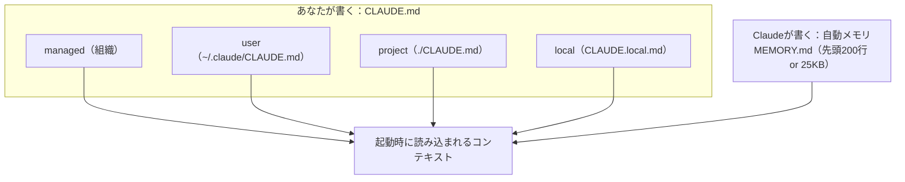
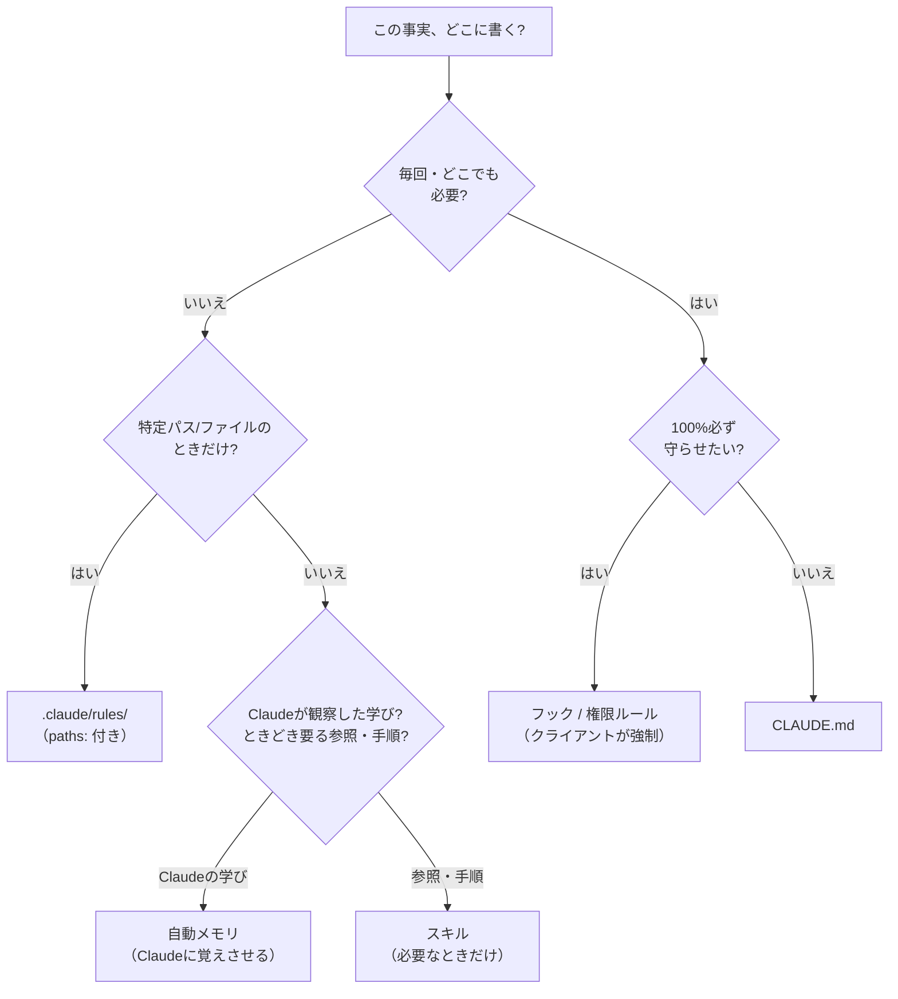

# Claude Codeの記憶設計 — CLAUDE.md・rules・自動メモリの置き場所を早見表で決める

> **対象読者**: とりあえず効く CLAUDE.md を1つ作りたい入門者／スコープ・import・自動メモリまで含めた「メモリ設計」を整理したい開発者
> **前提知識**: Claude Code がインストール済みであること。git の基本操作（コミット）に触れたことがあると読みやすいですが、必須ではありません
> **この記事でできること**: CLAUDE.md と自動メモリの違いを理解し、「この事実はどこに書くか」を1枚の表で判断できる

「同じことを毎回説明し直している」「CLAUDE.md を書いたのに、なぜか毎回無視される」——Claude Code を使い込むほど、この2つにぶつかります。原因は同じで、**記憶の仕組みを1つだと思っている**ことです。

通常のセッションが扱う記憶は、**あなたが書く CLAUDE.md** と、**Claude が自分で書く自動メモリ**の2種類です（サブエージェント専用メモリもありますが、別枠として後半で触れます）。公式ドキュメントに散らばる両者の仕様を突き合わせ、「この設定はどこに書くか」を**1枚の判断表**で決められるようにします。

動作確認は2026年7月4日時点の Claude Code 2.1.201 です（バージョンはほぼ毎日上がるので、番号が違っても読み替えてください。手元では `claude --version`）。扱うのは Claude Code の CLAUDE.md と自動メモリで、Claude.ai の会話メモリや API の Memory Tool は別機能です。

## まず、記憶は主に2種類

先に、繰り返し出てくる言葉をそろえます。

| 言葉 | この記事での意味 |
|---|---|
| コンテキスト | Claude に毎回渡される文脈（指示や会話）。ここに入った内容だけを踏まえて動きます |
| CLAUDE.md | あなたが書く指示ファイル。プロジェクトやユーザー単位で置きます |
| 自動メモリ | Claude が自分で学びをためていく仕組み（`MEMORY.md`） |
| フック | 決まったタイミングでコマンドを自動実行する仕組み。モデルの判断に関係なく走ります |
| 権限（パーミッション）ルール | ツールやコマンドの実行を許可・拒否する設定 |

2つの記憶は補完し合い、**どちらも毎セッションの開始時に読み込まれます**。そしてどちらも「絶対に守らせる設定」ではなく**コンテキスト**として扱われます。何があっても操作を止めたいなら、記憶ではなく `PreToolUse` フックが要ります（フック自体は別の記事で扱う予定です）。



2つの違いを整理します。

| | CLAUDE.md | 自動メモリ |
|---|---|---|
| 書くのは | あなた | Claude |
| 中身 | 指示とルール | 学びとパターン |
| スコープ | プロジェクト／ユーザー／組織 | リポジトリ単位（ワークツリー間で共有） |
| 読み込み | 毎セッション（全文） | 毎セッション（MEMORY.md の先頭200行 or 25KB） |

図の `local`（＝`CLAUDE.local.md`）は project スコープの個人版です。4つのスコープ（managed／user／project／local）の詳しい違いは、後述の「メモリ設計の要点」で扱います。

### 保存用の判断表 — この事実、どこに書く?

「毎回同じ説明」を減らす鍵は、**その事実を置くべき層を選ぶ**ことです。結論はこの1枚で足ります（理由は後半で説明します）。

| こういう事実 | 置き場所 |
|---|---|
| どこでも・毎回必要で、Claude が常に知っておくべき | **CLAUDE.md** |
| 特定のファイル／パスを触るときだけ効けばよい | **`.claude/rules/`（`paths:` 付き）** |
| 人が課すルールではなく、Claude が観察した「学び」 | **自動メモリ**（Claude に覚えさせる） |
| たまに使う参照資料や、`/名前` で呼び出す手順 | **スキル**（オンデマンド読み込み） |
| 例外なく毎回、モデルの判断に関係なく守らせたい | **フック**（決まったタイミングで実行）／**権限ルール**（許可・拒否） |

- 入門者の方: 「メモリ」には、あなたが書くものと Claude が書くものの2つがあります。ここの混同が「なぜ覚えてくれないの?」の一番の原因です。
- 開発者の方: どちらもハードな制約ではありません。必ず成立させたい要件は、記憶ではなくフックか権限（パーミッション）ルール（[W3](https://qiita.com/ujunja/items/2b5cceaf5a1a39f43033) で扱いました）に置きます。

## はじめての、効くCLAUDE.md（入門）

最初の1つは小さく作るのがコツです。手順は3ステップです。

1. プロジェクトのルートで `/init` を実行する。**Claude Code を起動し、その入力欄で `/init` と打ちます**（OS のシェルで実行するコマンドではありません）。コードベースを分析してたたき台を作ります（既存の CLAUDE.md があれば上書きせず改善案を提案）。
2. できたファイルから**要らない行を削る**。
3. git にコミットしてチームで共有する（プロジェクトの CLAUDE.md は共通資産として育ちます。git に慣れていなければ、まず一度コミットしてみるところから）。

削る基準が、公式の「書くべき／書かないほうがよい」表です。多くの人が足したくなるもの（チュートリアル、当たり前の心得）は、たいてい書かないほうが効きます。

| 書くべき（Include） | 書かないほうがよい（Exclude） |
|---|---|
| Claude が推測できないシェルコマンド | コードを読めば分かること |
| 既定と異なるコードスタイルのルール | Claude が既に知っている標準的な言語規約 |
| テスト手順・使うテストランナー | 長い API ドキュメント（リンクで十分） |
| リポジトリの作法（ブランチ名・PR 規約） | 頻繁に変わる情報 |
| プロジェクト固有のアーキテクチャ判断 | 長い説明やチュートリアル |
| 開発環境のクセ（必要な環境変数など） | ファイルごとのコードベース説明 |
| よくある落とし穴・非自明な挙動 | 「きれいなコードを書く」等の自明な心得 |

最初の CLAUDE.md はこのくらいで十分です。

```markdown
# CLAUDE.md

## コマンド
- ビルド: `npm run build`
- テスト: `npm test`（コミット前に必ず実行）

## コードスタイル
- インデントは半角スペース2つ
- 文字列はシングルクォート

## 注意点
- API テストにはローカルの Redis が必要
```

指示は**検証できるくらい具体的に**書きます。「きれいに整形して」ではなく「インデントは半角スペース2つ」、「テストして」ではなく「`npm test` をコミット前に実行」。行数の目安は**1ファイル200行未満**です（理由は後述の「CLAUDE.mdが『無視される』本当の理由」で）。

いつ1行足すかの基準もあります。**同じ間違いを2回された**、コードレビューでプロジェクト固有の見落としが出た、同じ訂正を別セッションでまた打った、新メンバーにも同じ前提が要る——このどれかなら足しどきです。ただし複数ステップの手順や、特定の場所だけで必要なものは、CLAUDE.md ではなくスキル（`/名前` で呼び出せる再利用可能な指示のまとまり。スラッシュコマンドとは別の仕組みで、詳しくは別の記事で）やパス限定ルール（後述）に回します。

## メモリ設計の要点（開発者向け）

CLAUDE.md をチームや複数スコープで使い込むと、`settings.json` の感覚ではハマる3点があります（入門なら次節まで読み飛ばして構いません）。

- **4つのスコープは「上書き」ではなく「連結」**。managed／user／project／local はどれかが勝つのではなく、すべて連結してコンテキストに入ります。`settings.json`（高いスコープが上書き）とは別モデルで、矛盾した指示が同時に居座ることがあります。
- **下位ディレクトリの CLAUDE.md はオンデマンド**。作業ディレクトリとその祖先は起動時に全文読まれますが、下位（サブフォルダ）の CLAUDE.md は起動時には読まれず、Claude がそのフォルダのファイルを実際に読んだときに初めて足されます。モノレポで「`packages/foo` の流儀を知らない」正体はこれです。
- **`@import` はコンテキスト節約にならない**。取り込んだファイルは起動時に全文展開されるので、直接貼るのと消費量は同じです。毎回の読み込みを減らすなら、後述の `.claude/rules/`（パス限定）が正しい道具です。

そもそも「書いたのに効かない」のは、CLAUDE.md がシステムプロンプトの一部ではなく、その後ろに続くユーザーメッセージとして渡されるからです（後述の「CLAUDE.mdが『無視される』本当の理由」で扱います）。

<details>
<summary>開発者向け：連結の詳細・起動場所・CLAUDE.local.md＋import・AGENTS.md連携</summary>

### 連結と、settings.json との違い

読み込み順は広いほうから managed（組織全体）→ user（`~/.claude/CLAUDE.md`）→ project（`./CLAUDE.md` または `./.claude/CLAUDE.md`）→ local（`./CLAUDE.local.md`）です。managed だけは配置先が OS ごとに決まっていて（MDM で配布する組織向け）、個人の設定では除外できません。

ここが [W1](https://qiita.com/ujunja/items/05a2c163921ab3e1ea96) の `settings.json` と決定的に違います。`settings.json` は優先順位で上書きされ高いスコープが勝ちますが、CLAUDE.md は上書きされず、すべて連結（concatenation）されます。そのためスコープをまたいで矛盾した指示が同時にコンテキストへ存在でき、解決は Claude 任せになりがちです——`settings.json` の感覚では気づけない罠です。

### どこで `claude` を起動するかで読み込みが変わる

Claude Code は作業ディレクトリからツリーを**上へたどって** CLAUDE.md / `CLAUDE.local.md` を集めます（起動場所に近いものほど後に読まれ、最も具体的な指示として扱われます）。各ディレクトリ内では `CLAUDE.local.md` が `CLAUDE.md` の後に足されます。

読み込みには非対称があります。作業ディレクトリとその祖先は起動時に全文読まれ、下位のサブディレクトリはオンデマンドです。ルートで起動すると読まれるのはルートの CLAUDE.md だけですが、サブディレクトリの**中に入ってから**起動すると、そのディレクトリに加え**すべての祖先の CLAUDE.md** が起動時に読まれます。`claude` を打つ前にどこへ `cd` したかで、最初に効く内容が変わります。

なお CLAUDE.md 内のブロックコメント（`<!-- メモ -->`）は、コンテキストへ入る前に取り除かれます（コードブロック内のコメントは残ります）。

### CLAUDE.local.md と @import

Git に入れたくない個人設定は、プロジェクト直下に `CLAUDE.local.md` を作ります（`.gitignore` へ）。CLAUDE.md は `@path/to/import` で他ファイルを取り込め、**起動時に展開**されます。相対パスは作業ディレクトリではなく、**その import を書いたファイル**を基準に解決されます。import は入れ子にでき、**最大4段（importの連鎖4回まで）**たどります。

```markdown
# CLAUDE.md
プロジェクト概要は @README.md、使えるスクリプトは @package.json を参照。
個人設定は @~/.claude/my-project-instructions.md
```

`CLAUDE.local.md` は gitignore されるため、作ったワークツリーにしか存在しません。複数の `git worktree` で共有したいなら、ローカルファイルではなく `@~/.claude/my-project-instructions.md` のようにホームのファイルを import します。初めて外部 import に出会うと、対象ファイルを列挙した確認ダイアログが一度だけ出ます。拒否すると import は無効化され、ダイアログは再表示されません。

### AGENTS.md との連携と、対話式の `/init`

Claude Code が読むのは `AGENTS.md` ではなく `CLAUDE.md` です。他のコーディングエージェント向けに `AGENTS.md` を使うなら、`@AGENTS.md` を import する CLAUDE.md を作れば、二重管理せず両方が同じ内容を読めます。

```markdown
# CLAUDE.md
@AGENTS.md
（この下に Claude 固有の指示を書き足す）
```

シンボリックリンク（`ln -s AGENTS.md CLAUDE.md`）でも代用できますが、Windows ではリンク作成に管理者権限や開発者モードが要るため、`@AGENTS.md` の import が無難です。`/init` は既存の `AGENTS.md` を読んで生成物に取り込み、`.cursorrules`・`.devin/rules/`・`.windsurfrules` など他ツールの設定も読みます。

環境変数 `CLAUDE_CODE_NEW_INIT=1` を付けて起動すると、`/init` が**対話式の多段フロー**になります（現在提供されている挙動です）。何をセットアップするか（CLAUDE.md・スキル・フック）を尋ね、サブエージェント（subagent）がコードベースを調べ、不足を埋める追加質問をし、ファイルを書く前にレビュー可能な提案を見せます。既定の `/init` は [W2](https://qiita.com/ujunja/items/577019cd04fed7bfabec) で触れた「生成して提案する」フローのままです。

</details>

## 大きくなってきたら：.claude/rules/

CLAUDE.md が膨らんだら、`.claude/rules/` に複数の markdown として指示を分けられます。ルールファイルは YAML フロントマターの `paths:` で**特定のパスに限定**できます。

```markdown
# .claude/rules/frontend.md
---
paths: ["src/frontend/**"]
---
インラインスタイルではなく Tailwind のユーティリティクラスを使う。
```

- `paths:` の**ない**ルールは、`.claude/CLAUDE.md` と同じ優先度で起動時に無条件で読み込まれます。
- `paths:` の**ある**ルールは、Claude がそのパターンに一致するファイルを読んだときだけ発火します（毎ツール使用ごとではありません）。

これが CLAUDE.md を肥大化させない正攻法です。特定パスでしか意味を持たない内容は、常時読み込みの CLAUDE.md ではなくパス限定ルールへ切り出します。個人用の `~/.claude/rules/` はプロジェクトルールより先に読まれるので、矛盾時はプロジェクト側が実質的に優先されます。

<details>
<summary>細かい既知の挙動（シンボリックリンクと paths:）</summary>

シンボリックリンク経由（例: リンクされたチェックアウト）でファイルに到達したときの `paths:` 照合は、2026年7月1日（v2.1.198）に正しく動くよう修正されました。それ以前は一致しないことがありました。

</details>

## Claudeが自分で書く：自動メモリ

自動メモリは、**あなたが何も書かなくても** Claude がセッションをまたいで知識をためる仕組みです。将来の会話で役立ちそうかを Claude が判断して保存します（v2.1.59 以降が必要）。

- **保存場所**: `~/.claude/projects/<プロジェクト>/memory/`。`<プロジェクト>` は Git リポジトリから決まり（リポジトリ外ではプロジェクトルート）、同じリポジトリのワークツリーやサブディレクトリは**1つのフォルダを共有**します（`autoMemoryDirectory` 設定で変更可）。
- **中身**: 入口の `MEMORY.md` と、Claude が作る話題別ファイル（`debugging.md` など）。`MEMORY.md` は「何がどこにあるか」の索引です。
- **読み込みの上限**: 起動時に読まれるのは `MEMORY.md` の**先頭200行、または先頭25KB のどちらか早いほう**まで（数値は2026年7月時点）。この上限は **`MEMORY.md` だけ**の話です。起動時またはオンデマンドで読み込み対象になった CLAUDE.md は、長さに関わらず全文入ります。話題別ファイルは起動時には読まれず、必要なときに Claude が開きます。
- **マシンローカル**: 同じリポジトリのワークツリー間では共有されますが、**別マシンやクラウド環境には同期されません**。コミットした CLAUDE.md のようにチームへ配られはしません。

自動メモリに足したいときは、会話でそのまま頼めば（例:「これからは npm ではなく pnpm を使って」）Claude が保存します。CLAUDE.md に足すなら「これを CLAUDE.md に追記して」と頼むか、`/memory` から開いて編集します。（`#` で始めるクイックメモの記法は、現行の公式ドキュメントには記載がありません。）

- 入門者の方: **自動メモリは補助です。** Claude が役立つと判断した学びを保存しますが、チーム全員に必ず読ませたい前提や毎回確実に守らせたいルールは CLAUDE.md に書きます。覚える1コマンドは `/memory`——読み込み中の CLAUDE.md・ローカルファイル・ルールを一覧でき、自動メモリのオン／オフも切り替えられます（環境変数なら `CLAUDE_CODE_DISABLE_AUTO_MEMORY=1` を付けて起動）。
- 開発者の方: 「200行 / 25KB」は `MEMORY.md` の上限で、CLAUDE.md の上限ではありません。混同すると「どれだけ入るか」の見積もりを誤ります。

ここまでの2種類とは**別枠**に、サブエージェント（subagent）メモリがあります。frontmatter の `memory` フィールドで独自の永続メモリ（scope は `user`/`project`/`local`）を持て、`project` が共有向けの推奨です。CLAUDE.md とも自動メモリとも別の仕組みで、詳しくは別の記事で扱う予定です。

## この事実、どこに書く? — 各層の使い分け

置き場所は「保存用の判断表」で決まります。ここでは、なぜその層なのかを補足します。

- **どこでも毎回必要 → CLAUDE.md**。常に読まれるので、中核の規約（コーディング規約・ビルドコマンド・プロジェクト構造）や「常に X する／絶対 X しない」はここへ。
- **特定パスのときだけ → `.claude/rules/`（`paths:` 付き）**。一致するファイルを触ったときだけ発火し、常時読み込みを膨らませません。
- **Claude が観察した学び → 自動メモリ**。人が課すルールではなく、作業から得た知見を Claude 自身にためさせます。
- **たまに使う参照・`/名前` で呼ぶ手順 → スキル**。オンデマンド読み込みで、毎回の会話を膨らませません。
- **例外なく必ず → フック／権限ルール**。モデルの判断に関係なくクライアント側で強制されます。

<details>
<summary>同じ判断をフローチャートで見る</summary>



</details>

## CLAUDE.mdが「無視される」本当の理由

「書いたのに効かない」の正体は、1つの事実で説明できます。**CLAUDE.md の内容は、システムプロンプトの一部ではなく、その後ろに続く『ユーザーメッセージ』として渡されます。**（システムプロンプトは最初から固定で渡る土台の指示、ユーザーメッセージは会話中に渡す入力です。）

Claude はそれを読んで従おうとしますが、厳密な遵守は保証されません。特に**曖昧・矛盾した指示**で守られにくくなります。原因は「長い」だけではなく、名前の付いた3つです。

1. **肥大化（bloat）**: 目安は1ファイル200行未満。公式の「200行」目安と context rot（コンテキストが伸びるほどモデルの再現精度が落ちる現象）という背景を踏まえると、行が増えるほど本当に大事な指示が埋もれると考えられます。対策は**容赦なく削る**こと。指示がなくても正しくできることは消し、必ず起きてほしいことはフックに変えます。
2. **曖昧さ（vagueness）**: 検証できるくらい具体的に。「コードを整形する」ではなく「インデントは半角スペース2つ」、「変更をテストする」ではなく「`npm test` を実行」。
3. **矛盾（conflicts）**: 2つのルールが（入れ子の CLAUDE.md や `.claude/rules/` をまたいで）矛盾すると、Claude は**どちらかを任意に選ぶ（may pick one arbitrarily）**ことがあります。この点は公式ドキュメント間に温度差があり、`features-overview` では「Claude が判断で調整し、より具体的な指示が優先されるのが普通」とも書かれています。安全側に倒すなら「任意に選ばれうる」を前提に置き、「具体的なほうが優先されやすい」は保証ではなく傾向として押さえます。

「絶対に守らせたい」ときは、CLAUDE.md を長く強い口調にするのではなく、**目的に合った層を使い分けます**。

| やりたいこと | 使う層 |
|---|---|
| モデルの判断と無関係に、必ず止める／走らせる | **フック**・**権限ルール**（`permissions.deny`）・サンドボックス |
| システムプロンプトと同じ高さに指示を置く | CLI フラグ **`--append-system-prompt`**（毎回の起動で渡すため、スクリプト・自動化向き） |
| 一般的な行動指針を伝える | **CLAUDE.md** |

フックと権限ルールは、モデルの判断に関係なくクライアント側で強制されます（サンドボックスや `permissions.deny` は [W3](https://qiita.com/ujunja/items/2b5cceaf5a1a39f43033) で扱いました）。`--append-system-prompt` は「より高いプロンプト位置に置く」手段で、技術的に遮断するわけではない点が前2者と違います。

## /compact で何が残るか

会話が長くなると、要約でコンテキストが圧縮されます（`/compact`）。このとき何が残り何が消えるかは仕組みごとに違い、「長いセッションの途中でルールを忘れた」の原因は、たいていこの表の1行です。

| 仕組み | `/compact` の後 |
|---|---|
| ルートの CLAUDE.md／`paths:` なしのルール | ディスクから再注入される |
| 自動メモリ | ディスクから再注入される |
| `paths:` 付きのルール | 一致するファイルを再び読むまで消える |
| サブディレクトリの入れ子 CLAUDE.md | そのフォルダのファイルを再び読むまで消える |
| 呼び出したスキルの本体 | 再注入される（1スキル5,000トークン・合計25,000トークンが上限。古いものから落ちる） |
| フック | 対象外（コードとして走るので、コンテキストではない） |

## 早見表

### スラッシュコマンド

| コマンド | 用途 |
|---|---|
| `/memory` | 読み込み中の CLAUDE.md・ローカル・ルールを一覧。自動メモリのオン／オフ、フォルダを開く |
| `/init` | たたき台の CLAUDE.md を生成（既存があれば上書きせず提案） |
| `/compact` | 会話を要約してコンテキストを圧縮 |

### 環境変数・フラグ

| 名前 | 用途 |
|---|---|
| `CLAUDE_CODE_NEW_INIT=1` | `/init` を対話式の多段フローにする（起動時に付与） |
| `CLAUDE_CODE_DISABLE_AUTO_MEMORY=1` | 自動メモリを無効化する |
| `autoMemoryDirectory` 設定 | 自動メモリの保存先を変更（絶対パスか `~/` 始まり） |
| `claude --safe-mode` | CLAUDE.md・プラグイン・スキル・フック・MCP をすべて無効にして起動（切り分け用） |

CLAUDE.md やフックが変な挙動の原因かもと思ったら、`claude --safe-mode` で全部を切って起動し、切り分けるのが手早いです。ただし managed settings policy 下のフック・ステータスライン・ファイル候補コマンドは safe-mode でも適用され続けます（組織配布の設定は残る、という注意点です）。

## まとめ

**入門者の方へ**

- 記憶は主に2種類。**CLAUDE.md はあなたが書き、自動メモリは Claude が書く**。どちらも毎回自動で読まれます。
- 最初の CLAUDE.md は小さく。`/init` で作り、Include/Exclude 表で削り、git にコミットして共有します。
- 「効かない」原因はたいてい3つ（長い・曖昧・矛盾）で、いずれも直せます。`/memory` で今の状態を確認できます。

**開発者の方へ**

- CLAUDE.md の4スコープは**上書きではなく連結**です。`settings.json` の優先順位とは別モデルで、矛盾指示が同居して任意に解決されることがあります。
- **import はコンテキストを節約しません**。毎回の読み込みを減らすなら、パス限定の `.claude/rules/` を使います。
- **絶対に守らせたいものは CLAUDE.md に頼らない**。止めるのはフックや権限ルール、プロンプト位置に置くなら `--append-system-prompt`、と目的で使い分けます。

次の一歩です。

- 入門者の方: `/init` で作ったファイルから、Exclude 表に当たる行を削ってみてください。それだけで守られ方が変わります。
- 開発者の方: いま CLAUDE.md に書いている内容を「保存用の判断表」で仕分けし、パス限定は `.claude/rules/` へ、Claude の学びは自動メモリへ移してみてください。

## 参考リンク

- [Memory (CLAUDE.md & auto memory)](https://code.claude.com/docs/en/memory) — 2026-07-04 確認
- [Best Practices](https://code.claude.com/docs/en/best-practices) — 2026-07-04 確認
- [Features Overview](https://code.claude.com/docs/en/features-overview) — 2026-07-04 確認
- [Context Window](https://code.claude.com/docs/en/context-window) — 2026-07-04 確認
- [Large Codebases](https://code.claude.com/docs/en/large-codebases) — 2026-07-04 確認
- [Subagents](https://code.claude.com/docs/en/sub-agents) — 2026-07-04 確認
- [Commands Reference](https://code.claude.com/docs/en/commands) — 2026-07-04 確認
- [Changelog](https://code.claude.com/docs/en/changelog) — 2026-07-04 確認
- [Effective context engineering for AI agents (Anthropic Engineering)](https://www.anthropic.com/engineering/effective-context-engineering-for-ai-agents) — 2026-07-04 確認

---
### シリーズナビ
- ◀ 前: [W3 Claude Codeのサンドボックスだけでは秘密情報を守れない](https://qiita.com/ujunja/items/2b5cceaf5a1a39f43033)
