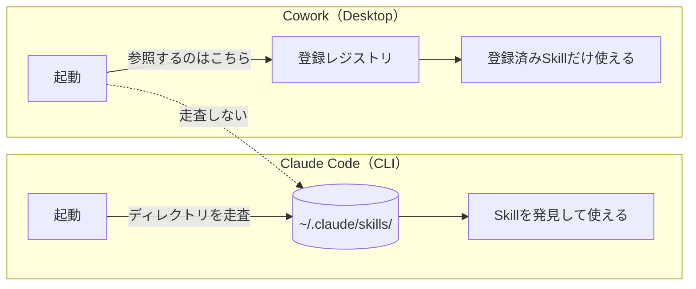
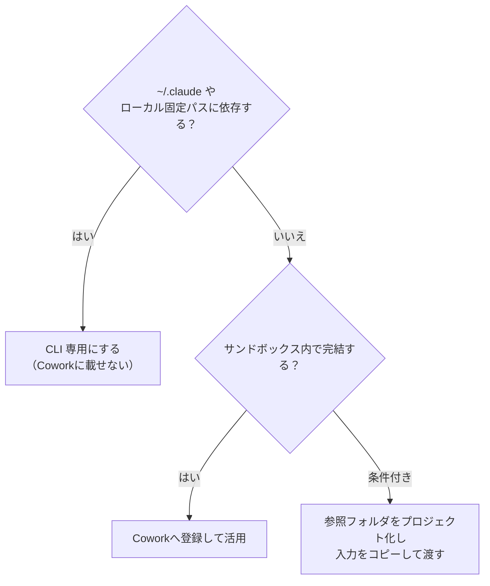

## 🙋 はじめに

Claude の Skill を自作して、ターミナルの Claude Code（CLI）では問題なく動いていたのに、デスクトップの Cowork を開いたら一覧にも出てこない。こんな経験はないでしょうか。

私も、社内リポジトリから取ってきた Skill を `~/.claude/skills/` にコピーして、CLI では使えているのに Cowork の「カスタマイズ > スキル」には影も形もない、という状態にハマりました。
原因は単純で、**CLI と Cowork では Skill の読み込み方そのものが違う**からです。CLI の「フォルダに置けば読む」という感覚のまま Cowork を使うと、ここでつまずきます。

この記事では、その違いと、Cowork に Skill をきちんと認識させる手順を、自作 Skill を運用している方向けにまとめます。なお、ここで扱う挙動は2026年6月時点の確認と報告に基づきます。後述のとおり既知の不具合を含むため、最新の仕様は公式ドキュメントで確認してください。

## 🎯 要点（先に結論）

- Skill フォルダを `~/.claude/skills/` に**置くだけ**だと、Claude Code（CLI）は認識しますが、Cowork は認識しません。
- 理由は、Cowork が `~/.claude/skills/` を自動スキャンしないからです。Cowork は独自の登録レジストリを持ち、設定画面（カスタマイズ > スキル）から登録したものを読みます。
- 反映はリロードでは効きません。**設定画面で登録 → 新しいセッション（タスク）から有効**になります。
- `SKILL.md` の `description` には「何を・いつ使うか」と発動トリガー語を書きます。複数行で書くと整形ツールやYAML解釈でフロントマターが壊れ、認識されない事例があるので、**1行（クオート囲み）が無難**です。
- Cowork はサンドボックスで動くため、`~/.claude` やローカルの固定パスに依存する Skill は、そもそも Cowork 向きではないことが多いです。CLI 専用と割り切るのも有効です。

> 📝 Agent Skills とは：手順・スクリプト・参照資料をフォルダにまとめ、エージェントが必要なときに読み込む仕組みです。`SKILL.md`（YAMLフロントマター＋本文）が起点になります。

---

## 🔍 症状：置いただけではCoworkに出てこない

よくある手順は以下です。

```bash
# 例：社内リポジトリから Skill を取得して配置
git clone https://github.com/<org>/agent-skills.git
cp -r agent-skills/<skill-name> ~/.claude/skills/
```

これで Claude Code（CLI）は Skill を認識します。`/` で一覧に出ますし、トリガーにも反応します。
ところが Cowork（Claude Desktop のデスクトップ作業モード）では、同じ Skill が一覧にも出ず、発動もしません。「カスタマイズ > スキル」を開いても見当たりません。

---

## ⚖️ なぜ出てこないか：CLIとCoworkで読み込み方が違う

同じ `~/.claude` を見ているはず、と思いがちですが、CLI と Cowork では Skill の読み込み方が別物です。まず違いを整理します。

| 観点 | Claude Code（CLI） | Cowork（Desktop） |
|---|---|---|
| Skill の探索 | `~/.claude/skills/` 等の**ディレクトリを走査**して発見 | **自動走査しない**。独自の登録レジストリを参照 |
| 追加方法 | フォルダを置く（＋必要に応じ再起動） | **「カスタマイズ > スキル」からアップロード／有効化** |
| 反映タイミング | 新規セッション（再起動）から | 登録後、**新規セッション（タスク）から** |
| 実行環境 | ローカルそのまま（`~/.claude`・ローカルパスに届く） | **サンドボックス**（作業フォルダ外は要マウント） |

核心は一点です。Cowork は起動時に `~/.claude/skills/` をスキャンして新規 Skill を発見する処理を持ちません。設定画面（カスタマイズ > スキル）に出るのは画面から登録した Skill が中心で、`cp` や rsync、git で置いただけのものは、ファイルとして正しくても一覧に出てきません。



これは複数の利用者から同じ挙動が報告されている既知の事象です（[GitHub Issue #50669](https://github.com/anthropics/claude-code/issues/50669) のほか #49148、#31597、#26131、#58615 など）。置けば読むという CLI の発想は Cowork では通用せず、登録という明示的な操作が要ります。

---

## 🛠️ 手順：CoworkにSkillを取り込む

最初の一度だけ、「コード実行とファイル作成」を有効にする前提があります。ここはプランと権限で操作が変わるので、注意してください（画面表記は日本語UIに合わせています）。

- **個人プラン（Free / Pro / Max）**：自分で「設定 > 機能」（Settings > Capabilities）を開き、「コード実行とファイル作成」をオンにします。
- **Team プラン**：組織レベルで既定オンです。**メンバーの「組織設定」にはこの有効化項目は出ません**（有効化はオーナー専用）。メンバーはそのまま次の「カスタマイズ > スキル」へ進めば登録できます。もしスキルが使えない、または一覧でグレーアウトする場合だけ、オーナーに「組織設定 > スキル」で「コード実行とファイル作成」と「スキル」を有効化してもらいます。
- **Enterprise プラン**：オーナーが「組織設定 > スキル」で「コード実行とファイル作成」と「スキル」を有効化します。メンバー側の操作は Team と同じです。

> ⚠️注意：「組織設定」に有効化のスイッチが見当たらないのは、多くの場合あなたがメンバー権限だからです。メンバーは「カスタマイズ > スキル」を使い、必要時だけオーナーに有効化を依頼してください。

そのうえで、登録の手順は次のとおりです。

1. Skill フォルダ（`SKILL.md` ＋ `scripts/` などの一式）を **ZIP** にまとめます。配布やワンクリック導入まで見据えるなら、拡張子を **`.skill`** にし、`SKILL.md` をアーカイブ直下に置きます。`.skill` は「スキルを保存」操作で取り込めます。
2. Cowork 左サイドバーの **「カスタマイズ」→「＋」→「スキル」** タブを開きます。
3. **「スキルをアップロード」** を選びます（既存のものはトグルで有効化します）。
4. スキル横のトグルを **オン** にします。オフだと使われません。
5. **新しいタスク（セッション）** を開始して反映します。

実際の画面はこんな様子です。

**図1：「カスタマイズ > スキル」でアップロード**（手順2〜3）


**図2：アップロードしたスキルのトグルを「オン」にした状態**（手順4。オンで有効になる）


> ⚠️注意：リロード（同一セッションの再読込）では新規 Skill は反映されません。登録したら新しいセッションを開く、が基本線です。

---

## 📝 Tips：`description` の書き方

`SKILL.md` のフロントマターは YAML です。必須は `name` と `description` の2つです。

```yaml
---
name: my-skill
description: "何をするスキルか／いつ使うか。発動キーワードも入れる（1行）。"
---
```

- `name`：小文字・ハイフン区切り・簡潔に。フォルダ名と一致させるのが無難です（公式ヘルプの上限は**最大64文字**）。
- `description`：何を・いつ使うかを書きます。Claude はこの文章を見てスキルの発動を判断するので、発動キーワードを具体的に入れるとトリガー漏れを防げます（公式ヘルプの上限**は最大200文字**）。

ここで実務上のハマりどころが、`description` の複数行化です。
`description` を複数行で書くと、整形ツール（Prettier など）の介在や YAML の解釈でフロントマターが壊れ、認識されないことがあります。**1行**（クオート囲み）にしたら一覧に出るようになった、という報告があります。

あわせて、小さなコツです。

- `description` には発動トリガー語を具体的に入れます（例：「日報」「作業まとめ」など）。ただし `ALWAYS`／`NEVER`／`MUST` を並べた硬い命令文は避けます。文脈が落ちて、エッジケースを取りこぼしやすくなります。
- `name` はフォルダ名と一致させます。
- 任意フィールド（`allowed-tools`、`dependencies` など）は必要なときだけ使います。

---

## 🧭 使い分け：CLI専用にするか、Coworkへ取り込むか

Cowork はサンドボックスで動くため、`~/.claude` 配下やローカルの固定パス（例：外付けドライブの `G:\`）に直接アクセスできません。これらに依存する Skill は、Cowork では実行時にパスへ届かず、その都度マウントが必要になります。

判断の目安は次のとおりです。

- ローカルのログや特定ドライブ、ホスト環境に依存する Skill は、**CLI 専用**にするのが素直です。Cowork に無理に載せません。
- サンドボックス内で完結する作業（文書生成・調査・整形など）は、**Cowork へ登録**して活用します。

迷ったときは、この順で振り分けると決めやすいです。



CLI で動けば十分なものを Cowork に載せ替えようとすると、マウント運用の手間が増えるだけのことが多いです。Skill ごとに実行環境を決めてしまうのが、結局は速い、というのが私の実感です。

:::note info
**Tips：Coworkの参照フォルダを“プロジェクト化”して事前に用意する**

Cowork はサンドボックスで作業フォルダの外を読めないため、依頼のたびにフォルダをマウントするのは手間になります。これを避ける運用があります。

- 案件ごとに、Cowork が常に参照できる作業フォルダ（プロジェクト）を先に用意しておきます。
- 調査や依頼のときは、必要な入力ファイルをそのフォルダに置いてから、指示と一緒に Cowork へ渡します。
- こうすると、毎回のマウントの往復が減り、入力と成果物が同じフォルダにそろいます。

ただし、向き不向きがあります。

- 有効：入力をそのフォルダにコピーできるケース。資料やログの抜粋、対象ファイルなどです。
- 不向き：`~/.claude` のログや固定ドライブを直接読む前提のスキル。これはフォルダ配置では代替できず、CLI 向きです。
:::
---

## 🌐 Cowork以外でも使えるか（claude.ai／Desktopチャットのプロジェクト）

スキルはアカウント単位で有効化され、チャット／プロジェクト／Cowork／Claude Code を横断して適用されます。

- Claude Desktop の通常チャットのプロジェクトでも、有効化済みのスキルが `description` で自動起動しました。プロジェクトに添付したファイルではなく、アカウントで有効なスキルが効きます。
- 条件は、当該プランで「コード実行とファイル作成」が有効であることです。無効だと、CLAUDE.md などに書いた「このスキルを使う」という参照は、ただのテキストになって機能しません。
- ここから言えるのは、ルール本体をスキルへ外出しし、CLAUDE.md には参照だけ残す運用でも、スキルがアカウントで有効なら、Claude のどの入り口（チャット／プロジェクト／Cowork／Claude Code）から使っても同じように効く、ということです。逆に、スキルを使えない入り口（コード実行が無効）で動かすなら、ルールをインラインで持つ別版を用意します。

---

## ✅ まとめ

- Cowork は `~/.claude/skills/` を自動で読みません。CLI の「置けば読む」は通用しません。
- Cowork に出すには、「設定 > 機能」で有効化 →「カスタマイズ > スキル」で登録 → 新セッション、の順です。
- `description` は「何を・いつ使うか」とトリガー語を入れ、簡潔に（公式ヘルプの上限は最大200文字）。複数行でフロントマターが壊れる事例があるので1行が無難です。
- ローカル依存の Skill は CLI 専用と割り切るのも正解です。Skill ごとに実行環境を決めましょう。

---

## 🔗 参考リンク

- [Claudeでスキルを使用する（Anthropic公式ヘルプ）](https://support.claude.com/ja/articles/12512180-claudeでスキルを使用する)
- [カスタムスキルの作成方法（Anthropic公式ヘルプ）](https://support.claude.com/ja/articles/12512198-カスタムスキルの作成方法)
- [Cowork が `~/.claude/skills/` を自動走査しない報告（GitHub Issue #50669）](https://github.com/anthropics/claude-code/issues/50669)
- [CLIで動く Skill が一覧（`/`）に出ない報告（GitHub Issue #49148）](https://github.com/anthropics/claude-code/issues/49148)

---

最後に、GMOコネクトでは研究開発や国際標準化に関する支援や技術検証をはじめ、幅広い支援を行っておりますので、何かありましたらお気軽にお問合せください。

お問合せ: https://gmo-connect.jp/contactus/
