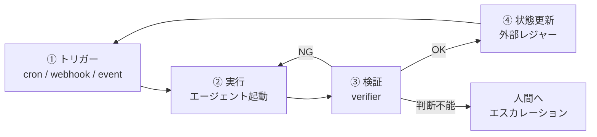

## TL;DR

- 2026年6月に一気に広まった **Loop Engineering（ループエンジニアリング）** は、「AIに良いプロンプトを打つ」のではなく「AIにプロンプトを出し続ける仕組み（ループ）を設計する」というパラダイム
- ただし現在語られているのはほぼ **開発ドメイン**（CI修復・lint・依存バンプ）の話
- 私たちが開発している TechHive Agents（THA）は、これを **業務ドメイン**（HR業務のBPO）で商用実装している。ループを業務に持ち込むと、設計の重心が「検証の自動化」から **「状態の外部化」と「エスカレーション設計」** に移る
- 本記事では、ループエンジニアリングの4要素を THA のアーキテクチャ（ コンテキストレジャー / リスクティア HITL / MCP 単一入口）にマッピングし、業務ループ特有の設計判断を整理する

## 1. ループエンジニアリングとは何か

発端は 2026年6月7日、Peter Steinberger 氏（OpenClaw 作者）の2文のポストだった。

> You shouldn't be prompting coding agents anymore. You should be designing loops that prompt your agents.

翌日には Google の Addy Osmani 氏がブログ記事 "Loop Engineering" で概念を定式化。さらに Anthropic で Claude Code を率いる Boris Cherny 氏の発言が象徴として繰り返し引用されている。

> I don't prompt Claude anymore. I have loops running that prompt Claude and figuring out what to do. My job is to write loops.

要点は一つ。**レバレッジの所在が「プロンプトを打つこと」から「プロンプトを打つシステムを設計すること」へ移った**、ということだ。

「タスクを見つける → 実行する → 検証する → ダメなら直す → 次を決める」── このサイクルの各ステップで、従来は人間が次の一手を出していた。AIがどれだけ速くても、人間がバトンを渡すまで作業は止まる。ループエンジニアリングはこの人間ボトルネックを外し、条件を満たすまでシステム自身がサイクルを回す。

### 抽象化の系譜における位置

各レイヤーは下を置き換えるのではなく、上に積み上がる。

| レイヤー | 時期 | 設計対象 |
|---|---|---|
| ① プロンプトエンジニアリング | 〜2024 | 1回の指示の質 |
| ② コンテキストエンジニアリング | 2025 | モデルに渡す情報環境の全体 |
| ③ ハーネスエンジニアリング | 2026 初頭 | 単一エージェントの実行環境・ツール・検証ゲート |
| ④ **ループエンジニアリング** | 2026/6〜 | ③を自走させる **反復制御** |

## 2. ループを構成する4要素

Osmani 氏の整理と各所の実装例を横断すると、ループの骨格は次の4要素に収束する。



### ① トリガー
スケジュール・イベント・条件で発火する仕組み。これがあって初めて「一度やった実行」ではなく「ループ」になる。

### ② 実行
エージェント本体。ここはハーネスエンジニアリングの領域で、ループはその1つ上の制御レイヤー。

### ③ 検証（verifier）
**成功を機械的に判定できないタスクはループ化に向かない。** 開発ドメインでこの手法が先行しているのは、テスト・型チェック・lint という強力な自動 verifier が最初から存在するからだ。

### ④ 状態の外部化
賢いループは進捗を会話コンテキストに溜め込まない。git 履歴・progress ファイル・タスク定義といった**外部の永続成果物**に状態を逃がす。毎回フレッシュなコンテキストで再起動しても、外部記録から「どこまで終わったか」を読み直して続行できる。長時間タスクで破綻しない理由はここにある。

## 3. 業務ドメインに持ち込むと何が変わるか

ここからが本題。現在のループエンジニアリング言説は、ほぼ全てが開発タスク（CI修復のトリアージ、依存バンプPR、lint 修正パス）を題材にしている。

私たちは TechHive Agent（THA）という、AIエージェントを「派遣されるデジタル従業員」として HR 部門に提供する BPO プラットフォームを開発している。求人媒体の運用、応募者対応、経理処理といった**業務ワークフロー**を、エージェントが定期・イベント駆動で自律実行する。

つまり構造的には、業務ドメインのループエンジニアリングを商用実装していることになる。そして実際にやってみると、**開発ループと業務ループでは設計の重心が明確に違う**。

### 3-1. verifier が「テストが通るか」ではなくなる

開発ループの検証は決定的（deterministic）だ。テストは通るか通らないか。業務ループにはそれがない。「応募者への返信文面が適切か」「勤怠データの突合結果が正しいか」を機械的に完全判定することはできない。

THA ではこれを **Risk Tier** という概念で吸収している。タスクを完全自動判定しようとするのではなく、**アクションの不可逆性で層別**し、層ごとに検証の主体を変える。

| Tier | アクションの性質 | 検証の主体 |
|---|---|---|
| T1 | 読み取りのみ | 自動（ループ内で完結） |
| T2 | 内部への書き込み | 自動 + 監査ログ |
| T3 | 外部への作用（メール送信等） | **人間の承認が必須** |
| T4 | 不可逆操作 | 人間の承認 + 二重確認 |

これはループエンジニアリング用語で言えば、**verifier を単一の自動判定器ではなく、エスカレーション付きの多層ゲートとして設計する**ということだ。冒頭で紹介した言説でも「本当に難しいのは検証・停止条件・人間へのエスカレーションの設計」と指摘されているが、業務ドメインではこれが難所ではなく**設計の主役**になる。

### 3-2. 状態の外部化が「あると便利」ではなく「監査要件」になる

開発ループの progress.txt は、コンテキスト溢れ対策の実用テクニックだ。業務ループでは事情が変わる。「エージェントがいつ・何を・どの根拠で実行したか」は、顧客への説明責任と監査の対象になる。

THA では `session_contexts` という **append-only のレジャー**を業務状態の SoT（Source of Truth）にしている。

- エージェントセッションは毎回フレッシュに起動し、レジャーから業務文脈を読み直す
- 実行結果は追記のみ（上書き・削除なし）
- 「先週の続き」「前回のエスカレーション結果」もレジャー経由で引き継ぐ

ポイントは、これが**ループの再開可能性と監査可能性を同一の仕組みで担保する**ことだ。開発ループの「状態の外部化」を業務に持ち込むと、自然と会計帳簿のような設計に行き着く。

### 3-3. ループの入口を1本に絞る

自律ループが暴走したとき、被害範囲を決めるのは「エージェントが何に触れるか」だ。THA ではエージェントが DB・外部 API に触れる経路を **MCP サーバー1本**に集約している。

```
Agent Session ──> MCP (/mcp) ──> 認証 ──> Risk Tier チェック ──> ツール実行 ──> 監査ログ
```

ループエンジニアリングの文脈で言えば、これは**停止条件をプロンプトではなくインフラで強制する**設計だ。「T3以上は承認なしに実行するな」とプロンプトに書くのではなく、MCP レイヤーで物理的に通さない。非決定的な LLM ランタイムに対する信頼性エンジニアリングとして、ゲートは確率的な層（プロンプト）ではなく決定的な層（API）に置くべき、というのが私たちの結論だ。

### 3-4. トリガー設計：Mode A / Mode B の分離

THA には実行モードが2つある。

- **Mode A（Scheduled Worker）**: cron / webhook / メール受信をトリガーに、オーケストレーター・ペルソナが業務ワークフローを自律実行。`session_contexts` で業務台帳を管理
- **Mode B（Ad-hoc Assistant）**: チャットからの依頼に応答する汎用エージェント。業務台帳は持たない

これはループエンジニアリング用語での **closed loop（自走）/ open loop（人間駆動）** の分離に相当する。重要なのは、この境界を運用ルールではなく**型システムと設定で強制**していることだ。Mode B のエージェントが勝手に業務ループに参加することはできない。

## 4. マッピングまとめ

| ループエンジニアリングの要素 | 開発ドメインの典型 | THA（業務ドメイン）での実装 |
|---|---|---|
| トリガー | cron, CI イベント | webhook / cron / メール受信（Mode A） |
| 状態の外部化 | progress.txt, git 履歴 | `session_contexts` append-only レジャー |
| verifier | テスト・型・lint | Risk Tier 多層ゲート（T1自動〜T4二重承認） |
| 停止条件 | 予算・最大試行回数 | MCP レイヤーでのインフラ強制 + HITL |
| エスカレーション | issue 起票 | T3/T4 承認フロー（人間の待ち時間を含むループ再開設計） |

## 5. 正直な限界の話

ループエンジニアリングには構造的な限界が指摘されており、業務ドメインではより深刻に効く。

**① レビューボトルネック。** 生成量を10倍にしても、人間がレビューできる量は変わらない。開発なら未レビューPRが積み上がるだけだが、業務では T3 承認待ちが積み上がると業務そのものが止まる。だからこそ THA では「何を T1/T2 に落とせるか（＝人間を介さず流せるか）」の見極めが、導入設計の中心作業になっている。

**② トークンコスト。** 自律ループのコストは単発利用の数倍〜数十倍に膨らむ。業務 BPO では「この業務に人間なら何分かかるか」を基準にした価格設計と、ループ側のコスト管理（キャッシュ戦略・モデル選択の層別）をセットで考える必要がある。

**③ 判断を要するタスクは残る。** 「完了」の定義に人間の判断が要るタスクはループ化に向かない。ループ設計とは、**任せる範囲と人間が残す範囲の線引きそのもの**であり、これは開発でも業務でも変わらない普遍則だと考えている。

## 6. まとめ

- ループエンジニアリングは「プロンプトを打つ」から「プロンプトを打つ仕組みを設計する」へのレバレッジ移動
- 開発ドメインで先行しているのは、強力な自動 verifier（テスト）が最初から存在するから
- 業務ドメインに持ち込むと、設計の重心は **検証の多層化（Risk Tier）・状態の監査可能な外部化（append-only レジャー）・インフラレベルの停止条件（MCP 単一入口）** に移る
- ループがどれだけ賢くなっても、最終的な品質判断と責任は人間が握る。エンジニアの仕事は消えるのではなく、「ループを設計し、監督する」ことへ移っていく

前回の記事では THA の Methodology を「非決定的な LLM ランタイムに対する信頼性エンジニアリング」として整理した。今回のループエンジニアリングという補助線を引くと、あの設計判断群（BFC / Skill / Risk Tier）は「業務ループを安全に自走させるための反復制御設計」だった、と言い直せる。名前が後から追いついてきた感覚だ。

---

### 参考

- Addy Osmani, "Loop Engineering" (2026-06-07)
- Peter Steinberger 氏の X ポスト (2026-06-07)
- Boris Cherny 氏の発言 (Acquired Unplugged, WorkOS 主催, 2026-06-02)
