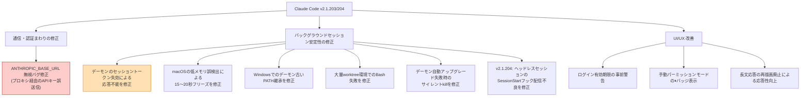
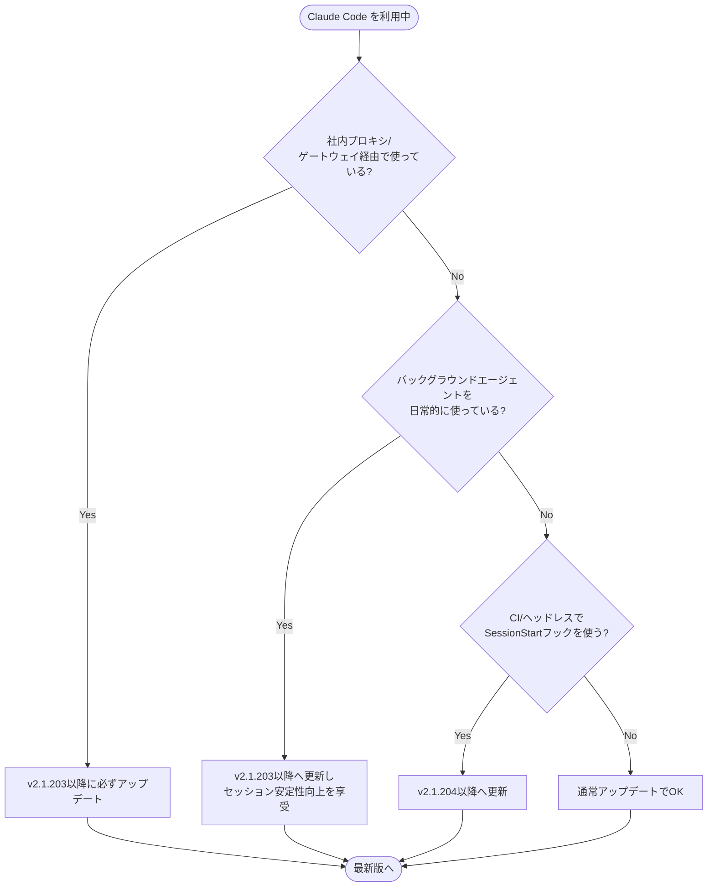

## はじめに

2026年7月、Claude Code の `v2.1.203` と `v2.1.204` が立て続けにリリースされました。特に `v2.1.203` は、バックグラウンドエージェント／セッション機能まわりを中心に**約40件**の修正・改善を含む大型アップデートです。

中でも見逃せないのが、**シェルで設定した `ANTHROPIC_BASE_URL` が無視され、API キーがデフォルトのエンドポイントに送信されてしまうバグ**の修正です。社内プロキシや LLM ゲートウェイ経由で Claude Code を利用している組織にとっては、認証エラー（401）だけでなく、意図しない宛先へのキー送信という点でセキュリティ上も無視できない問題でした。

本記事では、この2つのリリースの変更点を整理し、「誰が」「どう対応すべきか」をまとめます。

> **📌 影響を受ける人**
> - 社内プロキシ／LLM ゲートウェイ経由で Claude Code を使っている人
> - バックグラウンドエージェント（`claude agents`）や VSCode の Remote Control を多用している人
> - Windows／macOS でバックグラウンドセッションの動作が不安定だった人
> - CI やヘッドレスモードで `SessionStart` フックを利用している人

## 変更の全体像

今回の修正は大きく「**通信経路（エンドポイント）の不具合**」と「**バックグラウンドセッションの安定性**」の2軸に分類できます。



## 変更内容

### 🔴 最重要: `ANTHROPIC_BASE_URL` 無視によるAPIキー誤送信（severity: high）

バックグラウンド／エージェントビューで実行されるセッションが、シェルで `export` した `ANTHROPIC_BASE_URL` を参照せず、Claude Code のデフォルトエンドポイント（`api.anthropic.com`）にリクエストを送ってしまう不具合がありました。結果として以下のような症状が発生していました。

- プロキシ／ゲートウェイ側で期待するリクエストが来ず、**401 エラーで処理が失敗する**
- 本来ゲートウェイ経由で送るはずの API キーが、**意図しないデフォルトエンドポイントに直接送信される**

通常のフォアグラウンドセッションでは問題なく動作していたため、「対話モードでは動くのに、バックグラウンドエージェントだけ 401 になる」という形で気づいたユーザーも多かったはずです。

### そのほかの重要な修正（バックグラウンドセッション安定性）

| 修正内容 | 症状（Before） | 対象環境 |
|---|---|---|
| デーモンのセッショントークン失効 | バックグラウンドセッションが恒久的に応答不能になる | 全OS |
| macOSの低メモリ誤検出（2.1.196のリグレッション） | セッション切替時に15〜20秒停止 | macOS |
| デーモンの古いPATH継承 | バックグラウンドエージェントがツールを発見できない | Windows |
| 大量git worktree環境 | Bashが「argument list too long」で失敗 | 全OS |
| デーモン自動アップグレード失敗 | 全バックグラウンドセッションが黙ってkillされる | 全OS |
| `claude agents` へ復帰時 | 実行中サブエージェントが停止し最初から再実行 | 全OS |
| コンテキスト使用量インジケータ | 毎ターン全トランスクリプトを再解析（メモリ/CPUリグレッション） | 全OS |
| worktree分離サブエージェント | 親チェックアウトでコマンドを実行してしまう | 全OS |
| `TaskStop`/`TaskOutput` | 他エージェント起動のバックグラウンドエージェントを発見できない | 全OS |

### v2.1.204: ヘッドレスセッションの `SessionStart` フック配信不良（severity: medium）

ヘッドレス（非対話）セッションで `SessionStart` フックを実行中、フックイベントがストリーミング配信されない不具合がありました。これにより、CI やリモートワーカー環境で**フック実行中にアイドルと誤判定され、処理途中で回収（idle-reap）されてしまう**リスクがありました。`v2.1.204` でこの配信不良が修正され、CI・リモート実行環境での信頼性が向上しています。

### 新機能・UI改善（抜粋）

- ログイン有効期限が近い場合に警告表示（バックグラウンドセッション中断前に再認証可能に）
- 手動パーミッションモード時、フッターにグレーの⏸バッジを表示
- 追加作業ディレクトリを MCP の `roots/list` に含め、変更時に `notifications/roots/list_changed` を送信
- [VSCode] 全セッションでの Remote Control 有効化トグルを設定に追加
- 大型依存の遅延ロードによりバイナリサイズ約7MB・起動メモリ約7MB削減

## 影響と対応



> **⚠️ Breaking Change**
> 破壊的変更そのものはありませんが、`ANTHROPIC_BASE_URL` を設定してプロキシ経由運用している環境では、**アップデート前は「バグにより意図せずデフォルトエンドポイントに直接通信していた」状態**でした。アップデート後は正しくプロキシへ向くようになるため、プロキシ側のアクセス許可・認証設定が正しいか改めて確認してください。

> **💡 Tips**
> アップデート後、`ANTHROPIC_BASE_URL` が正しく反映されているか不安な場合は、一度バックグラウンドエージェントを起動し、プロキシ側のアクセスログにリクエストが記録されているかを確認するのが確実です。

具体的なアクション:

1. `claude update`（または各インストール方法に応じた手順）で `v2.1.204` 以降へアップデートする
2. プロキシ／ゲートウェイ運用者は、アップデート後にバックグラウンドエージェント経由のリクエストが正しくプロキシを通っているか確認する
3. CI で `SessionStart` フックを使っている場合は、idle-reap によるフック中断が解消されているか動作確認する
4. Windows 環境でバックグラウンドエージェントのツールが見つからない事象があった場合は、再現しないか確認する

## コード例

`ANTHROPIC_BASE_URL` の設定自体は変わりませんが、修正前後で「どこにリクエストが飛ぶか」が変わる点がポイントです。

**Before（v2.1.203より前・バックグラウンドセッションでバグの影響を受ける状態）**

```bash
# シェルでプロキシ経由のエンドポイントを設定
export ANTHROPIC_BASE_URL="https://llm-gateway.example.com"
export ANTHROPIC_API_KEY="sk-ant-xxxxx"

# フォアグラウンドでは gateway 経由で正しく動く
claude

# しかしバックグラウンドエージェントでは ANTHROPIC_BASE_URL が無視され、
# api.anthropic.com へ直接 API キーが送信されてしまい 401 エラーに
claude agents run "長時間タスクを実行"
```

**After（v2.1.203以降・修正済み）**

```bash
export ANTHROPIC_BASE_URL="https://llm-gateway.example.com"
export ANTHROPIC_API_KEY="sk-ant-xxxxx"

# フォアグラウンド・バックグラウンドともに gateway 経由で通信
claude
claude agents run "長時間タスクを実行"
```

設定手順自体に変更はなく、**アップデートするだけで正しい挙動に修正される**点は運用上ありがたいポイントです。

## まとめ

- `v2.1.203` は、バックグラウンドエージェント／セッションを中心とした約40件の修正・改善を含む大型リリース
- 最重要修正は `ANTHROPIC_BASE_URL` が無視され API キーがデフォルトエンドポイントに送信されるバグで、**プロキシ／ゲートウェイ利用者は必ずアップデートすべき**
- macOSの低メモリ誤検出によるフリーズ、デーモンのトークン失効による応答不能、Windowsでのツール未検出など、バックグラウンドセッションの安定性が大きく向上
- `v2.1.204` では、ヘッドレスセッションの `SessionStart` フック配信不良を修正し、CI・リモート実行環境の信頼性が向上
- 破壊的変更はないが、プロキシ運用者はアップデート後に通信経路が変わる点に注意し、動作確認を推奨

バックグラウンドエージェントやプロキシ経由運用をしているチームは、優先度高めで `v2.1.204` 以降へのアップデートを検討してください。
