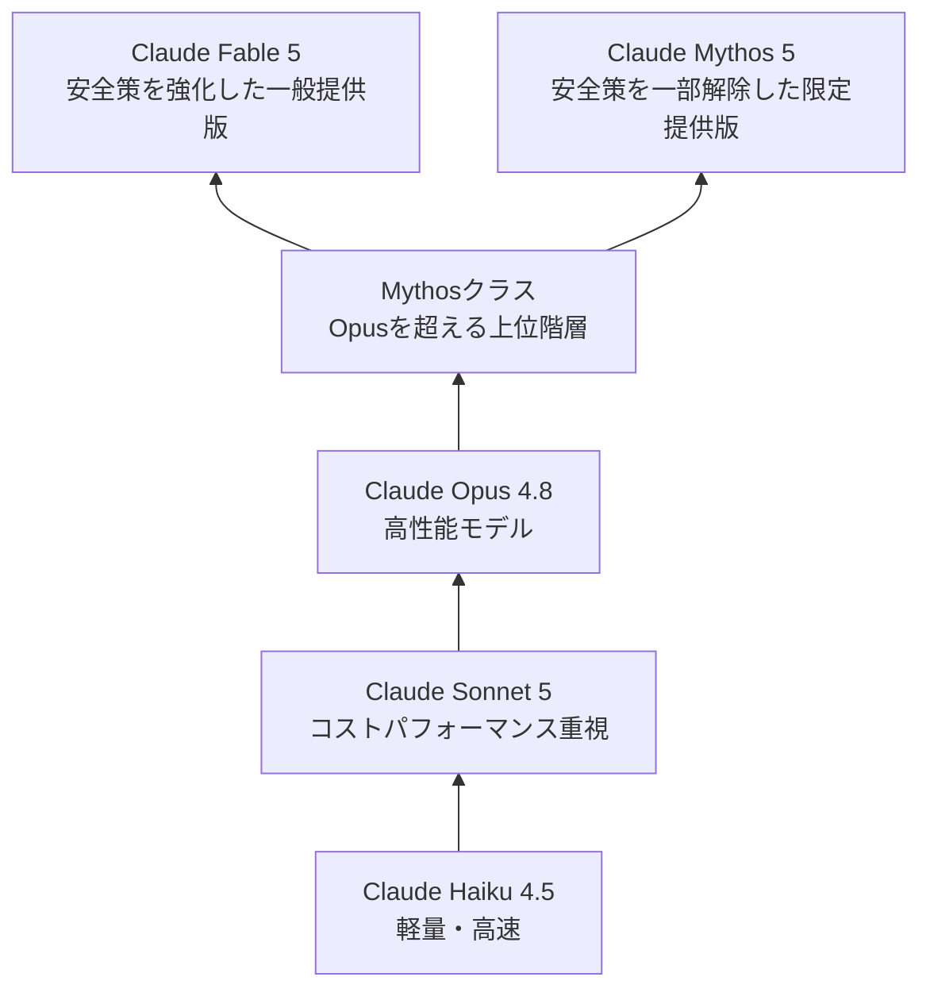
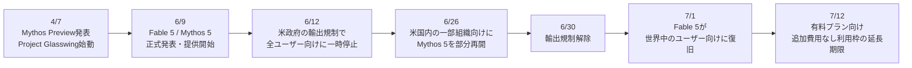
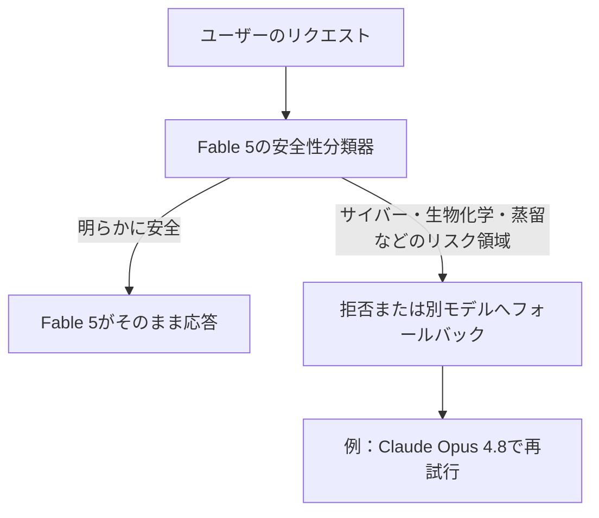

## はじめに

2026年6月9日、AnthropicはOpusクラスを超える新しいモデル階層「Mythosクラス」の現行モデルとして、Claude Fable 5とClaude Mythos 5を発表しました。

ところがその3日後の6月12日、米政府の輸出規制を受け、Anthropicは両モデルへのアクセスを全ユーザー向けに一時停止します。Fable 5のグローバル提供が再開されたのは7月1日で、停止から復旧までにかかった日数は19日でした。

なお、復旧後もMythos 5は一般提供モデルではありません。Project Glasswingなどの限定プログラム向け提供が続いており、一般ユーザーや通常のAPI利用者が使えるのは、主に安全策を強化したClaude Fable 5です。

この一連の出来事を追うと、AIの安全設計・国家によるAI規制・ジェイルブレイク（安全策の突破）対策という、これからのAI業界を考えるうえで重要な論点が見えてきます。

本記事では、Fable 5 / Mythos 5とは何か、これまでの経緯、そして現時点でどう使えるのかを時系列で整理します。

想定読者は、AI・LLMの動向を追いたいエンジニアから、AIガバナンスや自社のAI活用戦略に関心のあるビジネスパーソンまでです。専門的な前提知識がなくても読み進められるよう、できるだけ噛み砕いて解説します。

## 目次

* [対象読者](#対象読者)
* [この記事でわかること](#この記事でわかること)
* [本記事について（情報基準日）](#本記事について情報基準日)
* [全体像：Claudeのモデル階層とMythosクラス](#全体像claudeのモデル階層とmythosクラス)
* [基本概念：FableとMythos、名前の違いは何か](#基本概念fableとmythos名前の違いは何か)
* [これまでの経緯：発表から利用停止、そして復旧まで](#これまでの経緯発表から利用停止そして復旧まで)
* [安全性のしくみ：セーフティマージンとジェイルブレイクの重大度](#安全性のしくみセーフティマージンとジェイルブレイクの重大度)
* [現時点でわかっている性能と評価](#現時点でわかっている性能と評価)
* [よくある誤解と注意点](#よくある誤解と注意点)
* [まとめと次のステップ](#まとめと次のステップ)

## 対象読者

* Claude APIやClaude Codeを業務・開発で使っているエンジニア
* 生成AIの最新動向を継続的にキャッチアップしたいITエンジニア
* 「なぜ最新AIモデルが急に使えなくなったのか」を知りたい人
* AIガバナンスや輸出規制など、AI政策の動向に関心のあるビジネスパーソン
* AIの安全設計（セーフガード・ジェイルブレイク対策）の考え方を知りたい人

## この記事でわかること

* Claude Fable 5とClaude Mythos 5がどのようなモデルで、何が新しいのか
* 「Mythosクラス」という新しいモデル階層の位置づけ
* Fable 5とMythos 5の違い
* 2026年6月12日に全ユーザー向けに利用停止となった技術的・政策的背景
* 米国の輸出規制とAI企業のガバナンス対応の具体例
* 現時点の利用状況・料金体系
* 「セーフティマージン」「ジェイルブレイクの重大度」というAI安全設計の考え方

## 本記事について（情報基準日）

本記事は2026年7月8日時点で、Anthropic公式サイト、Claude Platform Docs、Claude Help Center、主要テック媒体の報道をもとに執筆しています。

Fable 5 / Mythos 5を巡る状況は発表からまだ間もなく、料金・提供プラットフォーム・利用条件などは今後も変わる可能性があります。本記事内の数値や条件は執筆時点のものとしてご覧いただき、実際の利用や記事公開前には、必ずAnthropic公式ページで最新情報をご確認ください。

モデルをAPI経由で試す場合の最低限の情報は以下の通りです。

| 項目              | 内容                                                                                                                              |
| --------------- | ------------------------------------------------------------------------------------------------------------------------------- |
| Fable 5のモデルID   | `claude-fable-5`                                                                                                                |
| Mythos 5のモデルID  | `claude-mythos-5`                                                                                                               |
| Fable 5の提供チャネル  | Claude API / AWS上のClaude Platform / Amazon Bedrock / Google Cloud / Microsoft Foundry / Claude.ai / Claude Code / Claude Cowork |
| Mythos 5の提供チャネル | Project Glasswingなどの承認済みパートナー向け限定提供                                                                                             |
| コンテキストウィンドウ     | 100万トークン（デフォルト）                                                                                                                 |
| 最大出力トークン        | 128,000トークン                                                                                                                     |
| 価格              | 入力100万トークンあたり10ドル、出力100万トークンあたり50ドル                                                                                             |
| データ保持           | 少なくとも30日間。原則として30日後に自動削除。ただし安全調査や法的要件がある場合は例外あり。ゼロデータ保持は不可。「Covered Model」扱い                                                    |

## 全体像：Claudeのモデル階層とMythosクラス

Anthropicのモデルは、これまでHaiku・Sonnet・Opusという3クラスで展開されてきました。そこに、Opusクラスの上位にあたる新しい階層として「Mythosクラス」が加わりました。

Mythosクラスは、2026年4月に登場したClaude Mythos Previewを起点とし、6月にFable 5・Mythos 5という現行世代に更新されました。

ポイントは次の3つです。

* **Fable 5**：安全策（セーフガード）を強化し、一般ユーザー向けに広く提供されているモデル
* **Mythos 5**：Fable 5と同じ基盤モデルだが、サイバー防御などの用途向けに一部の安全策が解除された限定提供モデル
* **Mythos Preview**：2026年4月に登場したMythosクラス最初のモデル。Mythos 5の登場によって後継モデルへ移行中

Anthropic発表によれば、Fable 5 / Mythos 5の主な特長は次のとおりです。

* 数日がかりの長時間タスクを自律的にこなす、長時間稼働性能
* ゲーム画面のスクリーンショットのみでレトロゲームを進めるなど、高度な視覚（ビジョン）能力
* 100万トークンの長いコンテキストと、メモリツールを活用した長期タスクへの対応
* 創薬・分子生物学など科学研究での仮説生成・実験デザイン支援（主にMythos 5）

各モデルの位置づけを比較すると、次のようになります。

| モデル                   | 立ち位置                      | 提供状況（2026年7月8日時点）                           | 価格（入力/出力・100万トークンあたり）             |
| --------------------- | ------------------------- | ------------------------------------------- | --------------------------------- |
| Claude Mythos Preview | Mythosクラス最初のモデル（2026年4月〜） | Mythos 5へ移行中                                | \\$25 / \\$125                        |
| Claude Mythos 5       | Mythosクラス・安全策の一部を解除       | Project Glasswing参加組織など限定提供                 | \\$10 / \\$50                         |
| Claude Fable 5        | Mythosクラス・安全策を強化した一般提供版   | Claude API・Claude.ai・Claude Code・Cowork等で提供 | \\$10 / \\$50                         |
| Claude Opus 4.8       | 高性能モデル                    | 一般提供                                        | \\$5 / \\$25                          |
| Claude Sonnet 5       | コストパフォーマンス重視モデル           | 一般提供（2026年6月30日〜、導入価格）                      | \\$2 / \\$10（2026年8月31日まで。以降\\$3 / \\$15） |

## 基本概念：FableとMythos、名前の違いは何か

「Fable」と「Mythos」は、どちらも「物語」や「語られるもの」に近い意味を持つ言葉です。Anthropicは、Fableの語源であるラテン語の *fabula* と、ギリシャ語の *mythos* の近さに触れています。

つまり、Fable 5とMythos 5は次のような関係にあります。

* 基盤となるモデルは同一
* 両者を分けているのは安全策（セーフガード）の有無・強度
* Fable 5は広く使えるように安全策を強化したモデル
* Mythos 5は一部の安全策を解除し、防御的サイバーセキュリティや研究用途向けに限定提供されるモデル

Fable 5に搭載されている安全策は、主に次の分野のリスクに対応するものです。

* **サイバーセキュリティ**：ソフトウェアの脆弱性発見・悪用など、攻撃的なサイバー活動につながるリスク
* **生物・化学**：生物兵器転用などにつながりうる高度な科学タスクのリスク
* **蒸留（distillation）**：Claudeの能力を抜き出して、別モデルの学習や模倣に利用されるリスク

これらの分野に該当するリクエストが来ると、Fable 5はリクエストを拒否したり、別モデルにフォールバックしたりする可能性があります。Claude Platform Docsでは、拒否時にはエラーではなく、HTTP 200の成功レスポンスとして `stop_reason: "refusal"` が返ると説明されています。

## これまでの経緯：発表から利用停止、そして復旧まで

Fable 5 / Mythos 5を理解するうえで欠かせないのが、発表からわずか3日で全ユーザー向け停止という異例の事態に至った経緯です。

### 2026年4月7日：Project Glasswing始動

AnthropicはMythosクラス最初のモデルClaude Mythos Previewを発表すると同時に、一般提供を見送る判断をしました。

理由は、サイバーセキュリティ能力の高さです。かわりに、AWS・Apple・Cisco・Google・Microsoft・NVIDIAなどの主要企業や米政府を含む限定パートナーに対し、防御目的でモデルを提供する「Project Glasswing」という枠組みを立ち上げました。

Project Glasswingは、ソフトウェアの脆弱性発見・修正という防御目的に絞って、強力なAIモデルを活用する取り組みです。公式発表では、5月時点で約50のパートナーが参加し、6月2日には15カ国超の約150の新規組織へ拡大されたと説明されています。

### 2026年6月9日：Fable 5 / Mythos 5発表

安全策の開発が進んだことを受け、AnthropicはMythosクラスの現行世代モデルとしてFable 5とMythos 5を同時発表しました。

Fable 5は一般提供向け、Mythos 5はProject Glasswingなどの限定提供向けという位置づけです。

Anthropicは、Fable 5を「広く提供しているモデルの中で最も高性能なモデル」と説明しています。ただし、第三者による独立検証が十分に蓄積された段階ではないため、性能評価についてはAnthropicおよび早期アクセスパートナーの発表ベースである点に注意が必要です。

### 2026年6月12日：全ユーザー向けに利用停止

発表からわずか3日後、米政府がFable 5とMythos 5に輸出規制を適用しました。

規制の内容は、外国籍ユーザーへのアクセス制限を求めるものでした。しかしAnthropicは、利用者の国籍をリアルタイムに確認する信頼できる手段を持たなかったため、影響範囲を絞り込めず、結果として両モデルへのアクセスを全ユーザー向けに一時停止しました。

規制の引き金になったのは、Amazonの研究者による報告です。特定のプロンプトによりFable 5の安全策をすり抜け、ソフトウェアの脆弱性を特定させたり、一部では脆弱性を悪用するコードのデモを生成させたりできることが報告されました。

Anthropicはその後の検証で、この報告にあった挙動は「Mythosクラス特有の危険な能力」ではなく、Claude Opus 4.8やGPT-5.5、Kimi K2.7など、より低い能力のモデルでも再現可能だったと説明しています。脆弱性を悪用するコードのデモについても、検証対象の多くのモデルで同様の出力が可能だったとされています。

### 2026年6月26日〜7月1日：段階的な復旧

米政府の承認を受け、6月26日にはMythos 5が米国内の一部組織向けに先行復旧しました。

その後、6月30日に輸出規制が解除され、翌7月1日、Fable 5がClaude Platform、Claude.ai、Claude Code、Claude Cowork上で世界中のユーザー向けに復旧しました。AWS、Google Cloud、Microsoft Foundry向けの復旧も順次進められました。

ここで注意したいのは、7月1日時点で一般ユーザー向けに大きく復旧したのはFable 5であり、Mythos 5は引き続きProject Glasswingなどの限定プログラム向け提供である点です。

復旧にあたり、AnthropicはAmazonの報告にあった手法を狙い撃ちする新しい安全性分類器を導入し、同種の手法を99%以上ブロックできるようにしたと説明しています。あわせて、Amazon・Microsoft・Googleなどの業界パートナーと共同で、ジェイルブレイクの深刻度を客観的に評価するための共通フレームワーク作りにも着手しています。

なお、Pro・Max・Team・一部EnterpriseプランでのFable 5の追加費用なし利用枠は、公式発表では当初2026年7月7日までとされていました。その後、複数の報道では7月12日まで延長されたとされています。この点は変更されやすい情報のため、利用前に最新の公式情報をご確認ください。

## 安全性のしくみ：セーフティマージンとジェイルブレイクの重大度

一連の出来事を理解するうえで、Anthropicが説明する2つの考え方が参考になります。

### セーフティマージン（安全余裕度）

Fable 5の安全性分類器は、危険性が高いと判断されるリクエストを拒否したり、別モデルにフォールバックしたりするよう設計されています。

特にサイバーセキュリティや生物・化学のように、良性用途と悪用の境界が難しい分野では、本来は防御的・研究的な目的の質問であっても、安全策に引っかかる可能性があります。

この設計のトレードオフは明確です。

* メリット：危険なリクエストを見逃すリスクを下げられる
* デメリット：本来は安全な質問まで誤って拒否される可能性がある

Anthropicは、復旧時に新しい安全性分類器を導入しました。この分類器は、Amazonの報告にあった特定の手法を99%以上のケースでブロックできると説明されています。ただし、その代償として、通常のコーディングやデバッグにおける良性リクエストも以前より引っかかりやすくなる可能性があります。

### ジェイルブレイクの重大度という考え方

Anthropicは今回の一件を踏まえ、ジェイルブレイク（モデルの安全策を突破する手法）の深刻度を測る共通の物差しを、Amazon・Microsoft・Googleなどの業界パートナーと共同で検討しています。

提案されている評価軸は次の4つです。

* **能力向上度**：既存の手段（検索エンジンや、他の性能の低いAIモデルなど）と比べて、どれだけ高い能力を与えるか
* **能力向上の広さ**：同じ手法がどれだけ多くの攻撃的タスクに応用できるか
* **武器化の容易さ**：実際の攻撃に転用するのにどれだけ手間がかかるか
* **発見されやすさ**：その手法自体がどれだけ知られやすい・見つかりやすいか

この考え方に沿うと、今回Amazonが報告した手法は、Anthropicの説明では「安全策をわずかに越える程度の限定的なジェイルブレイク」であり、「あらゆる危険な挙動を解放するユニバーサルジェイルブレイク」ではなかった、という位置づけになります。

## 現時点でわかっている性能と評価

以下は、Anthropicおよび早期アクセスパートナー企業が公表している評価内容です。第三者による独立検証ではなく、Anthropic側の発表に基づく数値である点にご留意ください。

| 評価元                  | 内容                                              |
| -------------------- | ----------------------------------------------- |
| Stripe               | 5,000万行規模のRubyコードベースの移行を1日で完了したと紹介              |
| Hex                  | 独自の分析ベンチマークで初めて90%を突破したと紹介                      |
| Anthropic社内          | Fable 5セッションの多くが、Opus 4.8へのフォールバックなしで完結すると説明    |
| Anthropic社内（バグバウンティ） | 外部バグバウンティで1,000時間以上検証し、ユニバーサルジェイルブレイクは未発見と説明    |
| Anthropic社内（創薬）      | Mythos 5がタンパク質設計プロセスを高速化したと説明                   |
| Anthropic社内（分子生物学）   | 専門家によるブラインド評価で、Mythos 5の仮説がOpus級モデルの仮説より好まれたと説明 |

ここで重要なのは、Fable 5 / Mythos 5の評価は、まだ公式発表・早期アクセス事例が中心であるという点です。

技術記事としては、以下のように書くと誤解が少なくなります。

* 「世界最強」と断定するより、「Anthropicが広く提供している中で最も高性能なモデル」と書く
* 「すべての用途で最適」とは書かず、長時間エージェント作業・複雑な推論・コード近代化などに強いと整理する
* ベンチマークや事例は、Anthropicまたは早期アクセス企業の発表ベースであると明記する

## よくある誤解と注意点

### 「Mythos 5も誰でも使える」という誤解

一般ユーザーが使えるのは主にFable 5です。Mythos 5はProject Glasswing参加組織など、限定的なトラステッドアクセスプログラムの対象者のみが利用できます。

### 「Fable 5とMythos 5は別々に開発されたモデル」という誤解

両者は同じ基盤モデルを共有しています。違いは、安全策の有無・強度です。

### 「まだ輸出規制で止まっている」という古い情報

2026年6月12日から一時停止していましたが、6月30日に輸出規制が解除され、7月1日にFable 5が世界中のユーザー向けに復旧しました。ただし、Mythos 5は引き続き限定提供です。

### ゼロデータ保持（ZDR）が使えない

Fable 5・Mythos 5は「Covered Model」に指定され、少なくとも30日間のデータ保持が適用されます。ZDR環境ではCovered Modelsにアクセスできないため、企業利用では社内のデータガバナンス担当者と事前に確認する必要があります。

### API実装時の拒否レスポンスを見落とす

Fable 5が安全性分類器によってリクエストを拒否した場合、エラーではなく `stop_reason: "refusal"` という成功レスポンス（HTTP 200）が返ります。既存のエラーハンドリングだけでは想定通りに動かない可能性があるため、フォールバック・リトライの実装を検討してください。

### サブスクの追加費用なし利用枠には期限がある

Pro / Max / Teamなどの有料プランでFable 5を追加費用なしで利用できる枠には期限があります。公式発表では当初7月7日までとされ、その後7月12日まで延長されたと報じられています。期限や条件は変わる可能性があるため、利用前に公式情報を確認してください。

### 一次情報と二次情報で数値が食い違うことがある

輸出規制のような速報性の高いニュースでは、メディアごとに日付や数値の表現が微妙に異なることがあります。可能な限りAnthropic公式ページ、Claude Platform Docs、Claude Help Centerなどの一次情報を優先してください。

## まとめと次のステップ

* Claude Fable 5 / Mythos 5は、Opusクラスを超える新階層「Mythosクラス」の現行モデル
* Fable 5とMythos 5は同じ基盤モデルを共有しており、違いは安全策の有無・強度
* 2026年6月12日、米国の輸出規制により両モデルが全ユーザー向けに一時停止された
* 2026年6月30日に輸出規制が解除され、7月1日にFable 5が世界中のユーザー向けに復旧した
* Mythos 5は復旧後も一般提供ではなく、Project Glasswingなどの限定提供が続いている
* 背景には、AIの高度なサイバーセキュリティ能力に関するデュアルユースリスクと、業界横断でのジェイルブレイク重大度基準づくりという論点がある
* APIで利用する場合は、`stop_reason: "refusal"`、フォールバック、30日データ保持、ZDR不可といった仕様に注意が必要

さらに詳しく知りたい方には、以下の一次情報・参考情報がおすすめです。

* Anthropic公式：Claude Fable 5 and Claude Mythos 5
  https://www.anthropic.com/news/claude-fable-5-mythos-5

* Anthropic公式：Statement on the US government directive to suspend access to Fable 5 and Mythos 5
  https://www.anthropic.com/news/fable-mythos-access

* Anthropic公式：Redeploying Claude Fable 5
  https://www.anthropic.com/news/redeploying-fable-5

* Anthropic公式：Project Glasswing
  https://www.anthropic.com/glasswing

* Anthropic公式：Claude Mythos
  https://www.anthropic.com/claude/mythos

* Claude Platform Docs：Claude Fable 5とClaude Mythos 5のご紹介
  https://platform.claude.com/docs/ja/about-claude/models/introducing-claude-fable-5-and-claude-mythos-5

* Claude Platform Docs：料金
  https://platform.claude.com/docs/ja/about-claude/pricing

* Claude Help Center：Covered Models
  https://support.claude.com/en/articles/15425695-covered-models

* Claude Help Center：Mythosクラスモデルのデータ保持慣行
  https://support.claude.com/ja/articles/15425996-mythos-%E3%82%AF%E3%83%A9%E3%82%B9%E3%83%A2%E3%83%87%E3%83%AB%E3%81%AE%E3%83%87%E3%83%BC%E3%82%BF%E4%BF%9D%E6%8C%81%E6%85%A3%E8%A1%8C

* Impress Watch：Fable 5のサブスク利用延長に関する報道
  https://www.watch.impress.co.jp/docs/news/2123278.html

---

**免責事項**：本記事は当社が確認した時点の情報に基づく参考情報であり、正確性・完全性・最新性を保証するものではありません。実際の利用にあたっては、Anthropic公式ドキュメントおよび各提供プラットフォームの最新情報をご確認ください。
