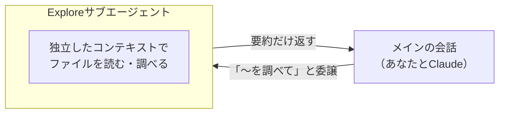
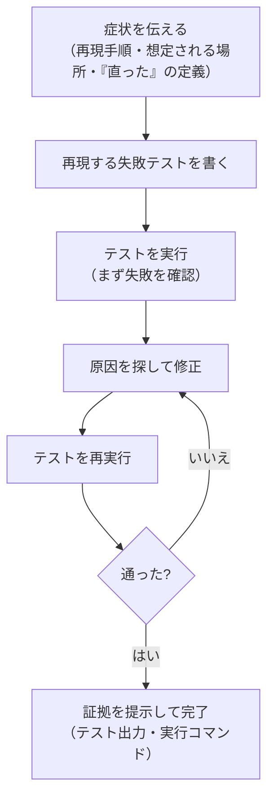

# Claude Codeに「できました」と言われたのに直ってない時の検証ループ

> **対象読者**: 「できたと言われたのに直っていない」を減らしたい入門者／検証ループと新しい操作（メッセージのキューイング・バックグラウンド実行・Explore）まで押さえたい開発者
> **前提知識**: Claude Code がインストール済みであること。git の基本（コミット）に触れたことがあると読みやすいですが、必須ではありません
> **この記事でできること**: 「読む・直す・試す」を、合否が出るチェックで閉じる検証ループとして回せる

「テスト、通りました」「実装できました」——Claude Code はそう言うのに、動かすと直っていない。ビルドもテストも緑なのに、実機で触るとさっきのバグが残っている。使い始めると、たいてい一度はこれにぶつかります。がっかりしますが、あなたのせいではありません。

これは公式ドキュメントが名前を付けた失敗パターンです。Claude は**作業が「できたように見えた」時点で手を止めます**。実行できるチェックがなければ、「できたように見える」だけが唯一の信号になり、間違いに気づく検証役はあなた一人になる——ドキュメントはこれを **trust-then-verify gap**（信用してから検証するまでの隙間）と呼びます。対策は1つ、**テスト・スクリプト・スクリーンショットなど合否を返すチェックを渡し、少なくとも出荷・共有の前には必ず通すこと**です。

ハマるのはあなただけではありません。Anthropic が約23.5万ユーザーの約40万セッション（2025年10月〜2026年4月）を分析した報告では、壊れたコードの修正に費やされたセッションの割合がこの期間に33%から19%へ下がっています。浮いた分は別の使い方（ソフトの操作や、文章・分析）へ移っており、Claude Code の**使われ方が広がっている**ことがうかがえます。入門者のセッションは約19%が途中で放棄されて終わっており、それ以外のユーザーの5〜7%より高いという数字も出ています。詰まりやすいのは普通で、恥ずかしいことではありません。

（なおこの分析は、サードパーティの IDE や SDK 経由の利用を集計から外していること、セッションの分類がモデルの読み取りに依存すること、生成されたコードがその後も使われ続けたかまでは測れないことを、自ら限界として断っています。数字は割り引いて読んでください。）

この記事は、公式ドキュメントの複数ページに散らばる対策を、「読む・直す・試す」という1つの検証ループにまとめます（2026年7月6日時点、Claude Code 2.1.201 で動作確認。バージョンはほぼ毎日上がるので番号は読み替えてください。手元では `claude --version`）。

## まず、これだけ

細かい操作は後回しでも、次の4つだけで「できたと言われたのに直っていない」はかなり減ります。

1. **「直った」の定義を最初に渡す**（例:「このエラーが消えて、ビルドが通る状態」）。
2. **まず失敗するテストを書かせてから**直させる。合否が出る形にしてから直すのがコツです。
3. 「できました」ではなく**証拠を出させる**——テストの出力・実行したコマンド・スクリーンショット。
4. **同じ問題で2回直らなければ `/clear`** して、学んだことを足したプロンプトで仕切り直す。

## まず「読む」— 知らないコードベースを把握する

知らないリポジトリは、広く聞いてから狭めます。公式の例はこう進みます（広い質問から狭い質問へ）。

```text
このコードベースの概要を教えて
ここで使われている主要なアーキテクチャパターンを説明して
ユーザー認証を扱っているファイルを見つけて
ログイン処理をフロントエンドからデータベースまで追いかけて
```

概要 → アーキテクチャ → 該当ファイル → 実行経路、と具体度を上げるのがコツです。コーディング規約や独自パターン、用語集も同じ流れで聞けます。「シニアエンジニアに聞くような質問」をそのまま投げてよく、`CustomerOnboardingFlowImpl はどんなエッジケースを扱う?` のような細部も対象です。

広く「調べて」と丸投げすると、Claude が何百ものファイルを読んで**コンテキスト**（Claude が保持している会話の文脈）を埋め尽くすことがあります（ドキュメントの言う「無限の探索」）。対策は、範囲を絞るか、調査を**サブエージェント（subagent）**に任せることです。

```text
認証システムがトークンのリフレッシュをどう扱っているか、サブエージェントで調べて
```

サブエージェントは**独立したコンテキストでファイルを読み、要約だけをメインの会話へ返します**。だからメインのコンテキストが膨らみません。



Claude Code には、**Explore という読み取り専用の組み込みサブエージェント**が最初から入っています。Write と Edit は禁止され、コードベースの検索・分析に最適化されていて、変更を伴わない調べ物では Claude が自動でここへ委譲します。調べる深さ（`quick`／`medium`／`very thorough`）も内容に応じて選ばれます。

- 入門者の方: 「会話を汚さずに、ちょっと調べてきて、と頼める」くらいの理解で十分です。自分でサブエージェントを設定する必要はありません。
- 開発者の方: 「コードベースから X を探す」作業は、Explore が自動でメインのコンテキスト外に追い出します。カスタムのサブエージェント作成（別の記事で扱う予定です）は、この用途には不要です。

開発者向けの差分: v2.1.198 以降、Explore は Haiku 固定ではなくメインの会話のモデルを引き継ぎ（Claude API では Opus が上限）、サブエージェントは既定でバックグラウンド実行になりました。

<details>
<summary>補足：Explore の細かい挙動（バージョン依存）</summary>

Explore と Plan は、調査を速く・軽く保つため、CLAUDE.md や親セッションの git 状態を読み込まない唯一の組み込みサブエージェントです（CLAUDE.md は [W4](https://qiita.com/ujunja/items/a6bf13f9ca981b2ca5f3) で扱いました）。上のモデル継承・既定バックグラウンド化は、いずれも v2.1.198 以降の挙動です（以前の Explore は常に Haiku）。バージョンで変わる詳細です。
</details>

## 「直す」ループ — 症状 → 失敗テスト → 原因修正 → 検証

バグ修正の基本形は「エラーを渡す → 修正案をもらう → 適用する」。ここに効くコツが3つあります。

- **再現コマンドとスタックトレース**を渡す。
- **再現手順**を伝える。
- そのエラーが**再現性のあるものか、間欠的か**を伝える。

さらに公式は、プロンプトを一段具体化した形を薦めます——**症状・想定される場所・「直った」の定義**を渡し、**まず問題を再現する失敗テストを書いてから直す**。

```text
セッションタイムアウト後にログインが失敗すると報告があります。src/auth/ の認証フロー、特にトークンのリフレッシュを確認して。問題を再現する失敗テストをまず書いてから、直して。
```

なぜ「まず失敗テスト」かというと、それが**合否を返すチェック**になり、直ったかどうかを Claude 自身が確認できるからです（同じ形は別のドキュメントにも独立して出てきます）。症状を渡してから「直った」が確認できるまで、Claude が中で回すのはおおむね次の流れです。



大事なのは、症状の抑え込みではなく**根本原因**を直させることです。

```text
ビルドがこのエラーで失敗します: [エラーを貼る]。直してビルドが通ることを確認して。エラーを握りつぶさず、根本原因に対処して。
```

エラーログは、ファイルの中身をそのまま Claude に渡せます: `cat error.log | claude`（`|` は左のコマンドの出力を右へ流す「パイプ」という記法です）。

リファクタリングは**小さく検証可能な単位**で進め、各変更のあとにテストを走らせます。逆に、変更が**1文で説明できるくらい小さい**とき（タイプミス修正・ログ1行追加・変数名変更）は、計画の手順を踏まずに直接直させてよい、と公式は明記しています（プランモードは [W2](https://qiita.com/ujunja/items/577019cd04fed7bfabec) で扱いました）。

## 「試す」— テストを足し、検証の穴をふさぐ

テストを増やす手順にも公式の定型があります: **未テストのコードを特定 → 雛形を生成 → 意味のあるケースを追加 → 実行して直す**。このとき Claude は**既存のテストファイルを先に読み、スタイル・フレームワーク・アサーションの書き方を合わせます**。

```text
<ファイル> の中でテストされていない関数を見つけて
<コンポーネント> のテストを追加して
<コンポーネント> の境界条件のテストケースを足して
新しいテストを実行して、失敗を直して
```

見落としやすいケースは、明示的に洗い出してもらいます（「エラー条件・境界値・想定外の入力のテストを提案して」）。「モックは使わないで」と範囲を絞ると、浅い・ごまかしのテストを避けられます。

「直して」ではなく「**合否が出るチェックを渡す**」——これを具体化した公式の before/after が3つあります。

| ねらい | 渡すチェック（例） |
|---|---|
| テストケースで判定 | 「validateEmail を書いて。例: `user@example.com` は true、`invalid` は false、`user@.com` は false。実装後にテストを実行して」 |
| 画面の差分で判定 | 「[スクショを貼る] このデザインを実装して。結果のスクリーンショットを撮って元と比較し、違いを挙げて直して」 |
| 根本原因で判定 | 「このエラーでビルドが失敗する: […]。直して、ビルドが通ることを確認して。原因に対処して」 |

1つ目のメール検証は [W2](https://qiita.com/ujunja/items/577019cd04fed7bfabec) のプロンプト設計でも触れた、「検証できるチェックを渡す」の一種です。この連載で新しく扱うのは**スクリーンショット差分**と**根本原因**の型。UI なら「絵を渡す」のが効きます——Anthropic 社内でも、2025年7月のブログでダッシュボードのスクショを渡して障害を切り分けた例が自己申告で紹介されています（現在の公式手順ではなく、当時の事例として読んでください）。

そして、「できました」と主張させるのではなく**証拠を出させます**——テスト出力、実行したコマンドとその結果、スクリーンショット。証拠を見るほうが自分で検証し直すより速く、見ていなかったセッションにも効きます。

冒頭の Anthropic の分析も、成功を**測る**ときは同じ発想でした。都合のよい結果ではなく、**コミットや PR、テストの合格、ユーザーの明示的な同意**という裏づけがあって初めて「成功」と数えています。

テストだけでなく、**動いているアプリそのもの**で確かめる道もあります。同梱スキル（`/名前` で呼び出せる、あらかじめ用意された手順のまとまり）の `/run`・`/verify`・`/run-skill-generator` は、README・`package.json`・Makefile などから起動方法を推測してアプリを立ち上げ、変更を実アプリ上で確認します（`/run`・`/verify` は設定不要。いずれも v2.1.145 以降）。推測が当てにならないときは、`/run-skill-generator` が動く起動手順をプロジェクト固有のスキルとして記録します。

- 入門者の方: 「テストで足りるか不安なら、Claude に実アプリを操作させて確かめられる」と覚えておけば十分です。
- 開発者の方: UI や結合部など、テストが実挙動を書ききれない場所で、スクショ差分と補い合います。

## チェックがごまかされないように

人が書いたテストがあっても、**同じセッションが「書いて・採点する」構図**だと判定は甘くなりがちです。公式ドキュメントは「Claude はテストをズルする」といった警告は出さず、代わりに**構造で防ぐ**方法を示します。

- **実装者と採点者を分ける**。無人で長く走らせるほど、独立したチェックが効きます。**新しいサブエージェントのコンテキストでレビュー**させると、レビュー役は差分と与えた基準だけを見て、その変更を生んだ理由には引きずられずに評価します。
- **`/code-review` で現在の差分をレビュー**。同梱スキルが、新しいサブエージェントのコンテキストで差分のバグを調べ、指摘をセッションへ返します。（GitHub の PR にコメントを付けるモードもありますが、出荷まわりは別の記事で扱う予定です。ここではローカル差分のレビューだけを使います。）
- **書く役と直す役を2セッションに分ける**。片方の Claude がテストを書き、もう片方がそれを通すコードを書く——自分が今書いたコードは、自分では公平に判定しにくいからです。

つまり、テストを先に書くだけでは足りません。**独立したレビューの層**と組み合わせて初めて、「テストが通った」を「本当に直った」へ近づけられます。

ただしレビュー役は、頼めば**たいてい何か指摘します**（それが仕事だから）。すべてを追うと、要らない抽象化や防御的コード、起こりえないケースのテストで過剰になります。**正しさや要件に関わる指摘だけを挙げて、残りは任意扱いにして**と指示するのが公式の勧めです。

- 入門者の方: ここは少し高度ですが、要点は1つ——「書いた本人に採点させない」。自信がないときは、新しい会話で「さっきの変更をレビューして」と頼むだけでも見落としが減ります。

<details>
<summary>補足：/code-review の名前の変遷（履歴）</summary>

`/code-review` は 2026年5月21日（v2.1.147）に `/simplify` から改名され、選んだ effort レベルで正しさのバグを報告する方向に変わりました（旧・整理専用の挙動は一度削除）。その後 2026年5月27日（v2.1.152）に `/simplify` が `/code-review --fix` の別名として復活し、翌5月28日（v2.1.154）に、`/simplify` が再利用・簡潔化・効率化などの cleanup 専用レビューとして独立し直しました。短期間に何度か変わっているので、手元の版で挙動を確認してください。
</details>

## 止めずに操舵する — キューイング・二回ルール・バックグラウンド

ループの途中で方向を変えたいとき、道具が2つあります。

- **`Esc`**：実行中のツール呼び出しを**その場で止め**、Claude は次の指示を待ちます（[W3](https://qiita.com/ujunja/items/2b5cceaf5a1a39f43033) で扱いました）。
- **メッセージのキューイング**：止めずに**訂正を入力して Enter**すると、実行中のツールは止まらず、Claude は**今の動作が終わり次第それを読んで**次の判断に反映します。

小さな訂正のたびに止めて入れ直す必要はありません。Claude Code は会話的で、最初のプロンプトが完璧でなくても、やり直しではなく**重ねて直す**前提です。

同じ問題で**2回訂正しても直らない**なら、粘らないのが公式の目安です。失敗した試行でコンテキストが散らかっているので、`/clear` して、**学んだことを織り込んだより具体的なプロンプト**で仕切り直します。訂正を積み上げた長いセッションより、きれいなセッション＋良いプロンプトのほうが成功しやすくなります。この「二回ルール」は覚えやすい目安です。

長く走るコマンド（開発サーバー・ビルド・テストランナー）は**バックグラウンド**に送れます。実行中の Bash を **`Ctrl+B`** で背面へ回すと、タスク ID がすぐ返り、Claude はそのまま次のプロンプトへ応答できます（tmux 利用時は tmux のプレフィックスキーと重なるため `Ctrl+B` を2回）。自然言語で「バックグラウンドで走らせて」と頼んでも構いません。

- 入門者の方: `npm run dev` のために別のターミナルタブを開かなくて済みます。`Ctrl+B` で背面に回し、同じ画面で作業を続けられます。
- 開発者の方: 開発サーバーやテストランナーを背面に回せば、1つの Claude セッションで「動かしながら直す」を続けられます。キューイング（止めずに反映）と `Esc`（実行中を停止）の使い分けと合わせれば、手を止めずにループを回せます。

背面のものを見る道具は用途で分かれます。混同しやすいので、分けて覚えます。

| 見たいもの | 使う |
|---|---|
| 背面で走っているシェルとサブエージェント | **`/tasks`**（別名 `/bashes`） |
| Claude 自身の作業チェックリスト（保留・進行中・完了） | **`Ctrl+T`** で表示切り替え（最大5件。Claude が項目を作っていなければ何も出ません） |
| 背面のサブエージェントを全部止める | **`Ctrl+X Ctrl+K`**（3秒以内に2回で確定） |

`Ctrl+T` のチェックリストは背面タスクの一覧ではありません。Claude が複数ステップの作業を計画したときの ToDo で、`/compact`（長い会話を要約して圧縮する操作）をまたいでも残ります。

背面のサブエージェントがツールを使う**権限（パーミッション）**を求めてきたときは、その確認がメインのセッションに、どのサブエージェントの要求かという名前つきで出ます。`Esc` を押すと、サブエージェント全体は止めずに**その1回のツール呼び出しだけを拒否**できます。

<details>
<summary>補足：バックグラウンドの上限・許可・シェルモード（バージョン依存）</summary>

- 背面タスクの出力が 5GB を超えると自動終了します（注意が stderr に出ます）。また 2026年6月25日（v2.1.193）以降、macOS/Linux では、30分以上アイドルで何も走っていない背面タスクが OS のメモリ逼迫時に終了されることがあります（`CLAUDE_CODE_DISABLE_BG_SHELL_PRESSURE_REAP=1` で無効化）。バックグラウンド機能全体は `CLAUDE_CODE_DISABLE_BACKGROUND_TASKS=1` で切れます。
- バックグラウンドのサブエージェントの許可要求を `Esc` で1回だけ拒否できるのは 2026年6月22日（v2.1.186）以降です。それ以前は黙って自動拒否されていました。
- `!` で始めるシェルモードは、Claude の承認なしにコマンドを直接実行し、`Ctrl+B` での背面化にも対応します。2026年6月22日（v2.1.186）以降、`!` 実行の出力が記録に載ると Claude が自動で応答します（通常のプロンプト送信と同じコスト）。以前の「黙って文脈に足すだけ」に戻すには、`settings.json` の `respondToBashCommands` を `false` にします。
</details>

## 検証をどこまで強制するか（段階のはしご）

チェックができたら、それが「完了」をどこまで強く縛るかを選べます。公式は4段のはしごを示しています。

| 段 | どう縛るか |
|---|---|
| 1. 1つのプロンプト内 | そのプロンプトの中で確認させる |
| 2. セッション全体 | チェックを `/goal`（セッションを通して満たし続ける目標）に設定し、別の評価役が毎ターン再チェック、満たすまで続行 |
| 3. 決定論的なゲート | Stop フック（Claude がターンを終えようとした瞬間に自動で走るスクリプト）がチェックを走らせ、通るまでターンを終えさせない |
| 4. 第二の意見 | 検証用サブエージェントなど、別のモデルに結果を反証させる（書いた本人に採点させない） |

3段目の Stop フックにも歯止めがあり、**現時点では**連続8回ブロックすると Claude Code が上書きしてターンを終えます（無限ループ防止）。`/goal` やフックの具体的な書き方は別の記事で扱う予定です。ここでは「頼むだけの先に段階がある」と分かれば十分です。

## 早見表

### コマンド・スキル

| 名前 | 用途 |
|---|---|
| `/run` | 実アプリを起動・操作して、変更が動くところを見る（設定不要、v2.1.145 以降） |
| `/verify` | 変更後にビルド・実行し、テストや型チェックに頼らず直接確認（v2.1.145 以降） |
| `/run-skill-generator` | 動く起動手順をプロジェクト固有スキルとして記録（v2.1.145 以降） |
| `/code-review` | 現在の差分を新しいサブエージェントでレビュー（ローカル） |
| `/tasks`（`/bashes`） | 背面のシェル・サブエージェントを一覧 |
| `/clear` | コンテキストを消して仕切り直し（同じ問題で2回訂正が目安） |

### ショートカット

| キー | 動作 |
|---|---|
| `Ctrl+B` | 実行中の Bash を背面へ（tmux では2回） |
| `Ctrl+T` | 通常の対話画面で、Claude の作業チェックリスト表示を切り替え |
| `Ctrl+X Ctrl+K` | 背面サブエージェントを全部停止（3秒以内に2回） |
| `Esc` | 実行中のツール呼び出しを停止（背面では1回分だけ拒否） |

### 環境変数

| 名前 | 用途 |
|---|---|
| `CLAUDE_CODE_DISABLE_BACKGROUND_TASKS=1` | バックグラウンド機能を無効化 |
| `CLAUDE_CODE_DISABLE_BG_SHELL_PRESSURE_REAP=1` | アイドル背面タスクのメモリ逼迫時終了を無効化 |

## コピーして使う3つの型

そのまま貼って使えます。「合否が出る形にしてから直す」を3つの型にしました（ログインなど具体のドメインは、あなたの状況に置き換えてください）。

```text
【失敗テスト先行】
まず問題を再現する失敗テストを書いて。テストが失敗するのを確認してから、根本原因を直して、テストが通るところまで見せて。

【スクショ差分で判定】
[スクリーンショットを貼る] このデザインに寄せて実装して。実装後に結果のスクリーンショットを撮り、元との違いを挙げてから直して。

【2回で仕切り直し（これはあなたが打つ操作）】
同じ問題で2回直らなかったら、いったん /clear。そのうえで「症状・想定される場所・『直った』の定義」を1文で書き直して、もう一度お願いする。
```

## まとめ

**入門者の方へ**

- 「できたように見える」は「できた」ではありません。でもこれは信頼の問題ではなく、**合否を返すチェック**（テスト・スクショ比較・ビルド）を渡せば直る、構造の問題です。
- 詰まりやすいのは普通です（入門者の中断率は約19%、他は5〜7%）。直し方はこの検証ループで、抽象的な「プロンプト上達」ではありません。
- 今日から効く2つ: 作業中でも訂正を入力して Enter（止めなくていい）／同じ問題で2回直らなければ `/clear` して具体的に言い直す。

**開発者の方へ**

- ごまかしを防ぐ公式の答えは警告ではなく**構造**です——実装者と採点者を分ける（新コンテキストのレビュー、書く役／直す役の2セッション）。
- `/run`・`/verify` で「テストが通る」を「実アプリが正しく動く」まで広げられます。
- キューイングと `Esc` は別物です。止めずに操舵するか、実行中の呼び出しを止めるか、狙って使い分けます。
- Claude が自律的に動く範囲が広がるほど、この検証規律の価値はむしろ上がります。

次の一歩です。

- 入門者の方: 次のバグ修正で「症状・場所・『直った』の定義」を1文で渡し、「まず失敗するテストを書いて」と足してみてください。
- 開発者の方: 長めのタスクで `/code-review` を1回挟み、正しさに関わる指摘だけを拾ってみてください。

## 参考リンク

- [Best Practices](https://code.claude.com/docs/en/best-practices)
- [Common workflows](https://code.claude.com/docs/en/common-workflows)
- [How Claude Code works](https://code.claude.com/docs/en/how-claude-code-works)
- [Interactive mode](https://code.claude.com/docs/en/interactive-mode)
- [Subagents](https://code.claude.com/docs/en/sub-agents)
- [Skills](https://code.claude.com/docs/en/skills)
- [Commands Reference](https://code.claude.com/docs/en/commands)
- [Changelog](https://code.claude.com/docs/en/changelog)
- [Agentic coding and persistent returns to expertise (Anthropic Research)](https://www.anthropic.com/research/claude-code-expertise)
- [How Anthropic teams use Claude Code (2025年7月24日付)](https://claude.com/blog/how-anthropic-teams-use-claude-code)

---
### シリーズナビ
- ◀ 前: [W4 CLAUDE.mdと自動メモリの置き場所](https://qiita.com/ujunja/items/a6bf13f9ca981b2ca5f3)
