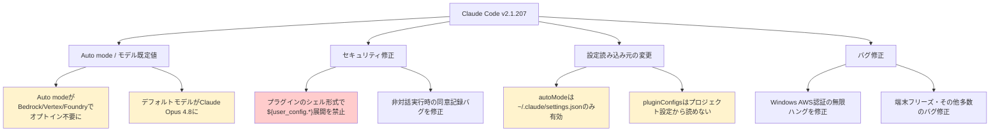
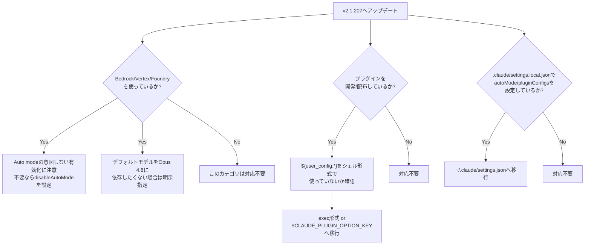

## はじめに

2026年7月にリリースされた Claude Code `v2.1.207` は、一見すると小さなパッチバージョンですが、中身は**設定の挙動が変わる破壊的変更**と**セキュリティ修正**が中心の重要なアップデートです。

特に以下の3点は、Bedrock / Vertex AI / Foundry 経由で Claude Code を使っている組織や、プラグインを開発・配布しているチームに直接影響します。

- Auto mode がオプトイン不要でデフォルト有効化される
- Bedrock/Vertex/AWS 経由のデフォルトモデルが Claude Opus 4.8 に変更
- プラグインのシェルインジェクション対策として `${user_config.*}` のシェル形式展開が禁止

さらに、設定ファイルの読み込み元が制限される変更が2件あり、これまで動いていた設定が **知らないうちに無視される** ケースが出てきます。本記事では、公式リリースノートの内容を整理し、「何が変わったか」「なぜ重要か」「どう対応すべきか」をまとめます。

> **📌 影響を受ける人**
> - Amazon Bedrock / Vertex AI / Microsoft Foundry 経由で Claude Code を利用している人
> - Claude Code プラグイン（hooks / monitors / MCP）を自作・配布している人
> - `.claude/settings.local.json` や プロジェクトの `.claude/settings.json` で `autoMode` / `pluginConfigs` を設定している人

## 変更の全体像

今回のリリースで影響度が高い変更を、カテゴリ別に整理すると以下のようになります。



赤色のノードが最も注意すべき破壊的変更、黄色が「要チェック」レベルの変更です。以降、それぞれ詳しく見ていきます。

## 変更内容

### 1. Auto mode がデフォルトで有効化（Bedrock / Vertex AI / Foundry）

これまで Auto mode をこれらのプラットフォームで使うには、環境変数 `CLAUDE_CODE_ENABLE_AUTO_MODE` によるオプトインが必須でした。v2.1.207 からはこの制限が撤廃され、**デフォルトで Auto mode が有効**になります。

無効化したい場合は、settings の `disableAutoMode` を使う必要があります。

### 2. デフォルトモデルが Claude Opus 4.8 に変更

Bedrock、Vertex AI、Claude Platform on AWS でモデルを明示的に指定していない場合、これまでとは異なり **Claude Opus 4.8** がデフォルトで使用されるようになりました。Opus 系はコストが高く挙動特性も異なるため、コスト管理をしているチームは影響を受けます。

### 3. プラグインのシェルインジェクション対策（Breaking）

最も注意が必要な変更です。プラグインの hooks / monitors / MCP の `headersHelper` において、シェル形式コマンド内で `${user_config.*}` を展開することが**セキュリティ上の理由で禁止**されました。これはユーザー設定値がシェルに直接埋め込まれることによるインジェクションを防ぐための修正です。

移行先は以下の2パターンです。

| 対象 | 旧方式 | 新方式 |
|---|---|---|
| hooks | シェル形式コマンド内で `${user_config.*}` 展開 | exec 形式（`args` 配列）または `$CLAUDE_PLUGIN_OPTION_<KEY>` 環境変数 |
| monitors / headersHelper | シェル形式コマンド内で `${user_config.*}` 展開 | スクリプト内で設定ファイルやサーバーの `env` ブロックから値を読み取る |

### 4. 設定ファイルの読み込み元が制限される変更（2件）

以下の2つは severity が medium ですが、**気付かないうちに設定が無視される**タイプの変更のため要注意です。

| 設定項目 | 変更前 | 変更後 |
|---|---|---|
| `autoMode` | `.claude/settings.local.json`（リポジトリ内）でも有効 | `~/.claude/settings.json`（ユーザーレベル）のみ有効 |
| `pluginConfigs` | プロジェクトの `.claude/settings.json` でも有効 | ユーザー設定 / `--settings` / 管理設定のみ有効 |

いずれもセキュリティ強化（リポジトリに紛れ込ませた設定で意図しない挙動を引き起こせないようにする）が目的です。

### 5. その他の重要な修正

- **非対話実行時の同意記録バグ**：`claude -p` や SDK からの非対話実行で、確認ダイアログを出さないままリモート管理設定が「同意済み」として恒久記録されていた問題を修正（severity: high）。
- **Windows での AWS 認証ハング**：`credential_process` が停止した際に無期限にハングしていたのが、60秒のストールガードで復帰できるように修正（severity: medium だが影響大）。

## 影響と対応

> **⚠️ Breaking Change**
> プラグインのシェル形式コマンドで `${user_config.*}` を使っている場合、アップデート後にプラグインが動作しなくなります。事前に移行してください。

対応すべきアクションを一覧にまとめます。



**優先度順のチェックリスト**

1. **プラグイン開発者は最優先で対応**：`${user_config.*}` をシェル形式コマンドで使っているプラグインは、アップデート後に動作しなくなります。
2. **Bedrock/Vertex/Foundry 利用者**：意図しない Auto mode 有効化と、モデル変更によるコスト影響を確認。
3. **リポジトリ設定に依存しているチーム**：`.claude/settings.local.json` の `autoMode`、プロジェクト `.claude/settings.json` の `pluginConfigs` をユーザーレベル設定に移行。

## コード例

### Auto mode を無効化する（Before/After）

```jsonc
// Before: 環境変数でオプトインしないとAuto modeは無効だった
// （v2.1.207未満では何も設定しなければAuto modeはOFF）
```

```jsonc
// After: ~/.claude/settings.json でdisableAutoModeを明示しないとON
{
  "disableAutoMode": true
}
```

### プラグイン hooks の移行（シェル形式 → exec形式）

```jsonc
// Before: シェル形式コマンド内で ${user_config.*} を展開（v2.1.207で拒否される）
{
  "hooks": {
    "PreToolUse": [
      {
        "type": "command",
        "command": "echo ${user_config.api_key} | some-validator"
      }
    ]
  }
}
```

```jsonc
// After: exec形式（args配列）に変更
{
  "hooks": {
    "PreToolUse": [
      {
        "type": "command",
        "command": "some-validator",
        "args": ["${user_config.api_key}"]
      }
    ]
  }
}
```

```bash
# もしくはスクリプト内で環境変数 $CLAUDE_PLUGIN_OPTION_<KEY> を読み取る方式
#!/bin/bash
echo "$CLAUDE_PLUGIN_OPTION_API_KEY" | some-validator
```

### autoMode 設定の移行

```jsonc
// Before: リポジトリ内 .claude/settings.local.json（v2.1.207からは無視される）
{
  "autoMode": true
}
```

```jsonc
// After: ~/.claude/settings.json（ユーザーレベル）に移行
{
  "autoMode": true
}
```

## まとめ

Claude Code v2.1.207 は、パッチバージョンながら実質的には**セキュリティ強化と設定管理の厳格化**を目的としたリリースです。要点を再掲します。

- Bedrock/Vertex AI/Foundry では **Auto mode がデフォルトON**、デフォルトモデルは **Claude Opus 4.8** に変更。意図しない挙動・コスト変化に注意。
- プラグインのシェル形式コマンドで `${user_config.*}` を使うコードは**動かなくなる**。exec 形式か `$CLAUDE_PLUGIN_OPTION_<KEY>` へ早めに移行する。
- `autoMode` と `pluginConfigs` は、リポジトリ内やプロジェクトの設定ファイルからは読み込まれなくなり、**ユーザーレベル設定への一本化**が必要。
- Windows での AWS 認証ハングなど、地味だが実運用で困っていたバグも複数解消されている。

いずれも「アップデートしたら急に動かなくなった」という事故を防ぐため、特にプラグイン開発者とエンタープライズクラウド利用者は、アップデート前に本記事のチェックリストを確認しておくことをおすすめします。
