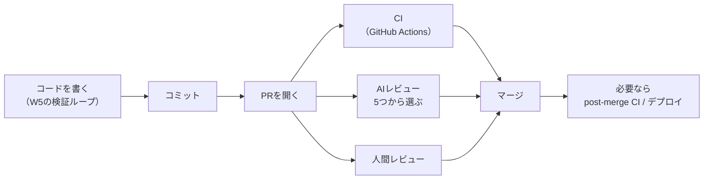
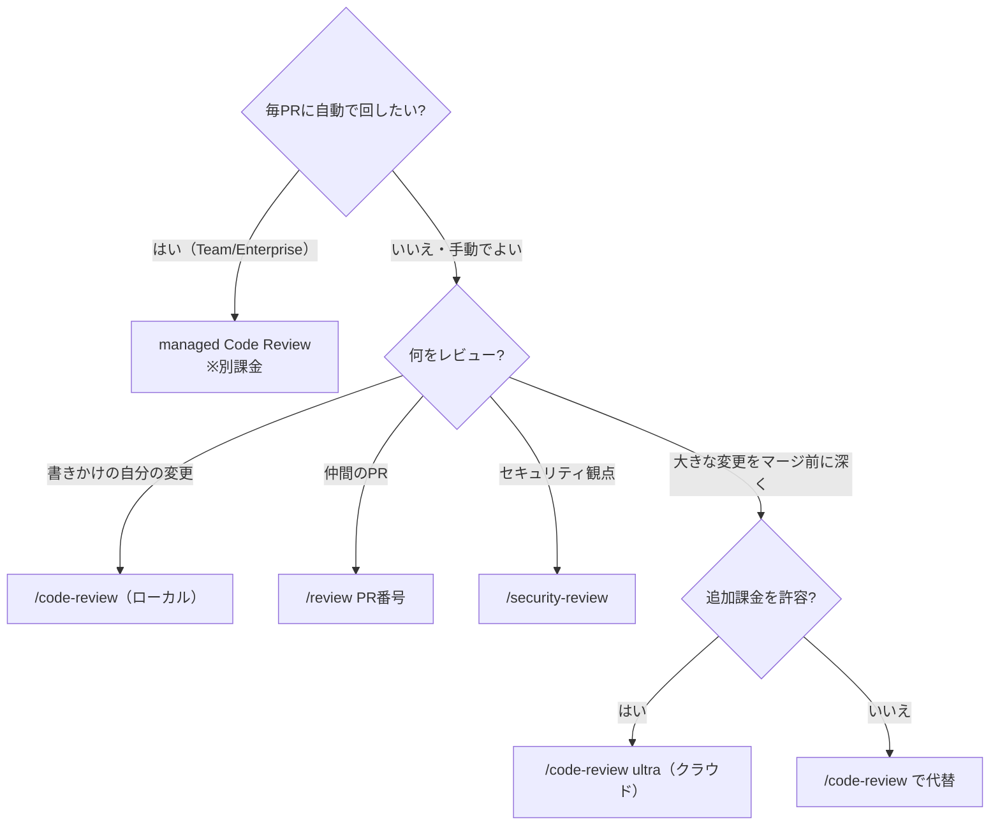

# Claude Codeのレビュー5種類 — 対象・コスト・権限・CIで選ぶ

> **対象読者**: Claude Code にコミットや PR を任せてよいか不安な入門者／5つのレビュー機能の使い分けと GitHub Actions 連携まで押さえたい開発者
> **前提知識**: Claude Code がインストール済みで、git のコミット・PR に触れたことがあること（`gh` CLI は本文で導入します）
> **この記事でできること**: コミット→PR→CI・レビュー→マージ という出荷フローを組み立て、5つのレビュー機能をコストと権限で選び分けられる

コードが書けてテストも通った——でも、作業はそこで終わりません。分かりやすいコミットメッセージを書き、プルリクエスト（PR）を開き、レビューの指摘に答え、CI を緑にする。この「出荷の雑務」は面倒で、間違えると影響が大きい。だからこそ AI に任せたいのに、任せてよいか不安になります。

Claude Code の「AI レビュー」は1種類ではありません。実務上は**5つの選択肢**に分かれ、対象・コスト・権限・CI 連携の向き不向きが違います。この記事は5つを1枚の早見表にまとめ、コミットからマージまで「いつどれを使うか」を選べるようにします。

（2026年7月10日時点、Claude Code 2.1.206 で確認。バージョンはほぼ毎日上がるので番号は読み替えてください。手元では `claude --version`。料金や研究プレビュー機能の可否は変動します。）

## まず、これだけ

細かい使い分けは後回しでも、次の4つを順に守れば「AI にコミットと PR を任せる」を比較的安全に試せます。まずは feature ブランチで試し、`git diff` で変更を自分の目で見てから PR を出しましょう。

1. **小さく任せる**。最初は「分かりやすいメッセージでコミットして、PR を開いて」と頼むだけで十分です。公式のベストプラクティスも、テストと型チェックが通ったあとにコミットして PR を作る順番を示しています（[Best practices](https://code.claude.com/docs/en/best-practices)の「Explore, plan, code, commit」の Commit ステップ、および「Create skills」節の fix-issue スキル例の手順5〜8）。
2. **出す前に自分で見る**。生成された PR の説明をそのまま提出せず、「**リスクや考慮点を挙げて**」と頼んでから出します（公式も提出前の確認を明示的に勧めています）。AI が書いたからこそ、もう一度目を通す価値があります。
3. **`gh` CLI（GitHub 公式のコマンドラインインターフェース）を先に入れて認証しておく**。手順は OS ごとに違うので [GitHub CLI の公式サイト](https://cli.github.com/) を参照してください（macOS なら `brew install gh` など）。入れたら `gh auth login` で対話認証し、`gh auth status` で確認します。認証しておかないと、Claude は未認証の GitHub API を叩き、レート制限に当たりやすくなります。
4. **マージ前に1回レビューを挟む**。その「レビュー」が場面ごとに5つあり、後半の本題です。



CI・AI レビュー・人間レビューは、いずれも**マージの前**に並列で通すのが基本です。CI を後回しにして先にマージするモデルではありません。

## コミットを作る

### メッセージと履歴

コミットメッセージは、Claude に任せられる典型的な作業です。ブランチ命名や PR の規約といった**リポジトリのお作法**は、毎回プロンプトに書く代わりに `CLAUDE.md` に置いておけば、コンテキストとして読み込ませて従う確率を上げられます。ただし `CLAUDE.md` は強制装置ではなく指示コンテキストです。絶対に守らせたい規則はフックや CI で検証します（`CLAUDE.md` の置き場所は [W4](https://qiita.com/ujunja/items/a6bf13f9ca981b2ca5f3) で扱いました）。

知らないコードに触れる前は、git の履歴を会話で調べると背景がつかめます。公式の例は「そのコードがどう出来上がってきたか」を要約させる使い方です（変更者を1行ずつ調べる `git blame` とは別です）。

```text
ExecutionFactory の git 履歴を追って、その API がどう出来上がってきたか要約して
```

非対話モードの `claude -p` は、コミットログをそのまま要約できます（`|` は前のコマンドの出力を次へ渡す記法です）。コミットメッセージの下書きにも、後述の CI の部品にもなります。

```bash
git log --oneline -20 | claude -p "summarize these recent commits"
```

なお、良いコミットの粒度（1コミット1目的にするか、複数を1つにまとめる〈squash〉か、そのまま統合〈merge〉するか）についての専用の公式ページは見当たりませんでした。一般的な慣習として捉えてください。

### 帰属表記（Co-Authored-By）

Claude はコミットや PR に、AI が関与したことを示す帰属表記（attribution）を既定で添えます。設定で内容を変えたり消したりでき、チームの方針に合わせて調整できます。

この設定面は今も手が入っています。2026年6月19日（v2.1.183）に claude.ai のセッションリンクをコミット・PR から省く設定（`attribution.sessionUrl`）が追加され、2026年6月12日（v2.1.174）にモデル名が誤表示される不具合が修正されました。

考えどころは、公開・OSS のリポジトリでこの表記を**残すか外すか**です。正解はなく、チームで決める話なので、まず「そういう設定がある」と知っておくのが第一歩です。

## PRを作る

PR は、直接頼んでも、3ステップで案内しても作れます。

```text
# 直接
create a pr for my changes

# 3ステップ（要約 → 作成 → 補強）
summarize the changes I've made to the authentication module
create a pr
enhance the PR description with more context about the security improvements
```

（指示は英語でも日本語でも同じように動きます。上の例は公式ドキュメントの表記に合わせています。）

`gh pr create` で PR を作ると、その**セッションが PR に自動でリンク**されます。後から再開する方法は2つです。

```bash
gh pr create
# 番号で戻る
claude --from-pr 123
# または /resume のピッカーに PR の URL を貼って検索する
```

`--from-pr` は番号のほか、GitHub / GitHub Enterprise の PR URL、GitLab のマージリクエスト URL、Bitbucket の PR URL も受け付けます。数日後にレビューの続きへ戻るときの導線です。

## マージ前のレビュー — 5種類の使い分け

ここがこの記事の中心です。公式が「5大機能」と呼ぶわけではなく、**実務上5つのレビュー選択肢に分けて整理**したものです。性質が違って混同しやすいので、まず1枚の早見表で俯瞰します。

| 機能 | 対象（何を見る） | 起動 | 条件・認証 | 課金・マージ阻止 |
|---|---|---|---|---|
| `/code-review` | 書きかけのローカル差分 | 手動 | 通常の認証（API可） | 利用枠内※／マージは止めない |
| `/review PR番号` | 仲間の GitHub PR | 手動 | 通常の認証（API可） | 利用枠内※／マージは止めない |
| `/security-review` | 現ブランチの変更（セキュリティ） | 手動・1回 | プラン別対応は未確認 | 利用枠内※／マージは止めない |
| managed Code Review | 毎 PR（自動コメント） | 自動（トリガー不要） | GitHub App・Team/Enterprise（研究プレビュー・ZDR不可） | 約 $15〜25/回（税別）／中立=止めない |
| `/code-review ultra` | 大きな変更をクラウドで深く | 手動 | Claude.ai 認証必須・API単独不可・Pro/Max/Team/Enterprise（Free対象外） | Pro/Max 3回無料→$5〜20/回（税別）／マージは止めない |

※ 公式のプラン別対応表は確認できていません。`/code-review`・`/review` は公式の比較表で「通常の利用枠内（counts toward normal usage）」と確認できますが、`/security-review` は同表になくプラン対応は未確認です。API キーで認証している場合は API 利用料がかかります。

> 「研究プレビュー」は正式提供前の試験公開機能です。managed Code Review と ultra はどちらも研究プレビューで、価格もプランも変わり得ます。料金はいずれも**米ドルの税別**の目安で、変動します。日本の顧客には 2026年4月以降 **消費税（JCT）10%** が別途加算されます。消費税の課税対象となる法人顧客は適格請求書により仕入税額控除を受けられますが、個人（消費者）顧客は受けられません。個人事業主等の扱いは出典に明記がないため、詳細は税理士等にご確認ください（出典は末尾の参考リンク「消費税に関するお知らせ」）。利用前に公式の料金ページで再確認してください。

公式も段階に沿った使い分けを示しています——**書いている最中は `/code-review`、仲間の PR を承認前に見るなら `/review PR番号`、大きな変更をマージする前に深く見たいなら `/code-review ultra`**。決定木にすると次のようになります。



この5つは、[W2](https://qiita.com/ujunja/items/577019cd04fed7bfabec) で見た `explore → plan → code → commit` の最後の一行「PRを開いて」を、コミットからマージまで広げたものです。[W5](https://qiita.com/ujunja/items/211c6eb10750f8597e6e) の検証ループで積んだ「証拠」は、ここで PR の説明や CI の合否として、レビュアーの目に見える形になります。

### 1. `/code-review` — ローカルで速い

書きながら回す、正しさのバグ探し用のレビューです。**実行すると、いまの差分への指摘がターミナルに一覧表示されます**。基礎の挙動・`--fix`・effort レベル・改名の履歴は [W5](https://qiita.com/ujunja/items/211c6eb10750f8597e6e) で扱ったので繰り返しません。対象は正確には「**上流（プッシュ元のリモートブランチ）より先にあるブランチのコミット＋作業ツリーの未コミット変更**」で、ファイルパス・PR 番号・ブランチ名・`main...my-feature` のような範囲も指定できます。

この記事で新しいのは `--comment` です。指摘を**ローカル表示するだけでなく、GitHub の PR にインラインコメントとして投稿**します。W5 が「出荷まわりで扱う」と送り出したのがこのモードです。

```bash
/code-review --comment    # 指摘をPRのインラインコメントとして投稿
```

### 2. `/review PR番号` — 仲間の PR を見る（挙動が変わったばかり）

これは `/code-review` とは**別のコマンド**で、GitHub の PR を番号で指定し、**速い1パスの読み取り専用レビュー**を走らせます。引数なしなら開いている PR の一覧から選べます。

注意したいのは、この挙動が**約2週間で2回変わった（往復した）**ことです。2026年6月22日（v2.1.186）から v2.1.201 までは `/code-review medium` と同じマルチエージェント方式でしたが、2026年7月6日（v2.1.202）で**速い単一パスに戻り**、深いレビューが欲しいときは `/code-review レベル PR番号` を使う形になりました。

教訓は明快です。**スラッシュコマンドをエイリアスやスクリプトに固定する前に、今の版で挙動を確認する**。同じことは次の `/simplify` にも当てはまります。

### 3. `/security-review` — セキュリティ観点で1回

現ブランチの未処理の変更を、インジェクション・認証の不備・データ露出といった観点でスキャンします。頼んだときに1回走る、オンデマンドのパスです（常時監視ではありません）。2026年7月10日時点では専用のドキュメントページを確認できず、コマンド表の一行を正式な説明として扱っています。

### 4. managed Code Review — 毎 PR に自動（GitHub App、Team/Enterprise）

ローカルの `/code-review` コマンドとは**別物**で、Anthropic が提供する **GitHub App**（GitHub に追加インストールして使う外部アプリ）製品です。`@claude` のトリガーなしに、**毎 PR へ自動でインラインコメント**を付けます。研究プレビューで、Team / Enterprise 向け（Zero Data Retention 有効の組織は不可）です。

重要なのは、これが**単体ではマージを止めない**点です。GitHub のチェックラン（PR 上に表示される CI の合否ステータス）は常に **neutral（中立）**で終わるので、ブランチ保護でマージを止めません。指摘でマージを本当にゲートしたいチームは、チェックランの出力から重大度の内訳を**自前の CI で読み取る**必要があります（公式は `gh api ... --jq` の例を示していますが、正確な構文は発行前に `code-review` ページで直接確認してください）。

- **重大度タグ**: Important（マージ前に直すべきバグ）／Nit（軽微、ブロックしない）／Pre-existing（この PR より前からあるバグ）。承認も却下もしません。
- **調整**: `CLAUDE.md` は Nit レベルの文脈として読まれ、レビュー専用の新しい **REVIEW.md** は各エージェントへの最優先指示として注入されます。
- **手動起動**: PR のトップレベルコメントで `@claude review`（以後プッシュ連動で継続）か `@claude review once`（単発）。
- **料金・所要**: 1回あたり平均 $15〜25（税別）、およそ20分。

### 5. `/code-review ultra`（別名 `/ultrareview`）— マージ前の深いパス

クラウド上で走る深いレビューで、大きな変更をマージする前の最終確認向けです。v2.1.86 以降の研究プレビューで、旧名 `/ultrareview` は別名として残っています。Claude Code on the web の基盤で動くため、**Claude.ai アカウント認証が必要**（API キーのみでは不可）です。企業向けの一部基盤（Amazon Bedrock・Google Cloud の Agent Platform・Microsoft Foundry）や、Zero Data Retention を有効にした組織では使えません。

Pro / Max は**3回まで無料**（補充されない一度きり）で、以降と Team / Enterprise（無料枠なし）は変更規模に応じて1回 $5〜20 の従量課金です。所要は5〜10分で、バックグラウンドタスクとして走り `/tasks` で確認できます。CI 向けには非対話の `claude ultrareview` サブコマンドがあります。

```bash
claude ultrareview --json --timeout 15   # --timeout の単位は「分」（既定30分）
# 終了コード: 0=完走（※「指摘ゼロ」の意味ではない。出力/--json を必ず確認）／1=失敗・タイムアウト／130=Ctrl-C
```

`/code-review ultra --fix` は、クラウドのレビュー結果をローカルの作業ツリーに適用します。

### 周辺のコマンド

5機能とは別の、覚えておくと便利なコマンドです。

- **`/simplify`**（整理専用）: v2.1.154 以降、正しさのバグは**探しません**（バグ探しは `/code-review`）。以前 `/simplify` をバグ探し目的でスクリプトに組んでいた人は `/code-review --fix` に切り替える必要があります。「2」と同じ「自動化を確認する」場面です。
- **`/autofix-pr`**: 現ブランチの PR を見張り、CI が失敗したりレビュアーがコメントを付けたら、Claude Code on the web のセッションが**自動で修正をプッシュ**します。
- **`/diff`**: 未コミットの変更とターンごとの差分を、対話的なビューアで見ます。

## CIへ広げる — GitHub Actions

レビューを CI に載せると、PR や Issue で **`@claude` とメンションするだけ**で、Claude がコードを分析し、PR を作り、機能実装やバグ修正まで——プロジェクトの規約に従って——動きます。

導入は Claude Code のターミナルセッションで `/install-github-app` を実行します。GitHub App を入れ、ワークフローとシークレットの設定まで対話的に案内してくれます（リポジトリ管理者権限が必要で、`ANTHROPIC_API_KEY` をリポジトリシークレットに追加する手順が案内されます）。2026年6月23日（v2.1.187）以降は「Skip for now」で App だけ入れて設定を後回しにもできます。このクイックスタートは Claude API 直利用者向けで、Bedrock 等は別途手動設定が要ります。

### 既存のワークフローがある人は v1.0 の破壊的変更を確認

Claude Code GitHub Actions は v1.0（GA）に到達し、ベータからの破壊的変更が入りました。数か月前に設定した人は、ワークフローファイルの更新が必要です。

- `mode` 設定は**廃止**（自動判定になった）
- `direct_prompt` → **`prompt`** に改名
- `max_turns` / `model` / `custom_instructions` などの複数オプションが **`claude_args`** に統合

`claude_args` には `--max-turns` `--model` `--mcp-config` `--allowedTools` などの CLI フラグをそのまま渡せます。

コストは2か所から出ます——**GitHub Actions のランナー時間**と **Claude API のトークン使用量**です。公式は、`@claude` の指示を具体的にする・`--max-turns` を設定する・ワークフローにタイムアウトを設ける・concurrency で同時実行を制御する、といった節約策を挙げています。また、CI が **Claude 自身のコミットではトリガーされない**ことがあります（既定の Actions ユーザーではなく、適切な権限を持つ GitHub App を使う必要がある）——よくハマる点です。

managed Code Review との違いも公式が整理しています。**GitHub Actions は `@claude` で起動する自作の自動化**、**managed Code Review はトリガーなしで毎 PR に自動で動くレビュー**です。

CI で自動化するときの安全設定は、まず次の3つを押さえれば十分です。詳細は下の折りたたみにまとめます。

- **対話なしで回す** → `dontAsk`（許可ルールと読み取り専用コマンドのみ実行）
- **完全自律で回す** → `bypassPermissions` は使い捨てのコンテナ・VM の中だけ
- **再現性を上げる** → `--bare` で自動探索を省く

<details>
<summary>自分でスクリプト化する人向け（headless・権限・worktree・GitLab）</summary>

### headless（`-p`）モード

CI では対話画面を使わず `claude -p` で走らせます。

```bash
claude -p "Find and fix the bug in auth.py" --allowedTools "Read,Edit,Bash"
```

`--bare` は、フック・スキル・プラグイン・MCPサーバー・自動メモリ・`CLAUDE.md` の自動読み込みを省き（OAuth・keychain 読み取りも省く）、再現性と速さを上げます。ただし明示的に呼ぶ `/skill-name` は bare でも解決します（実機の `claude --help` で確認）。将来 `-p` の既定になる予定です（現時点では既定ではありません）。OAuth・キーチェーンを読まないぶん、認証は `ANTHROPIC_API_KEY` か `apiKeyHelper` から渡す必要があります。`--output-format json` は `total_cost_usd` を含み、コスト集計に使えます。v2.1.128 以降、パイプ入力は 10MB で上限が付きます。

### `claude setup-token`

CI・スクリプト用に**1年間の OAuth トークン**を発行します（端末に表示されるだけで、どこにも保存されません）。Pro / Max / Team / Enterprise が必要で、**推論専用**（Remote Control は張れません）。注意点として、`--bare` は `CLAUDE_CODE_OAUTH_TOKEN` を読まないので、`--bare` と setup-token を併用するスクリプトは `ANTHROPIC_API_KEY` / `apiKeyHelper` を使ってください（setup-token の基礎は [W1](https://qiita.com/ujunja/items/05a2c163921ab3e1ea96) で扱いました）。

### CI 向けの権限（パーミッション）モード

公式は自動実行向けのモードを明示しています——**ロックダウンした CI・スクリプトには `dontAsk`**（許可ルールと読み取り専用コマンドのみ実行し、それ以外は確認なしに拒否）、**`bypassPermissions` は使い捨てのコンテナ・VM の中だけ**（インターネットアクセスを遮断した隔離環境が望ましい）。⚠️ `bypassPermissions` は root / sudo で（サンドボックス外では）起動を拒否します。無人・非 root で自律実行するなら dev container 構成が推奨です。権限モードの仕組み自体は [W3](https://qiita.com/ujunja/items/2b5cceaf5a1a39f43033) で扱いました。

### git worktree で並列に出荷する

`--worktree`（`-w`）で、新しいブランチ上の独立したチェックアウトを作れます（既定で `.claude/worktrees/<値>/`、ブランチ名 `worktree-<値>`）。既存 PR から枝分かれするには `#123` か PR の URL を渡します。手動なら `git worktree add ../project-feature-a -b feature-a` でも同じです。

```bash
claude --worktree feature-a
claude --worktree "#123"   # PR #123 から枝分かれ
```

2026年7月1日（v2.1.198）以降、`claude agents` から起動したバックグラウンドのエージェントは、worktree での作業を終えると**自動でコミット・プッシュし、ドラフト PR まで開く**ようになりました。無人の並列セッションを回す人に効く変化です。なお rebase・cherry-pick・bisect は「名前の付いた機能」ではなく、**あなたが指示した git コマンドを Claude が通常の Bash ツールで実行する**もの、と捉えてください。

### GitLab CI/CD（ベータ・GitLab 保守）

GitLab CI/CD 向けの連携もありますが、**ベータで、Anthropic ではなく GitLab が保守**しています。マスクした `ANTHROPIC_API_KEY` 変数と、Claude Code を導入して `claude -p` を走らせる `.gitlab-ci.yml` ジョブで構成します。GitHub 中心の本記事では、詳細は[公式ドキュメント](https://code.claude.com/docs/en/gitlab-ci-cd)に譲ります。

</details>

## 早見表

### コマンド

| コマンド | 用途 | 出力先 | 追加課金 |
|---|---|---|---|
| `/code-review --comment` | ローカルの指摘を PR に投稿 | ターミナル＋PRコメント | なし（利用枠内） |
| `/review PR番号` | 仲間の PR を速い1パスでレビュー | ターミナル | なし（利用枠内） |
| `/security-review` | 現ブランチをセキュリティ観点で1回 | ターミナル | なし（利用枠内・未確認） |
| `/code-review ultra` | クラウドの深いレビュー（マージ前） | ターミナル／`/tasks` | Pro/Max 3回無料→$5〜20（税別） |
| `/simplify` | 整理専用（バグ探しは `/code-review`） | ターミナル | なし（利用枠内） |
| `/autofix-pr` | PR を見張り、CI 失敗やコメントに自動で修正プッシュ | PRへプッシュ | なし（利用枠内） |
| `/diff` | 未コミット差分を対話的に表示 | ターミナル | なし |
| `/install-github-app` | GitHub Actions 連携を導入 | — | なし |

※ CI で使う `claude ultrareview --timeout` の単位は「分」です（既定30分）。秒と取り違えると長時間ハングするので注意してください。

### GitHub Actions v1.0 移行（主要な変更）

| ベータ | v1.0 |
|---|---|
| `anthropics/claude-code-action@beta` | `@v1` |
| `mode` | 廃止（自動判定） |
| `direct_prompt` | `prompt` |
| `max_turns` / `model` など個別オプション | `claude_args` に統合 |

網羅的な対応表は[公式の GitHub Actions ドキュメント](https://code.claude.com/docs/en/github-actions)を参照してください。

## まとめ

**入門者の方へ**

- 出荷は、すでに知っている流れの**最後の2歩**です——コミットして PR を開き、マージ前に何か（人でもツールでも）に一度見てもらう。それだけです。
- 「AI レビュー」は1つのブラックボックスではなく、場面ごとに5つあります。今どれを見ているか分かれば混乱は減ります。
- 生成された PR の説明はそのまま出さず、「リスクを挙げて」と頼んでから提出する——AI が書いたからこそ、この一手間が効きます。
- `gh` CLI は早めに入れて認証しておくと、後の分かりにくいレート制限を避けられます。

**開発者の方へ（選び方3行）**

- **手元の変更**は `/code-review`、**仲間の PR**は `/review PR番号`、**大きな変更のマージ前**は `/code-review ultra`。
- **毎 PR を自動で**回すなら managed Code Review（Team / Enterprise・別課金・チェックランは中立で単体ではマージを止めない）。ゲートしたいなら重大度を自前の CI で読み取ります。
- **スラッシュコマンドは版で挙動が変わります**（`/review` は約2週間で2回、`/simplify` も役割が変わりました）。エイリアスやスクリプトに固定する前に、今の版で挙動を確認してください。

次の一歩です。

- 入門者の方: 次の変更で「分かりやすいメッセージでコミットして、PR を開いて。リスクも挙げて」と一息で頼んでみてください。
- 開発者の方: まず手元で `/code-review` → 仲間の PR に `/review` → 大きな変更のマージ前に `/code-review ultra` や managed を検討、と段階的に運用へ組み込んでください。

## 参考リンク

- [Best practices](https://code.claude.com/docs/en/best-practices) — 2026-07-10 確認
- [Common workflows](https://code.claude.com/docs/en/common-workflows) — 2026-07-10 確認
- [Sessions](https://code.claude.com/docs/en/sessions) — 2026-07-10 確認
- [Commands reference](https://code.claude.com/docs/en/commands) — 2026-07-10 確認
- [CLI reference](https://code.claude.com/docs/en/cli-reference) — 2026-07-10 確認
- [Code review](https://code.claude.com/docs/en/code-review) — 2026-07-10 確認
- [Security guidance](https://code.claude.com/docs/en/security-guidance) — 2026-07-10 確認
- [Ultrareview](https://code.claude.com/docs/en/ultrareview) — 2026-07-10 確認
- [GitHub Actions](https://code.claude.com/docs/en/github-actions) — 2026-07-10 確認
- [Headless mode](https://code.claude.com/docs/en/headless) — 2026-07-10 確認
- [Authentication](https://code.claude.com/docs/en/authentication) — 2026-07-10 確認
- [Permission modes](https://code.claude.com/docs/en/permission-modes) — 2026-07-10 確認
- [Worktrees](https://code.claude.com/docs/en/worktrees) — 2026-07-10 確認
- [GitLab CI/CD](https://code.claude.com/docs/en/gitlab-ci-cd) — 2026-07-10 確認
- [Changelog](https://code.claude.com/docs/en/changelog) — 2026-07-10 確認
- [消費税（JCT）に関する日本のお客様向けのお知らせ](https://support.claude.com/en/articles/14051822-notice-regarding-consumption-tax-jct-for-japanese-customers) — 2026-07-10 確認

---
### シリーズナビ
- ◀ 前: [W5 「できました」と言われたのに直ってない時の検証ループ](https://qiita.com/ujunja/items/211c6eb10750f8597e6e)
