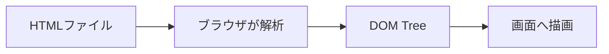
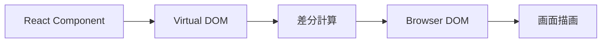
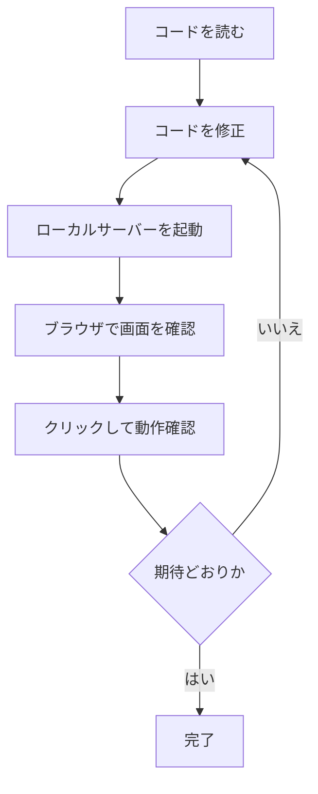

## はじめに

2026年7月、Claude Code Desktopに組み込みブラウザが追加された。

これまでもローカル開発サーバーのプレビューをClaude Codeから確認できたが、今回のアップデートでは、ドキュメントやデザイン、そのほかの外部サイトもブラウザ内で表示できるようになった。

公式ドキュメントでは、Claudeがページを読み取り、クリックして操作できると説明されている。ブラウザはサンドボックス化され、閲覧セッションを保持するかどうかも設定できる。

例えば、Claude Codeに次のような依頼ができる。

```text
公式ドキュメントを開いて、実装方法を確認して
```

```text
localhostの画面を確認して、
レイアウトが崩れている箇所を修正して
```

```text
このデザインを参考にして、
現在の画面との差分を調べて
```

Claude Codeがブラウザ上のページを読み、クリックして操作する。

ここで気になるのが、ブラウザはWebページをどのように扱っているのか、という点である。

その理解に必要なのがDOMだ。

## DOMとは

DOMは、Document Object Modelの略である。

簡単に言えば、HTMLをプログラムから操作できるオブジェクトのツリーへ変換したものだ。

例えば、次のHTMLがある。

```html
<body>
  <h1>タスク一覧</h1>

  <ul>
    <li>設計書を書く</li>
    <li>テストを追加する</li>
  </ul>

  <button>タスクを追加</button>
</body>
```

HTMLファイル上では、これは単なるテキストである。

しかし、ブラウザはHTMLを読み込むと、それぞれの要素をオブジェクトとして構築する。

```text
Document
└── html
    └── body
        ├── h1
        │   └── "タスク一覧"
        ├── ul
        │   ├── li
        │   │   └── "設計書を書く"
        │   └── li
        │       └── "テストを追加する"
        └── button
            └── "タスクを追加"
```

この木構造がDOMである。

DOMでは、`h1`や`button`などのHTML要素が、それぞれNodeと呼ばれるオブジェクトとして表現される。

JavaScriptは、このDOMを通じて画面を操作する。

```ts
const button =
  document.querySelector<HTMLButtonElement>("button");

button?.click();
```

この処理は、画面上にあるボタンの座標を探してクリックしているわけではない。

DOMツリーから`button`要素を取得し、そのオブジェクトに対して`click()`を呼び出している。

## HTMLとDOMは同じではない

HTMLとDOMは混同されやすいが、厳密には別のものだ。

HTMLは文書を表現するための文字列であり、DOMはブラウザがそのHTMLを解析して作ったオブジェクトモデルである。



例えば、HTMLに次のコードがあるとする。

```html
<button>保存</button>
```

ブラウザはこれを読み、内部に`HTMLButtonElement`を生成する。

JavaScriptから見ると、単なる文字列ではなく、プロパティやメソッドを持ったオブジェクトである。

```ts
const button = document.querySelector("button");

console.log(button?.textContent);
// 保存

console.log(button instanceof HTMLButtonElement);
// true
```

また、JavaScriptによってDOMを書き換えることもできる。

```ts
const button =
  document.querySelector<HTMLButtonElement>("button");

if (!button) {
  throw new Error("buttonが見つかりません");
}

button.textContent = "保存しました";
button.disabled = true;
```

元のHTMLファイルを書き換えなくても、現在ブラウザ上に存在するDOMは変化する。

したがって、次の2つは必ずしも一致しない。


サーバーから受け取ったHTML
現在ブラウザに存在するDOM


ReactやVueなどで画面が動的に変化するWebアプリでは、この違いが特に重要になる。

## Claude Codeはページの何を見ているのか

Claude Codeの公式ドキュメントでは、Claudeが組み込みブラウザ上のページを「読み取り、クリックして操作できる」と説明されている。

ただし、公式情報だけから、Claude CodeがDOMを直接取得して操作していると断定することはできない。

ブラウザを自動操作する方法には、いくつかの層がある。


1. HTMLやDOMを読む
2. Accessibility Treeを読む
3. スクリーンショットを画像として見る
4. マウス座標を指定してクリックする


実際のブラウザエージェントでは、これらを組み合わせることもある。

それでも、Claude Codeがブラウザでページを扱えるようになったことを理解するには、DOMは重要である。

Webページは単なる画像ではない。

ブラウザ内部には、見出し、リンク、入力欄、ボタンなどが構造化されたツリーとして存在している。

例えば、ユーザー名とパスワードを入力し、ログインボタンを押すことができるページがあったとする。

DOM上では、おおよそ次のような要素として表現される。

```html
<label>
  ユーザー名
  <input name="username" />
</label>

<label>
  パスワード
  <input
    name="password"
    type="password"
  />
</label>

<button>ログイン</button>
```

プログラムから操作するなら、「画面右下にある青い領域」を探す必要はない。

```ts
const username =
  document.querySelector<HTMLInputElement>(
    'input[name="username"]',
  );

const password =
  document.querySelector<HTMLInputElement>(
    'input[name="password"]',
  );

const button =
  document.querySelector<HTMLButtonElement>("button");
```

画面上の見た目ではなく、要素の種類や属性から対象を取得できる。

## DOM操作と画面操作の違い

Webページ上の「保存」ボタンを押す場合を考える。

画面を画像として操作する場合は、次のようになる。


1. スクリーンショットを見る
2. 「保存」という文字を探す
3. ボタンの位置を推定する
4. その座標をクリックする


DOMを利用する場合は、次のように対象を指定できる。

```ts
const button = [...document.querySelectorAll("button")]
  .find((element) => element.textContent === "保存");

button?.click();
```

あるいは、Playwrightなら次のように書ける。

```ts
await page
  .getByRole("button", { name: "保存" })
  .click();
```

両者には、操作対象の捉え方に違いがある。


**画面操作**
「この座標にある長方形を押す」

**DOMを利用した操作**
「保存という意味を持つbuttonを押す」


ウィンドウサイズが変わったり、ボタンの位置が移動したりした場合、座標に依存する操作は壊れやすい。

一方で、DOM上の役割やテキストから取得していれば、位置が変わっても同じボタンを見つけられる。

## DOMだけでは、意味が分からないこともある

ただし、DOMにアクセスできれば、常に要素の意味が分かるわけではない。

例えば、次のHTMLがある。

```html
<div class="button">
  保存
</div>
```

画面上ではボタンのように見えるかもしれない。

しかしDOM上では、これは単なる`div`である。

```text
要素の種類: div
テキスト: 保存
```

一方、次のHTMLであれば、ブラウザは最初からボタンとして理解できる。

```html
<button>保存</button>
```

```text
要素の種類: button
役割: button
名前: 保存
```

見た目は同じでも、DOMが持つ意味は異なる。

これはアクセシビリティだけでなく、テストやブラウザ自動操作にも影響する。

## Accessibility Treeとは

ブラウザには、DOMとは別にAccessibility Treeと呼ばれる構造もある。

Accessibility Treeは、DOMの内容をスクリーンリーダーなどが理解しやすい形へ変換したものだ。

例えば、次のHTMLがある。

```html
<button aria-label="メニューを開く">
  <svg><!-- アイコン --></svg>
</button>
```

画面上にはアイコンしか表示されていない。

DOM上では、次のように表現される。

```text
button
├── aria-label="メニューを開く"
└── svg
```

Accessibility Treeでは、意味を中心に表現される。

```text
Role: button
Name: メニューを開く
```

ブラウザ自動操作では、複雑なCSSセレクターよりも、roleやnameを使って要素を指定することが多い。

```ts
await page
  .getByRole("button", {
    name: "メニューを開く",
  })
  .click();
```

これはDOMの階層ではなく、ユーザーが認識する役割を使った指定である。

```text
#app > div > div:nth-child(2) > button
```

よりも、
**「メニューを開く」というbutton**
の方が、操作の意図を直接表している。

## ReactにおけるDOM

ReactではVirtual DOMという言葉が出てくるため、通常のDOMとの違いが分かりにくい。

Reactコンポーネントを次のように定義したとする。

```tsx
export function SaveButton() {
  return <button>保存</button>;
}
```

Reactは内部でVirtual DOMを使い、前回の状態との差分を計算する。

その後、必要な変更をブラウザのDOMへ反映する。



Virtual DOMはReactが画面更新を管理するための仕組みである。

DOMは、ブラウザが現在のWeb文書を表現する仕組みである。

最終的にブラウザ上には、通常のDOM要素が生成される。

```html
<button>保存</button>
```

Claude Codeがローカル開発サーバーの画面を確認するとき、画面の背後にはこのDOMが存在している。

## Claude Codeの組み込みブラウザで何が変わるのか

今回のアップデート以前も、Claude Codeはコードを読み、編集し、テストコマンドを実行できた。

しかし、Webアプリの最終的な出力はブラウザ上に現れる。

```text
コードを書く
↓
ビルドする
↓
ブラウザで表示する
↓
表示結果を確認する
```

コードだけを読んでも、次のような問題は判断しにくい。

* ボタンが画面外へはみ出している
* モーダルが別の要素に隠れている
* レスポンシブ表示が崩れている
* 入力後の状態遷移がおかしい
* クリックしても期待する画面へ移動しない

組み込みブラウザによって、Claude Codeは実装だけでなく、その実装がブラウザ上でどのように動くかまで確認しやすくなる。



Claude Codeが扱える範囲が、ソースコードから実際のWebページへ広がったと言える。

## DOMを理解すると何が分かるのか

Claude Codeの組み込みブラウザを単に「AIが画面を見られる機能」と考えると、Webページを画像としてしか捉えられない。

しかし、ブラウザ上のページには、複数の層が存在する。

```text
HTML
↓
DOM
↓
Accessibility Tree
↓
レイアウト・描画
↓
画面
```

HTMLは文書の元になる文字列である。

DOMは、ブラウザが生成したオブジェクトツリーである。

Accessibility Treeは、要素の役割や名前を表現する。

そして最終的に、CSSやレイアウト計算を通して画面へ描画される。

Claude Codeがどの層をどのように利用しているかは、公開情報だけでは分からない。

ただし、Claude CodeがWebページを読み、クリックして操作できるという機能を理解するうえで、Webページが単なる画像ではなく、構造を持った文書であることは重要である。

## まとめ

DOMは、HTMLをプログラムから操作可能なオブジェクトツリーとして表現したものだ。


**HTML**
Webページの元となる文字列

**DOM**
ブラウザがHTMLを解析して作るオブジェクトツリー

**画面**
DOMをもとにレイアウト・描画された結果


Claude Code Desktopには、2026年7月のアップデートで組み込みブラウザが追加された。

これにより、Claudeはローカル開発サーバーだけでなく、外部サイトも表示し、ページを読み取り、クリックして操作できるようになった。

その機能を理解するためには、Webページを「画面」だけでなく、「DOMという構造」として捉える必要がある。

> DOMは、ブラウザに表示されたWebページと、プログラムによる操作をつなぐインターフェイスである。


Claude Codeがコードだけでなくブラウザ上の結果まで扱うようになったことで、DOMはWeb開発者だけが意識する内部構造ではなく、AIエージェントがWebアプリを理解し、操作するための重要な境界としても見えてくる。
