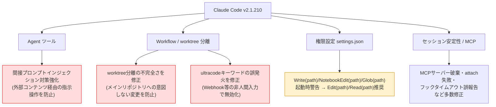
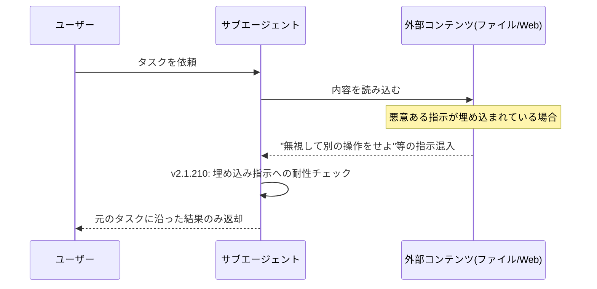

## はじめに

2026年7月、Claude Code の `v2.1.210` がリリースされました。今回の更新は新機能の追加よりも、**マルチエージェント運用時のセキュリティ強化**と**安定性向上**に重点が置かれています。

具体的には以下の3点が重要度「high」として挙げられています。

- Agent ツールにおける**間接プロンプトインジェクション対策の強化**
- `isolation: 'worktree'` 指定のサブエージェントが**メインリポジトリを変更できてしまう不具合**の修正
- `ultracode` キーワードが Webhook 等の**人間以外の入力で誤発火する**問題の修正

さらに、権限ルール `Write(path)` / `NotebookEdit(path)` / `Glob(path)` に**起動時警告**が追加され、既存の `settings.json` を見直す必要があるユーザーもいます。エージェント型ワークフロー（サブエージェント・Workflow・worktree 分離）を活用している開発者は特に確認しておくべきリリースです。

## 変更の全体像

今回のセキュリティ関連修正は、いずれも「Claude Code がエージェントとして自律的にコードやコンテンツを扱う」場面に集中しています。全体像を図にすると以下のようになります。



赤色で示した3つが severity: high のセキュリティ修正、黄色が対応が必要な非推奨警告です。

## 変更内容

### 1. Agent ツールの間接プロンプトインジェクション対策強化

サブエージェントがファイルや Web ページなどの外部コンテンツを読み込む際、そのコンテンツに埋め込まれた「指示」によってエージェントの挙動が乗っ取られる攻撃を**間接プロンプトインジェクション**と呼びます。今回、Agent ツールにこの攻撃への耐性が追加されました。



> **📌 影響を受ける人**
> Agent ツールでファイル解析・Web スクレイピング・PR コメント処理など、外部由来のテキストを扱うワークフローを組んでいる人。

### 2. worktree 分離サブエージェントの修正

`isolation: 'worktree'` は、並列に動くサブエージェントが互いのファイル変更で衝突しないようにする仕組みです。しかし修正前は分離が不完全で、**本来触れてはいけないメインのリポジトリチェックアウトに対して git 変更コマンドを実行できてしまう**バグがありました。並列エージェントでコード変更を行うワークフローでは、意図しないメインブランチの汚染につながりかねない重要な修正です。

あわせて、kill されたバックグラウンドセッションが git worktree のロックを永続的に残してしまう問題も修正され、所有プロセスが消えたロックは定期スイープで自動解放されるようになりました。

### 3. ultracode キーワードの誤発火修正

`ultracode` は大量のエージェント起動（＝大量トークン消費）を許可する**ユーザー本人による明示的なオプトイン**キーワードです。修正前は Webhook ペイロードや中継された PR コメントなど、**人間が入力したのではないテキスト**に `ultracode` という文字列が含まれているだけで有効化されてしまう場合がありました。プロンプトインジェクションによる意図しない大規模オーケストレーションやコスト増を防ぐ修正です。

### 4. 権限ルールの非推奨警告（対応が必要）

`settings.json` の permission ルールで `Write(path)` / `NotebookEdit(path)` / `Glob(path)` を使っている場合、起動時に警告が表示されるようになりました。

| 旧ルール | 推奨される新ルール | 用途 |
|---|---|---|
| `Write(path)` | `Edit(path)` | 書き込み系 |
| `NotebookEdit(path)` | `Edit(path)` | Notebook 編集 |
| `Glob(path)` | `Read(path)` | 読み取り系 |

> **⚠️ Breaking Change**
> 廃止が確定したわけではありませんが、起動時警告が出るようになっています。将来的な非推奨化に備え、早めの移行を推奨します。

### 5. その他の安定性修正（抜粋）

severity: high の周辺として、セッション・MCP・エージェント運用に関わる多数のバグ修正も含まれています。

- `claude attach` がセッション遷移中に失敗する問題
- MCP サーバーのセッション中再同期時に、プラグイン提供の MCP サーバーが破棄される問題
- フックコールバックのタイムアウトが「ユーザー拒否」と誤報告され、無人セッションが停止する問題
- `claude agents --effort ultracode` の値がディスパッチ先に届かず黙って破棄される問題

いずれも直接コードを書き換える必要はありませんが、MCP やフックを多用する CI・自動化パイプラインでは体感できる改善です。

## 影響と対応

| 対象 | 対応要否 | アクション |
|---|---|---|
| Agent ツール / サブエージェントを利用しているユーザー全般 | 不要 | アップデートするだけで自動的に保護が強化される |
| `isolation: 'worktree'` を使った並列エージェントワークフロー | 不要 | アップデート後、意図しないメインリポジトリ変更のリスクが解消 |
| Webhook 等の外部トリガーで Claude Code を呼び出している環境 | 不要 | `ultracode` の誤発火リスクが解消 |
| `settings.json` で `Write(path)`/`NotebookEdit(path)`/`Glob(path)` を使用中 | **要対応** | `Edit(path)`/`Read(path)` へ書き換え推奨 |

```mermaid
flowchart TD
    A[settings.jsonのpermissionsを確認] --> B{Write(path)/NotebookEdit(path)/Glob(path)を使っているか}
    B -- はい --> C[Edit(path)/Read(path)に書き換え]
    B -- いいえ --> D[対応不要]
    C --> E[claude起動時の警告が消えることを確認]
```

> **💡 Tips**
> `claude doctor` や起動時ログに警告が出ていないか、アップデート後に一度確認しておくと安心です。

## コード例

`.claude/settings.json` の権限ルールを移行する例です。

**Before**

```json
{
  "permissions": {
    "allow": [
      "Write(src/**)",
      "NotebookEdit(notebooks/**)",
      "Glob(docs/**)"
    ]
  }
}
```

**After**

```json
{
  "permissions": {
    "allow": [
      "Edit(src/**)",
      "Edit(notebooks/**)",
      "Read(docs/**)"
    ]
  }
}
```

`Write`/`Glob` はそれぞれ「新規作成含む書き込み全般」「パターン検索」を指していましたが、今後は編集操作を `Edit`、読み取り操作を `Read` に統一する方向性のようです。既存ルールが広めのパス指定になっている場合は、意図しない権限が付与されていないかもあわせて見直すとよいでしょう。

## まとめ

- Claude Code v2.1.210 は**エージェント型ワークフローのセキュリティ強化**が中心のリリース
- Agent ツールの**間接プロンプトインジェクション対策**、**worktree 分離の穴の修正**、**ultracode 誤発火の修正**という3つの high severity 修正が含まれる
- `Write(path)`/`NotebookEdit(path)`/`Glob(path)` を permission ルールで使っている場合は**`Edit(path)`/`Read(path)` への移行を推奨**
- MCP・フック・セッション安定性まわりの細かい修正も多数含まれており、CI や自動化パイプラインでの体感改善が期待できる

サブエージェントや Workflow、外部トリガー連携を使っている開発者ほど恩恵の大きいアップデートです。まだアップデートしていない場合は、この機会に最新版へ更新することをおすすめします。
