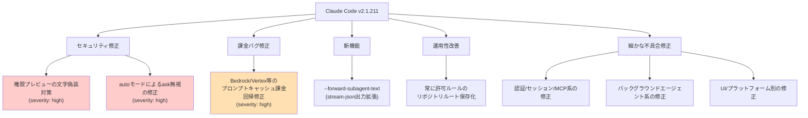
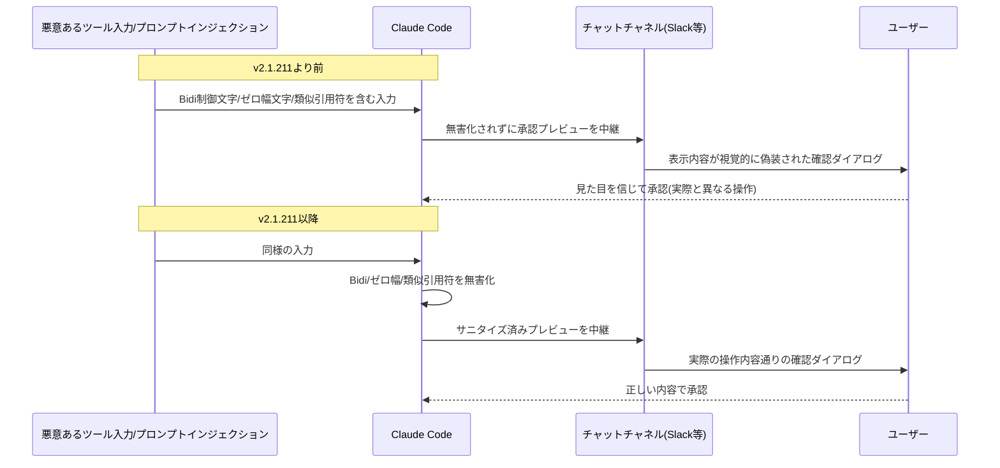
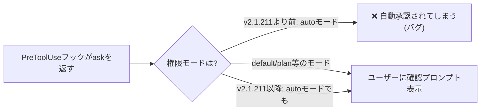
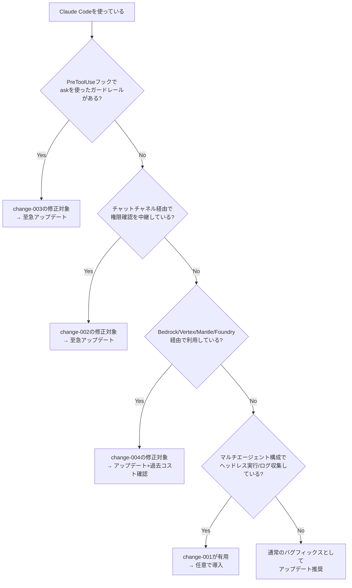

## はじめに

2026年7月にリリースされた **Claude Code v2.1.211** は、新機能追加よりも「安全性」と「正確な課金」を守るための修正が中心の、地味だが重要度の高いリリースです。

特に注目すべきは次の3点です。

- 権限確認ダイアログの表示内容を**文字偽装（Unicode スプーフィング）**で改変できてしまう脆弱性の修正
- `auto` モードが `PreToolUse` フックの `ask` 判定を**無視して自動承認**してしまうバグの修正
- Bedrock / Vertex AI などクラウドプロバイダ経由利用時に、プロンプトキャッシュが効かず**課金が増加**していたバグの修正

これらは「知らないまま使い続けると、意図せずセキュリティホールが空いたまま運用していた」「気づかないうちに余計なコストを払っていた」という類のバグであり、Claude Code をチームやCI/CDに組み込んで運用しているエンジニアほど早期に把握しておくべき内容です。

> **📌 影響を受ける人**
> - フックで危険なコマンドをガードしている運用者
> - Amazon Bedrock / Google Vertex AI / Mantle / Foundry 経由で Claude Code を使っている組織
> - チャットチャネル（Slack連携等）経由で権限確認を中継している構成を使っている人
> - マルチエージェント構成でヘッドレス実行・ログ収集を行っているツール開発者

## 変更の全体像

今回のリリースに含まれる変更を、影響領域ごとに整理すると以下のようになります。



赤系のノードがセキュリティに直結する修正、オレンジがコストに直結する修正です。まずこの2系統から見ていきます。

## 変更内容

### severity 一覧

| ID | 種別 | severity | 対応要否 | 概要 |
|---|---|---|---|---|
| change-002 | bugfix | high | 必須 | 権限プレビューの文字偽装（Bidi/ゼロ幅/類似引用符）対策 |
| change-003 | bugfix | high | 必須 | autoモードがフックのask判定を上書きしてしまう問題 |
| change-004 | bugfix | high | 必須 | Bedrock/Vertex等でのプロンプトキャッシュ課金回帰 |
| change-001 | new_feature | medium | 任意 | `--forward-subagent-text` フラグ追加 |
| change-006 | bugfix | medium | 任意 | 認証・セッション・MCP関連の複数バグ修正 |
| change-007 | bugfix | medium | 任意 | バックグラウンドエージェント/セッション管理の修正 |
| change-005 | improvement | medium | 任意 | 「常に許可」ルールのリポジトリルート保存化 |
| change-008 | bugfix | low | 任意 | Windows/Chrome拡張/アクセシビリティの細かな修正 |
| change-009 | improvement | medium | 任意 | レンダリング性能・エージェント結果報告等の改善 |

### 1. 権限プレビューの文字偽装を無害化（change-002）

Claude Code はツール実行前にユーザーへ承認を求めますが、その確認プレビューをチャットチャネル（Slack連携など）へ中継する構成において、ツール入力に含まれる **Unicode の双方向テキスト制御文字（Bidi override）・ゼロ幅文字・見た目が似た引用符** が無害化されずにそのまま表示されてしまう問題がありました。

これは、悪意あるツール入力やプロンプトインジェクションによって、承認ダイアログの**見た目だけを偽装**し、ユーザーに実際の操作内容と異なる印象を与えて承認させてしまう攻撃経路になり得ます。



> **⚠️ Breaking Change**
> 動作自体の破壊的変更ではありませんが、承認フローの信頼性に直結する修正です。チャット連携で権限確認を運用している場合は、必ずアップデートしてください。

### 2. autoモードがフックの `ask` 判定を上書きする問題（change-003）

`PreToolUse` フックは、危険なコマンドの実行前に `ask`（ユーザーへの確認を要求）を返すことでガードレールとして機能します。しかし非サンドボックスの Bash 実行時、`auto` モードがこの `ask` 判定を無視し、フックが確認を要求しているにもかかわらず**自動的に許可してしまう**バグがありました。

フックを使って「このコマンドだけは必ず人間の目を通す」という運用をしていたチームにとっては、ガードレールが実質的に無効化されていたことになります。



修正後は、権限モードに関わらず、フックが `ask` を返した場合は必ずユーザーへの確認プロンプトが下限として発生するようになりました。

### 3. Bedrock/Vertex等でのプロンプトキャッシュ課金回帰（change-004）

Amazon Bedrock、Google Vertex AI、Mantle、Foundry 経由で Claude Code を利用している環境において、末尾のシステムコンテキストブロックが本来はキャッシュヒットするはずなのに、**毎リクエスト「新規入力トークン」として課金**されてしまう回帰バグがありました。

これはコード自体の挙動不良というより、静かにコストだけが増えるタイプの問題であるため、気づかれにくい点が厄介です。

| 項目 | 修正前(バグあり) | 修正後 |
|---|---|---|
| システムコンテキストのキャッシュ | 毎回フレッシュな入力として課金 | 正しくキャッシュヒットして課金軽減 |
| 対象プラットフォーム | Bedrock / Vertex AI / Mantle / Foundry | 同左（修正済み） |
| 気づき方 | 請求書やコスト監視で事後的に判明しやすい | 通常のキャッシュ挙動に復帰 |

> **💡 Tips**
> 該当プラットフォームを利用している組織は、このバージョンより前の期間の請求・コスト監視ダッシュボードを確認し、想定外のコスト増がなかったか振り返ることを推奨します。

## 影響と対応

対応の要否を判断する簡易フローです。



具体的なアクション:

1. **フック運用者**: `claude update` などで v2.1.211 以降へアップグレードし、`ask` を返すフックが実際に確認プロンプトを出すか動作確認する
2. **チャット連携運用者**: 権限プレビューが偽装されないことを前提にした運用に戻せる。特に外部入力（Web検索結果やファイル内容など）をツールに渡す構成では優先度高
3. **クラウドプロバイダ利用者**: アップデート後、コスト監視ツールでプロンプトキャッシュのヒット率が回復しているか確認する
4. **worktreeを使う並列開発者**: change-005 により「常に許可」ルールがリポジトリルート単位で保存されるようになったため、worktreeごとに権限を分離したい場合は挙動変化に注意

## コード例

### `--forward-subagent-text` の利用例（change-001）

ヘッドレス/プログラマティック利用で、サブエージェントのテキストと thinking を stream-json 出力に含めたい場合、以下のように指定します。

**Before（サブエージェントの出力が可観測性ログに含まれない）**

```bash
claude -p "複数のサブエージェントでリファクタリングして" \
  --output-format stream-json
```

**After（サブエージェントのテキスト・thinkingもstream-jsonに含める）**

```bash
claude -p "複数のサブエージェントでリファクタリングして" \
  --output-format stream-json \
  --forward-subagent-text
```

環境変数でも同様に有効化できます。

```bash
export CLAUDE_CODE_FORWARD_SUBAGENT_TEXT=1
claude -p "複数のサブエージェントでリファクタリングして" --output-format stream-json
```

マルチエージェント構成のオーケストレーションツールを自作している場合、これによりサブエージェント単位のログ収集・可観測性ダッシュボードが構築しやすくなります。

### PreToolUseフックの `ask` 判定（change-003）が保証する挙動

```json
{
  "hookSpecificOutput": {
    "hookEventName": "PreToolUse",
    "permissionDecision": "ask",
    "permissionDecisionReason": "rm を含むコマンドは必ず確認する"
  }
}
```

v2.1.211以降は、`auto` モードで実行していても、上記のようにフックが `ask` を返した場合は必ずユーザーへの確認プロンプトが表示されることが保証されます。危険コマンドのガードレールをフックで組んでいる場合、この保証に依存した設計が可能になります。

## まとめ

Claude Code v2.1.211 は新機能よりも「気づきにくいが重要な」バグフィックスが中心のリリースです。

- **セキュリティ**: 権限プレビューの文字偽装対策、および `auto` モードがフックの `ask` を無視する問題を修正 — フック運用者・チャット連携運用者は優先的にアップデートすべき
- **コスト**: Bedrock/Vertex等でのプロンプトキャッシュ課金回帰を修正 — 該当プラットフォーム利用者は過去のコストも振り返る価値あり
- **新機能**: `--forward-subagent-text` によりマルチエージェント構成の可観測性が向上
- **運用性**: 「常に許可」ルールがリポジトリルート単位で保存されるようになり、worktreeを使った並列開発が快適に

いずれも派手さはありませんが、フックによるガードレールやクラウド経由の課金に依存している組織ほど影響が大きいため、早めのアップデートを推奨します。
