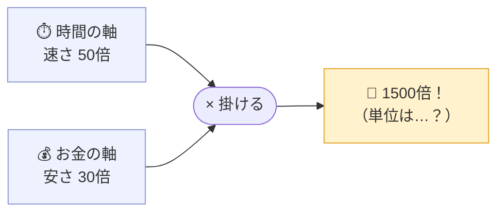

## はじめに

先日、エンジニアtype の人気記事ランキングで1位になっていた記事があります。

> GMO代表・熊谷正寿「2カ月で10万行コード書いた」
> （エンジニアtype, 2026.07.01）

GMOインターネットグループ代表・熊谷正寿さん（62歳）が、Claude Code で2カ月に約10万行のコードを書き、「昔なら5000万円かかった開発が、トークン代3万円で済んだ」と語る内容です。数字のインパクトが強いですね。

---

## その記事は何を語ったのか

主張だけ整理すると…

| 主張 | 記事中の根拠 |
| --- | --- |
| 2カ月で約10万行のコードを書いた | Claude Code の利用統計で「9万7808行」 |
| 作ったのは自分専用の時間管理ポータル | 余命を秒単位で刻む「人生時計」アプリ |
| 誰にも聞かず1人で開発 | 本も YouTube も見ず、社内エンジニアにも未相談 |
| 昔なら5000万円かかった | 「1000行=100万円」× 10万行 = 50人月 |
| 実際のトークン代は3万円 | Claude への2カ月分の支払い |
| 差し引き1500倍の効率 | 「時間効率50倍 × コスト1/30」 |

作ったのは企業の基幹システムではなく、自分専用のツールです。詰まったら画面のスクショを Claude に貼って壁打ちし、GitHub 経由で9台のデバイスを使い分けて1人で仕上げた、という開発の進め方も紹介されています。

---

## まずは、素直に評価したい

- 62歳・非エンジニアの経営トップが、自分の手で作り切った。「AIで開発が変わる」と語る経営者は山ほどいますが、大半は伝聞です。自分でエラーに詰まり、スクショを貼って質問し、一つずつ潰しています。この一次体験の重みは軽くありません。
- 「トップが使ってナンボ」を地で行っている。現場に「AI使え」と号令をかけるだけで自分は触らない経営層が多い中、率先して手を動かす姿勢は、DXが口先で止まっている企業への強い対比になります。
- 参入障壁が下がったことの、生きた証拠。プログラミングと無縁だった人間が2カ月で動くものを作った事実は、それだけで時代の変化を示しています。

---

## 検証：その数字は「本当」か

### 「5000万円」はどこから来た数字か

まず押さえたいのは、5000万円は誰かが出した見積もりではない、という点です。ロジックはこうなっています。

```
昔のSIer相場： 1人月100万円で書けるのは平均1000行
      ↓
「1000行 = 100万円」を業界のザックリ相場と置く
      ↓
10万行 ÷ 1000行 = 50人月 = 5000万円
```

問題は起点の「1人月 = 1000行」です。生産性をかなり低く見積もった前提で、その分だけ旧来開発を割高に描いています。実際の受託開発は、要件定義・設計・レビュー・テスト・ドキュメントを含んだ総工数への価格であって、「1人月で1000行しか書けない＝1000行の価値が100万円」ではありません。

つまり5000万円は、**「AIが安い」を引き立てるために都合よく組んだ試算**であって、実在した見積書ではない。記事本文でも「昔の業界のザックリした相場」とは断ってあるのですが、見出しに躍るのはもちろん、その概算で一番景気のいい数字のほうです。

### 「10万行」は成果の量か

エンジニアには耳タコの論点ですが、コード行数（LOC）は成果の量ではありません。

- AIが生成したコードには、書いては消し、リファクタで置き換えた分も累積で乗ります。「純増10万行の完成品」ではなく「Claude Code が延べ10万行を触った」に近い。
- 同じ機能を10万行で書くか2万行で書くかは実装しだいで、行数が多いほど良いわけでもありません（むしろ逆のほうが多い）。
- 対象は個人用の時間管理アプリ。仕様の合意・他者との整合・長期保守を背負う企業システムの10万行とは、1行の重みが違います。

「10万行」は迫力のある数字ですが、成果の大きさを測る物差しとしては心もとない。そもそもコードレビューで「今週◯行書きました」が褒め言葉になった試しはありません。額面で受け取ると、話全体が一段ぶん過大評価に振れます。

### 3万円と5000万円は、同じ土俵の比較か

これが一番大きい。両者は含んでいるものが違います。いわゆる「りんごとみかん」の比較です。

| | 5000万円（旧来） | 3万円（今回） |
| --- | --- | --- |
| 含むもの | 要件定義・設計・実装・テスト・保守・保証・PM | Claude のトークン代のみ |
| 人件費 | プロの50人月 | 本人の2カ月分の工数は未計上 |
| その他 | — | 9台のデバイス・各種サブスク等は別 |

5000万円が「他人に発注してフルセットで作ってもらう総額」なのに対し、3万円は「自分で作ったときのAPI利用料だけ」。**経営TOP自身が2カ月投じた時間はコストに入っていません。** 土俵を揃えて本人工数を足せば、「1500倍」はかなり縮みます。

### 「50倍 × 1/30 = 1500倍」をどう受け取るか

締めの「1500倍」。これは時間効率（50倍）とコスト削減（1/30）という、そもそも単位の違う2つの軸を掛け合わせた数字です。



時間とお金という別種のメーターを掛けて出た「1500倍」に物理的な意味はなく、正体は桁を大きく見せる演出です。「速くなった（50倍）」「安くなった（30倍）」と別々に言えば十分伝わるところを、わざわざ掛けて4桁に育てています。このひと手間に、記事のトーンがよく出ています。

---

## 注意しておきたい：「一部機能を公開した」の死角

記事にはさらっと、こんな一節があります。

> なんなら、一部の機能はもう一般向けにアプリとしてストア公開までしちゃってます。

10万行や5000万円の陰でスルーされがちですが、エンジニアとしていちばん眉が動くのは、正直この一文です。

まず線引きから。自分専用の非公開アプリなら、テストが無くても何も問題ありません。使うのは自分だけ、壊れて困るのも自分だけ。むしろ趣味の範囲で過剰にテストを書くのは KISS/YAGNI に反します。「AIと壁打ちしながら動くものを作る」いわゆるバイブコーディングは、この領域とは最高に相性がいい。

問題は、それを公開して他人に使わせた瞬間に、責任の次元が変わることです。

- 自動テストが無いと、回帰を検知できません。AIに次の修正を頼んだとき、別の場所が静かに壊れても気づけない。
- セキュリティ。入力バリデーション、XSS、認証・認可、依存ライブラリの脆弱性。「動く」と「攻撃に耐える」は別物です。
- 個人情報を扱うなら、保管と漏洩のリスク。ユーザーのデータを預かる時点で、法的・倫理的な責任が発生します。
- 保守。作った本人しか構造を知らず、しかもその構造をAIが書いたとなると、半年後に誰が直すのか。

「動いているから大丈夫」と「安全に他人へ提供できる」の間には、はっきりした一線があります。

**非エンジニアがAIで作れる時代の落とし穴は、この一線が見えにくいこと**です。挑戦そのものを否定する気はありませんが、記事を読んで「自分も公開してみよう」と思った人には、ここだけ強調しておきたい。

---

## で、結局「本当」なのか

「5000万円 → 3万円 → 1500倍」は、額面どおりには受け取らないほうがいい。5000万円は後付けの概算、10万行は成果の量ではなく、比べている土俵も揃っていない。ここまで見てきたとおりです。

とはいえ、方向性まで否定する気はありません。個人がAIで、以前なら外注していたレベルのものを作れるようになった。コスト構造が根底から変わった。ここは誇張抜きに正しい。

特に、記事本文の「ただコードを書くだけのコーダーという役割は終わった」という指摘は、過去に私自身も同じ趣旨の記事を書いています。価値の重心が「書く」から「何を作るべきか見極めて、安全に届ける」へ移りつつある。

数字は演出込みで割り引く。でも、その奥にある変化からは目を逸らさない。この両立ができる人が、たぶんこの時代を一番活かせます。

皮肉なもので、AIで誰でも作れるようになったからこそ、テスト・セキュリティ・保守という「公開の作法」を持つ人間の価値は、むしろ上がっています。「5000万円が3万円に」を読んで震え上がる必要はありません。自分がその3万円の外側で出している価値は何か。それを確かめる機会にすればいい話です。

---

*出典：エンジニアtype「GMO代表・熊谷正寿『2カ月で10万行コード書いた』トップ自ら“使ってなんぼ”を地で行く理由」（2026.07.01） https://type.jp/et/feature/31346/*

---

## オチ

絵文字付き Mermaid 辺りでピンと来た人もいるでしょうが、以上の内容は、全て Claude（＋技術記事作成向け自作SKILL）が書きました(笑) 

別視点から記事を書かせてみても、面白いかも？…というわけで、Claude自身に自分の書いた記事を批評＆修正してもらった結果が[こちら](https://qiita.com/fallout/items/31536a13a0596013e987)です。
