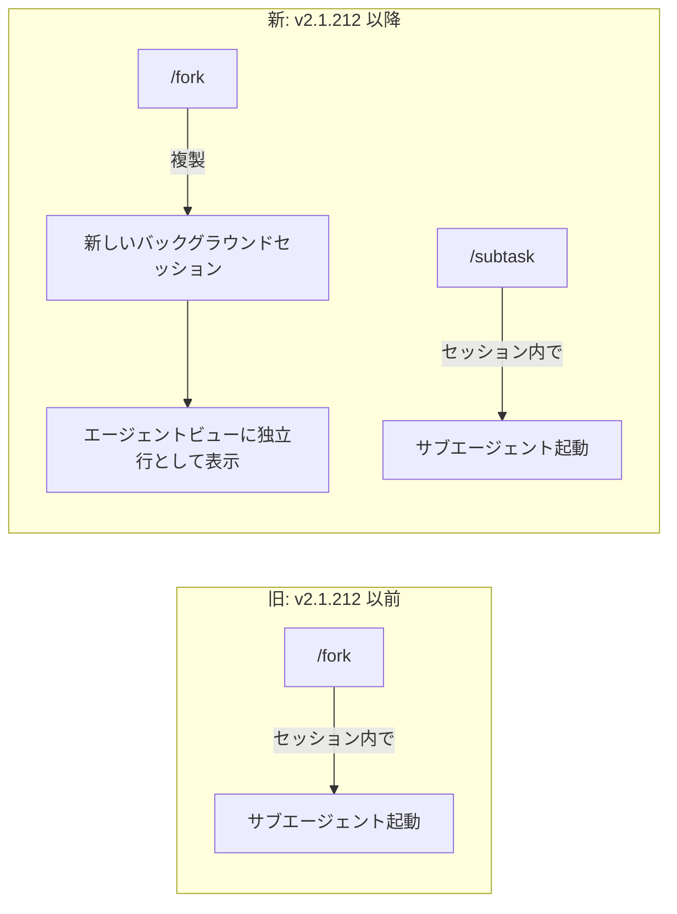
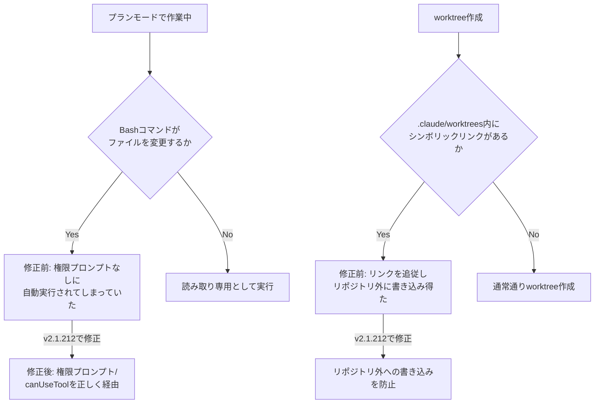

## はじめに

2026年7月17日、Claude Code の v2.1.212 がリリースされました。今回は単なる小粒アップデートではなく、**日常的に使っている `/fork` コマンドの挙動が根本から変わる**大型リリースです。加えて、プランモードの権限モデルを迂回してしまう **critical severity のセキュリティ修正**、worktree 経由でリポジトリ外に書き込みが起きうる **high severity の修正**も含まれています。

Claude Code を CI/CD やマルチエージェント運用に組み込んでいる人、`/fork` や Task ツールの `mode` パラメータを使い込んでいる人ほど影響が大きいリリースです。本記事では公式リリースノート(v2.1.212)の内容をもとに、何が変わり、何をすべきかを整理します。

> **📌 影響を受ける人**
> - `/fork` を使ってサブエージェントを起動するワークフローを組んでいる人
> - Claude Agent SDK で `canUseTool` によるカスタム権限制御を実装している人
> - Task ツールの `mode` パラメータでサブエージェントの権限を個別制御している人
> - 信頼できないリポジトリ(OSS など)を Claude Code で扱う人
> - WebSearch やサブエージェントを多用する自動化パイプラインを運用している人

## 変更の全体像

`/fork` の役割分担がどう変わったかを図示します。



続いて、今回の critical / high な修正2件がどこに効いているかを整理します。



## 変更内容

今回のリリースのうち、影響度が高い項目を中心に整理します。

| 種別 | 変更内容 | Severity | 対応要否 |
|---|---|---|---|
| 新機能 | `/fork` がバックグラウンドセッション複製に変更、従来機能は `/subtask` へ | high | ✅ 要対応 |
| 新機能 | WebSearch(既定200回)・サブエージェント生成(既定200体)にセッション上限を追加 | medium | 環境変数で調整可 |
| 新機能 | 2分超のMCPツール呼び出しを自動バックグラウンド化 | medium | 同期前提のスクリプトは要確認 |
| 修正(critical) | プランモードがファイル変更Bashコマンドを無許可実行する不具合を修正 | **critical** | ✅ **即時アップデート推奨** |
| 修正(security) | worktree作成時にシンボリックリンクを追従しリポジトリ外へ書き込みうる不具合を修正 | high | ✅ **即時アップデート推奨** |
| 非推奨化 | Taskツールの `mode` パラメータを非推奨化(現在は無視される) | medium | ✅ 要対応 |
| 改善 | プロンプトキャッシュがLLMゲートウェイ(Bedrock/Vertex/1P)経由でも機能、エージェント間メッセージングのトークン削減 | medium | 特になし(恩恵のみ) |
| 修正 | OpenTelemetryエクスポートの互換性・trace_id/span_id欠落を修正 | medium | OTel監視組織は要確認 |

## 影響と対応

> **⚠️ Breaking Change**
> `/fork` のセマンティクスが変わりました。従来「セッション内でサブエージェントを起動する」目的で `/fork` を使っていた場合、v2.1.212以降は挙動が変わり、**新しいバックグラウンドセッションが複製される**ようになります。同じ目的を継続したい場合は `/subtask` に切り替えてください。

対応が必要な項目を優先度順に挙げます。

1. **最優先: アップデート**
   プランモードの権限バイパス(change-005)と worktree のシンボリックリンク追従(change-006)はいずれもセキュリティに関わる修正です。特に SDK 経由で `canUseTool` によるカスタム権限制御を実装しているアプリケーション、および信頼できない/OSSリポジトリを扱う環境では速やかに v2.1.212 へアップデートしてください。

2. **ワークフローの呼び分け見直し**
   `/fork` をセッション内サブエージェント起動の目的で使っていたスクリプトやドキュメントがあれば `/subtask` に置き換えます。エージェントビューでの複製管理に慣れておくと移行がスムーズです。

3. **Task ツールの `mode` パラメータ依存を削除**
   SDK やカスタムエージェント定義で `mode` を指定していても、v2.1.212以降は無視されます。サブエージェントは常に親セッションの権限モードを継承する前提で設計を見直してください。

4. **セッション上限の環境変数を確認**
   大量の WebSearch や委譲を行う自動化パイプラインでは、既定値(WebSearch 200回、サブエージェント200体)を超える可能性があります。必要に応じて `CLAUDE_CODE_MAX_WEB_SEARCHES_PER_SESSION` / `CLAUDE_CODE_MAX_SUBAGENTS_PER_SESSION` を調整してください。

5. **長時間MCPツールの同期前提を見直す**
   2分を超えるMCPツール呼び出しは自動的にバックグラウンド化されます。同期完了を前提にしたスクリプトがあれば `CLAUDE_CODE_MCP_AUTO_BACKGROUND_MS` の設定も含めて動作確認をしてください。

> **💡 Tips**
> セッション上限やMCP自動バックグラウンド化の閾値は、それぞれ専用の環境変数で調整・無効化できます。まずはデフォルト値のまま運用し、実際に上限に引っかかったログが出てから調整するのがおすすめです。

## コード例

### `/fork` → `/subtask` への置き換え

```bash
# Before (v2.1.212より前): セッション内でサブエージェントを起動する目的で使用
/fork "このモジュールのリファクタリングを検討して"

# After (v2.1.212以降): 同じ目的なら /subtask を使う
/subtask "このモジュールのリファクタリングを検討して"

# /fork は「バックグラウンドセッションへの複製」専用になった
/fork
# → 元のセッションは継続、複製セッションは `claude agents` の一覧に独立行として表示
```

### Task ツールの `mode` パラメータ

```jsonc
// Before: mode でサブエージェントの権限を個別制御していた(SDK / カスタムエージェント定義)
{
  "tool": "Task",
  "input": {
    "description": "コードレビューを実行",
    "prompt": "...",
    "mode": "readOnly"  // v2.1.212以降は無視される
  }
}

// After: mode 指定を削除し、親セッションの権限モード継承を前提にする
{
  "tool": "Task",
  "input": {
    "description": "コードレビューを実行",
    "prompt": "..."
  }
}
```

### セッション上限の調整(環境変数)

```bash
# WebSearch呼び出し上限を既定の200回から500回に引き上げ
export CLAUDE_CODE_MAX_WEB_SEARCHES_PER_SESSION=500

# サブエージェント生成上限を既定の200体から100体に引き下げ
export CLAUDE_CODE_MAX_SUBAGENTS_PER_SESSION=100

# MCPツールの自動バックグラウンド化しきい値を5分に変更(既定は2分)
export CLAUDE_CODE_MCP_AUTO_BACKGROUND_MS=300000
```

## まとめ

Claude Code v2.1.212 は、運用性を高める新機能と、見過ごせないセキュリティ修正が同居した大型リリースです。

- **`/fork` はバックグラウンドセッション複製専用に変更**。セッション内サブエージェント起動は `/subtask` へ移行が必要
- **プランモードの権限バイパス**と**worktreeのシンボリックリンク経由の書き込み問題**はいずれもセキュリティ関連の重要修正であり、早期アップデートを強く推奨
- **Taskツールの `mode` パラメータは非推奨化**され、サブエージェントは親セッションの権限モードを継承する設計に統一される
- WebSearch・サブエージェント生成のセッション上限、MCPツールの自動バックグラウンド化など、暴走防止・操作性向上の仕組みも追加

特にSDKでカスタム権限制御を実装している開発者、`/fork` を使い込んだ自動化フローを持つチームは、今回のリリースノートを一読した上でのアップデートをおすすめします。
