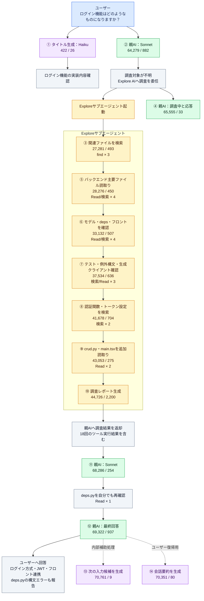
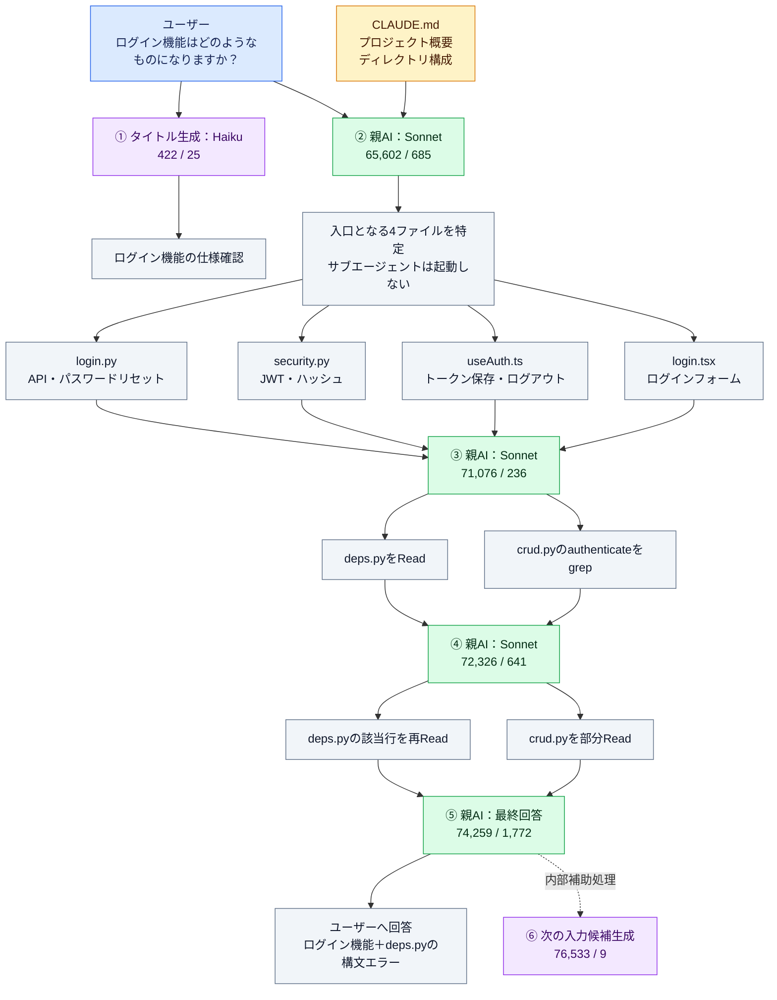
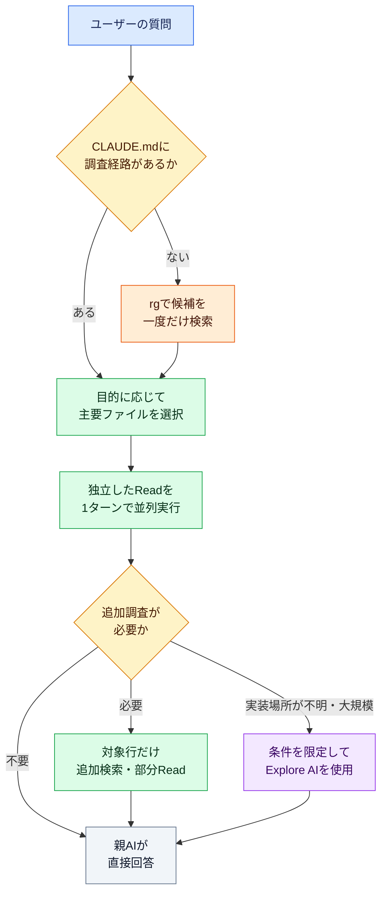

# 目的

Claude Codeを使っていると、プロジェクトの構成や作業ルールを`CLAUDE.md`に書くことがあります。

主な目的の一つに、`CLAUDE.md`に主要ファイルが書かれていれば、Claudeがリポジトリ内を手探りで探索する必要がなくなるというものがあります。
ファイル探索やサブエージェントの起動を省略できるなら、最終的なトークン消費は減るかもしれません。

そこで今回は、これが**トークン消費の観点でどれくらい効くのか**を実際に検証したいと思います。

内容としては、同じリポジトリに対して

```
ログイン機能はどのようなものになりますか？
```

と質問し、以下の2パターンでClaude Codeからモデルへ送られたリクエスト・レスポンスを比較しました。

- `CLAUDE.md`を作成する前
- `CLAUDE.md`を作成した後

本記事では、単純なトークン数の比較だけでなく、**Claudeがどのファイルを読み、どのツールを使い、なぜ呼び出し回数に差が出たのか**まで実ログから追いかけます。

# 前提

- WSL2（Ubuntu）環境
- Claude Code をリバースプロキシ経由で Amazon Bedrock（`jp.anthropic.*` プロファイル）に接続
- モデルは`claude-sonnet-5`を使用
- 調査対象のリポジトリは [full-stack-fastapi-template](https://github.com/fastapi/full-stack-fastapi-template)（FastAPI + React のフルスタックテンプレート）

:::note warn
今回の2回は、完全に条件を固定したベンチマークではありません。

そのため「`CLAUDE.md`を置けば常に同じ割合で削減できる」という結果ではなく、**今回の実行ログで何が起きたかを分析したケーススタディ**としてお読みください。
:::

# 検証に使用した`CLAUDE.md`

今回作成した`CLAUDE.md`は以下となります。
内容は主に、リポジトリの概要と主要ファイルの役割です。

```markdown:CLAUDE.md
# CLAUDE.md

このファイルは、Claude Code (claude.ai/code) がこのリポジトリでコードを扱う際のガイダンスを提供します。

## リポジトリの概要

FastAPI（バックエンド）+ React（フロントエンド）+ PostgreSQLによるフルスタックのWebアプリケーションテンプレート。認証・ユーザー管理・アイテムのCRUDを備えたサンプル実装が既に動く状態で入っている。Docker Composeで開発・本番両方の起動が可能。

## ディレクトリ構成

- `backend/app/api/routes/login.py` — ログイン（アクセストークン発行）・パスワード再設定のエンドポイント。
- `backend/app/api/routes/users.py` — ユーザー登録・取得・更新・削除のエンドポイント。
- `backend/app/api/routes/items.py` — アイテム（サンプルのビジネスロジック）のCRUDエンドポイント。
- `backend/app/core/security.py` — パスワードハッシュ化、JWTアクセストークンの生成・検証。
- `backend/app/core/config.py` — 環境変数・設定値の定義。
- `backend/app/crud.py` — ユーザー/アイテムに対するDB操作（`authenticate`、`get_user_by_email`など）。
- `backend/app/models.py` — SQLModelで定義されたDBモデル・入出力スキーマ（User, Item, Tokenなど）。
- `backend/tests/api/routes/` — バックエンドAPIの単体・結合テスト（`test_login.py`など機能ごとに分割）。
- `frontend/src/routes/login.tsx`, `signup.tsx`, `recover-password.tsx`, `reset-password.tsx` — 認証関連のページ。
- `frontend/src/hooks/useAuth.ts` — フロントエンドの認証状態管理・ログイン/ログアウト処理。
- `frontend/src/client/` — OpenAPIスキーマから自動生成されたAPIクライアント。
- `frontend/tests/login.spec.ts`, `sign-up.spec.ts`, `reset-password.spec.ts` — PlaywrightによるE2Eテスト（機能ごとに分割）。
- `compose.yml` / `compose.override.yml` / `compose.traefik.yml` — Docker Composeによる開発・本番構成。
- `development.md` / `deployment.md` — 開発環境の立て方・デプロイ手順。

```

この`CLAUDE.md`は24行、1,297文字です。

:::note info
特定の質問に対する答えを先に教えるような条件にしないため、「ログイン機能を説明するときはこの5ファイルを見る」といったタスク固有の参照指示は入れていません。

検証するのは、あくまでプロジェクト概要とディレクトリ構成だけで、Claudeの探索経路がどのように変わるかです。
:::

# まずは全ログのトークン数の比較
まずは「`CLAUDE.md`なし」の場合です。
全部で14ステップのモデル実行が走りました。


<details><summary>CLAUDE.mdなし レスポンス</summary>

```
ログイン機能の実装を確認するため、リポジトリを調べます。

● Explore(Explore login/auth implementation)
Backgrounded agent (↓ to manage · ctrl+o to expand)

ログイン機能の実装を調査中です。結果が出たらまとめてお伝えします。

✻ Waiting for 1 background agent to finish

● Agent "Explore login/auth implementation" finished · 59s

このテンプレートの現状のログイン機能を調査した結果をまとめます。ただし一点、深刻な指摘（構文エラー）があったので実物を確認します。

  Read 1 file

調査完了しました。現状のコードベースにあるログイン機能は以下のような構成です。

全体の流れ

1. フロントエンド (/login ページ, frontend/src/routes/login.tsx)
  - メールアドレス（usernameとして送信）とパスワード（8文字以上）を入力
  - react-hook-form + zod でバリデーション
  - 「パスワードを忘れた場合」（/recover-password）や「サインアップ」へのリンクあり
2. バックエンド API (backend/app/api/routes/login.py)
  - POST /login/access-token — OAuth2パスワードフローで認証し、JWTを返す
  - POST /login/test-token — トークンの有効性確認
  - POST /password-recovery/{email} → メールでリセットトークン送信
  - POST /reset-password/ → トークンを検証してパスワード更新
3. JWT発行 (backend/app/core/security.py)
  - HS256アルゴリズム、SECRET_KEYで署名
  - 有効期限は8日間（ACCESS_TOKEN_EXPIRE_MINUTES = 60*24*8）
  - パスワードは Argon2（旧データはBcryptからの自動移行あり）
4. トークン保存・利用 (フロントエンド useAuth.ts, main.tsx)
  - 取得したJWTを localStorage["access_token"] に保存
  - 以降のAPIリクエストには自動で Authorization: Bearer <token> ヘッダーが付与される
  - 401/403が返るとログアウトして /login にリダイレクト
5. 保護ルート (backend/app/api/deps.py)
  - get_current_user がJWTをデコード・検証してユーザーをロード
  - is_active / is_superuser のチェックあり

⚠️ 見つかった不具合

backend/app/api/deps.py:36 に以下の記述があります。

except InvalidTokenError, ValidationError:

これは Python 2 時代の書き方で、Python 3 では構文エラーになります（正しくは except (InvalidTokenError, ValidationError):）。このままではモジュールのimport自体が失敗し、認証機能全体が動作しません。修正が必要であれば対応します。
```
</details>


次に`CLAUDE.md`ありでは、全部で6ステップのモデル実行が走りました。


<details><summary>CLAUDE.mdあり レスポンス</summary>

```
ログイン機能の実装を確認するため、関連ファイルを読みます。

  Searched for 1 pattern, read 6 files, ran 1 shell command

ログイン機能はバックエンド（FastAPI + JWT）とフロントエンド（React + TanStack Router）で以下のように実装されています。

バックエンド

認証フロー (backend/app/api/routes/login.py)
- POST /login/access-token:OAuth2のusername/passwordフォームでメール・パスワードを受け取り、crud.authenticate()で検証。成功すればJWTアクセストークン（Token）を返す。
- POST /login/test-token: トークンの有効性チェック用。

パスワード検証 (backend/app/crud.py)
- authenticate()はユーザーが存在しない場合でもDUMMY_HASHとの比較を行い、タイミング攻撃（メール存在の推測）を防止。
- ハッシュ化はpwdlibでArgon2（推奨）とBcrypt（旧ハッシュ互換）の二段構成。ログイン時にBcryptハッシュならArgon2へ自動移行する。

JWT発行・検証 (backend/app/core/security.py, backend/app
- create_access_token()でHS256署名のJWTを発行（sub=ユーザーID、有効期限あり）。
- get_current_user()がAuthorization: Bearerヘッダーのト を取得、is_activeをチェック。

パスワード再設定
- /password-recovery/{email}→ メール存在有無に関わらず同じレスポンスを返し、存在する場合のみリセットメール送信。
- /reset-password/→ トークン検証後にパスワード更新。

フロントエンド

- /loginルート (frontend/src/routes/login.tsx): React Hook Form +
Zodでメール形式・8文字以上のパスワードを検証。既にログイ
- useAuthフック (frontend/src/hooks/useAuth.ts):
ログイン成功時にアクセストークンをlocalStorageに保存し、削除して/loginへ。
- APIクライアントはOpenAPIスキーマから自動生成（LoginServiceなど）。

---
⚠️ 重要な指摘: backend/app/api/deps.py:36に構文エラーが
あ
except InvalidTokenError, ValidationError:

これはPython 2の書き方で、Python 3ではSyntaxErrorになります。正しくは：

except (InvalidTokenError, ValidationError):

この行はトークン検証（get_current_user）の中にあり、認証 コードパスです。現状だとapp/api/deps.pyのimport自体が失敗し、バックエンドが起動しない可能性があります。修正しますか？
```
</details>

保存されたすべてのレスポンスについて、`usage`を合計しました。

| 条件 | API呼び出し数 | 入力トークン | 出力トークン | 合計 |
| --- | ---: | ---: | ---: | ---: |
| `CLAUDE.md`なし | 14回 | 664,656 | 7,486 | 672,142 |
| `CLAUDE.md`あり | 6回 | 360,218 | 3,368 | 363,586 |
| **削減量** | **8回** | **304,438** | **4,118** | **308,556** |
| **削減率** | **57.1%** | **45.8%** | **55.0%** | **45.9%** |

`CLAUDE.md`あり側は、入力トークンがなし側の約54.2%、出力トークンが約45.0%まで減っています。合計では約54.1%です。

ただし、この14回・6回という数字には、ユーザーへの本回答以外の内部処理も含まれています。

- 会話タイトルの生成
- 次にユーザーが入力しそうな文の生成
- ユーザーが戻ってきたときの会話要約

そこで、これらを除いて「ログイン機能を調査して回答する処理」だけを集計してみます。

| 条件 | API呼び出し数 | 入力トークン | 出力トークン | 合計 |
| --- | ---: | ---: | ---: | ---: |
| `CLAUDE.md`なし | 11回 | 523,122 | 7,371 | 530,493 |
| `CLAUDE.md`あり | 4回 | 283,263 | 3,334 | 286,597 |
| **削減率** | **63.6%** | **45.9%** | **54.8%** | **46.0%** |

本回答に必要な処理だけで見ても、入力は約45.9%、合計は約46.0%削減されました。

# `CLAUDE.md`なしでは何が起きていたのか

`CLAUDE.md`なし側の処理を、役割ごとに分けると次のようになります。

| 処理 | 呼び出し数 | 入力トークン | 出力トークン |
| --- | ---: | ---: | ---: |
| タイトル生成 | 1 | 422 | 26 |
| 親AIの調査・回答 | 4 | 267,442 | 2,106 |
| サブエージェント（Explore AI） | 7 | 255,680 | 5,265 |
| 次の入力候補生成 | 1 | 70,761 | 9 |
| 復帰時の要約生成 | 1 | 70,351 | 80 |
| **合計** | **14** | **664,656** | **7,486** |

フロー図で表すとこんな感じ。



最初の親AIは、ログイン機能がどこにあるかを自分で調べず、`Agent`ツールから**Exploreサブエージェント**を起動しました。

:::note info
Explore AIとは

Explore AIは、Claude Codeに組み込まれている読み取り専用のサブエージェントです。ファイルの場所を探したり、コード中のシンボルを検索したりする役割を持ちます。
:::


# `CLAUDE.md`ありでは何が起きていたのか

`CLAUDE.md`あり側では、ディレクトリ構成を入口にして、実コードの依存関係をたどる3段階の調査になりました。

| 処理 | 呼び出し数 | 入力トークン | 出力トークン |
| --- | ---: | ---: | ---: |
| タイトル生成 | 1 | 422 | 25 |
| 直接調査・回答 | 4 | 283,263 | 3,334 |
| 次の入力候補生成 | 1 | 76,533 | 9 |
| **合計** | **6** | **360,218** | **3,368** |

Claudeは`CLAUDE.md`のディレクトリ構成から直接関係すると判断した、次の4ファイルを最初の応答で並列に読みました。

- `backend/app/api/routes/login.py`
- `backend/app/core/security.py`
- `frontend/src/hooks/useAuth.ts`
- `frontend/src/routes/login.tsx`

その後、`login.py`のimportと関数呼び出しを手掛かりに、次の2ファイルへ調査を広げています。

- `backend/app/api/deps.py`
- `backend/app/crud.py`

`deps.py`はファイル全体を読んだ後、構文エラーが疑われる該当行を再度部分読取りしています。`crud.py`も最初に`authenticate()`周辺を`grep`し、その後に先頭65行を読みました。

フロー図で表すとこんな感じ。



Explore AIと`find`は使われていません。ツール実行は`Read`が7回、`grep`が1回の合計8回です。
内容を確認したユニークファイルは6ファイルでした。

# `CLAUDE.md`自体はトークンを増やしている

ここで注意したいのは、`CLAUDE.md`の内容は都度モデルに渡されていることです。

最初のSonnet呼び出しだけを比較すると、`CLAUDE.md`あり側の入力は増えています。

| 条件 | 最初の入力トークン |
| --- | ---: |
| `CLAUDE.md`なし | 64,279 |
| `CLAUDE.md`あり | 65,602 |
| **差分** | **+1,323** |

最初の呼び出しだけなら、`CLAUDE.md`あり側の方が約2.1%多い結果です。

:::note warn
この差分1,323トークンを、すべて`CLAUDE.md`のコストとは断定できません。利用可能なツール数も、なし側36個、あり側37個と1個異なっていました。
:::

しかし、ここまで検証した結果、`CLAUDE.md`は **後続の探索コストを削減するためのインデックス**として機能し、トークン消費につながっていることが分かります。

つまり、`CLAUDE.md`はAIが仕事をするにあたって必要な情報を簡潔にまとめておくことで、増えるトークン数以上の働きをしてくれます。

# 実際に確認したファイルはどう変わったか

コードの内容まで確認したユニークファイル数は、なし側が11ファイル、あり側が6ファイルでした。

| ファイル | なし | あり |
| --- | :---: | :---: |
| `backend/app/api/routes/login.py` | `Read` | `Read` |
| `backend/app/core/security.py` | `Read` | `Read` |
| `backend/app/crud.py` | `grep＋部分Read` | `grep＋部分Read` |
| `frontend/src/hooks/useAuth.ts` | `Read` | `Read` |
| `frontend/src/routes/login.tsx` | `Read` | `Read` |
| `backend/app/core/config.py` | `Read` | ― |
| `backend/app/models.py` | `grep` | ― |
| `backend/app/api/deps.py` | `Read`×2＋`grep` | `Read`×2 |
| `backend/tests/api/routes/test_login.py` | `Read` | ― |
| `frontend/src/main.tsx` | `grep＋部分Read` | ― |
| `frontend/src/client/core/OpenAPI.ts` | `grep` | ― |

なし側では、さらに次のファイル名も`find`で列挙しています。ただし、内容までは読んでいません。

- `frontend/src/components/Common/AuthLayout.tsx`
- `frontend/src/routes/recover-password.tsx`
- `frontend/src/routes/reset-password.tsx`
- `frontend/src/client/`配下の生成ファイル
- `backend/tests/utils/user.py`
- `backend/tests/crud/test_user.py`
- `backend/tests/api/routes/test_users.py`

:::note info
`CLAUDE.md`あり側では、`CLAUDE.md`を`Read`ツールで開いたわけではありません。
Claude Codeのハーネスが内容を自動取得し、`system-reminder`としてモデルの入力に埋め込んでいます。
:::

ツールごとに固定のトークン数があるわけではなく、影響量は、コマンドの長さ、検索結果数、ファイルサイズによって変わりますが、
各コマンドの結果サイズでは、概ね次の順になるはずです。

```text
find < grep < Read
```

`Read`が多い `CLAUDE.md なし` は必然的に消費トークン数も多くなりますね。。。

ただし、本当に大きな要因はツール結果のサイズだけではありません。

# 最大の要因は「モデルとの往復回数」だった

Explore AIの入力トークンは、ツール実行が進むにつれて次のように増えました。

```text
27,281
  ↓ findの結果を追加
28,276
  ↓ find + Readの結果を追加
33,132
  ↓ grep + Readの結果を追加
37,534
  ↓ grep + find + Readの結果を追加
41,678
  ↓ grepの結果を追加
43,053
  ↓ Readの結果を追加
44,726
```

毎回、新しい結果だけが送られるわけではありません。それまでの会話、システム指示、ツール定義、過去のツール呼び出し、過去の実行結果が再び入力に含まれます。

最初の入力27,281トークンを7回繰り返すだけでも、次の量になります。

```text
27,281 × 7 = 190,967トークン
```

実際のExplore AIの入力合計は255,680トークンでした。

| 要因 | 入力トークン |
| --- | ---: |
| 基本コンテキストを7回送信 | 190,967 |
| ツール呼び出し・結果の蓄積 | 64,713 |
| **合計** | **255,680** |

:::note warn
ツールを使うたびに次のモデル呼び出しが必要になり、巨大な基本コンテキストが再送されてしまいます。
:::


## 4つの`Read`を並列実行した効果と追加調査

`CLAUDE.md`あり側では、入口となる4ファイルを1ファイルずつ読まず、1回のモデル応答で4つの`Read`を並列に発行しました。

```text
モデル呼び出し
  ↓
Read × 4を並列実行
  ↓
4ファイルの結果をまとめて受信
  ↓
deps.pyとcrud.pyを追加調査
  ↓
問題箇所を再確認して最終回答
```

最初の4ファイルを1ターンにまとめた点は効率的でした。
一方、依存先の確認と問題箇所の再確認が必要になったため、本回答までのモデル呼び出しは合計4回になっています。

本回答処理の最初の入力65,602トークンを4回分並べると262,408トークンです。実際の入力283,263トークンとの差20,855トークンが、ツール呼び出しと結果の蓄積分です。

| 要因 | 入力トークン |
| --- | ---: |
| 基本コンテキストを4回送信 | 262,408 |
| ツール呼び出し・結果の蓄積 | 20,855 |
| **合計** | **283,263** |

独立したファイルは同じターンでまとめつつ、依存先の追加確認は対象行を絞ることが重要です。

# キャッシュをどう見るか

`prompt_tokens`には、プロンプトキャッシュから読み取られたトークンも含まれています。

| 条件 | キャッシュ読取り | キャッシュ作成 | その他の入力 | 入力合計 |
| --- | ---: | ---: | ---: | ---: |
| `CLAUDE.md`なし | 574,236 | 69,042 | 21,378 | 664,656 |
| `CLAUDE.md`あり | 273,970 | 76,029 | 10,219 | 360,218 |

なし側はモデル呼び出しが多いため、同じシステムプロンプトやツール定義を何度もキャッシュから読んでいます。入力の86.4%がキャッシュ読取りでした。

したがって、今回の「入力45.8%削減」を、そのまま「料金45.8%削減」と考えることはできません。
通常入力、キャッシュ作成、キャッシュ読取りでは料金体系が異なるためです。

一方、raw token数はレイテンシやコンテキスト量の把握に使えるので、呼び出し経路を比較する指標としては有効です。

## 調査結果に差はあったか

`CLAUDE.md`なし側は11ファイル、あり側は6ファイルを確認しましたが、ログイン機能の説明内容に大きな差はありませんでした。

また、両方とも`backend/app/api/deps.py:36`の構文エラーを発見しています。今回の質問に対しては、`CLAUDE.md`あり側が調査対象を絞ったことで重要な情報を見逃したとは確認できませんでした。

つまり今回は、確認ファイルとトークン消費を減らしながら、主要な回答内容を維持できた結果となります。

# トークン消費を抑えるための対策

今回の結果から、効果が大きい順に整理します。
ただし、過剰に対策を行うと逆にAIの動きを制限しすぎてしまうため、
**「トークン効率と調査品質のトレードオフ」** ということに注意してください。

## 1. モデルとツールの往復回数を減らす

最も効果が大きい対策です。

```text
避けたい
検索 → 判断 → Read → 判断 → Read → 判断 → Read

推奨
対象を一度決める → 必要なReadをまとめて実行 → 回答
```

1回あたりの結果を数百トークン削るより、モデル呼び出しを1回減らす方が大きく効く場合があります。

## 2. `CLAUDE.md`をリポジトリの索引として使う

実装の詳細をすべて書くのではなく、次の情報を短く記載します。

- プロジェクトの概要
- 主要ディレクトリ
- 機能ごとの入口ファイル
- 関連するバックエンド・フロントエンド・テスト
- 調査目的ごとの参照範囲
- やってはいけない探索や不要なサブエージェント起動

今回の検証では、タスク固有の参照指示を書かなくても、次のような役割付きディレクトリ一覧だけで探索経路が短くなりました。

```markdown:CLAUDE.md
## ディレクトリ構成

- `backend/app/api/routes/login.py` — ログイン・パスワード再設定API。
- `backend/app/core/security.py` — JWT生成とパスワードハッシュ。
- `backend/app/crud.py` — `authenticate`などのDB操作。
- `backend/tests/api/routes/` — APIテスト。
- `frontend/src/routes/` — 画面単位のルート。
- `frontend/src/hooks/useAuth.ts` — ログイン・ログアウト処理。
```

特定の質問に対して「このファイルを読め」と答えを埋め込むのではなく、各ディレクトリや主要ファイルの役割を索引として書くのがポイントです。

## 3. 独立したツール呼び出しを並列化する

読むべきファイルが決まっているなら、1つずつではなく同じ応答でまとめて`Read`します。

```text
避けたい
Read A → モデル → Read B → モデル → Read C

推奨
Read A・B・Cを並列実行 → モデル
```

## 4. サブエージェントを条件付きで使う

次の場合は、親AIが直接調査した方が効率的です。

- 主要ファイルが`CLAUDE.md`に書かれている
- 読むべきファイルが数個程度
- 一度の並列`Read`で調査できる
- 単一機能の概要説明

一方、次の場合はExplore AIに価値があります。

- 実装場所が分からない
- 大規模なリポジトリを横断する
- 複数の独立した調査を並列化する
- 親AIと探索用コンテキストを分離したい

サブエージェントを使う場合も、対象ディレクトリ、最大ツール回数、報告文字数を指定すると膨張を抑えられます。

## 5. `find`・`grep`・`Read`の出力量を制限する

対象ファイルが不明な場合は、次の順に絞り込みます。

```text
rg --files / rg -lで候補を絞る
  ↓
rg -nで関連行を確認
  ↓
必要なファイル・範囲だけRead
```

- 対象ディレクトリを限定する
- 一致件数を制限する
- `node_modules`や生成物を除外する
- 大きなファイルは行範囲を指定する
- ロックファイルを全文で読まない

## 6. 同じファイルを再読取りしない

今回のなし側では、Explore AIが`deps.py`を読んだあと、親AIが同じファイルをもう一度読んでいます。あり側でも、`deps.py`全体を読んだ後に該当行を再読取りし、`crud.py`は`grep`の後に部分`Read`しています。

サブエージェントには、ファイル全体を報告させるのではなく、次の形式で返させると再読取りを小さくできます。

```text
- ファイルパス
- 行番号
- 根拠となるコード5行以内
- 結論
```

親AIが確認する場合も、該当行周辺だけを読みます。

## 7. 不要なツール・MCP・Skillを減らす

今回、短い質問にもかかわらず最初の入力は約64,000〜66,000トークンありました。ユーザーの質問よりも、システム指示、ツール定義、Skill一覧、MCPツールのスキーマなどが大きな割合を占めています。

使わないMCPやSkillを常時有効にしていると、モデル呼び出しのたびに基本入力へ乗ります。

- プロジェクトで使わないMCPを外す
- 用途別に有効なツールを分ける
- 使わないSkillパッケージを常時読み込まない
- IDE連携が不要ならIDEツールを減らす

基本入力を1,000トークン減らせば、10回のモデル呼び出しで約10,000入力トークンの差になります。


Toolなどがトークン量に与える影響については別の記事にまとめています。
良ければ見てください。

https://qiita.com/eiji-noguchi/items/7678fdaca837ba6e176a


# 推奨する調査フロー

今回の結果を、実務向けのフローにまとめると次のようになります。



# まとめ

今回、同じ「ログイン機能はどのようなものになりますか？」という質問を、`CLAUDE.md`の有無で比較しました。

| 指標 | `CLAUDE.md`なし | `CLAUDE.md`あり | 削減率 |
| --- | ---: | ---: | ---: |
| API呼び出し数 | 14回 | 6回 | 57.1% |
| 入力トークン | 664,656 | 360,218 | 45.8% |
| 出力トークン | 7,486 | 3,368 | 55.0% |
| 合計トークン | 672,142 | 363,586 | 45.9% |
| 内容を確認したファイル | 11 | 6 | — |
| 調査ツール実行 | 20 | 8 | 60.0% |

ポイントは次の3つです。

1. **`CLAUDE.md`自体は入力トークンを増やす**
2. **それ以上に、探索・サブエージェント・モデルとの往復を減らす効果が大きかった**
3. **トークン削減で最も効くのは、1回の`Read`を小さくすることより、モデル呼び出し回数を減らすことだった**

そのため、`CLAUDE.md`には特定質問への答えを書くのではなく、

- プロジェクトの概要
- 主要ディレクトリと役割
- 機能の入口となるファイル
- テストや設定ファイルの場所

を簡潔な索引として書くのが良さそうです。

`CLAUDE.md`は「モデルに守らせるルール集」であると同時に、**リポジトリ探索を短縮するための索引**として設計することで、トークン消費を大きく抑えられることが今回のログから確認できました。
