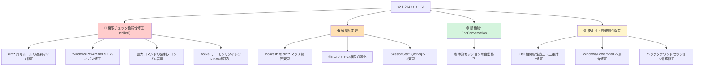
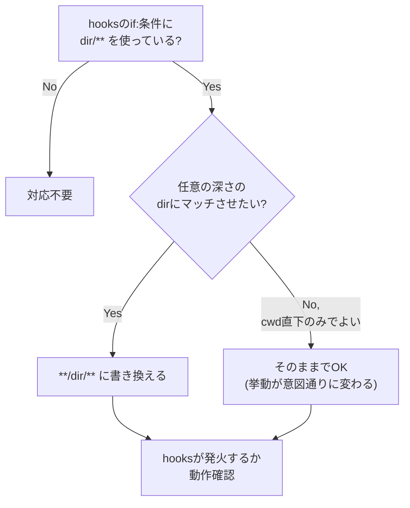

## はじめに

2026年7月にリリースされた **Claude Code v2.1.214** は、権限チェック周りの複数のセキュリティ脆弱性を修正した重要なアップデートです。単なるバグフィックスにとどまらず、`Edit(src/**)` のような許可ルールが意図しない範囲まで自動承認してしまう問題や、Windows PowerShell 5.1 環境での権限チェックバイパスなど、実運用で見落としやすい深刻な穴が塞がれています。

あわせて、hooks の `if:` 条件パターンのマッチ範囲が変更される**破壊的変更**や、虐待的な会話を Claude 自身が終了できる **EndConversation ツール**の追加など、開発者が把握しておくべきトピックが多数含まれています。

本記事では、Claude Code を CI/CD やチーム開発に組み込んでいるエンジニア向けに、今回のリリースで「何が」「なぜ」変わったのかを整理し、必要な対応をまとめます。

> **📌 影響を受ける人**
> - `hooks` の `if:` 条件で `dir/**` のような単一セグメントパターンを使っている人
> - `permissions` に `Edit(src/**)` 等のディレクトリ許可ルールを設定している人
> - Windows / PowerShell 環境で Claude Code を使っている人
> - OpenTelemetry でセッションのコスト・トークンを計測している人

## 変更の全体像

今回のリリースは大きく「セキュリティ修正」「破壊的変更」「新機能」「安定性改善」の4系統に分かれます。特に権限チェックの脆弱性修正（change-001）と、それに対になる hooks のパターンマッチ変更（change-002）は密接に関連しています。



## 変更内容

### 🔴 権限チェックのセキュリティ脆弱性修正（critical）

最も重要なのが change-001 です。以下の7つの問題が同時に修正されました。

| # | 問題 | リスク |
|---|------|--------|
| 1 | 単一セグメント `dir/**` 許可ルールが `<cwd>/dir` 以外のツリー内同名ディレクトリも自動承認 | 意図しないパスへの書き込みが承認される |
| 2 | Windows PowerShell 5.1 での権限チェックバイパス | Windows 環境で権限確認が効かない |
| 3 | bash と権限アナライザでFDリダイレクト解釈が異なる場合の扱い | 解釈不一致を悪用した権限すり抜け |
| 4 | 10,000文字超のコマンドが自動実行されていた | 巨大コマンドの中身を確認せず実行 |
| 5 | zsh `[[ ]]` 内の変数サブスクリプト・修飾子を不活性テキスト扱い | 実際は実行可能なコードが見逃される |
| 6 | `help`/`man` コマンドの自動承認によるオプション経由の実行 | コマンド置換等での意図しない実行 |
| 7 | リモートセッションで権限プロンプトがローカル確認より先に進行 | 確認前に処理が進んでしまう |

さらに `docker --url` / `--connection` / `--identity` やPodmanのリモートモードなど、**デーモンリダイレクトを伴う docker コマンド**にも新たに権限プロンプトが追加されています。

> **⚠️ Breaking Change**
> 修正6により、これまで自動承認されていた `help`/`man` コマンドの一部が今後は権限プロンプトを要求するようになります。CI などで無人実行しているスクリプトがある場合は、事前に許可ルールの見直しが必要です。

### 🟠 破壊的変更: hooks の `dir/**` マッチ範囲

change-002 は change-001 の許可ルール修正と対になる仕様変更です。

- **旧仕様**: hooks の `if:` 条件で `dir/**` と書くと、ツリー内の任意の深さにある `dir/` にマッチしていた
- **新仕様**: `<cwd>/dir` 直下のみにマッチする。任意の深さでマッチさせたい場合は明示的に `**/dir/**` と書く必要がある

なお、`deny`/`ask` の権限ルール自体は従来どおり任意の深さでマッチする挙動を維持しており、変更されるのは **hooks の `if:` 条件のみ**です。



その他の破壊的変更（change-009、medium）:

| 変更点 | 内容 |
|---|---|
| `file` コマンド | `-m`/`--magic-file`、`-f`/`--files-from` 使用時は読み取り専用扱いされず権限が必要に |
| 接続プーリング | keep-alive のstale-connectionエラー後は無効化され、リトライ時に新規ソケットを開く |
| SessionStart hooks | フォーク開始時のソースが `"resume"` ではなく `"fork"` になる |

### 🟢 新機能: EndConversation ツール

高度に虐待的なユーザーやジェイルブレイク試行に対して、Claude 自身がセッションを終了できる `EndConversation` ツールが追加されました（change-003）。claude.ai では2025年から提供されていた機能が Claude Code にも導入された形で、Anthropic の model welfare（モデル福祉）への取り組みの一環です。

### 🟡 その他の改善

| 変更 | 概要 |
|---|---|
| OpenTelemetry 強化（change-004） | `message.uuid`・`client_request_id`・`tool_source` 属性追加、`CLAUDE_CODE_OTEL_CONTENT_MAX_LENGTH` 環境変数追加、トレースコンテキスト欠落・トークン二重計上を修正 |
| UX/可観測性改善（change-005） | 長時間ツールの進捗ハートビート、メモリファイルの更新タイムスタンプ、サブエージェント行の推論エフォート表示 |
| Windows/PowerShell 修正（change-006） | ハング、文字コードクラッシュ、UTF-16LE書き込み問題、企業プロキシでのストリーミング失敗などを修正 |
| バックグラウンドセッション修正（change-007） | デーモンのソケット競合、アイドルセッションのプロセス残留、セッション削除不能などを修正 |
| hooks/MCP/安定性修正（change-008） | hookのexit code 2がブロックしない問題、MCPスラッシュコマンド消失、プラグイン読み込みリグレッション等の修正 |

## 影響と対応

**必ず確認すべきポイント:**

1. **hooks の `if:` 条件を棚卸しする**
   `dir/**` のようなパターンを使っている場合、意図が「cwd直下のみ」か「任意の深さ」かを確認し、必要なら `**/dir/**` に書き換えてください。

2. **permissions のディレクトリ許可ルールを再確認する**
   `Edit(src/**)` のようなルールは、これまで意図せず広い範囲を自動承認していた可能性があります。今回の修正で挙動が厳格化されたため、これまで通っていた操作が権限プロンプトを要求するようになる場合があります。

3. **CI/無人実行環境での動作確認**
   `help`/`man` コマンドの自動承認停止、10,000文字超コマンドの強制プロンプト化、`docker` のデーモンリダイレクトへの権限追加により、CIパイプラインが途中で権限待ちになる可能性があります。事前にステージング環境でリリースを試すことを推奨します。

4. **SessionStart hooks で `"resume"` を判定条件にしている場合**
   フォーク開始時は `"fork"` を返すようになったため、条件分岐の見直しが必要です。

> **💡 Tips**
> 影響範囲を素早く洗い出すには、プロジェクト内の `.claude/settings.json` や `hooks` 設定ファイルを `grep -r "dir/\*\*"` のように検索し、該当箇所を一つずつ確認するのが確実です。

## コード例

### hooks の `if:` 条件の書き換え

```yaml
# Before (v2.1.213以前)
# ツリー内の任意の深さの "dist" ディレクトリにマッチしていた
hooks:
  PreToolUse:
    - matcher: Edit
      if: "dist/**"
      command: "./scripts/protect-dist.sh"
```

```yaml
# After (v2.1.214以降)
# <cwd>/dist のみにマッチするよう変更。任意の深さが必要なら **/dist/** を使う
hooks:
  PreToolUse:
    - matcher: Edit
      if: "**/dist/**"
      command: "./scripts/protect-dist.sh"
```

### SessionStart hooks でのフォーク判定の見直し

```bash
# Before: "resume" のみをチェックしていた
if [ "$SESSION_SOURCE" = "resume" ]; then
  echo "既存セッションを再開しました"
fi
```

```bash
# After: フォーク開始時は "fork" を返すため、両方をケアする
if [ "$SESSION_SOURCE" = "resume" ] || [ "$SESSION_SOURCE" = "fork" ]; then
  echo "既存セッションから継続しています (source=$SESSION_SOURCE)"
fi
```

## まとめ

- Claude Code v2.1.214 は **権限チェックに関する7つのセキュリティ脆弱性**を修正した重要なリリースです。特に許可ルールの過剰マッチと Windows PowerShell 5.1 のバイパスは影響が大きく、早急なアップデートが推奨されます。
- hooks の `if:` 条件で使う単一セグメント `dir/**` パターンのマッチ範囲が変更される**破壊的変更**があり、既存の hooks 設定が意図通り発火しなくなる可能性があります。`**/dir/**` への書き換えが必要かどうか棚卸ししましょう。
- 虐待的セッションを Claude 自身が終了できる `EndConversation` ツールが新たに追加されました。
- そのほか OpenTelemetry の相関属性追加、Windows/PowerShell 関連やバックグラウンドセッション管理の多数の不具合修正が含まれています。

アップデート後は、hooks・permissions 設定の動作確認とCI/CDパイプラインでの権限プロンプト発生有無のチェックを行うことを強く推奨します。
