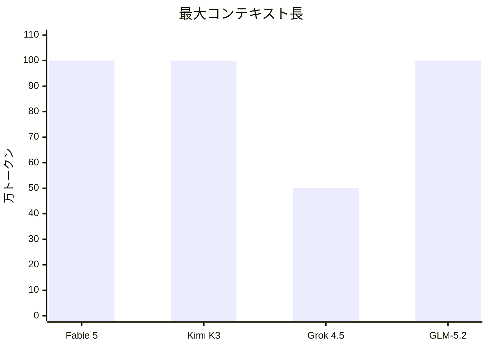
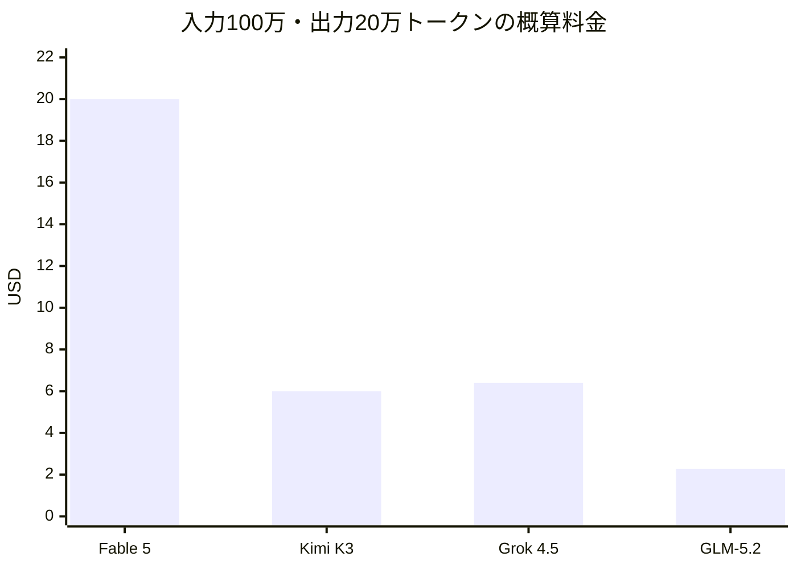
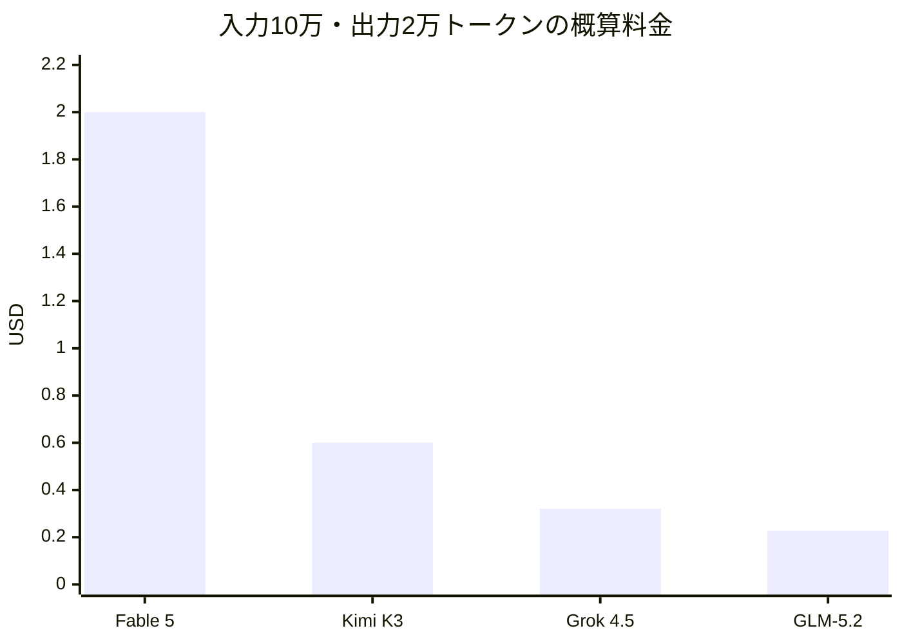
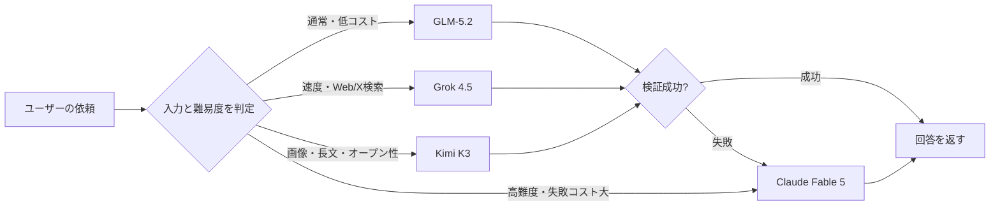
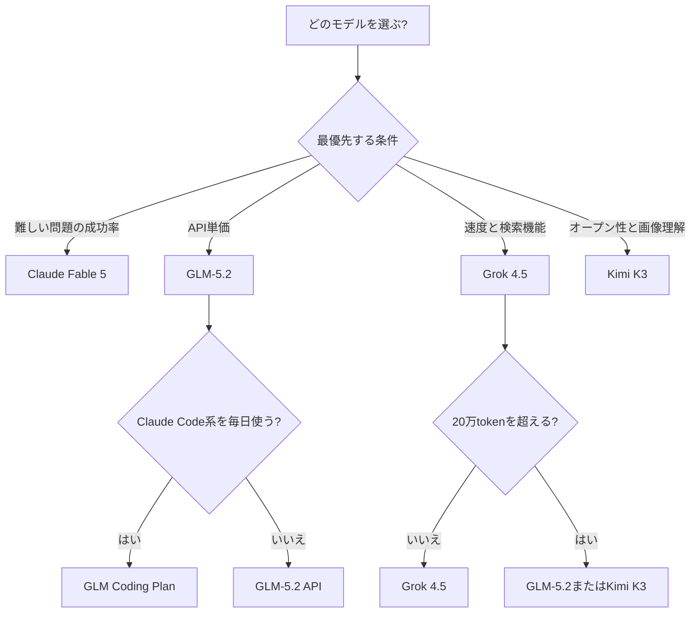

## はじめに

2026年は、単純なチャット性能だけでなく、長時間のコーディング、巨大なリポジトリの解析、Web検索、ターミナル操作、資料作成などを自律的に進める「エージェント性能」がLLM選定の重要な基準になっています。

この記事では、次の4モデルを比較します。

- Anthropicの**Claude Fable 5**
- Moonshot AIの**Kimi K3**
- SpaceXAIの**Grok 4.5**
- Z.aiの**GLM-5.2**

比較する主な項目は以下です。

- 最大コンテキスト長
- API料金
- キャッシュ料金
- コーディング・エージェント性能
- 画像入力
- オープンウェイト
- 実際の利用料金
- 用途別のコストパフォーマンス

※本記事の料金・仕様は2026年7月18日時点の公式ドキュメントに基づきます。

---

## 先に結論

| 重視する項目 | 有力候補 |
|---|---|
| 難しいタスクの成功率を優先 | Claude Fable 5 |
| API単価を最優先 | GLM-5.2 |
| 価格・速度・性能のバランス | Grok 4.5 |
| オープンウェイトと画像理解 | Kimi K3 |
| 100万トークンの長文処理 | Fable 5 / Kimi K3 / GLM-5.2 |
| Claude Code系ツールを定額利用 | GLM Coding Plan |
| 高難度タスクだけ高性能モデルへ振り分ける | Grok 4.5またはGLM-5.2 + Fable 5 |

単純なAPI単価だけを見ると、今回の4モデルでは**GLM-5.2が最安**です。

一方、モデルのコストパフォーマンスはAPI単価だけでは決まりません。安いモデルでも、修正や再実行が多ければ最終的な費用は増えます。

実務では次の考え方が重要です。

```text
実質コスト
= API料金
+ 再試行にかかる料金
+ 人間が確認・修正する時間
```

---

## 基本仕様の比較

| モデル | 提供元 | 最大コンテキスト | 最大出力 | 画像入力 | 画像出力 | オープンウェイト |
|---|---|---:|---:|---|---|---|
| Claude Fable 5 | Anthropic | 1,000,000 | 128,000 | 対応 | 非対応 | 非公開 |
| Kimi K3 | Moonshot AI | 1,048,576 | 131,072（既定）/ 最大1,048,576 | 対応（画像・動画） | 非対応 | 公開予定（7/27まで・Modified MIT） |
| Grok 4.5 | SpaceXAI | 500,000 | 公式記載なし | 対応 | 非対応 | 非公開 |
| GLM-5.2 | Z.ai | 1,000,000 | 128,000 | 非対応（テキストのみ） | 非対応 | 公開（MIT） |

なお、**4モデルとも出力はテキストのみで、画像生成（画像出力）には対応していません**。SpaceXAIの場合、画像・動画生成はgrok-imagine系の別モデルとして提供されており、画像1枚当たり$0.02〜$0.07の従量課金です。画像生成が必要なワークフローでは、これらの専用モデルや他社の画像生成APIを組み合わせる構成になります。

Claude Fable 5は、Anthropicが一般提供するモデルの中で最も高性能なモデルとして案内されています。100万トークンのコンテキストと、最大128Kトークンの出力に対応します。

Kimi K3は2.8兆パラメータのMoEモデルで、100万トークン（1,048,576）のコンテキストと、画像・動画のネイティブ理解を備えています。`max_completion_tokens`のデフォルトは131,072で、最大1,048,576まで設定できます。オープンウェイトは2026年7月27日までにModified MITライセンスで公開予定と発表されていますが、**本記事執筆時点（7月18日）ではまだダウンロードできません**。

Grok 4.5のコンテキストは50万トークンです。ほかの3モデルより短いものの、一般的なコーディングやエージェント処理には非常に大きな容量です。なお、公式モデルページに最大出力トークンの独立した記載はありません。

GLM-5.2は、長時間タスク向けに100万トークンのコンテキストを採用しています。モデル本体はMITライセンスでウェイトが公開されており、セルフホストも可能です。ただし入出力はテキストのみで、**画像入力には対応していません**（Vision用途はGLM-4.6Vなど別モデルの領域です）。



---

## API料金の比較

### 通常料金

| モデル | 入力 | キャッシュ入力 | 出力 |
|---|---:|---:|---:|
| Claude Fable 5 | $10.00 | $1.00（読み取り） | $50.00 |
| Kimi K3 | $3.00 | $0.30 | $15.00 |
| Grok 4.5 | $2.00 | $0.50 | $6.00 |
| GLM-5.2 | **$1.40** | **$0.26** | **$4.40** |

すべて100万トークン当たりの価格です。

Claude Fable 5のキャッシュは読み取り$1.00（通常入力の90%割引）に加え、キャッシュ書き込みが別料金です（5分キャッシュ$12.50、1時間キャッシュ$20.00）。

```mermaid
xychart-beta
    title "100万トークン当たりのAPI料金"
    x-axis ["Fable 5", "Kimi K3", "Grok 4.5", "GLM-5.2"]
    y-axis "USD" 0 --> 55
    bar [10, 3, 2, 1.4]
    bar [50, 15, 6, 4.4]
```



1本目の棒が入力料金、2本目が出力料金です。

### 単価だけならGLM-5.2が最安

通常料金を比較すると、GLM-5.2はGrok 4.5よりも安価です。

| 比較 | GLM-5.2の価格差 |
|---|---:|
| Grok 4.5との入力料金差 | 約30%安い |
| Grok 4.5との出力料金差 | 約27%安い |
| Kimi K3との入力料金差 | 約53%安い |
| Kimi K3との出力料金差 | 約71%安い |
| Fable 5との入力料金差 | 約86%安い |
| Fable 5との出力料金差 | 約91%安い |

ただし、価格の安さとタスクの成功率は別の指標です。

---

## Grok 4.5は長いコンテキストで料金が変わる

Grok 4.5では、20万トークンを超える長いコンテキストを使用した場合、料金が次のように変わります。

| 条件 | 入力 | キャッシュ入力 | 出力 |
|---|---:|---:|---:|
| 20万トークン以下 | $2.00 | $0.50 | $6.00 |
| 20万トークン超 | $4.00 | $1.00 | $12.00 |

公式ドキュメントによると、プロンプトが閾値に達した時点で、**そのリクエストの全トークンに長コンテキスト料金が適用**されます。

そのため、Grok 4.5は短〜中規模の入力ではコストパフォーマンスが高い一方、大規模リポジトリをまとめて投入する場合は料金が倍になります。

50万トークンを継続的に使う用途では、100万トークンまで通常単価で利用できるGLM-5.2やKimi K3とも比較すべきです。

---

## 実際の1タスク料金を試算する

次のコーディングタスクを想定します。

- 入力：100万トークン
- 出力：20万トークン
- キャッシュなし
- ツール料金は含めない（例：Grok 4.5のWeb検索・X検索・コード実行は1,000回当たり$5が別途発生）

### Claude Fable 5

```text
入力：1.0 × $10.00 = $10.00
出力：0.2 × $50.00 = $10.00
合計：$20.00
```

### Kimi K3

```text
入力：1.0 × $3.00 = $3.00
出力：0.2 × $15.00 = $3.00
合計：$6.00
```

### Grok 4.5

Grok 4.5は1回のコンテキスト上限が50万トークンなので、100万入力は分割が必要です。

また、50万トークンの入力は20万トークンを超えるため、長コンテキスト料金を適用します。

```text
入力：1.0 × $4.00 = $4.00
出力：0.2 × $12.00 = $2.40
合計：$6.40
```

### GLM-5.2

```text
入力：1.0 × $1.40 = $1.40
出力：0.2 × $4.40 = $0.88
合計：$2.28
```



| モデル | 概算料金 | Fable 5を100としたコスト指数 |
|---|---:|---:|
| Claude Fable 5 | $20.00 | 100 |
| Kimi K3 | $6.00 | 30 |
| Grok 4.5 | $6.40 | 32 |
| GLM-5.2 | **$2.28** | **11.4** |

この条件では、GLM-5.2はFable 5の約11%のAPI料金です。

---

## 20万トークン以下の一般的なタスクを比較

次は、より一般的なコーディングタスクを想定します。

- 入力：10万トークン
- 出力：2万トークン
- キャッシュなし

| モデル | 入力料金 | 出力料金 | 合計 |
|---|---:|---:|---:|
| Claude Fable 5 | $1.00 | $1.00 | $2.00 |
| Kimi K3 | $0.30 | $0.30 | $0.60 |
| Grok 4.5 | $0.20 | $0.12 | $0.32 |
| GLM-5.2 | $0.14 | $0.088 | **$0.228** |



この条件でもGLM-5.2が最安で、次にGrok 4.5、Kimi K3、Fable 5と続きます。

---

## キャッシュを使うとさらに安くなる

同じリポジトリ、設計書、システムプロンプトを何度も参照する場合は、キャッシュ入力料金が重要です。

| モデル | 通常入力 | キャッシュ入力 | 割引率 |
|---|---:|---:|---:|
| Claude Fable 5 | $10.00 | $1.00（読み取り） | 90% |
| Kimi K3 | $3.00 | $0.30 | 90% |
| Grok 4.5 | $2.00 | $0.50 | 75% |
| GLM-5.2 | $1.40 | $0.26 | 約81% |

※Claude Fable 5はキャッシュ書き込みに別料金（5分$12.50/1M、1時間$20.00/1M）がかかります。

たとえばGLM-5.2で、100万入力トークンのうち80%がキャッシュにヒットし、20万トークンを出力した場合は次のようになります。

```text
キャッシュ入力：
0.8 × $0.26 = $0.208

通常入力：
0.2 × $1.40 = $0.280

出力：
0.2 × $4.40 = $0.880

合計：
$1.368
```

キャッシュを使わない場合の$2.28から、約40%削減できます。

---

## コーディング性能の比較

各社公表値と独立系ベンチマークから、4モデルのコーディング性能を比較します。

### 主要ベンチマークのスコア

| ベンチマーク | Fable 5 | Kimi K3 | Grok 4.5 | GLM-5.2 |
|---|---:|---:|---:|---:|
| SWE-Bench Pro | **80.3%** | 未公表 | 64.7% | 62.1% |
| Terminal-Bench 2.1 | 84.3〜88.0%※1 | **88.3%**※2 | 83.3% | 未公表 |
| SWE Marathon（pass@1） | 24.0% | **42.0%**※2 | 29.0% | 未公表 |
| DeepSWE 1.1（独立・共通ハーネス） | **70%** | 未公表 | 53% | 44% |
| SWE-bench Verified（vals.ai独立計測） | **95.0%** | 未公表 | 86.6% | 未公表 |

- ※1：Anthropic公表値は88.0%、SpaceXAIの比較チャートでは84.3%。ハーネスや集計時点の違いによる差とみられます。
- ※2：Moonshot AI公表値（`reasoning_effort: max`）。独立検証はまだ揃っていません。
- 参考：SWE-Bench Proの他モデルは、Claude Opus 4.8が69.2%、GPT-5.5が58.6%です。

読み方の整理は次のとおりです。

- **リポジトリレベルのIssue解決（SWE-Bench Pro / SWE-bench Verified / DeepSWE）ではFable 5が明確にトップ**です。特に独立の共通ハーネスで実施されたDeepSWE 1.1では、Fable 5（70%）とGrok 4.5（53%）、GLM-5.2（44%）の差が大きく開きます。
- **ターミナル操作系（Terminal-Bench 2.1）は上位4モデルが83〜88%の狭い範囲に密集**しており、実務上の差は小さい領域です。
- **長時間・大規模タスクを測るSWE MarathonではKimi K3の42.0%が突出**していますが、自社ハーネスでの公表値である点に注意が必要です。
- **GLM-5.2はローンチ時に公式ベンチマークを公表しておらず**、上記の数値はSpaceXAIの比較チャートやサードパーティ論文由来です。単価の安さと合わせて、自社タスクでの実測が特に重要なモデルです。

### 独立系の総合指標

Artificial AnalysisのIntelligence Indexでは、Fable 5がトップで、Kimi K3が57.1で全体4位、Grok 4.5が約54、GLM-5.2が約51という序列です。

同社のCoding Agent Index（エージェント環境込みの評価）では、Grok 4.5（Grok Build）が76ポイントで、Claude Code上のFable 5に1ポイント差まで迫っています。一方で1タスク当たりのコストはGrok 4.5が$2.49、GPT-5.5が$5.07、Fable 5が$11.80と大きく異なります。

### トークン効率という新しい軸

SpaceXAIは、Grok 4.5がSWE-Bench Proの1タスクを平均15,954出力トークンで解決し、Claude Opus 4.8（67,020トークン）の約4.2分の1で済むと公表しています。

同じ$6/1Mの出力単価でも、タスク当たりのトークン消費が4分の1なら実質コストも4分の1になります。逆にKimi K3は常時思考モードで出力トークンが膨らみやすく、名目単価より実質コストが高くなりがちです。「単価 × タスク当たり消費トークン」で比較する視点が2026年のモデル選定では重要になっています。

### コーディング性能のまとめ

| 観点 | 有力モデル |
|---|---|
| 難しいIssue解決の成功率 | Claude Fable 5 |
| ターミナル操作・エージェント作業 | 4モデルとも僅差（Kimi K3がやや優位） |
| 長時間タスクの継続力 | Kimi K3（自社公表値） |
| 成功率当たりのコスト | Grok 4.5 |
| 単価最優先（性能は要実測） | GLM-5.2 |

ベンチマークは使用ハーネスや推論レベルで大きく変わるため、次章「性能比較で注意すべきこと」の観点と合わせて読んでください。

---

## Claude Fable 5の特徴

Claude Fable 5は、価格よりも難しいタスクの完了能力を優先するモデルです。

### 強み

- Anthropicの一般提供モデルで最高クラス
- 100万トークンのコンテキスト
- 最大128Kトークンの出力
- 長時間のエージェント処理
- 高度な推論
- Vision入力
- コード実行
- メモリツール
- プログラムによるツール呼び出し
- コンテキスト圧縮
- キャッシュ読み取り90%割引

### 弱み

- 入力・出力ともに高額
- 出力単価はGLM-5.2の約11.4倍
- 大量処理には予算管理が必要
- 安全性分類器によってリクエストが拒否される場合がある

Claude Fable 5では、拒否がHTTPエラーではなく、`stop_reason: "refusal"`を含むHTTP 200レスポンスで返る場合があります。

APIへ組み込む際は、別モデルへのフォールバック処理を用意した方が安全です。

### 向いている用途

- 大規模リファクタリング
- 本番障害の調査
- 複雑な設計変更
- 高品質なコードレビュー
- 失敗した場合の損失が大きい業務
- 他モデルで解決できなかったタスク

---

## Kimi K3の特徴

Kimi K3は、2.8兆パラメータの大規模MoEモデルです。

### 強み

- 100万トークン（1,048,576）のコンテキスト
- 画像・動画のネイティブ理解
- 長時間のコーディング
- 巨大なリポジトリの解析
- ターミナルツールの操作
- 画像とコードを組み合わせた開発
- オープンウェイト（Modified MITライセンスで7/27までに公開予定）
- 自動コンテキストキャッシュ（割引率90%）
- JSON Modeと構造化出力
- 長コンテキストでも料金は一律（コンテキスト長による段階料金なし）

Moonshot AIは、Kimi K3がスクリーンショットを確認しながらゲーム、フロントエンド、CADなどを改善できると説明しています。

### 弱み

- GLM-5.2やGrok 4.5よりAPI単価が高い
- 現時点では推論レベルが実質的に`max`のみ
- 常時思考モードのため、思考トークンも$15/1Mの出力トークンとして課金され、簡単な処理でもコストが膨らみやすい
- オープンウェイトは公開予定段階で、執筆時点ではまだダウンロード不可
- 2.8兆パラメータのセルフホストには巨大な計算資源が必要

オープンウェイトが公開されても、一般的な16GBや32GBのPCでそのまま動かせるモデルではありません。

仮に全パラメータを4bitで保持するだけでも、単純計算で約1.4TB必要です。

```text
2.8兆パラメータ × 4bit ÷ 8
= 約1.4TB
```

### 向いている用途

- オープンモデルの研究
- 画像・動画を含むコーディング
- 長大な資料の分析
- 巨大なリポジトリ
- キャッシュが効く反復処理
- GPUクラスタを利用できる企業・研究機関

---

## Grok 4.5の特徴

Grok 4.5は、性能、速度、API価格のバランスを狙ったモデルです。

### 強み

- 入力$2、出力$6の低価格
- キャッシュ入力$0.50
- 約80トークン/秒と案内
- コーディングとエージェント処理
- Function Calling
- Structured Outputs
- Web検索・X検索・コード実行
- Vision入力
- Cursorから利用可能（全プラン対応）

SpaceXAIは、Grok 4.5が同等クラスのモデルより少ないステップや出力トークンで問題を解決できると説明しています。

### 弱み

- コンテキスト上限は50万トークン
- 20万トークン超では料金が2倍
- 100万トークンの資料を1回では処理できない
- ローンチ時点でEUでは利用不可
- Web検索・X検索・コード実行などのサーバーサイドツールは呼び出し課金（$5/1,000回など）が別途発生
- 新しいモデルのため実プロジェクトでの検証が必要

### 向いている用途

- 20万トークン以下のコーディング
- 高速な反復開発
- Cursorを使った開発
- WebやXの最新情報を使うエージェント
- API費用を抑えた大量処理
- GLM以外の低価格なクローズドモデルを使いたい場合

---

## GLM-5.2の特徴

GLM-5.2は、長時間タスクと低いAPI単価が特徴です。

### 強み

- 100万トークンのコンテキスト
- 最大128Kトークン出力
- 入力$1.40、出力$4.40
- キャッシュ入力$0.26
- MITライセンスのオープンウェイト（セルフホスト可能）
- プロジェクト規模のコーディング
- 長時間のエージェントタスク
- Claude Code、Cline、OpenCodeなどに対応するCoding Plan
- 月額固定プランを選べる

### 弱み

- 画像入力に非対応（テキスト入出力のみ）
- Claude Fable 5に比べると、高難度タスクの成功率は用途ごとの確認が必要
- APIとCoding Planは利用条件が異なる
- Coding Planの枠を一般SaaSのAPIとして転用できない
- 中国系サービスの利用要件やデータ管理方針を企業ごとに確認する必要がある

### 向いている用途

- 100万トークンの長文処理
- 大規模リポジトリ
- APIコストを最優先するサービス
- Claude Code系ツールを毎日使う開発者
- 月額費用を固定したい個人開発者
- 大量のエージェント処理
- オープンウェイトのセルフホスト

---

## GLM Coding Planと従量課金APIの違い

GLM-5.2には、通常の従量課金APIとは別に、コーディングツール向けのGLM Coding Planがあります。

| プラン | 通常月額 | プロモ適用時 | 週あたりの目安プロンプト数 | 主な用途 |
|---|---:|---:|---:|---|
| Lite | $18 | $12.60 | 約400 | 小規模開発、軽い利用 |
| Pro | $72 | $50.40 | 約2,000 | 日常的な開発 |
| Max | $160 | $112 | 約8,000 | 高頻度・大規模開発 |

- 請求サイクルによる割引があります（月払い10%、四半期払い20%、年払い30%）。
- 2026年9月まで30%の導入プロモーションが適用されています。
- クォータはトークンではなくプロンプト数ベースで、GLM-5.2はピーク時3倍・オフピーク2倍のレートで消費されます。

Coding Planは、Claude Code、Cline、OpenCode、Kilo Codeなどの対応ツールで使うためのプランです。

次の用途には、通常のAPIを使う必要があります。

- 自社Webアプリへの組み込み
- SaaSのバックエンド
- 顧客向けチャットボット
- 独自エージェントサービス
- リクエスト単位の原価管理

月額プランの利用枠を、一般向けAPIとして転用できるわけではありません。

---

## 各社サブスクリプション料金の一覧

API従量課金とは別に、各社はチャットアプリやコーディングツール向けの定額プランを提供しています。2026年7月時点の公表価格をまとめます。

| 提供元 | プラン | 月額（USD） | 備考 |
|---|---|---:|---|
| Anthropic | Free | $0 | 利用制限あり |
| Anthropic | Pro | $20 | 年払いで$17/月。Fable 5は制限付き |
| Anthropic | Max 5x | $100 | Proの5倍の利用枠。月払いのみ |
| Anthropic | Max 20x | $200 | Proの20倍の利用枠。月払いのみ |
| Anthropic | Team Standard | $25/席 | 年払いで$20/席。最低5席 |
| Anthropic | Team Premium | $125/席 | 年払いで$100/席。最低5席 |
| Moonshot AI | Free | $0 | 利用制限あり |
| Moonshot AI | Moderato | $19 | チャット＋Kimi Code入門枠。コンテキスト256K |
| Moonshot AI | Allegretto | $39 | クレジット増量。1Mコンテキスト解放 |
| Moonshot AI | Allegro | $99 | Agent Swarmが実用レベルに |
| Moonshot AI | 最上位プラン | $199 | 高頻度・大規模利用向け |
| SpaceXAI | Free | $0 | 利用制限あり |
| SpaceXAI | SuperGrok Lite | $10 | 入門プラン |
| SpaceXAI | SuperGrok | $30 | 標準プラン。年払い$300 |
| SpaceXAI | SuperGrok Heavy | $300 | Grok 4.5にフルアクセスできる唯一の個人プラン |
| SpaceXAI | X Premium | $8 | X機能＋簡易Grokアクセス |
| SpaceXAI | X Premium+ | $40 | X機能＋Grokアクセス |
| Z.ai | GLM Coding Plan Lite | $18 | プロモで$12.60（〜2026年9月） |
| Z.ai | GLM Coding Plan Pro | $72 | プロモで$50.40（〜2026年9月） |
| Z.ai | GLM Coding Plan Max | $160 | プロモで$112（〜2026年9月） |

### 定額プランで注意すべきポイント

**Claude Fable 5は定額枠に含まれない期間がある**：Fable 5は2026年7月12日までPro/Max/Team等の週次利用枠内（最大50%）で利用できましたが、以降は定額枠とは別の使用量クレジット（API料金相当）での課金になっています。定額プランだけでFable 5を使い続けられるわけではない点に注意が必要です。

**Kimiはプランによってコンテキスト長が変わる**：APIは全域一律1Mですが、アプリのメンバーシップではModerato（$19）が256K、Allegretto（$39）以上で1Mが解放されます。クォータはトークンではなく時間ベースです。

**Grok 4.5は段階展開中**：SuperGrok（$30）とX Premium+（$40）へのGrok 4.5展開は段階的で、確実にフルアクセスできる個人プランは現時点でSuperGrok Heavy（$300）のみです。

**GLM Coding Planは用途が限定される**：前章のとおり、対応コーディングツール専用のプランです。自社サービスへの組み込みには通常のAPIが必要です。

**単純な月額比較は成立しない**：各プランの利用枠の計り方が「メッセージ数」「プロンプト数」「時間」「クレジット」とバラバラで、同じ$20前後でも実質的な利用可能量は大きく異なります。日常のワークロードでどのプランが枠内に収まるかは、実際に試して確認するのが確実です。

---

## 性能比較で注意すべきこと

LLMの性能は、1つのベンチマークだけでは判断できません。

特にコーディングベンチマークは、次の条件で結果が変わります。

- 使用するエージェント
- 推論レベル
- 最大トークン数
- ツールの種類
- テスト環境
- 再試行回数
- コンテキストの与え方
- モデル提供元独自のハーネス

また、各社の公式発表は自社モデルに有利な評価条件を選んでいる可能性があります。

実際に導入するときは、自社のタスクを10〜30件ほど用意し、次の項目を記録する方法がおすすめです。

| 評価項目 | 内容 |
|---|---|
| 成功率 | 1回で要件を満たした割合 |
| テスト通過率 | 自動テストを通過した割合 |
| API料金 | 1タスク当たりの実費 |
| 所要時間 | 完了までの時間 |
| 再試行回数 | やり直した回数 |
| 修正時間 | 人間が直した時間 |
| ツール安定性 | Function Callingの失敗率 |
| 日本語品質 | 説明やドキュメントの読みやすさ |

---

## コスパを評価する式

単純なトークン料金だけでなく、次のように考えます。

```text
タスク当たりの実質費用
= API料金
+ 再試行料金
+ 人間の作業時間 × 人件費
```

たとえば、GLM-5.2が$0.30で処理できても、人間が30分修正する必要がある場合があります。

一方、Fable 5が$2.00かかっても、修正なしで完了すれば、人件費まで含めるとFable 5の方が安い可能性があります。

### API料金だけの順位

1. GLM-5.2
2. Grok 4.5
3. Kimi K3
4. Claude Fable 5

### 高難度タスクを含む実務コスパ

- 通常処理：GLM-5.2またはGrok 4.5
- 画像を含む長時間処理：Kimi K3
- 難問や失敗時のフォールバック：Claude Fable 5

この構成が現実的です。

---

## モデルを使い分ける構成

1つのモデルにすべてのタスクを任せる必要はありません。



### おすすめ構成例

#### 通常処理：GLM-5.2

- コード生成
- テスト作成
- ドキュメント
- 定型的な修正
- 大量のバッチ処理

#### 最新情報を含む処理：Grok 4.5

- Web検索
- X検索
- 市場調査
- 高速なコーディング
- 20万トークン以下の処理

#### 画像と長時間処理：Kimi K3

- UIスクリーンショットからの修正
- ゲーム画面を見ながらの開発
- 複数資料の分析
- オープンモデルの研究

#### 高難度処理：Claude Fable 5

- 他モデルが失敗した問題
- 大規模設計変更
- 本番障害
- 重要なコードレビュー
- 高い信頼性が必要な作業

---

## 用途別おすすめ

| 用途 | おすすめ |
|---|---|
| APIを最安で利用 | GLM-5.2 |
| 高難度のコード修正 | Claude Fable 5 |
| 画像を見ながら開発 | Kimi K3 |
| 高速な反復開発 | Grok 4.5 |
| 100万トークンの長文処理 | GLM-5.2 / Kimi K3 / Fable 5 |
| オープンウェイト | Kimi K3（公開予定） / GLM-5.2（公開済み） |
| Claude Codeの定額利用 | GLM Coding Plan |
| Web・X検索を組み込む | Grok 4.5 |
| 安価な大量バッチ | GLM-5.2 |
| 失敗時の最終フォールバック | Claude Fable 5 |

---

## 筆者による相対評価

以下は、公開仕様と料金を基にした5段階の相対評価です。公式ベンチマークではありません。

| 評価項目 | Fable 5 | Kimi K3 | Grok 4.5 | GLM-5.2 |
|---|---:|---:|---:|---:|
| 高難度タスク | 5 | 4 | 4 | 4 |
| API単価 | 1 | 3 | 4 | 5 |
| 長文処理 | 5 | 5 | 4 | 5 |
| Vision | 5 | 5 | 4 | 1 |
| オープン性 | 1 | 4 | 1 | 5 |
| ツール利用 | 5 | 5 | 5 | 5 |
| 定額コーディング | 3 | 4 | 4 | 5 |
| 総合コスパ | 3 | 4 | 4 | 5 |

※GLM-5.2は画像入力非対応のためVisionを1、MITライセンスでウェイト公開済みのためオープン性を5としています。Kimi K3のオープン性は、執筆時点でウェイトが公開予定段階（未公開）であることを踏まえて4としています。公開後は5相当です。

---

## 選び方のフローチャート



---

## まとめ

4モデルを一言で表すと次のようになります。

### Claude Fable 5

価格は高いものの、難しい推論や長時間のエージェント処理で有力です。API料金よりも、タスクの成功率や失敗リスクを重視する用途に向いています。

### Kimi K3

100万トークン、画像・動画理解、2.8兆パラメータ、オープンウェイト（7/27までに公開予定）が特徴です。オープンモデルの研究や、画像とコードを組み合わせた長時間タスクに向いています。

### Grok 4.5

20万トークン以下では入力$2、出力$6と安価で、速度やツール機能にも強みがあります。ただし、20万トークンを超えると料金が2倍になる点と、ローンチ時点でEUでは利用できない点に注意が必要です。

### GLM-5.2

入力$1.40、出力$4.40、100万トークンのコンテキスト、MITライセンスのオープンウェイトを備えています。今回比較した4モデルでは、API単価が最も安く、大量処理や長文処理のコストパフォーマンスが高いモデルです。ただし画像入力には対応していません。

最終的なおすすめは次のとおりです。

| 選び方 | モデル |
|---|---|
| 品質最優先 | Claude Fable 5 |
| API料金最優先 | GLM-5.2 |
| 性能・速度・検索のバランス | Grok 4.5 |
| オープン性・Vision・長文 | Kimi K3 |
| 迷った場合 | GLM-5.2から試し、難問だけFable 5へフォールバック |

2026年のLLM選定では、「どのモデルが最強か」だけではなく、タスクの難易度、入力サイズ、必要なツール、失敗時のコストに応じてモデルを使い分けることが重要です。

---

## 参考資料

- [Anthropic：Claude Fable 5公式ドキュメント](https://platform.claude.com/docs/en/about-claude/models/introducing-claude-fable-5-and-claude-mythos-5)
- [Kimi API：モデル一覧](https://platform.kimi.ai/docs/models)
- [Kimi API：Kimi K3クイックスタート](https://platform.kimi.ai/docs/guide/kimi-k3-quickstart)
- [Kimi K3公式ブログ](https://www.kimi.com/blog/kimi-k3)
- [Kimi API：Kimi K3料金](https://platform.kimi.ai/docs/pricing/chat-k3)
- [SpaceXAI：Grok 4.5公式発表](https://x.ai/news/grok-4-5)
- [SpaceXAI：Grok 4.5モデル仕様](https://docs.x.ai/developers/models/grok-4.5)
- [SpaceXAI：API料金](https://docs.x.ai/developers/pricing)
- [Z.ai：GLM-5.2公式発表](https://z.ai/blog/glm-5.2)
- [Z.ai：API料金](https://docs.z.ai/guides/overview/pricing)
- [Z.ai：GLM Coding Plan](https://z.ai/subscribe)
- [vals.ai：SWE-bench Verifiedリーダーボード](https://www.vals.ai/benchmarks/swebench)
- [Artificial Analysis：モデル比較](https://artificialanalysis.ai/)
