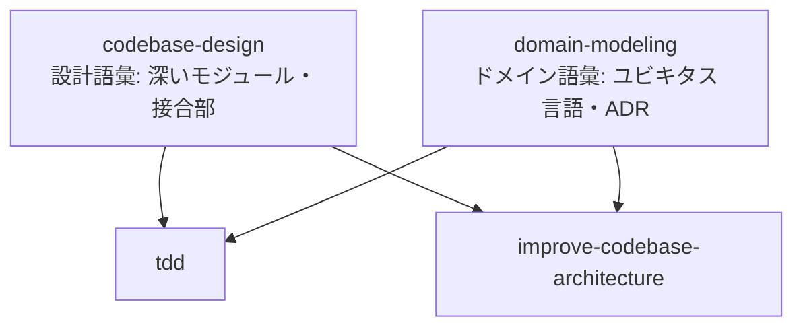

## はじめに

Total TypeScript の Matt Pocock 氏が「自分の `.claude/` ディレクトリそのものを公開した」リポジトリ `mattpocock/skills` が、v1.0.0 で**大規模な再構成**を行いました。

筆者は以前、18 スキル時代のこのリポジトリを全部読んで設計の作法を整理した記事[mattpocock/skills 18 個から学ぶ Claude Skill 設計](https://qiita.com/ryoji9702/items/fdd5e0ac1ce6718fb680) を書きましたが、その後の v1.0.0 でスキルの削除・改名・置換・新設が一気に入り、**当時の記事のスキル名がいくつかなくなっています**。実際、筆者の手元でも新旧バージョンのプラグインが共存した結果、`/diagnose` が `/diagnosing-bugs` に変わっていて一瞬混乱しました。

本稿は「何が消えて、何に変わって、何が増えたのか」の差分整理と、この再構成から読み取れる **Skill 設計思想のアップデート**をまとめたものです。

### この記事で分かること

- v1.0.0 の破壊的変更の全リスト（削除・改名・置換・新設）
- 新設された「共有語彙スキル」（codebase-design / domain-modeling）という設計パターン
- 分類軸が「ユーザー起動型 / モデル起動型」に変わった意味
- 旧バージョン利用者の移行時のハマりどころ

### 対象読者

- `mattpocock/skills` を既に導入している、または導入を検討している人
- Claude Code / Cowork で自作スキルを書いていて、スキル群の「育て方」に関心がある人

### 前提知識

- Claude Code / Cowork のスキル機構（`SKILL.md`）の概念を知っている

## 背景 — なぜ再構成が必要になったのか

前回記事の時点（2026-06-01、Stars 10 万超）では、スキルは `engineering / productivity / misc` の 3 カテゴリ 18 個構成でした。その後もリポジトリは伸び続け、2026 年 7 月時点で Stars は 17 万を超えています。

規模が大きくなると、スキル集は個人の dotfiles とは違う問題を抱え始めます。

- 同じ語彙（「深いモジュール」「接合部」など）を複数のスキルが**各自バラバラに再定義**している
- テスト用に作った重複スキルや、実際には使われないスキルが混ざっている
- 「どのスキルをいつ使えばいいのか」が初見では分からない

v1.0.0 の変更は、この 3 つに対する回答としてきれいに読めます。CHANGELOG に記録された変更を分類すると次の通りです。

## 変更点の全体マップ

### 削除・改名・置換

| 種別  | 対象                                       | 内容                                                  |
| --- | ---------------------------------------- | --------------------------------------------------- |
| 削除  | `caveman`                                | テスト用の重複スキルだったため削除                                   |
| 削除  | `zoom-out`                               | 使われていなかったため削除                                       |
| 改名  | `diagnose` → `diagnosing-bugs`           | 命名の統一（`grilling` / `writing-great-skills` と同じ動名詞形へ） |
| 置換  | `write-a-skill` → `writing-great-skills` | 語彙・原則を `GLOSSARY.md` に分離して再設計                       |

前回記事で「トークン消費を 75% 削減する」と紹介した `caveman` が削除されたのは象徴的です。便利ではあっても**本人の実運用に残らなかったものは容赦なく落とす**、という dotfiles 的な潔さがそのまま出ています。

### 新設スキル

| スキル | 分類 | 役割 |
| --- | --- | --- |
| `ask-matt` | ユーザー起動型 | 状況を聞いて適切なスキルへ案内するルーター |
| `codebase-design` | 共有スキル | モジュール・インターフェース・深さ・接合部などの設計語彙と原則 |
| `domain-modeling` | 共有スキル | プロジェクトのドメインモデル（ユビキタス言語・ADR）の構築と維持 |
| `resolving-merge-conflicts` | モデル起動型 | 進行中の merge / rebase 競合を解決するループ |

### 分類の変更

従来の「コマンド / スキル」という分類が、**「ユーザー起動型（user-invoked）/ モデル起動型（model-invoked）」**に改められました。

- ユーザー起動型：`/grill-with-docs` や `/triage` のように人間が明示的に呼ぶもの
- モデル起動型：`tdd` や `diagnosing-bugs` のように、文脈から Claude 自身が発動を判断するもの

これは Claude Code のスキル機構の実態（description を見てモデルがトリガー判断する）に合わせた整理で、**「スキルの description は誰に向けて書くのか」を分類として明示した**ことになります。自作スキルを書く人にとって、この軸はそのまま真似する価値があります。

## 注目ポイント1 — 「共有語彙スキル」というパターン

今回の再構成で筆者が一番面白いと思ったのは、`codebase-design` と `domain-modeling` の新設です。この 2 つは単体で何かを実行するスキルではなく、**他のスキルから参照される語彙と原則の置き場**です。



v1.0.0 で `tdd` と `improve-codebase-architecture` は、これらの共有スキルに**依存する**形に書き換えられました。つまり「深いモジュールとは何か」の定義が各スキルに重複コピーされるのではなく、1 箇所に集約され、利用側は参照するだけになったわけです。

前回記事で筆者は「Skill は OOP の class に似ている」と書きましたが、v1.0.0 はその続きとして読めます。**class だけだったスキル群に、継承元や mixin に相当する層が導入された**イメージです。

- 実行可能スキル（`tdd` など）= 具象クラス
- 共有語彙スキル（`codebase-design` など）= 抽象基底クラス / mixin
- `GLOSSARY.md` = パッケージ共通のドキュメント

スキルを 10 個以上運用している人なら、「同じ説明をあちこちの SKILL.md にコピペしている」経験があるはずです。DRY 原則をスキル集に適用するとこうなる、という実例として参考になります。

## 注目ポイント2 — ask-matt ルーター

もう 1 つの新顔 `ask-matt` は、**「どのスキルを使えばいいか分からない」問題への回答**です。ユーザーが状況を話すと、適切なスキル（grilling 系か、tdd か、triage か）へ案内してくれるエントリーポイントとして機能します。

注意点として、`ask-matt` は**他のスキルがインストールされていることを前提**とします。ルーターだけ入れても案内先がなければ動きません（これも破壊的変更としてマークされています）。

README の思想は、フレームワーク側がプロセス全体を所有する GSD / BMAD / Spec-Kit 系への批判でした。それがスキル数の増加を受けて「入口だけは案内役を置く」という妥協点に落ち着いたのは興味深い変化です。**制御は渡さず、ナビゲーションだけ提供する**という折り合いの付け方は、社内スキル集を整備する際にも使える構図だと思います。

## 注目ポイント3 — writing-great-skills と GLOSSARY.md

`write-a-skill` は `writing-great-skills` に置き換えられました。単なる改名ではなく、次の分解が行われています。

- スキル設計の語彙・原則 → `GLOSSARY.md` として独立
- 対話でユーザーの意図を詰める部分 → `grilling` としてモデル起動型スキルに公開

「スキルの書き方」というメタスキル自身が、**語彙の分離（GLOSSARY.md）と役割の分割（grilling の切り出し）という、自分が説いている設計原則で再設計された**ことになります。自己適用が効いているのは説得力があります。

## ハマりどころ — 旧バージョンからの移行

筆者の環境で実際に起きたことも含め、移行時の注意点を挙げます。

### 旧スキル名の呼び出しが静かに失敗する

`/diagnose` は `/diagnosing-bugs` に変わっています。エイリアスは残らないため、旧名で呼ぶと「そんなスキルはない」状態になります。CLAUDE.md やドキュメント、チームの手順書に旧スキル名をハードコードしている場合は一括で検索・置換しておくのが安全です。

```bash
# 旧スキル名が残っていないか確認する
grep -rn -e "caveman" -e "zoom-out" -e "/diagnose\b" -e "write-a-skill" .claude/ CLAUDE.md docs/
```

### 新旧プラグインの共存

`npx skills@latest add mattpocock/skills` で入れ直すと新構成になりますが、旧版をプラグインとして別途固めていた場合（筆者はこのパターンでした）、**新旧のスキルが両方リストに出てくる**状態になります。同じ `tdd` でも参照する語彙スキルの有無で中身が違うため、旧版は明示的にアンインストールしておくべきです。

### caveman 難民の代替

削除された `caveman`（出力の超圧縮モード）を常用していた人は、同等の指示を自分の CLAUDE.md に 1 行書けば実用上は困りません。もともと構造が単純なスキルだったので、これを機に「自分は何を圧縮してほしいのか」を自分の言葉で書き直すほうが、環境への適合度は上がります。

### 共有スキルの部分導入

v1.0.0 以降、`tdd` や `improve-codebase-architecture` だけをコピーして使う「つまみ食い導入」をすると、依存先の `codebase-design` / `domain-modeling` が無くて語彙参照が空振りします。部分導入する場合も共有語彙スキル 2 つはセットで入れる必要があります。

## まとめ

- `mattpocock/skills` は v1.0.0 で削除 2・改名 1・置換 1・新設 4 の破壊的再構成を実施しました
- 最大の見どころは `codebase-design` / `domain-modeling` という**共有語彙スキル**の導入で、スキル間の重複定義を DRY にする設計パターンとして自作スキルにも応用できます
- 分類軸が「ユーザー起動型 / モデル起動型」に変わり、description を誰に向けて書くかが明示されました
- 使われないスキルは消す・メタスキルには自分の原則を自己適用する、という**スキル集の「育て方」のお手本**として、差分だけ追う価値があります

18 個を読んで学べたのが「スキルの書き方」だとすると、v1.0.0 の差分から学べるのは「スキル集の運用とリファクタリング」です。スキルが 10 個を超えて雑然としてきた人こそ、CHANGELOG から読むことをおすすめします。

## 参考

- [mattpocock/skills — GitHub](https://github.com/mattpocock/skills)
- [mattpocock/skills CHANGELOG.md（v1.0.0 の破壊的変更の一次情報）](https://github.com/mattpocock/skills/blob/main/CHANGELOG.md)
- [Skills 公式インストーラ — skills.sh](https://skills.sh/mattpocock/skills)
- [Claude Skills 公式ドキュメント — Anthropic](https://docs.claude.com/en/docs/build-with-claude/skills)
- [Total TypeScript — Matt Pocock 本人](https://www.totaltypescript.com/)
