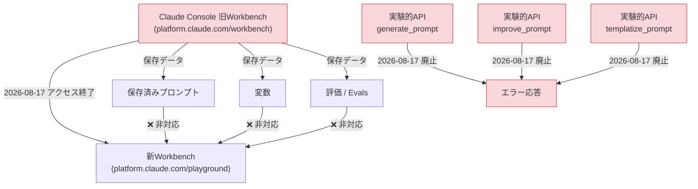
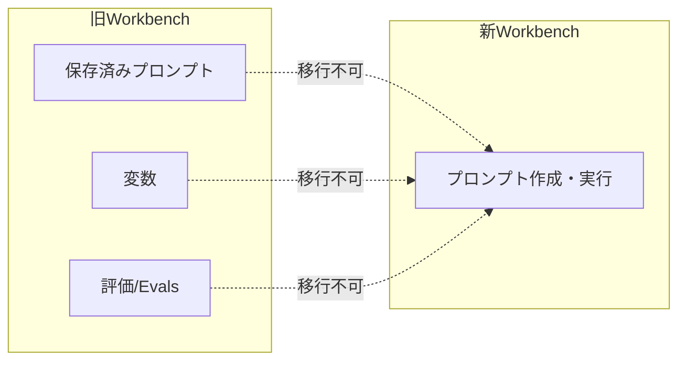

## はじめに

2026年7月17日付でAnthropicから、Claude Developer Platform（Claude Console）に関する重要な廃止告知がありました。

- **旧Workbench**（`platform.claude.com/workbench`）が**2026年8月17日にアクセス終了**
- 同日、**実験的プロンプトツールAPI 3種**（`generate_prompt` / `improve_prompt` / `templatize_prompt`）も**廃止**

特に実験的プロンプトツールAPIは `severity: critical` と評価されており、これらのAPIをCI/CDパイプラインや社内ツールに組み込んでいる場合、廃止日以降はリクエストが**エラーで失敗する**破壊的変更です。移行猶予は約1ヶ月しかないため、早めの棚卸しが必要です。

> **📌 影響を受ける人**
> - Claude ConsoleのWorkbenchで作成したプロンプト・変数・評価（evals）を保存している人
> - `/v1/experimental/generate_prompt`、`/v1/experimental/improve_prompt`、`/v1/experimental/templatize_prompt` をコードやスクリプトから呼び出している人
> - 社内でプロンプトエンジニアリング支援ツールをこれらのAPI上に構築しているチーム

## 変更の全体像

今回の変更は「旧Workbenchの廃止」と「それに付随する実験的APIの廃止」がセットになっています。関係性を図で整理します。



旧Workbenchの終了と実験的API群の廃止が**同一日（2026年8月17日）**に発生する点がポイントです。データ移行とコード移行を並行して進める必要があります。

## 変更内容

### 1. 旧Workbench（Claude Console）の廃止

| 項目 | 内容 |
|---|---|
| 対象 | `platform.claude.com/workbench`（レガシー版） |
| 廃止日 | 2026年8月17日 |
| severity | high |
| 後継 | 新Workbench（`platform.claude.com/playground`） |
| 非対応データ | 保存済みプロンプト、変数、評価（evals） |
| データ保持方法 | 画面上のバナー、または Organizational Settings からエクスポート |

新旧Workbenchの機能差分は次の通りです。



### 2. 実験的プロンプトツールAPIの廃止（Breaking Change / critical）

| エンドポイント | 用途 | 廃止後の挙動 |
|---|---|---|
| `POST /v1/experimental/generate_prompt` | プロンプトの生成 | エラーを返す |
| `POST /v1/experimental/improve_prompt` | プロンプトの改善 | エラーを返す |
| `POST /v1/experimental/templatize_prompt` | プロンプトのテンプレート化 | エラーを返す |

> **⚠️ Breaking Change**
> 2026年8月17日以降、上記3エンドポイントへのリクエストは全てエラーになります。これらを利用した自動化スクリプト・社内ツール・CIジョブがある場合、**廃止日までに移行または呼び出し箇所の削除**が必須です。

## 影響と対応

### やるべきことチェックリスト

1. **旧Workbenchのデータ棚卸し**：保存済みプロンプト・変数・評価（evals）を洗い出す
2. **エクスポート実行**：画面バナーまたは Organizational Settings からデータをエクスポート
3. **実験的APIの利用箇所を検索**：リポジトリ内で `generate_prompt` `improve_prompt` `templatize_prompt` を grep して洗い出す
4. **代替実装への置き換え**：新Workbench上での手動プロンプト作成、または通常の Messages API を用いた自前ロジックへ移行
5. **期限までに動作確認**：2026年8月17日より前に、移行後のコードが問題なく動くことを確認

判断フローにすると以下のようになります。

```mermaid
flowchart TD
    Start[現状のClaude利用を確認] --> Q1{旧Workbenchに\n保存データがある?}
    Q1 -->|Yes| Export[データをエクスポート]
    Q1 -->|No| Q2
    Export --> Q2{実験的API\n(generate/improve/templatize_prompt)\nを使っている?}
    Q2 -->|Yes| Migrate[代替実装へ移行 or\n呼び出しコードを削除]
    Q2 -->|No| Done[対応不要]
    Migrate --> Deadline["2026-08-17までに完了"]
    Deadline --> Done
```

### CLAUDE.mdなどの内部ドキュメント更新

社内のガイドラインやREADMEに実験的APIの利用に関する記述がある場合、以下のような注意書きを追記しておくと安全です。

```diff
## API利用上の注意
+ - 実験的プロンプトツールAPI（/v1/experimental/generate_prompt、improve_prompt、
+   templatize_prompt）は2026年8月17日に廃止されます。
+   これらのエンドポイントは新規に使用しないでください。既存の依存コードは
+   移行または削除が必要です。
```

## コード例

実験的APIを直接呼び出しているコードがある場合の対応イメージです。

**Before（廃止予定の実験的APIを利用）**

```python
import anthropic

client = anthropic.Anthropic()

# 2026-08-17に廃止される実験的エンドポイント
response = client.post(
    "/v1/experimental/generate_prompt",
    json={"task": "カスタマーサポート向けの丁寧な返信を生成するプロンプトを作って"}
)
generated_prompt = response.json()["prompt"]
```

**After（通常のMessages APIで代替実装）**

```python
import anthropic

client = anthropic.Anthropic()

# 通常のMessages APIを使い、プロンプト生成そのものをタスクとして依頼する
response = client.messages.create(
    model="claude-opus-4-8",
    max_tokens=1024,
    messages=[
        {
            "role": "user",
            "content": "カスタマーサポート向けの丁寧な返信を生成するための"
                        "システムプロンプトを作成してください。"
        }
    ]
)
generated_prompt = response.content[0].text
```

> **💡 Tips**
> 実験的APIが担っていた「プロンプト生成・改善・テンプレート化」は、通常のMessages APIに対して「〇〇するためのプロンプトを作って」と依頼するだけでほぼ同等の結果が得られます。専用エンドポイントへの依存を減らすことで、今後の廃止リスクにも強い実装になります。

## まとめ

- **旧Workbench**（`platform.claude.com/workbench`）は**2026年8月17日にアクセス終了**。保存済みプロンプト・変数・評価（evals）は新Workbenchに引き継がれないため、事前のエクスポートが必須
- **実験的プロンプトツールAPI 3種**（`generate_prompt` / `improve_prompt` / `templatize_prompt`）も同日廃止。廃止後はエラーになる破壊的変更（severity: critical）
- 対応の猶予は**約1ヶ月**。リポジトリ内の利用箇所の洗い出しとデータエクスポートを早めに実施することを推奨
- 代替として、通常の Messages API に対してプロンプト生成タスクを依頼する実装で多くのケースをカバー可能

期限が近いため、まずは自分たちのプロダクトやスクリプトが該当エンドポイントに依存していないか、今すぐ確認することをおすすめします。
