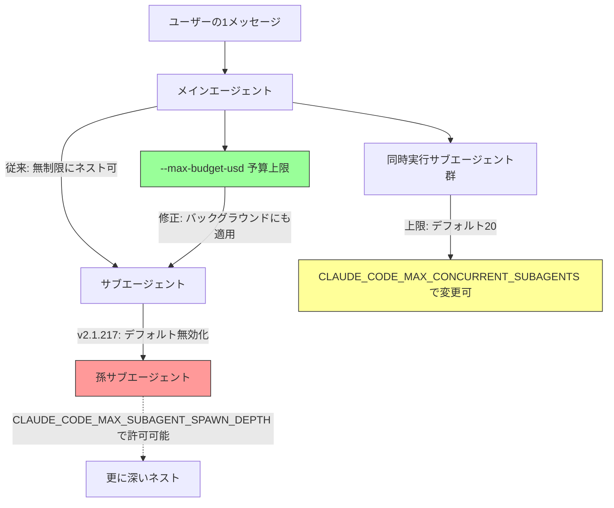
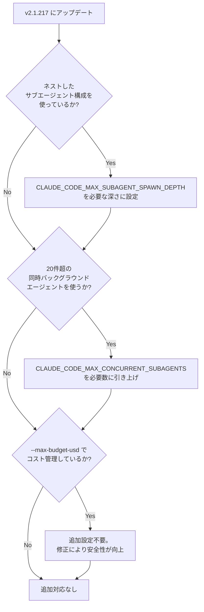

## はじめに

2026年7月、Claude Code の最新リリース **v2.1.217** が公開されました。今回のアップデートは合計20件の変更を含みますが、中でも注目すべきは **サブエージェント（Subagent）関連の仕様変更** です。

複数のサブエージェントを組み合わせてワークフローを自動化している人にとっては、**何もしていないのに突然エージェントが起動しなくなる／制限にかかる** という事態が起こり得る、実務上インパクトの大きい変更が含まれています。

また、セキュリティ・エンタープライズ利用に関わる重要なバグ修正も同時に入っているため、本記事ではこれらを中心に整理します。

> **📌 影響を受ける人**
> - サブエージェントからさらにサブエージェントを起動する「ネスト構成」のワークフローを組んでいる人
> - 1つの指示から大量のバックグラウンドエージェントをファンアウトさせる運用をしている人
> - `--max-budget-usd` でコスト上限を管理している人
> - 企業ネットワーク（mTLS・プロキシ等）配下で Claude Desktop 経由で Claude Code を使っている人
> - Windows で Claude Code を自動更新している人

## 変更の全体像

サブエージェント周りの変更を中心に、全体の関係性を図示します。



図中の赤（ネスト無効化）と黄（同時実行数上限）が、既存ワークフローに影響しうる箇所です。緑（予算上限修正）は安全側の修正なので、基本的に恩恵を受けるだけです。

## 変更内容

### 1. サブエージェントのネスト生成がデフォルト無効に（Breaking Change）

> **⚠️ Breaking Change**
> サブエージェントが、さらに別のサブエージェントを起動する「ネスト構成」がデフォルトで無効化されました。

| 項目 | 内容 |
|---|---|
| 変更前 | サブエージェントから孫サブエージェントへの起動が制限なく可能 |
| 変更後 | デフォルトでネスト生成が無効。深いネストを使うワークフローは動作が変わる |
| 対応方法 | 環境変数 `CLAUDE_CODE_MAX_SUBAGENT_SPAWN_DEPTH` で許可する深さを明示的に設定 |
| 影響度 | 🟡 要チェック（severity: high） |

複数階層のオーケストレーション（例: 「調査エージェント → その配下に検証エージェントを都度生成する」ような構成）を組んでいる場合、**アップデート後にエージェントが生成されず処理が止まる／期待した挙動にならない** といった形で気づくことになります。

### 2. 同時実行サブエージェント数の上限を追加（デフォルト20）

| 項目 | 内容 |
|---|---|
| 変更前 | バックグラウンドエージェントの同時実行数に上限なし |
| 変更後 | デフォルト20件に制限。超過分はキュー・制限される |
| 対応方法 | 環境変数 `CLAUDE_CODE_MAX_CONCURRENT_SUBAGENTS` で上限を変更可能 |
| 影響度 | 🟡 要チェック（severity: medium） |

1メッセージから大量のバックグラウンドエージェントをファンアウトさせる運用（大規模並列レビューや一括調査タスクなど）をしている場合、20件を超えるあたりから挙動が変わる可能性があります。

### 3. `--max-budget-usd` がバックグラウンドサブエージェントを停止しない問題を修正

従来、コスト上限 `--max-budget-usd` を設定していても、**バックグラウンドで動くサブエージェントはその制御の外側**にあり、予算超過後も動き続けてしまうことがありました。

修正後は、上限到達後に新規のサブエージェント生成が拒否され、すでに実行中のバックグラウンドエージェントも停止されるようになります。コスト管理を厳密に行っている場合は、意図しない超過が防げるようになった、というポジティブな修正です。

### 4. セキュリティ関連の修正: シンボリックリンク経由のワークスペース脱出

バックグラウンドセッションの分離（isolation）処理が、シンボリックリンクされた作業ディレクトリを正規化していなかったため、**セッションが指定ワークスペースの外に出られてしまう**不具合がありました。パスの正規化により、この脱出経路が塞がれています。

### 5. Claude Desktop のエンタープライズ向けネットワーク設定が無視される問題を修正

Claude Desktop 経由のセッションで、企業向けの **mTLS 証明書・TLS 検証・OAuth スコープ・プロキシ設定** が適用されていなかった問題が修正されました。影響スコアは70（🔴 直接影響）と高く、企業ネットワーク配下で Claude Desktop から Claude Code を利用している場合は特に確認しておきたい修正です。

### 6. Windows 自動更新で `claude.exe` が消失する問題を修正

Windows で自動更新に失敗すると実行ファイルそのものが消えて CLI が起動不能になるケースがありましたが、失敗時に保全済みの実行ファイルへ自動復元されるようになりました。

### その他の主な修正（影響は限定的）

| 変更 | 概要 |
|---|---|
| MCP ツール出力切り詰め時のメモリリーク修正 | 大きな出力を返す MCP を多用する長時間セッションでのメモリ肥大化を解消 |
| Bedrock 上の Opus 4.8 で auto-compact が動作しない問題 | Bedrock 環境でコンテキスト圧縮が機能していなかったのを修正 |
| managed settings の OTEL エンドポイント統制漏れ | 下位スコープの設定でテレメトリ送信先が回避されてしまう問題を修正 |
| 絵文字ショートコード自動補完 | `:heart:` のような入力を補完する新機能（`emojiCompletionEnabled` で無効化可） |

## 影響と対応

サブエージェントを使ったワークフローを運用している場合、以下の順でチェックすることを推奨します。



> **💡 Tips**
> `CLAUDE.md` にサブエージェント運用のポリシーを書いている場合は、以下のような追記をしておくと、チームメンバーが同じ落とし穴にはまらずに済みます。

## コード例

環境変数による設定の Before/After です。

**Before（v2.1.217 以前・暗黙的にネスト無制限）**

```bash
# 特別な設定なしでネストしたサブエージェントが動作していた
claude
```

**After（v2.1.217 以降・明示的な設定が必要）**

```bash
# ネストしたサブエージェント構成を維持したい場合
export CLAUDE_CODE_MAX_SUBAGENT_SPAWN_DEPTH=3

# 大量の並列バックグラウンドエージェントを使う場合
export CLAUDE_CODE_MAX_CONCURRENT_SUBAGENTS=50

claude
```

`CLAUDE.md` への追記例（サブエージェント運用セクション）:

```markdown
## サブエージェント運用

- v2.1.217 以降、ネストしたサブエージェント生成はデフォルト無効です。
  ネスト構成が必要な場合は `CLAUDE_CODE_MAX_SUBAGENT_SPAWN_DEPTH` を設定してください。
- 同時実行サブエージェント数はデフォルト20件に制限されています。
  超える場合は `CLAUDE_CODE_MAX_CONCURRENT_SUBAGENTS` で上限を引き上げてください。
```

## まとめ

- **サブエージェントのネスト生成がデフォルト無効化**（Breaking Change）。ネスト構成のワークフローは `CLAUDE_CODE_MAX_SUBAGENT_SPAWN_DEPTH` の設定が必須
- **同時実行サブエージェント数の上限（デフォルト20）**が新設。大規模ファンアウト運用は `CLAUDE_CODE_MAX_CONCURRENT_SUBAGENTS` を要確認
- `--max-budget-usd` がバックグラウンドエージェントにも確実に効くよう修正され、コスト管理の安全性が向上
- シンボリックリンク経由のワークスペース脱出、Claude Desktop のエンタープライズネットワーク設定無視、Windows 自動更新時の実行ファイル消失など、重要なセキュリティ・安定性の修正も同時に含まれる

サブエージェントを活用した自動化パイプラインを組んでいるチームは、アップデート前に **ネスト構成の有無** と **同時実行数** の2点だけは必ず確認しておくことをおすすめします。
