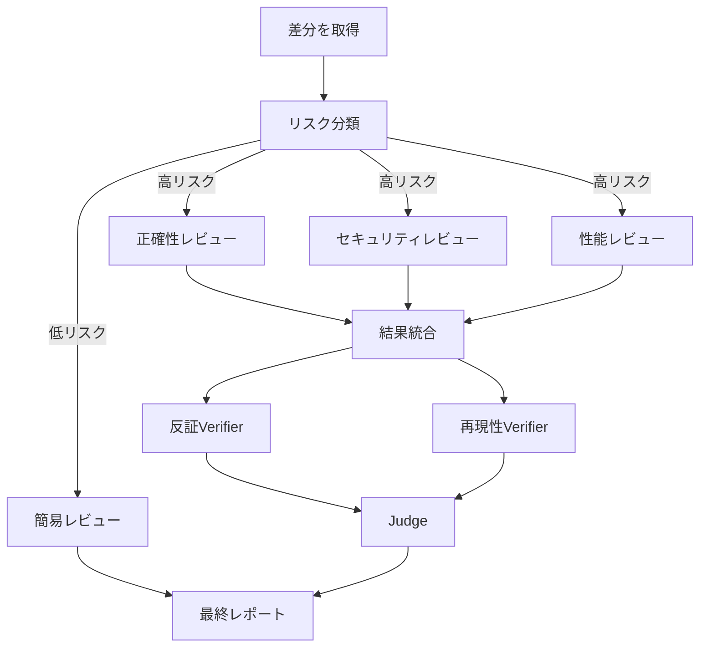
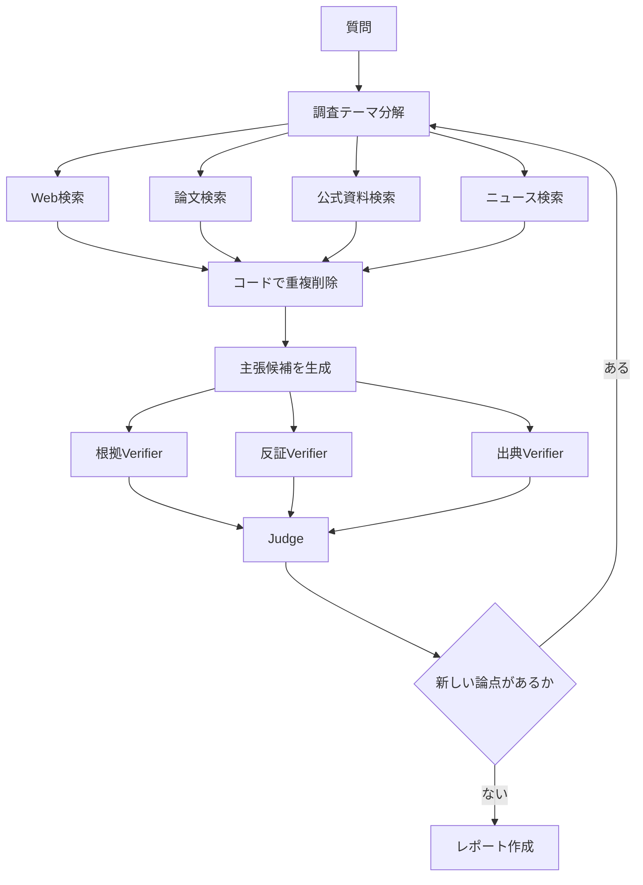
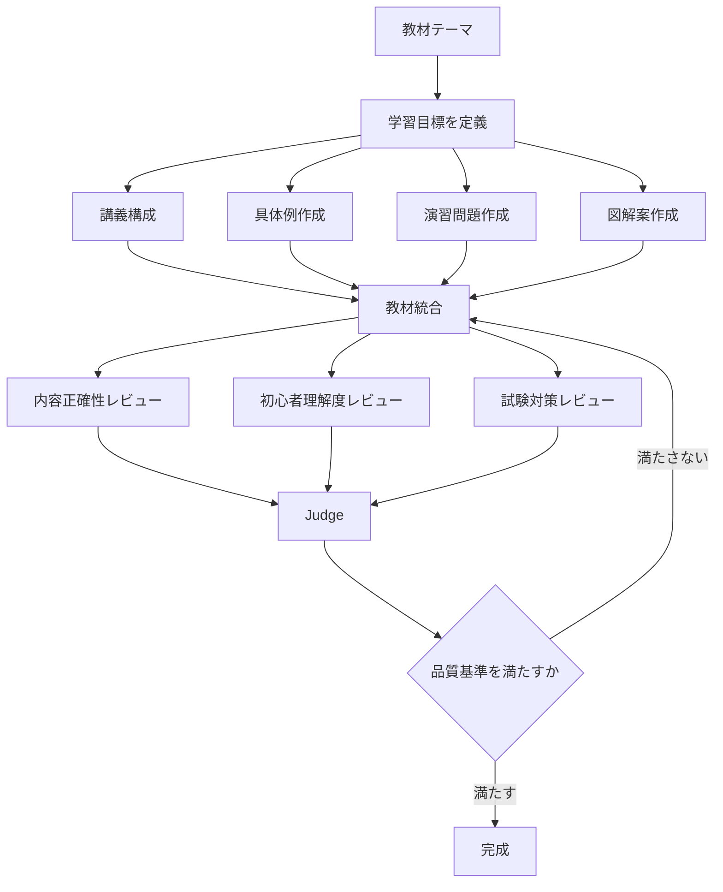

## 検証・障害分離・ループ・モデル選択で、AIエージェントを実用システムにする

> Graph Engineeringの本当の価値は、たくさんのAIを同時に動かすことではありません。
>
> **失敗しても止まらず、間違いを検証し、コストを制御しながら、目的に収束させること**にあります。

前回は、Graph Engineeringの基本として、次の概念を解説しました。

- Node
- Edge
- Parallel
- Fan-out
- Fan-in
- Router
- Verifier
- Pipeline
- Barrier

今回は、Graph Engineeringを実用システムへ発展させるための設計パターンを解説します。

扱うテーマは次のとおりです。

1. Node Contract
2. Edge Contract
3. Failure Isolation
4. Adversarial Verification
5. Judge Pattern
6. Loop until Dry
7. Model Tiering
8. Topology Design
9. Deterministic Edge
10. Observability

---

## 1. Graph Engineeringは「Agentの数」ではない

Graph Engineeringという言葉を聞くと、次のようなシステムを想像するかもしれません。

```text
Agent A
Agent B
Agent C
Agent D
Agent E
```

しかし、Agentを増やすだけでは、良いシステムにはなりません。

むしろ、設計せずにAgentを増やすと、次の問題が発生します。

- 同じ調査を何度も行う
- Agent同士の出力形式が合わない
- 誰の回答が正しいか分からない
- 1つのAgentの失敗で全体が停止する
- トークン消費が急増する
- いつ処理が終了するのか分からない

重要なのは、Agentの数ではありません。

重要なのは、次の4点です。

```text
何を入力するか

何を出力するか

どこへ渡すか

失敗したときにどうするか
```

---

## 2. Node Contract

Graphの各Nodeには、明確な契約が必要です。

これを **Node Contract** と呼びます。

Node Contractでは、最低限、次の3つを決めます。

- 入力
- 出力
- 責務

例えば、企業情報を調査するAgentを考えます。

悪い設計は次のようなものです。

```text
この会社について詳しく調べてください。
```

これでは、何を調べるのか、どの形式で返すのかが不明です。

良い設計では、役割と出力形式を限定します。

```text
役割:
企業の公開情報を調査する。

入力:
企業名、公式サイトURL

出力:
JSON形式で次の項目を返す。

- companyName
- businessSummary
- employeeCount
- revenue
- sources
```

Nodeの仕事を小さく限定すると、次の利点があります。

- 並列化しやすい
- テストしやすい
- 再利用しやすい
- 交換しやすい
- 失敗原因を特定しやすい

---

## 3. 構造化出力を使う

Agent同士を自然文だけで接続すると、システムが不安定になります。

例えば、調査Agentが次のように回答したとします。

```text
この会社は、どうやら成長しているようです。
社員数も増えていると思われます。
```

人間には読めますが、次のAgentが正確に処理するには不向きです。

そこで、JSONなどの構造化データを使います。

```json
{
  "companyName": "Example株式会社",
  "growthStatus": "growing",
  "employeeCount": 320,
  "confidence": 0.82,
  "sources": [
    "https://example.com/company"
  ]
}
```

構造化出力には、次の利点があります。

- 必須項目を検証できる
- 型を確認できる
- 後続処理をコード化できる
- Agentを交換しても接続を維持できる
- 自然文の解釈ミスを減らせる

---

## 4. Edge Contract

前回、EdgeはNode同士の順番ではなく、データの流れだと説明しました。

実践では、Edgeにも契約が必要です。

これを **Edge Contract** と考えます。

例えば、ResearcherからReviewerへデータを渡す場合、次の形式を決めます。

```json
{
  "claim": "対象企業は2025年度に売上を20%伸ばした",
  "evidence": [
    {
      "url": "https://example.com/ir",
      "summary": "2025年度売上高は前年比20%増"
    }
  ],
  "confidence": 0.9
}
```

Reviewerはこの形式だけを受け取ります。

```text
Researcher
    │
    │ Claimデータ
    ▼
Reviewer
```

重要なのは、ReviewerがResearcherの会話履歴全体を読む必要がないことです。

必要なデータだけをEdgeで渡します。

これにより、Context Windowの消費を抑えられます。

---

## 5. Edgeでできる処理はコードで行う

Graph Engineeringでは、すべての処理をAIに任せる必要はありません。

例えば、複数のAgentから返ってきた配列を1つにまとめるだけなら、AIは不要です。

```javascript
const items = results.flatMap((result) => result.items);
```

重複URLを削除するだけなら、通常のコードで十分です。

```javascript
const uniqueItems = Array.from(
  new Map(items.map((item) => [item.url, item])).values()
);
```

重要な原則は次のとおりです。

> 判断が必要な処理はAIに任せる。  
> 決定論的に処理できるものはコードに任せる。

AIに向いている仕事は、次のようなものです。

- 意味の理解
- 優先順位付け
- 要約
- 評価
- 仮説生成
- 矛盾の検出

通常のコードに向いている仕事は、次のようなものです。

- 配列の結合
- 重複削除
- 並べ替え
- 型検証
- 条件分岐
- 件数集計
- ファイル保存

すべてをAgentにすると、コストも不確実性も増加します。

---

## 6. Failure Isolation

直列型のAgentでは、途中で1つ失敗すると全体が停止します。

```text
A → B → C → D
        ×
```

Cが失敗すれば、Dは実行されません。

一方、Graphでは失敗をNode単位に閉じ込めます。

```text
        Agent A ○
       ／
入力 ─ Agent B ○ ─ 統合
       ＼
        Agent C ×
       ＼
        Agent D ○
```

Agent Cが失敗しても、A・B・Dの結果は利用できます。

この考え方を **Failure Isolation** と呼びます。

---

## 7. 失敗したNodeをnullとして扱う

並列処理では、失敗したAgentがあっても、全体を例外終了させない設計が重要です。

```javascript
const results = await Promise.all(
  tasks.map(async (task) => {
    try {
      return await runAgent(task);
    } catch (error) {
      console.error(error);
      return null;
    }
  })
);

const succeeded = results.filter(Boolean);
```

この設計では、10個中2個が失敗しても、残り8個の結果を使えます。

ただし、Fan-in側は「全Agentが成功する」と仮定してはいけません。

悪い設計は次のようなものです。

```javascript
if (results.length !== 10) {
  throw new Error("すべてのAgentが成功しませんでした");
}
```

良い設計では、最低成功数を定義します。

```javascript
if (succeeded.length < 6) {
  throw new Error("信頼できる結果数が不足しています");
}
```

---

## 8. RetryはNode単位で行う

失敗時にGraph全体を最初からやり直すと、コストが大きくなります。

```text
A ○
B ○
C ×
D 未実行

全体を最初から再実行
```

これでは、成功したAとBの処理まで繰り返してしまいます。

Node単位で再実行します。

```text
A ○ 保存済み
B ○ 保存済み
C × → Cだけ再実行
D ○
```

実務では、次の情報を保存しておくとよいでしょう。

- Node ID
- 入力
- 出力
- 実行時刻
- 使用モデル
- トークン数
- 成功・失敗
- エラーメッセージ
- 再実行回数

---

## 9. Agent同士の書き込み競合

複数のCoding Agentを並列実行すると、同じファイルを同時に変更する可能性があります。

```text
Coder A ─┐
         ├─ src/app.tsを書き換える
Coder B ─┘
```

この場合、次の問題が起こります。

- 片方の変更が消える
- マージに失敗する
- テスト結果が不安定になる
- どのAgentが何を変更したか分からなくなる

対策として、Agentごとに作業領域を分離します。

```text
Coder A → Worktree A

Coder B → Worktree B

Coder C → Worktree C
```

各Agentが別々のGit worktreeや一時ディレクトリで作業し、最後に変更を統合します。

---

## 10. Verifierは「確認するAgent」ではない

Verifierに対して、次のように指示するだけでは不十分です。

```text
この回答が正しいか確認してください。
```

AIは前の回答に引きずられやすいため、そのまま同意する可能性があります。

より強力なのは、**反証を目的にすること**です。

```text
この主張が間違っている証拠を探してください。

誤り、飛躍、証拠不足、再現不能のいずれかを発見してください。
```

この設計を **Adversarial Verification** と呼びます。

---

## 11. Adversarial Verification

例えば、Researcherが次の主張を出したとします。

```text
このライブラリには重大な脆弱性がある。
```

これを複数のVerifierに渡します。

```text
                  Verifier A
                 正確性の観点
                ／
Finding ───── Verifier B
                セキュリティの観点
                ＼
                  Verifier C
                 再現性の観点
```

それぞれ異なる観点を持たせます。

### Verifier A：正確性

```text
主張と証拠の間に論理的な飛躍がないか確認する。
```

### Verifier B：セキュリティ

```text
実際に攻撃可能な条件が成立するか確認する。
```

### Verifier C：再現性

```text
記載された手順で問題を再現できるか確認する。
```

同じプロンプトを3回実行するより、異なる視点を与えた方が効果的です。

---

## 12. 多数決だけでは不十分

3人のVerifierのうち2人が正しいと言ったら採用する、という設計は分かりやすい方法です。

```text
Verifier A：正しい
Verifier B：正しい
Verifier C：誤り

2対1で採用
```

しかし、多数決には弱点があります。

同じモデル、同じ情報、同じプロンプトを使っている場合、3人が同じ間違いをする可能性があります。

そこで、Verifierに多様性を持たせます。

- 異なるプロンプト
- 異なる役割
- 異なる検索方法
- 異なるモデル
- 異なる温度設定
- 異なる証拠

重要なのはAgentの人数ではなく、**判断経路の多様性**です。

---

## 13. Judge Pattern

複数の回答候補から最良のものを選ぶ場合は、Judge Patternを使います。

```text
           Answer A
          ／
入力 ─── Answer B
          ＼
           Answer C

              │
              ▼

          Judge Panel

              │
              ▼

          Final Answer
```

例えば、3つのAgentに異なる方針でコードを書かせます。

- Agent A：可読性重視
- Agent B：速度重視
- Agent C：保守性重視

次に、Judgeが採点します。

```json
{
  "correctness": 8,
  "security": 9,
  "performance": 7,
  "maintainability": 9,
  "total": 33
}
```

最高得点の案をそのまま採用する方法もあります。

ただし、よりよい方法は、各案の優れた部分を統合することです。

```text
Aの可読性

＋

Bの処理速度

＋

Cの保守性

↓

最終案
```

---

## 14. Judge自身も間違える

JudgeもAIなので、評価を誤る可能性があります。

そのため、重要な判断ではJudgeを複数にします。

```text
Answer A
Answer B
Answer C
    │
    ├── Judge 1
    ├── Judge 2
    └── Judge 3
          │
          ▼
      Score統合
```

Judgeには、できるだけ具体的な評価基準を与えます。

悪い基準は次のようなものです。

```text
最も良い回答を選んでください。
```

良い基準は次のようなものです。

```text
次の基準で各回答を10点満点で評価してください。

- 正確性
- 根拠の明確さ
- 実行可能性
- セキュリティ
- 保守性

各点数の理由も示してください。
```

---

## 15. LoopをGraphに加える

すべてのGraphがDAGである必要はありません。

DAGとは、循環を持たない有向グラフです。

```text
A → B → C
```

しかし、実際のAIシステムでは、繰り返しが必要なことがあります。

```text
探索

↓

新しい発見

↓

検証

↓

再探索
```

このように、前のNodeへ戻るEdgeを追加します。

```text
Finder
   │
   ▼
Verifier
   │
   ▼
新発見あり？
   │
   ├─ Yes → Finderへ戻る
   │
   └─ No  → 終了
```

---

## 16. 無限ループを防ぐ

Loopを導入すると、無限にAgentを実行し続ける危険があります。

次のような終了条件を必ず設けます。

- 最大実行回数
- 最大トークン数
- 最大費用
- 最大実行時間
- 新しい発見がない
- 品質スコアが基準を超えた
- 同じ回答が繰り返された

複数の終了条件を組み合わせることが重要です。

```javascript
while (
  round < MAX_ROUNDS &&
  cost < MAX_COST &&
  dryRounds < MAX_DRY_ROUNDS
) {
  // Agentを実行
}
```

---

## 17. Loop until Dry

未知のバグを探す場合、最初からバグの数は分かりません。

そこで使えるのが **Loop until Dry** です。

意味は、

> 新しい発見が出なくなるまで繰り返す

ということです。

```text
第1回：5件発見

第2回：2件発見

第3回：1件発見

第4回：0件

第5回：0件

終了
```

1回だけ0件だった場合、偶然見つからなかった可能性があります。

そのため、2回連続で新規発見がなければ終了する、といった条件を使います。

---

## 18. confirmedではなくseenで重複排除する

Loop until Dryで重要なのが、重複排除です。

次の2種類を区別します。

- `seen`：一度でも発見したもの
- `confirmed`：検証を通過したもの

重複排除は`confirmed`ではなく、`seen`に対して行います。

なぜなら、却下された発見も再び出てくる可能性があるからです。

```text
第1回

バグAを発見
↓
Verifierが却下

第2回

再びバグAを発見
↓
Verifierが却下

第3回

再びバグAを発見
```

`confirmed`だけで重複排除すると、同じ候補を何度も検証します。

```javascript
const seen = new Set();
const confirmed = [];

for (const finding of findings) {
  const id = createFindingId(finding);

  if (seen.has(id)) {
    continue;
  }

  seen.add(id);

  if (await verify(finding)) {
    confirmed.push(finding);
  }
}
```

---

## 19. Model Tiering

Graphでは、すべてのNodeに最高性能モデルを使う必要はありません。

Nodeによって必要な能力が違うからです。

例えば次のように分けます。

| Node | 仕事 | モデル |
|---|---|---|
| Extractor | データ抽出 | 軽量モデル |
| Classifier | 分類 | 軽量モデル |
| Researcher | 情報収集 | 中位モデル |
| Verifier | 検証 | 高性能モデル |
| Synthesizer | 最終統合 | 高性能モデル |

これを **Model Tiering** と呼びます。

---

## 20. 高性能モデルを使う場所

高性能モデルを使うべきなのは、判断の影響が大きいNodeです。

例えば次のNodeです。

- Planner
- Judge
- Verifier
- Final Synthesizer
- 複雑なコード修正
- 重要な意思決定

一方、次の処理には軽量モデルを使えます。

- 単純な分類
- 項目抽出
- 文書の分割
- タグ付け
- 形式変換
- 定型要約

Graphを使うと、Nodeごとにモデルを変えられるため、品質を維持しながらコストを下げられます。

---

## 21. Topologyが速度を決める

Graphの形を **Topology** と呼びます。

同じAgentを使っていても、Topologyによって速度とコストが変わります。

代表的なTopologyを見てみましょう。

### Chain

```text
A → B → C → D
```

特徴：

- 実装が簡単
- デバッグしやすい
- 遅い
- 途中の失敗に弱い

### Diamond

```text
       B
      ／
A ─── C ─── E
      ＼
       D
```

特徴：

- 並列処理に向く
- 調査やレビューに強い
- 最後にBarrierが必要

### Tree

```text
           A
         ／ ＼
        B   C
       ／＼ ／＼
      D E F G
```

特徴：

- 問題分解に向く
- 幅広く探索できる
- Node数が急増しやすい

### Router

```text
         ┌→ B
A → 判定 ├→ C
         └→ D
```

特徴：

- 入力に応じて処理を変えられる
- 不要な処理を省ける
- 分岐条件の設計が重要

### Pipeline

```text
Item 1：A → B → C

Item 2：    A → B → C

Item 3：        A → B → C
```

特徴：

- 全件の完了を待たない
- 大量データに向く
- ストリーミング処理ができる

### Cyclic Graph

```text
A → B → C
    ↑   │
    └───┘
```

特徴：

- 改善や探索に向く
- 終了条件が必要
- コスト管理が重要

---

## 22. BarrierとPipelineの使い分け

Barrierでは、すべての処理が終わるまで次へ進みません。

```text
A1 ─┐
A2 ─┼─ 全部待つ → B
A3 ─┘
```

一方、Pipelineでは、終わったものから次へ渡します。

```text
A1 → B1 → C1

A2 → B2 → C2

A3 → B3 → C3
```

Barrierが必要なのは、次のような場合です。

- 全候補を比較する
- 全体の重複を削除する
- 全体ランキングを作る
- 全結果を使って結論を出す

Pipelineが適しているのは、次のような場合です。

- 各ファイルを独立して処理する
- 各顧客データを個別に処理する
- 各URLを取得して要約する
- 大量のデータを順次保存する

原則として、全件が必要でなければBarrierを使わない方が高速です。

---

## 23. RouterはAgent、分岐はコード

Router Patternでは、AIに分類を任せ、分岐自体はコードで行うと安定します。

```text
AI：リスクを分類する

コード：分類結果に応じて分岐する
```

例えば次のようにします。

```javascript
const classification = await classifyRisk(diff);

if (classification.severity === "high") {
  return runFullAudit(diff);
}

return runQuickReview(diff);
```

AIにすべて任せると、処理を飛ばしたり、予定外の判断をしたりする可能性があります。

AIの役割は判断です。

コードの役割は制御です。

---

## 24. Graphの状態を保存する

長時間動くGraphでは、状態管理が必要です。

保存すべき情報には、次のものがあります。

```json
{
  "workflowId": "audit-2026-001",
  "currentPhase": "verification",
  "completedNodes": [
    "scope",
    "research-1",
    "research-2"
  ],
  "failedNodes": [
    "research-3"
  ],
  "cost": 4.82,
  "startedAt": "2026-07-24T09:00:00+09:00"
}
```

状態を保存しておけば、途中で停止しても再開できます。

```text
最初から再実行
```

ではなく

```text
失敗した地点から再開
```

が可能になります。

---

## 25. Observability

Graphが複雑になると、最終結果だけを見ても問題の原因が分かりません。

そこで、各Nodeの実行状況を観測できるようにします。

これを **Observability** と呼びます。

最低限、次の項目を記録します。

- Node名
- 開始時刻
- 終了時刻
- 実行時間
- 入力サイズ
- 出力サイズ
- 使用モデル
- トークン数
- 費用
- 成功・失敗
- Retry回数
- Confidence
- 次に進んだEdge

---

## 26. 品質だけでなくコストも測定する

Agent Graphでは、精度を上げようとするとAgent数が増えます。

しかし、Agentを増やせば必ずよくなるとは限りません。

例えば次の2つを比較します。

```text
構成A

Researcher 3人
Verifier 3人
Judge 1人
```

```text
構成B

Researcher 10人
Verifier 10人
Judge 3人
```

構成Bの方が高精度に見えますが、同じ情報を繰り返しているだけかもしれません。

そのため、次の指標を測定します。

- 正答率
- 誤検出率
- 見逃し率
- 実行時間
- トークン数
- 1件あたりの費用
- Agent追加による改善率

Graph Engineeringは、Agentを増やす技術ではありません。

**品質・速度・費用の最適点を設計する技術**です。

---

## 27. 実践例：コードレビューGraph



このGraphには次のパターンが含まれています。

- Router
- Parallel Review
- Fan-in
- Adversarial Verification
- Judge
- Final Synthesis

---

## 28. 実践例：Deep Research Graph



このGraphには、Loop until Dryも含まれています。

---

## 29. 実践例：AI教材作成Graph



このGraphでは、異なる観点のReviewerを使っています。

- 内容は正しいか
- 初心者に理解できるか
- 試験で得点につながるか

同じ教材でも、観点を分けることで品質が上がります。

---

## 30. Graph設計の手順

実際にGraphを作る場合は、次の順番で設計すると分かりやすくなります。

### Step 1：最終出力を決める

```text
何を完成させるのか？
```

例えば

- レポート
- コード
- 提案書
- 教材
- 判断結果

### Step 2：必要な情報を分解する

```text
最終出力を作るために、何が必要か？
```

### Step 3：依存関係を確認する

各処理について問いかけます。

```text
この処理は、直前の結果を本当に必要としているか？
```

必要がなければ並列化できます。

### Step 4：Node Contractを決める

各Nodeの次の項目を決めます。

- 役割
- 入力
- 出力
- 使用モデル
- Retry条件
- Timeout

### Step 5：Edge Contractを決める

Node間で渡すデータ形式を決めます。

### Step 6：コード化できる処理を分離する

次の処理は、なるべく通常のコードで行います。

- 結合
- 重複削除
- ソート
- フィルタリング
- 集計
- 分岐

### Step 7：検証Nodeを置く

重要な主張や判断の前にVerifierを配置します。

### Step 8：失敗時の動作を決める

- 無視して続ける
- Retryする
- 代替Nodeへ進む
- 人間へ確認する
- Graphを停止する

### Step 9：終了条件を決める

Loopがある場合は、費用・回数・時間の上限を設定します。

### Step 10：計測する

Graphを実行して、次の指標を測ります。

- 品質
- 速度
- 費用
- 失敗率
- Retry率

---

## 31. Graphを使わない方がよい場合

Graph Engineeringは、すべての問題に必要なわけではありません。

次のような処理では、1つのAgentで十分です。

- 短い文章の要約
- 単純な翻訳
- 定型メール作成
- 小さなコード修正
- 明確な質問への回答

複雑なGraphを使うと、かえって遅く、高価になります。

Graphが有効なのは、次の条件がある場合です。

- 複数の独立した調査がある
- 複数の観点から検証したい
- 大量のファイルやURLを処理する
- 途中の失敗を許容したい
- 処理経路を条件分岐したい
- 改善ループが必要
- 1つのContext Windowに収まらない

---

## 32. Graph Engineeringの本質

Graph Engineeringの本質は、

```text
AIを増やすこと
```

ではありません。

次のようなシステムを設計することです。

```text
独立した仕事は並列化する

データは構造化して渡す

決定論的処理はコードに任せる

重要な結果は反証させる

失敗を局所化する

必要な場所だけ待つ

安価なモデルと高性能モデルを使い分ける

終了条件を明確にする
```

---

## まとめ

Graph Engineeringを実用化するためには、次の考え方が重要です。

- Node Contract
- Edge Contract
- Failure Isolation
- Retry
- Adversarial Verification
- Judge Pattern
- Loop until Dry
- Model Tiering
- Topology Design
- Observability

AIエージェントの性能は、プロンプトだけでは決まりません。

Agentの性能だけでも決まりません。

最終的な性能を決めるのは、

> **どのNodeを、どのEdgeで、どのようなTopologyとして接続するか**

です。

プロンプトを書く人はAIに質問します。

Agent開発者はAIに仕事を与えます。

Graph Architectは、AIの組織そのものを設計します。

---

## 次回予告

次回は、

# Claude Code Dynamic Workflows

について解説します。

- Claude CodeのSubagent
- Dynamic Workflow
- JavaScriptによるオーケストレーション
- `parallel()`と`pipeline()`
- Workflowの保存と再利用
- コードレビューGraph
- Deep Research Graph

などを、実装イメージとともに紹介します。

---

## シリーズ

- 第1回：Prompt EngineeringからAgent Engineeringへ
- 第2回：Graph Engineering入門
- **第3回：Graph Engineering実践（この記事）**
- 第4回：Claude Code Dynamic Workflows
- 第5回：OpenAI Agents SDK・LangGraph・Google ADK比較
- 第6回：Monadoで作るAgent Operating System
- 第7回：AIエージェント実践事例
