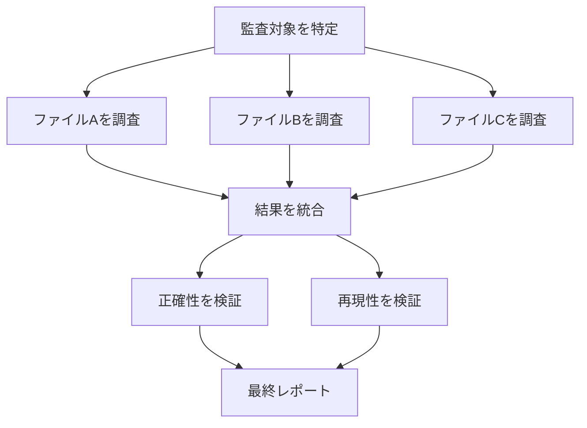
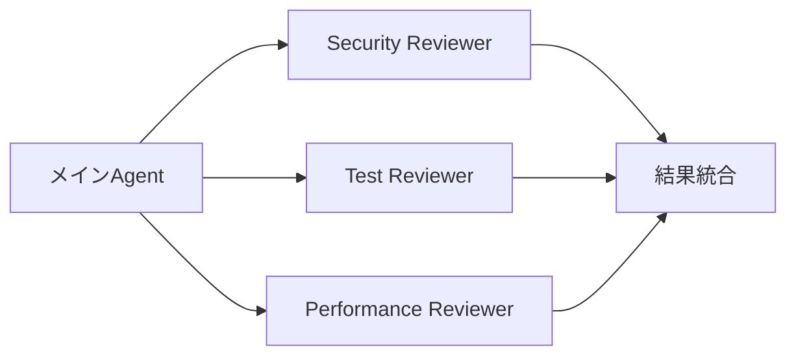
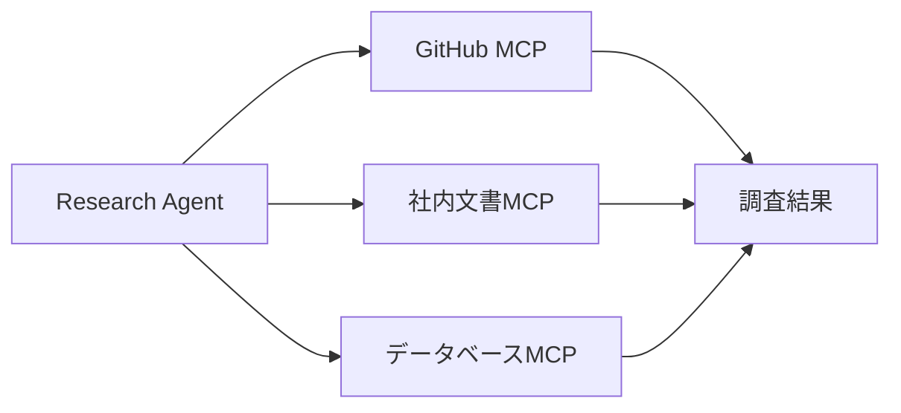
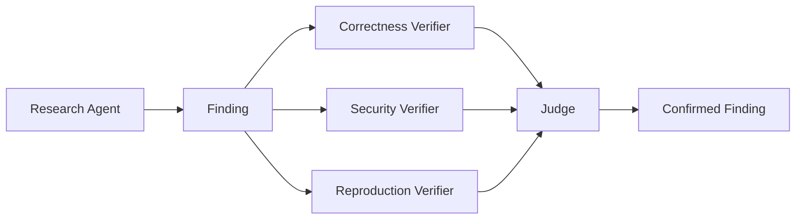
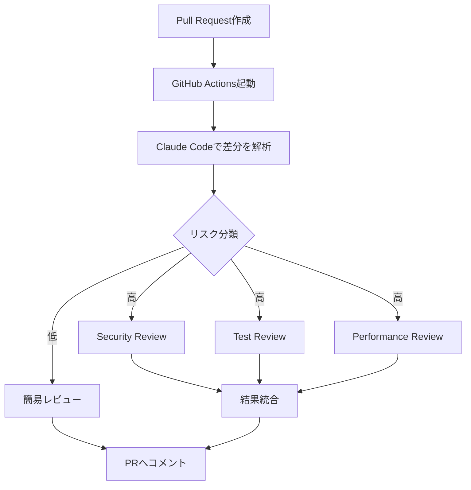
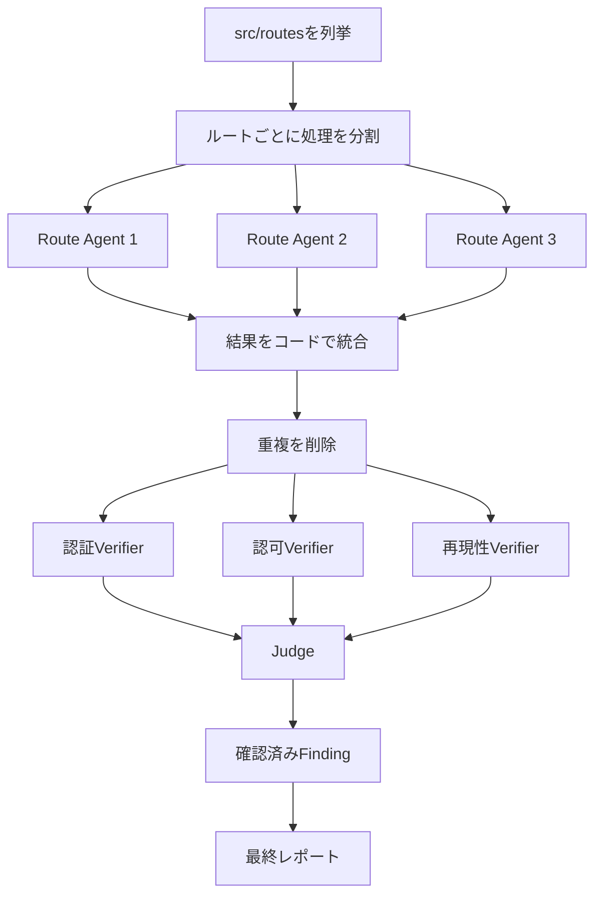
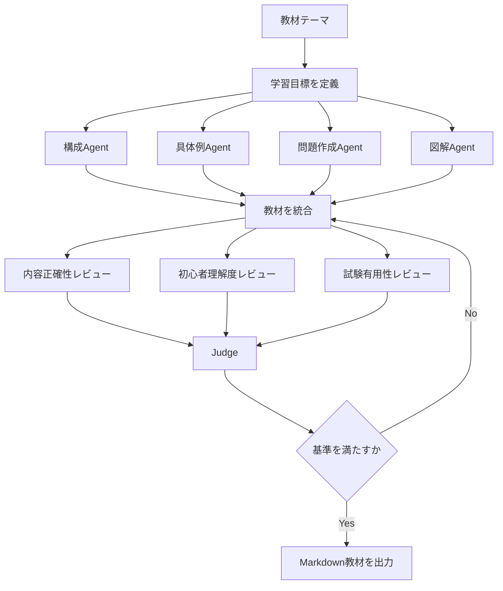

## Subagents・Skills・Hooks・Agent SDKでGraph Engineeringを実装する

> Promptを書く人は、AIに仕事を依頼します。
>
> Agent開発者は、AIに役割を与えます。
>
> Graph Architectは、複数のAgentが協働する仕組みを設計します。

前回は、Graph Engineeringの実践パターンとして、次の内容を解説しました。

- Node Contract
- Edge Contract
- Failure Isolation
- Adversarial Verification
- Judge Pattern
- Loop until Dry
- Model Tiering
- Topology Design
- Observability

今回は、これらの考え方をClaude Codeでどのように実現するかを解説します。

Claude Codeでは、次の機能を組み合わせることで、再利用可能なAIワークフローを構築できます。

- Subagents
- Skills
- Hooks
- CLAUDE.md
- MCP
- Agent SDK
- GitHub Actions

---

## 1. 「Dynamic Workflows」とは何か

まず、言葉を整理します。

「Dynamic Workflows」は、複雑なタスクに応じてAIが処理を分解し、複数のAgentやツールを組み合わせて実行する考え方として使われています。

例えば、コード監査を行う場合、次のような処理が考えられます。

```text
監査対象を特定する

↓

ファイルごとに調査する

↓

結果を統合する

↓

誤検出を検証する

↓

最終レポートを作る
```

これをGraphとして表すと、次のようになります。



本質は、Claude Codeの機能を組み合わせて、次のことを実現することです。

```text
役割を分ける

処理を再利用する

必要な処理を自動実行する

Agent同士のContextを分離する

外部ツールと接続する

実行ルールをコードで制御する
```

---

## 2. Claude Codeとは

Claude Codeは、Anthropicが提供するAgent型の開発ツールです。

単にコードを生成するだけではありません。

Claude Codeは、プロジェクト内のファイルを読み、コードを編集し、コマンドを実行し、テストやGitなどの開発ツールと連携できます。

```text
ユーザーの指示

↓

コードベースを調査

↓

実装方針を考える

↓

ファイルを編集

↓

テストを実行

↓

失敗したら修正

↓

結果を報告
```

つまり、Claude Codeそのものが、すでに基本的なAgent Loopを持っています。

---

## 3. Claude CodeのGraph Engineeringを支える機能

| Graph Engineering | Claude Codeの機能 |
|---|---|
| Node | Subagent、Skill、スクリプト |
| Edge | プロンプト、ファイル、構造化データ |
| Router | Claudeの判断、条件分岐、Hooks |
| Verifier | Review用Subagent |
| Memory | CLAUDE.md、自動メモリ、ファイル |
| Tool | Bash、ファイル操作、MCP |
| Workflow | Skill、Agent SDK、CI/CD |
| Trigger | Hooks、GitHub Actions |
| Isolation | Subagentの独立Context、worktree |

すべてをClaudeの会話だけで処理するのではありません。

AIの判断と、通常のコードによる制御を組み合わせることが重要です。

---

## 4. Subagents

Subagentは、特定の仕事を担当する専用Agentです。

メインのClaudeとは別のContextで動作し、指定された役割、ツール、モデル、指示に基づいて処理します。

例えば、次のようなSubagentを作れます。

```text
security-reviewer
test-runner
researcher
documentation-writer
database-reviewer
```

---

## 5. Subagentを使うメリット

### 5.1 Contextを分離できる

```text
メインAgent
   │
   ├── Security Agent
   ├── Test Agent
   └── Writer Agent
```

### 5.2 専門的な指示を固定できる

### 5.3 使用ツールを制限できる

### 5.4 モデルを使い分けられる

---

## 6. Subagentの定義例

```text
.claude/
└── agents/
    ├── security-reviewer.md
    ├── test-reviewer.md
    └── documentation-writer.md
```

```md
---
name: security-reviewer
description: ソースコードのセキュリティ上の問題を調査する
tools: Read, Grep, Glob
---

あなたはアプリケーションセキュリティの専門家です。

対象コードについて、次の項目を調査してください。

- 認証漏れ
- 認可漏れ
- SQLインジェクション
- コマンドインジェクション
- XSS
- CSRF
- 秘密情報の露出
- 危険なファイル操作

問題を発見した場合は、次の形式で回答してください。

1. 対象ファイル
2. 対象行
3. 問題の説明
4. 発生条件
5. 影響
6. 修正案
7. 確信度

問題が確認できない場合は、推測で報告しないでください。
```

---

## 7. SubagentはGraphのNodeになる



---

## 8. Skills

Skillは、再利用可能な手順や専門知識をClaude Codeへ追加する仕組みです。

```text
Subagent
＝誰が担当するか

Skill
＝どの手順で行うか
```

---

## 9. Skillの構成

```text
.claude/
└── skills/
    └── security-audit/
        ├── SKILL.md
        ├── checklist.md
        └── examples.md
```

```md
---
name: security-audit
description: Webアプリケーションのルートを対象に、認証・認可漏れを監査する
---

# Security Audit

次の手順で監査する。

1. 対象ルートを列挙する
2. 各ルートの認証処理を確認する
3. 認可条件を確認する
4. 入力値検証を確認する
5. 発見事項を構造化する
6. 各発見事項を反証する
7. 確認できた問題だけを報告する
```

---

## 10. CLAUDE.md

`CLAUDE.md`は、プロジェクト全体に共通する指示を書くファイルです。

```md
# Project Instructions

## Architecture

- フロントエンドはNext.js
- APIはFastAPI
- DBはPostgreSQL

## Coding Rules

- TypeScriptではanyを使わない
- Pythonでは型ヒントを必須とする
- 公開関数にはテストを書く
```

---

## 11. Hooks

Hooksは、Claude Codeの特定のタイミングでコマンドや処理を確実に実行する仕組みです。

```text
ファイル編集

↓

Hook発火

↓

Formatter実行

↓

結果をClaudeへ返す
```

```json
{
  "hooks": {
    "PostToolUse": [
      {
        "matcher": "Edit|Write",
        "hooks": [
          {
            "type": "command",
            "command": "npm run format"
          }
        ]
      }
    ]
  }
}
```

---

## 12. MCP

MCPは、Claude Codeと外部ツールやデータソースを接続するための仕組みです。



---

## 13. Router Pattern

```javascript
if (classification.severity === "high") {
  await runFullSecurityAudit();
} else {
  await runQuickReview();
}
```

AIの役割は、リスクを判断することです。

コードの役割は、決められた経路を確実に実行することです。

---

## 14. Parallel Pattern

```javascript
const results = await Promise.all(
  routes.map((route) => auditRoute(route))
);
```

---

## 15. Barrier Pattern

```text
Agent A ─┐
Agent B ─┼→ 全件完了を待つ → 統合
Agent C ─┘
```

---

## 16. Pipeline Pattern

```text
File A：調査 → 検証 → 保存
File B：    調査 → 検証 → 保存
File C：        調査 → 検証 → 保存
```

---

## 17. Verifier Pattern



---

## 18. Failure Isolation

```javascript
async function safeRun(task) {
  try {
    return await task();
  } catch (error) {
    return {
      success: false,
      error: String(error)
    };
  }
}
```

---

## 19. Worktreeによる作業分離

```text
Agent A → Worktree A → Branch A
Agent B → Worktree B → Branch B
Agent C → Worktree C → Branch C
```

---

## 20. Agent SDK

Claude Agent SDKを使うと、Claude CodeのAgent機能をプログラムから利用できます。

```typescript
type Finding = {
  file: string;
  line: number;
  severity: "low" | "medium" | "high";
  description: string;
  evidence: string;
  confidence: number;
};

async function runAudit(files: string[]): Promise<Finding[]> {
  const rawResults = await Promise.all(
    files.map(async (file) => {
      try {
        return await runResearchAgent(file);
      } catch (error) {
        console.error(`Failed: ${file}`, error);
        return [];
      }
    })
  );

  const findings = deduplicate(rawResults.flat());

  const verifiedResults = await Promise.all(
    findings.map((finding) => runVerifierAgent(finding))
  );

  return verifiedResults.filter(
    (result): result is Finding =>
      result !== null && result.confidence >= 0.8
  );
}
```

---

## 21. 状態管理

```typescript
type WorkflowState = {
  workflowId: string;
  phase:
    | "scope"
    | "research"
    | "verification"
    | "synthesis"
    | "completed";
  completedNodes: string[];
  failedNodes: string[];
  totalCost: number;
};
```

---

## 22. GitHub Actionsとの連携



---

## 23. 実践例：認証漏れ監査Workflow



---

## 24. 実践例：教材作成Workflow



---

## 25. Workflowの再利用

```text
.claude/
├── agents/
│   ├── security-reviewer.md
│   ├── test-reviewer.md
│   └── documentation-writer.md
│
├── skills/
│   ├── security-audit/
│   │   └── SKILL.md
│   ├── pr-review/
│   │   └── SKILL.md
│   └── release-notes/
│       └── SKILL.md
│
└── settings.json
```

---

## 26. Claudeに任せる部分とコードに任せる部分

### Claudeへ任せる

- 問題の理解
- タスク分解
- 仮説生成
- 設計判断
- レビュー
- 反証
- 最終的な文章化

### 通常のコードへ任せる

- 並列実行制御
- 条件分岐
- 重複削除
- 型検証
- Retry回数
- Timeout
- 費用上限
- 状態保存
- ログ
- 権限制御

---

## まとめ

Claude CodeでGraph Engineeringを実践するための中心機能は、次のとおりです。

- Subagents
- Skills
- CLAUDE.md
- Hooks
- MCP
- Agent SDK
- GitHub Actions

Claude Codeの価値は、コードを速く書けることだけではありません。

> **AI Agentを部品として組み合わせ、再利用可能な開発組織をコードベースの中に作れること**

にあります。

---

## 次回予告

次回は、主要なAgent開発基盤を比較します。

# OpenAI Agents SDK・LangGraph・Google ADK比較

---

## シリーズ

- 第1回：Prompt EngineeringからAgent Engineeringへ
- 第2回：Graph Engineering入門
- 第3回：Graph Engineering実践
- **第4回：Claude Codeで実践するDynamic Workflows（この記事）**
- 第5回：OpenAI Agents SDK・LangGraph・Google ADK比較
- 第6回：Monadoで作るAgent Operating System
- 第7回：AIエージェント実践事例
