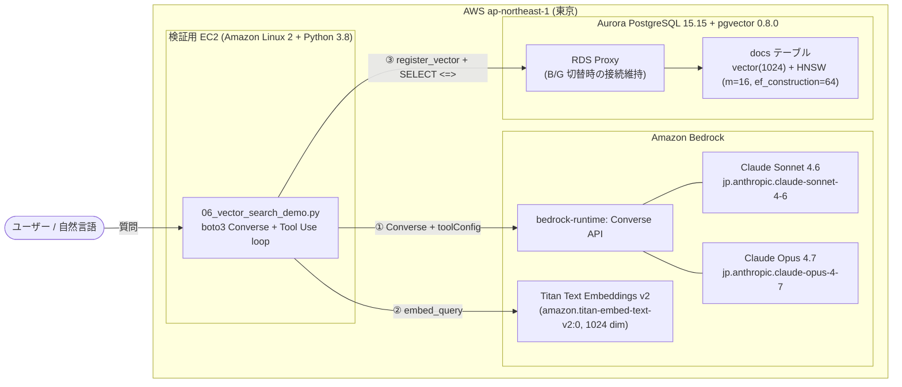
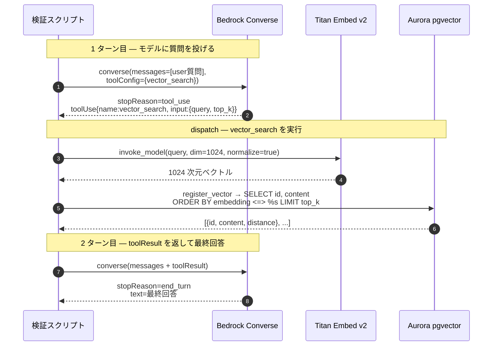

Fin-JAWS LTで発表した、[「ECS タスクを守り抜く！RDS Proxy × Aurora pgvector で実現する止まらない RAG 基盤(の一部‥)」](https://fin-jaws.connpass.com/event/388549/) の続編記事です。LT で残した「Bedrock 連携によるエンドツーエンド」のうち、本記事は **Bedrock 側の組み立て (Tool Use → pgvector 直叩き)** を担当します。

---

## 1. はじめに — LT で残した「宿題」を回収する

Fin-JAWS 2026-05-20 の LT では、Aurora PostgreSQL 15.15 + pgvector 0.8.0 + RDS Proxy という構成で「B/G スイッチオーバー時のクライアント停止時間を RDS Proxy 経由だと大幅に短縮できる」「`register_vector` を接続のたびに呼び直し、retry loop と組み合わせる」というパターンを実証しました。

ただ、タイトルに **「(の一部‥)」** と付けたとおり、LT のスコープは「DB 接続の耐障害性」までで、Bedrock を組み合わせたエンドツーエンドの動作には踏み込めませんでした。LT の続編として残った宿題は、大きく以下の 2 軸に整理できます。

- **(a) 接続耐障害性側の延長**: Bedrock 連携が稼働中に B/G 切替を実行し、Proxy + retry で貫通させる E2E ライブテスト (LT 主題の直接的な続編)
- **(b) Bedrock 連携側の組み立て**: pgvector の検索結果を Claude に渡してエンドツーエンドに回答させる、その「組み立て」自体

**本記事は (b) Bedrock 連携側に着目** します。(a) のライブテストは別記事に分離する想定です。

- **本記事のスコープ**: `boto3` の Converse API + Tool Use で、Claude (Sonnet 4.6 / Opus 4.7) に **`vector_search` ツールを 1 本だけ** 持たせ、実 Aurora pgvector を叩いて最終回答を返す最短経路の組み立て
- **本記事のスコープ外** (= 別記事): (a) の E2E ライブテスト (B/G 切替最中に Bedrock 連携が retry でどう復旧するか)

LT 資産はそのまま流用しています (`01_setup_pgvector.sql` / `register_vector` パターン / RDS Proxy 構成) 。本記事はその上に **Bedrock の Tool Use ループ** を載せた形です。

#### 本記事の検証ゴール

| # | 確認したいこと | 達成判定 |
|---|---|---|
| G1 | SYSTEM_PROMPT + 1 ツール構成で、1st turn の `vector_search` 選択率が安定するか | 全 10 回の実行で `stopReason == tool_use` が 1 ターン目に出る割合 |
| G2 | 取得した文書 ID が期待 ID とどれだけ overlap するか | Q1〜Q3 ごとに `expected_topic_ids` との一致件数を比較 |


#### 結論（先出し）

- 1 ツール構成 + SYSTEM_PROMPT で **1st turn のツール選択ヒット率 10/10 = 100%**、全 10 回が **2 ターンで完結** (`MAX_TURNS = 5` 未到達)
- 取得 ID と期待 ID の一致度は **Q2 = 4/4・Q3 = 2/2 完全一致、Q1 のみ 3〜4 / 5 で周辺文書を 1〜2 件落とす** 傾向

---

## 2. なぜ Knowledge Bases ではなく自前 Tool Use なのか

「Bedrock + RAG + pgvector」で検索すると、国内記事はほぼ **Knowledge Bases(KB) for Amazon Bedrock** ベースに集約されます。KB は Aurora pgvector を backing store として選べますし、フルマネージドで立ち上がりも速いので、**最短で動かすなら KB が正解**です。

それでも今回あえて KB を外し、 `boto3 Converse + Tool Use + 自前 pgvector` を選びました。動機としては **「KB の中に隠れて見えない部分を、SQL レベルで全部見える状態にしたい」** からになります。（あと、最近様々な検証をしている中で結局どんなSQLがどう投げられるのか、を把握しておきたいというのがあるためです。ただ、実用としては KB の方がもちろん利用しやすいです）

| 観点 | Knowledge Bases | 自前 Tool Use + pgvector |
|---|---|---|
| 検索クエリ文 | LLM の質問をそのまま | LLM が tool input で組み立てる + 前処理を挟める |
| 距離関数 | KB の選択肢内 | `<=>` (cosine) / `<->` (L2) / `<#>` (内積) を SQL で自由 |
| top_k / フィルタ | API パラメータ | SQL の WHERE / LIMIT / JOIN で自由 |
| HNSW チューニング | KB 任せ | `SET LOCAL hnsw.ef_search = N` を都度発行可 |
| 接続管理 | KB 内部 (見えない) | psycopg2 + `register_vector` + retry loop が見える |
| Tool 定義 | (KB 自体が tool) | `toolSpec` を自分で書く / 追加 tool も後から足せる |
| SYSTEM_PROMPT | KB の orchestration template 縛り | 自由 |

副次的なメリットとして、LT で書いた `psycopg2 + register_vector + retry loop` の資産がそのまま流用できる、という点もありました。LT の続編としての連続性を出しやすい構成でもありました。

---

## 3. アーキテクチャ全体像

検証用の構成は EC2 1 台で完結する最小構成にしました (LT で ECS Fargate は検証済みなので、今回は Bedrock 連携部分にフォーカスするため簡略化)。

### 3-1. 全体図



| 構成要素 | 採用したもの | 備考 |
|---|---|---|
| 検証用 EC2 | Amazon Linux 2 / Python 3.8 | LT で使ったインスタンスを流用 |
| ベクター DB | Aurora PostgreSQL 15.15 + pgvector 0.8.0 | LT 資産流用 (スナップショットから復元) |
| インデックス | HNSW (`m=16, ef_construction=64`) | pgvector デフォルト値 |
| 距離演算 | cosine (`<=>`) | 1024 dim を L2 正規化済みで使うため |
| Embedding | Amazon Titan Text Embeddings v2 (1024 dim) | `dimensions=1024, normalize=True` |
| LLM | Claude Sonnet 4.6 / Opus 4.7 | `jp.*` Cross-Region Inference Profile |
| 接続 | psycopg2 + `register_vector` (+ RDS Proxy) | LT 資産流用 |

:::note warn
**EC2 環境について**: 本検証は LT で構築済みの EC2 (Amazon Linux 2 / Python 3.8) をそのまま流用しています。Amazon Linux 2 は 2025-06-30、Python 3.8 は 2024-10 にそれぞれサポート終了済みなので、**新規構築時は Amazon Linux 2023 + Python 3.11 以降を推奨**します。本記事のコード自体は boto3 1.36+ / psycopg2 / pgvector の素直な組み合わせなので、新環境でもそのまま動くはずです。
:::

---

## 4. 実装 — Tool 定義 → SYSTEM_PROMPT → ループ

### 4-1. docs テーブルと埋め込み投入

LT で作った `01_setup_pgvector.sql` を 1024 dim 化して再利用します (Titan v2 と次元を揃えるため)。

```sql
CREATE EXTENSION IF NOT EXISTS vector;

DROP TABLE IF EXISTS docs;
CREATE TABLE docs (
    id          BIGSERIAL PRIMARY KEY,
    content     TEXT,
    embedding   vector(1024) NOT NULL,
    created_at  TIMESTAMPTZ NOT NULL DEFAULT NOW()
);

CREATE INDEX docs_embedding_idx
    ON docs
    USING hnsw (embedding vector_cosine_ops)
    WITH (m = 16, ef_construction = 64);
```

データは Aurora / pgvector / Bedrock の運用 Tips 風の Markdown 文書 20 件を `docs/01_*.md` 〜 `docs/20_*.md` として用意し、`05_ingest_docs.py` で Titan Embed v2 によるベクトル化 → INSERT を行いました (1 件あたり 300〜700 文字、合計 20 行)。

```python
# 05_ingest_docs.py の中核
body = json.dumps({
    "inputText": content,
    "dimensions": 1024,
    "normalize": True,
})
resp = bedrock.invoke_model(modelId="amazon.titan-embed-text-v2:0", body=body)
embedding = np.array(json.loads(resp["body"].read())["embedding"], dtype=np.float32)

cur.execute(
    "INSERT INTO docs (content, embedding) VALUES (%s, %s) RETURNING id",
    (content, embedding),
)
```

`register_vector(conn)` は `connect_db()` の中で**毎回呼ぶ**ようにしています。pgvector のデータ型を psycopg2 に認識させる設定は **セッション (接続) 単位でリセットされる** ため、以下のいずれのケースでも呼び直しが必須です。

- RDS Proxy 経由で **B/G 切替や障害発生時に接続が再確立**された
- コネクションプールから **新しい物理接続を取得**した
- retry loop の中で **`psycopg2.connect()` を再実行**した

LT でハマったポイントでもあり、Bedrock Tool Use ループから pgvector を叩く本記事の構成でも同じ前提が効いています。一度設定すれば永続化、と誤解しないことが E2E の耐障害性を担保する隠れた要点です。

### 4-2. `vector_search` ツール定義

`toolConfig` に渡すツールは `vector_search` 1 本だけにしました。NL2SQL や直接 SQL 実行のような派生は今回は外して、フォーカスを絞っています。

```python
VECTOR_SEARCH_TOOL = {
    "toolSpec": {
        "name": "vector_search",
        "description": (
            "Aurora PostgreSQL の pgvector を使ったベクター類似検索を行い、"
            "社内マニュアル・運用ナレッジ・障害事例などの非構造ドキュメントから "
            "クエリに関連する箇所を取得する。手順・定義・概念・原因究明など、"
            "ナレッジ文書の参照が必要な質問に必ず使う。"
        ),
        "inputSchema": {
            "json": {
                "type": "object",
                "properties": {
                    "query":  {"type": "string",  "description": "検索したい自然言語クエリ"},
                    "top_k":  {"type": "integer", "description": "上位何件を取得するか (1-10)", "default": 5},
                },
                "required": ["query"],
            }
        },
    }
}
```

ポイントは `description` を **「ナレッジ文書の参照が必要な質問に必ず使う」** と踏み込んで書いた点です。後述の SYSTEM_PROMPT と相補的に効いて、Tool 選択ヒット率に直結しました。

### 4-3. SYSTEM_PROMPT 設計

SYSTEM_PROMPT は次の 3 点に絞りました。

```python
SYSTEM_PROMPT = (
    "あなたは Aurora pgvector × Bedrock の運用支援アシスタントです。"
    "ユーザーの質問に回答するためには、必ず vector_search ツールを呼び出して"
    "関連ドキュメントを取得し、その内容に基づいて日本語で簡潔に回答してください。"
    "vector_search を使わず憶測で答えてはいけません。"
    "取得した content の事実のみを使い、推測の追加情報は含めないこと。"
)
```

- **vector_search を必ず呼ぶ** (検索ファースト)
- **取得した content の事実のみ使う** (推測フリー)
- **推測の追加情報は含めない** (out-of-knowledge を避ける)


### 4-4. Tool Use ループ

実際の処理フローはこうなります。



dispatch 部分のコードは下記のとおり、`<=>` (cosine 距離) で ORDER BY して上位 `top_k` 件を返すだけです。

```python
def vector_search(bedrock_client, db_conn, query: str, top_k: int = 5):
    vec = embed_query(bedrock_client, query)  # Titan v2 で 1024 dim
    with db_conn.cursor() as cur:
        cur.execute(
            """
            SELECT id, content, embedding <=> %s AS dist
            FROM docs
            ORDER BY embedding <=> %s
            LIMIT %s
            """,
            (vec, vec, top_k),
        )
        rows = cur.fetchall()
    return [{"id": int(r[0]), "content": r[1], "distance": float(r[2])} for r in rows]
```

`<=>` は cosine 距離 (0 で完全一致、1 で無関係、2 で逆向き) で、Titan v2 のベクトルは `normalize=True` で L2 正規化済みなのでそのまま素直に使えます。ループ側は「`stopReason == 'tool_use'` の間だけ dispatch して `toolResult` を `user` ロールで返す、それ以外なら break」という素直な書き方です (`MAX_TURNS = 5` で上限を切っています)。実装全体は約 460 行に収まりました。

---

## 5. 検証結果 — 「Tool Use が 100% 効く」を定量で示す

### 5-1. 検証クエリ

3 つの自然言語クエリを用意し、それぞれに「期待される文書 ID」を `expected_topic_ids` として宣言しておき、retrieval の overlap を機械的に評価できるようにしました。

| ID | クエリ | expected_topic_ids |
|---|---|---|
| Q1 | Aurora の Blue/Green スイッチオーバー中にアプリ側の接続を維持するベストプラクティスは？ | `[2, 3, 6, 4, 5]` |
| Q2 | pgvector の HNSW で `m` と `ef_construction` の意味と推奨値、検索時に効くパラメータは？ | `[9, 11, 12, 14]` |
| Q3 | Amazon Bedrock の Prompt Caching はどのようなケースで効果が出るか？ | `[16, 15]` |

### 5-2. 結果サマリ

Sonnet 4.6 を 7 回 (キャッシュ無 1 回 + キャッシュ有 6 回)、Opus 4.7 を 3 回 (キャッシュ有 3 回)、合計 10 回 回した結果が以下です。

- **ツール選択ヒット率: 10/10 = 100%** — 全 10 回で 1 ターン目に `vector_search` が選択された
- **ターン数**: **全 10 回が 2 ターンで完結** (1 ターン目で tool_use → 2 ターン目で end_turn)。`MAX_TURNS = 5` の上限に到達した実行はゼロ
- **取得 ID と期待 ID の一致度**: Q1 = 3〜4 / 5、Q2 = 4 / 4、Q3 = 2 / 2 (Q1 のみ周辺文書を 1 件落とす傾向)
- **Sonnet vs Opus 応答時間 (キャッシュ有、Sonnet 6 回平均 / Opus 3 回平均)**:
    - Sonnet 4.6 平均 **14,577 ms** (10,139 〜 19,366)
    - Opus 4.7 平均 **10,980 ms** (8,818 〜 12,831)
    - **Opus の方が速い** という意外な結果に
- **出力トークン (Q1 で比較)**: Opus 1,226 tokens、Sonnet (キャッシュ有 2 回) 1,392 / 1,483 tokens — Opus の方が要点を圧縮する傾向

「ツール選択 1 ターン目 100%」は SYSTEM_PROMPT + ツール `description` の合わせ技で十分到達できそうです。LangChain や KB の orchestration テンプレートに頼らずとも、110 行ほどのループで安定して回ります。（実用か、と言われるとちょっと疑問ではありますが）

---

## 6. 考察

### 6-1. なぜ 1st turn のツール選択が 10/10 になったのか

Tool が 1 本しかない状況であっても、SYSTEM_PROMPT で「**vector_search を使わず憶測で答えてはいけません**」と明示し、ツール `description` でも **「ナレッジ文書の参照が必要な質問に必ず使う」** とまで踏み込んで書いた結果、全 10 回とも 1 ターン目で `tool_use` が選ばれました。

検索ファーストを「強い指示」と「強い説明」の両側から押した、というのが構図としては素直で、`MAX_TURNS = 5` の上限ロジックは結局一度も発火しませんでした。

ただし、本検証は **SYSTEM_PROMPT を外した条件 / description を弱めた条件での ablation を行っていない** ため、「SYSTEM_PROMPT と description のどちらが主に効いているか」までは切り分けられていません。今回はあくまで「両方を強めに書けば 1 本ツールでも安定する」という確認に留めます。


### 6-2. Q1 のみ周辺文書を 1〜2 件落とす理由

retrieval の overlap は Q2 = 4/4、Q3 = 2/2 と完全一致だったのに対し、Q1 だけ 3〜4 / 5 と周辺の 1〜2 件を取りこぼしました。Q1 の `expected_topic_ids = [2, 3, 6, 4, 5]` は「Aurora 接続維持」というテーマで意味的に近い文書が 5 件並んでおり、相互の cosine 距離も小さい (互いに近接) という状態だったと考えられます。

HNSW のデフォルト `ef_search` (pgvector では 40) では、距離の僅差で並んでいる近接文書群の境界部分を毎回同じ順序で返すとは限らず、`top_k = 5` の範囲から押し出されてしまうケースが起きうる、という事はあると思います。

---

## 7. 今回扱わなかったこと（今後の課題など）

- B/G 切替最中に Bedrock Tool Use がリアルに retry で復旧する E2E ライブテスト → 次に実施できるとよいな・・
- ECS Fargate 構成 (LT で扱った) → （Finjawsがコンテナ支部との共催だったのでちょっと無理やり感あったけどつなげただけだったので・・・）今回は EC2 に簡略化
- NL2SQL や直接 SQL 実行を加えた multi-tool routing → 将来課題

---

## 8. まとめ

- Knowledge Bases を使わずとも、**`boto3 Converse + Tool Use + Aurora pgvector` の自前組立は簡単なスクリプトで動く**
- Tool 選択は SYSTEM_PROMPT + ツール `description` を整えれば、1st turn で **10/10 = 100%** 安定
- 検索ロジック (距離関数 / top_k / SQL) と接続管理が **SQL レベルで全部見える** 状態になり、デバッグ・チューニング・retry 設計を自分で把握できる（動きが理解できる）
- LT で示した接続耐障害性 (RDS Proxy + `register_vector` + retry loop) の上に、Bedrock 連携を **隠れマネージド層なし** で載せて動かした

KB との「どっちが偉い」勝負ではなく、**「KB で隠れている部分を SQL で書き直すと、こう見える」** という内容として読んでもらえればと。

---

## 参考リンク

### Amazon Bedrock 関連

- [Converse API (Use the Converse API) — Amazon Bedrock User Guide](https://docs.aws.amazon.com/bedrock/latest/userguide/conversation-inference.html)
- [Tool use (function calling) — Amazon Bedrock User Guide](https://docs.aws.amazon.com/bedrock/latest/userguide/tool-use.html)
- [Prompt caching for faster model inference — Amazon Bedrock User Guide](https://docs.aws.amazon.com/bedrock/latest/userguide/prompt-caching.html)
- [Cross-Region inference — Amazon Bedrock User Guide](https://docs.aws.amazon.com/bedrock/latest/userguide/cross-region-inference.html)
- [Claude on Amazon Bedrock — Anthropic Docs](https://docs.anthropic.com/en/api/claude-on-amazon-bedrock)
- [Knowledge Bases for Amazon Bedrock (比較対象)](https://docs.aws.amazon.com/bedrock/latest/userguide/knowledge-base.html)

### Aurora PostgreSQL / pgvector 関連

- [pgvector/pgvector (GitHub) — HNSW インデックスと距離演算子の章を参照](https://github.com/pgvector/pgvector#hnsw)

### このシリーズの前提となる LT

- Fin-JAWS LT (2026-05-20): [「ECS タスクを守り抜く！RDS Proxy × Aurora pgvector で実現する止まらない RAG 基盤(の一部‥)」](https://fin-jaws.connpass.com/event/388549/)
