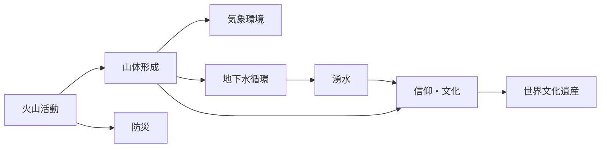
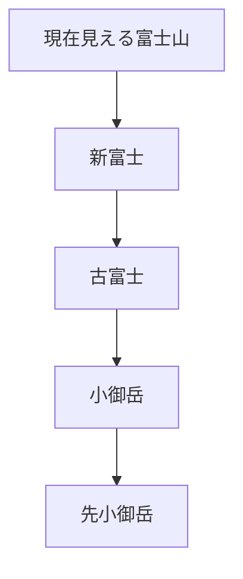
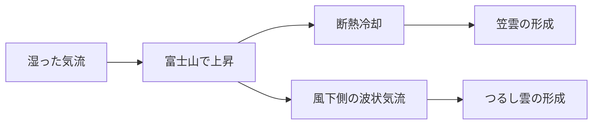
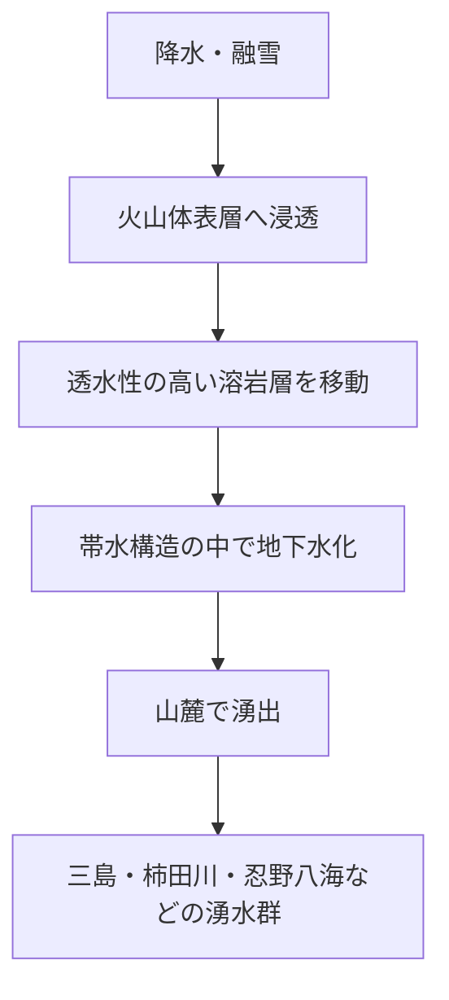

本記事はシリーズ「生成AIで専門技術記事はどこまで作れるか」の一編で、前編の月編と同じ様式を踏襲します。富士山を「美しい山」としてではなく、火山・地形・気象・地下水・信仰・防災が相互に結びついた一つの自然システムとして読み解きます。

同時に、その説明を生成AIで組み立てる際に不可欠な、「確度ラベル」による事実と推測の分離という方法論も実演します。本文では一貫して次のラベルを使います。

- 【観測】観測・測定・地形判読・記録・試料分析などで比較的直接に支えられる内容（広く支持される一次データに基づく整理を含む）
- 【有力仮説】複数の証拠に支えられるが、なお解釈の余地がある内容
- 【計画】制度・運用・対策・手順として決められている内容
- 【予測】将来の噴火時期・規模・影響範囲など、不確実性を含む見通し

【計画】と【予測】について補足します。制度・計画が存在すること自体は事実ですが、その中身（避難の段取りや影響範囲の想定など）は将来の出来事に関する想定を含みます。だからこそ、終章で述べる「想定≠確定」の区別が重要になります。

なお、本文中の模式図（mermaid）は、確度ラベルの対象外です。図は個々の命題を主張するものではなく、要素の関係を整理するための装置として用います。確度ラベル（【観測】【有力仮説】【計画】【予測】）は、あくまで本文の各命題にのみ付与します。

防災情報は更新されうるため、最終確認先は必ず公式資料です。とくに避難計画や警戒情報は、気象庁・内閣府・自治体・富士山火山防災対策協議会の最新資料を参照してください。

## 導入：この記事の作り方と読み方

:::note info
### 生成AIワークフロー

本記事は次の順で作成しました。

1. 一次・準一次資料を先に固定する
   - 気象庁
   - 産業技術総合研究所 地質調査総合センター
   - 防災科学技術研究所
   - 国土地理院
   - 富士山火山防災対策協議会
   - 内閣府
   - 世界遺産関連の公式資料

2. その資料群を前提に、生成AIへ構成案と下書きを作らせる

3. 最後に人手で以下を点検する
   - 確度ラベルが適切か
   - 断定しすぎていないか
   - 出典の向き先が妥当か
   - 「想定」を「確定」に言い換えていないか
:::

この記事の読み方はシンプルです。  
ラベル付きの文を見たら、「何が分かっていて、何がまだ揺れているのか」を意識して読んでください。とくに火山・地下水・防災は、不確実性を含むまま扱うほうが正確です。

また、数値は概算なら必ず「約」を付け、未解明点は断定しない方針で進めます。

## 序章：富士山とは何か

まずは基本諸元です。

| 項目 | 内容 |
|---|---|
| 名称 | 富士山 |
| 標高 | 約3,776 m（剣ヶ峰） |
| 地位 | 日本最高峰 |
| 火山タイプ | 成層火山 |
| 位置 | 山梨県・静岡県にまたがる |
| 世界遺産 | 2013年、「富士山―信仰の対象と芸術の源泉」として世界文化遺産に登録 |

【観測】世界遺産として登録されたのは富士山本体だけではなく、神社・湖沼・登山道などを含む25件の構成資産群です。

富士山は遠くから見ると、周囲からすっと立ち上がる独立峰に見えます。これは単に「一本だけ高い山だから」ではなく、広大な裾野を持ち、周辺地形との相対関係の中で際立って見えるためです。山頂だけでなく、山腹から山麓へなだらかに広がる形そのものが、独立峰らしさを強めています。

本記事の視点は、「美しい円錐形の山」という印象にとどまりません。富士山は次の要素が連結したシステムです。

- 火山としての成り立ち
- 山体がつくる気象環境
- 火山体内部の地下水循環
- それに根ざした信仰と文化
- 将来噴火に備える防災

これらの要素は次のように一つの系として連結しています。

上図は本記事全体の関係を俯瞰した模式図です。各要素の中身とつながりは、以下の各部で順に詳しく見ていきます。

つまり、富士山は地形でもあり、水の装置でもあり、文化の場でもあり、防災の対象でもあります。これらは別々の話ではなく、同じ山体をめぐる連続した現象です。

## 第I部：富士山の成り立ち — いくつもの火山体が重なった山

富士山を理解する第一歩は、「単一のきれいな円錐が一気にできた山」ではないと知ることです。

### 地体構造的に複雑な地域という背景

【観測】富士山周辺は、日本列島の中でも地体構造的に複雑な地域です。複数のプレート運動の影響が重なる場として扱われます。

【有力仮説】一般向け説明では「プレート三重会合付近」と表現されることが多いですが、その位置関係や定義の取り方には議論があります。したがって、これは厳密な一点の観測事実というより、地域の構造的複雑さを要約した整理として読むのが適切です。

【有力仮説】このような構造的背景が、マグマ供給を活発にしうる条件の一つになっていると考えられています。ただし、個々の噴火やマグマ供給の仕組みを単純に「三重会合だから」で説明し切ることはできません。供給機構の細部はなお未解明な点があり、研究途上です。

### 先小御岳→小御岳→古富士→新富士

現在の富士山は、少なくとも大きく見て複数段階の火山体の重なりでできたと理解されています。

上図は山体発達史の模式的整理です。各火山体の存在を支持する観測はありますが、区分境界や年代の細部には解釈の幅があります。

- **先小御岳**
  - 【有力仮説】現在の山体深部を構成する、より古い火山体の一部とされる
- **小御岳**
  - 【観測】山頂部付近の地質・露頭・掘削情報などから、その存在が支持される
  - 【有力仮説】ただし、他の火山体との境界や詳細な履歴には解釈の余地がある
- **古富士**
  - 【観測】現在の富士山の基盤的な火山体の一つとして認識される
  - 【有力仮説】年代区分や成長過程の細部には研究上の幅がある
- **新富士**
  - 【観測】現在の整った山容の主部をつくる比較的新しい火山活動の産物
  - 【有力仮説】どこまでを新富士に含めるかなど、整理の仕方には流儀がある

### どこまでが観測で、どこからが仮説か

観測と仮説の境界を明示しておきます。

【観測】
- 地表の露頭
- ボーリング資料
- 火山噴出物の層序
- 地球物理探査による地下構造の推定
- 岩石・火山灰の化学分析

【有力仮説】
- 各火山体の境界の細部
- 深部でのマグマ供給経路
- 各時代の山体成長がどの程度連続的・断続的だったか
- 観測データをどう一つの履歴モデルにまとめるか

観測はある。しかしその観測をどう一つの物語に組み立てるかは、なお研究対象です。

### 玄武岩質なのに、なぜ整った成層火山なのか

玄武岩質マグマは一般に粘性が低く、流れやすい性質を持ちます。そのため、ハワイのような盾状火山を連想しがちです。ではなぜ富士山は、あれほど整った成層火山になったのでしょうか。

【観測】富士山では、溶岩流だけでなく降下火砕物やスコリアなどの噴出物も繰り返し積み重なっています。  
【有力仮説】その結果として、単純な「低粘性だから平たい山になる」という図式ではなく、

- 噴出量の多さ
- 溶岩流と火砕物の反復
- 山腹・側火山での活動
- 成長する山体地形そのものの影響

が組み合わさり、現在の成層火山的な山容が形成されたと考えられます。

### Q&A

#### Q. 富士山はなぜ周りに山がなく独立峰に見える？

【観測】実際には周辺に山がないわけではありません。  
ただし、富士山は裾野が非常に広く、周辺地形に対して高く、しかも山頂へ向けて目立つ円錐形を示すため、遠望で強い独立峰性を持ちます。

#### Q. 玄武岩質マグマなのに、なぜハワイのような盾状火山にならなかった？

【有力仮説】富士山では、流れやすい溶岩だけでなく火砕物の堆積も山体形成に大きく寄与し、さらに噴火の繰り返し方や山腹噴火の分布も影響したため、盾状火山とは異なる成長をしたと考えられます。

## 第II部：噴火の歴史と様式 — 溶岩の山であり、爆発もする

富士山は「溶岩の山」です。しかし同時に、「爆発もする山」です。この両面を押さえると、富士山の噴火像がかなり立体的になります。

### 富士山の基本的な噴火様式

【観測】富士山の活動は、玄武岩質マグマ主体の火山として、

- 溶岩流
- 降下火砕物
- 側火山・山腹火口からの噴火

の組み合わせで特徴づけられます。

つまり「静かに流れるだけ」でも「大爆発だけ」でもありません。

### 貞観噴火：溶岩流が地形を変えた

864〜866年の貞観噴火は、富士山の代表的噴火の一つです。

【観測】この噴火では山腹から大量の溶岩流が流出し、青木ヶ原溶岩を形成しました。これが富士五湖周辺の地形や水系に大きな影響を与えたことは、地形・地質の両面から支持されています。

青木ヶ原樹海を「森」としてだけ見ると見落としますが、その土台には比較的新しい溶岩地形があります。植生の前に、まず溶岩流が地表を作っていたわけです。

### 宝永噴火：爆発的噴火と広域降灰

1707年の宝永噴火は、富士山の歴史上きわめて有名です。

【観測】この噴火は山腹の側火口群から起きた爆発的噴火で、現在も宝永火口として地形が残っています。また、広域に降灰をもたらしたことは歴史記録と地質記録の両方から確認されます。

【観測】宝永噴火（1707年12月16日開始）は、同年の宝永地震（1707年10月28日、M8級・南海トラフ巨大地震とされる）の約49日後に始まりました。  
【有力仮説】この時間的近接から、地震が噴火を誘発した可能性が論じられることがあります。ただし因果関係は確定しておらず、近接は【観測】、誘発は【有力仮説】として分けて読むのが適切です。

### 貞観噴火と宝永噴火の対比

| 項目 | 貞観噴火 | 宝永噴火 |
|---|---|---|
| 時期 | 864〜866年 | 1707年 |
| 主な特徴 | 大量の溶岩流 | 爆発的噴火・広域降灰 |
| 主な地形影響 | 青木ヶ原溶岩形成 | 宝永火口形成 |
| 様式の整理 | 【観測】大量の溶岩流を主体とする活動（青木ヶ原溶岩を形成） | 【観測】爆発的噴火・広域降灰／【有力仮説】プリニー式に分類されることが多い |

この対比が示すのは、富士山が一つの固定的な噴火様式だけで語れないことです。  
また、噴火様式ラベルは便利ですが、記述の粒度によっては解釈を含むため、断定の強さを調整する必要があります。

### マグマの層状構造と組成遷移

宝永噴火については、噴出物の層序や組成の違いから、噴火過程で異なる性質のマグマが関与した可能性が議論されます。

【観測】噴出物に層状の違いがあること、組成差が認められること。  
【有力仮説】初期にはより珪長質側のマグマ（デイサイト〜安山岩質）が関与し、その後より玄武岩質側へ遷移したと整理されることが多い。

ここは「定説です」と言い切るより、「有力な解釈として扱われる」と書くのが安全です。

## 第III部：気象と山体 — 高さが環境を変える

富士山は高い。その単純な事実が、気温・気圧・風・雲・雪に大きな差を生みます。

### 標高が変える気温と気圧

【観測】一般に標高が上がるほど気温は下がります。

標準気温減率を約0.65℃/100mとし、海抜0mを起点に単純計算すると、山頂（約3,776 m）は地上よりおよそ25℃低くなる目安になります（実際の山麓は標高があるため、山麓との実差はこれより小さくなります）。これは標準値を用いた推算です。

【観測】一方、富士山頂の年平均気温の平年値は約−5.9℃です（気象庁、1991〜2020年平年値。旧平年値1981〜2010年では−6.2℃）。  
ここで注意したいのは、上の「約25℃低い」は海抜0mを基準にした標高差による低下量を標準減率（約0.65℃/100m）から推算したものであり、実測の山頂年平均気温（絶対値）とは基準が異なる、という点です。標準値からの推算と実測値は、同じ「気温の話」でも意味する基準が違います。確度ラベルは、この「推算された差」と「観測された実測値」を取り違えないために役立ちます。

【観測】富士山頂の気圧は、おおむね地上（海面）の3分の2弱です。海面の標準気圧約1013 hPaに対し、年平均でおよそ637 hPa前後となり、気温などの条件によって概ね630〜650 hPa程度で変動します。登山時に息苦しさを感じやすいのは、この低圧・低酸素環境のためです。

### 笠雲・つるし雲・強風はなぜ起こるか

富士山の気象現象として有名なのが、笠雲やつるし雲です。

【観測】これらは地形と気流の相互作用で生じます。  
山に湿った空気が当たって上昇し、冷却されることで雲ができる。さらに山を越えた風下側では、波のような気流構造の中にレンズ状の雲ができることがあります。

上図は地形性雲の基本過程を示す模式図です。実際の雲形成は風速・風向・湿度・安定度に左右されます。

強風もまた、孤立した高山として周囲の気流の影響を受けやすいことと関係します。

### 雪と永久凍土はどう考えるべきか

「富士山にはいつも雪がある」「永久凍土がある」といったイメージはよく流通しますが、一般向けには断定を避けたほうがよい話題です。

【観測】山頂付近で積雪や凍結現象が見られることは確かです。  
【有力仮説】過去には富士山頂付近で永久凍土の存在が報告されており、その分布や長期安定性、近年の気候変動に伴う変化が研究対象になっています。  
【有力仮説】したがって、「雪があること」と「永久凍土が安定して存在すること」は同じではありません。

### 山頂の観測史

富士山頂は、象徴的な場所であるだけでなく、長期観測の場でもありました。高所での気象観測は、日本の気象観測史において重要な意味を持っています。富士山は景観の対象であると同時に、観測の対象でもあったのです。

### Q&A

#### Q. 富士山はいつも雪があるのか？

【観測】季節により積雪状況は大きく変わります。山頂付近に雪が見える期間は長いですが、見え方や残雪量は年によって異なります。常に一様な雪に覆われていると理解するのは正確ではありません。

#### Q. なぜ雲がかかりやすいのか？

【観測】高い山体が気流を強制的に持ち上げるためです。湿った空気が上昇・冷却されることで雲が生じやすくなります。

## 第IV部：水循環と湧水 — 火山体がつくる天然のろ過装置

富士山を「巨大な水のシステム」として見ると、見え方が一段変わります。

### 降水・融雪から湧水へ

富士山には大きな川があまり発達していないように見える一方で、山麓には著名な湧水が数多くあります。これは矛盾ではなく、火山体の性質の表れです。

【観測】降水や融雪の多くが、透水性の高い火山体へ浸透し、地下水として移動し、山麓で湧き出します。

上図は富士山の地下水循環を単純化した模式図です。実際の流路や帯水構造は地点差・深度差が大きく、一様ではありません。

### 代表的な湧水群

【観測】次の湧水群は、富士山起源の地下水と深く関係すると理解されています。

| 地点 | 特徴 |
|---|---|
| 三島周辺 | 富士山麓地下水の影響が強い湧水群で知られる |
| 柿田川 | 豊富な湧水で有名 |
| 忍野八海 | 富士山の伏流水・地下水との関係で語られる代表地点 |

### なぜ湧くのか：透水層と不透水層の重なり

この話は第I部とつながります。

【観測】新富士の溶岩層は比較的透水性が高く、水を通しやすい。  
【観測】一方で、古富士由来の泥流層などには相対的に水を通しにくい層がある。  
【有力仮説】この重なりが、地下水の流れ方や帯水構造、湧水の分布に関与していると理解されます。

つまり富士山は、ただ雨を受けるだけの山ではなく、内部に水を通し、ため、出す構造を持っています。

### 地下水の滞留時間

地下水が山にしみ込んでから湧き出すまでの時間は、しばしば単純化されがちですが、実際には地点差・深度差が大きい対象です。

【観測】トリチウムや安定同位体比などを使った推定が行われています。  
【有力仮説】浅層・深層や湧水地点ごとに滞留時間は大きく異なり、短いものから長いものまで幅があるとみるのが妥当です。したがって、「富士山の地下水は何年」と一括りにするのは適切ではありません。

ここで重要なのは、「全体像」と「地点差」を同時に押さえることです。

### Q&A

#### Q. 富士山に川がほとんど無いのはなぜか？

【観測】表面流出より浸透が卓越しやすいからです。透水性の高い火山噴出物が多く、降った水が地表を流れ続ける前に地下へ入りやすいのです。

#### Q. 溶岩の山なのになぜ大量の水が湧くのか？

【観測】溶岩や火山砕屑物の空隙・割れ目が水の通り道になるためです。  
【有力仮説】その下位に相対的不透水層があることで、地下水が集まり、山麓で湧出しやすくなると考えられます。

:::note info
生成AIは湧水名の列挙は得意です。一方で、地下水の滞留時間や帯水層構造を地点差なしに一般化しやすい傾向があります。富士山の水文は「全体像」と「地点差」の両方が重要です。
:::

## 第V部：信仰と文化 — 自然システムが文化を形づくる

富士山は自然物であると同時に、長いあいだ意味づけられてきた山でもあります。

### 浅間信仰と富士講

富士山は古くから信仰対象であり、浅間信仰、富士講、登拝の歴史が積み重なっています。噴火する山でありながら、あるいは噴火する山だからこそ、人々はそこに畏れと崇敬を重ねてきました。

山は単なる背景ではなく、共同体の記憶を集める場でもありました。登ること、拝むこと、語り継ぐことが、富士山を文化的存在にしていったのです。

### 世界文化遺産としての富士山

2013年の登録は「世界自然遺産」ではなく「世界文化遺産」です。ここは重要です。

【観測】評価されたのは景観美だけではありません。
- 信仰の対象であったこと
- 芸術に影響を与えたこと
- 巡礼・登拝の文化が形成されてきたこと

こうした蓄積が、文化遺産としての価値の核にあります。

### 自然と文化は切り離せない

火山としての富士山と、人が意味づけてきた富士山は切り離せません。噴火、雪、湧水、山容、遠望景観。それらの自然条件が文化的実践を生み、逆に文化は富士山の見え方を固定してきました。

この章では科学的断定を増やすより、「自然と文化がどう接続しているか」という文脈の把握を優先します。

## 終章：防災の現在 — 決まっていることと、想定でしかないこと

防災では、とくにラベル分けが重要です。「決まっている制度」と「将来の想定」を混同すると、過小評価にも過大評価にもつながります。

### ハザードマップの改定

【計画】2021年改定の富士山ハザードマップでは、想定火口域の拡大や、溶岩流到達時間の見直しが重要な論点になりました。【計画】大規模噴火の想定溶岩量が約2倍に見直され、溶岩流の到達可能性範囲には新たに7市5町（神奈川県の相模原市などを含む）が加わりました。

ここで大切なのは、「想定火口域」は将来必ずそこから噴くという意味ではなく、過去の実績や地質情報を踏まえて防災上広く備えるための想定だということです。

【計画】2021年改定（令和3年3月、約17年ぶり）の富士山ハザードマップが地図化したのは、溶岩流・火砕流・融雪型火山泥流・大きな噴石・降灰・降灰後土石流という複数の現象です。溶岩流や降灰だけが備えの対象ではありません。とくに融雪型火山泥流は、御殿場市役所へ最速約13分で到達しうるなど、市街地への短時間到達が新たに示されました。  
【観測】なお、山体崩壊は過去の発生実績図として参考掲載されるにとどまり、岩屑なだれ（御殿場岩なだれ等）は現行計画では想定対象外です（具体的な発生予測などが明らかになった時点で対象の是非を検討する、とされています）。

### ハザードマップ改定後の制度更新

【計画】ハザードマップ改定後、富士山火山防災対策協議会や関係機関では避難計画の具体化が進められ、2023年3月には、旧「富士山火山広域避難計画」（2015年策定）を改定・改称した「富士山火山避難基本計画」が公表されました（約8年ぶりの改定）。これは噴火時の避難の考え方や段階的対応を整理するための基礎文書です。

### 運用されている制度

【計画】現在の富士山防災には、次のような制度・体制があります。

- 噴火警戒レベル
- 火山防災対策協議会
- 観測体制の整備
- 自治体ごとの避難計画
- 広域連携の調整

これらは「すでに運用されている仕組み」です。一方で、避難の実効性、情報伝達、広域交通への対応など、改善が続く領域もあります。

### 広域降灰は予測であって確定ではない

【予測】東京を含む広域で火山灰が降るシナリオは、防災上の重要な想定です。  
しかしそれは、噴火規模、噴火継続時間、風向風速などの条件に強く依存します。したがって、確定的な予報ではありません。

### Q&A

#### Q. 噴火したら東京に火山灰は降る？

【予測】可能性はあります。ただし、必ず降るとも、どの程度降るとも、平時に断定はできません。噴火規模と気象条件によって大きく変わります。現実の局面では、気象庁などの公式情報を確認することが最優先です。

:::note warn
生成AIは「想定」を「確定」に言い換えがちです。  
防災文脈ではとくに危険です。

- 想定火口域 ＝ そこから必ず噴火する、ではない
- 広域降灰シナリオ ＝ 必ず東京が厚く灰に覆われる、ではない
- 警戒レベルの制度説明 ＝ 直近噴火の断定、ではない

制度・想定・予測を混同しないことが重要です。
:::

防災は不安を煽るための知識ではありません。  
【計画】として決まっていることと、【予測】として幅を持つことを分けて理解し、平時に備えるための知識です。

## まとめ：富士山を一つの自然システムとして見る

富士山の円錐形、噴火史、気象、地下水、信仰、防災は、別々の話ではありません。同じ山体をめぐる連続した現象です。

- 火山活動が山体をつくる
- 山体の高さと形が気象を変える
- 火山体の内部構造が地下水循環を生む
- その自然条件が信仰や文化を形づくる
- そして将来噴火への防災計画が必要になる

本記事の核は二つありました。

1. 富士山を一つの自然システムとして理解すること
2. その説明を生成AIで組み立てるとき、【観測】【有力仮説】【計画】【予測】の確度ラベルで事実と推測を分離すること

生成AIは、噴火年代や湧水名、制度名の列挙には強い一方で、

- 噴火様式やマグマ遷移を確定事実として書く
- 地下水の滞留時間を地点差なく一般化する
- 「想定」を「確定」に言い換える

といった危険を抱えます。だからこそ、一次・準一次資料を先に固定し、最後に人手で確度ラベルと出典を点検する工程が品質を支えます。

## 参考資料

- 気象庁: 富士山の火山活動解説、噴火警戒レベル、火山防災に関する公表資料
- 富士山火山防災対策協議会: 2021年改定 富士山ハザードマップ、富士山火山避難基本計画（2023年）
- 産業技術総合研究所 地質調査総合センター: 富士火山の地質・噴火史・宝永噴火噴出物に関する研究資料
- 防災科学技術研究所: 火山観測・火山防災基盤情報
- 国土地理院: 地形図、陰影起伏図、火山土地条件図など
- 環境省・文化庁・ユネスコ関連資料: 「富士山―信仰の対象と芸術の源泉」に関する公式説明
- 富士山の地下水・湧水に関する学術論文、自治体・研究機関の水文資料

本文中の主要論点では、特に次の典拠群を確認しておくと精度を保ちやすいです。

| 論点 | 優先して確認したい資料 |
|---|---|
| 貞観噴火の年代・青木ヶ原溶岩 | 産総研GSJの富士火山地質資料、火山噴火史解説 |
| 宝永噴火の様式・組成遷移 | 産総研GSJの宝永噴火研究、噴出物層序・岩石化学の論文 |
| 山頂気圧・高所気象 | 気象庁資料、富士山頂観測関連資料 |
| 地下水滞留時間・湧水 | 水文・同位体研究論文、自治体や研究機関の湧水調査 |
| 2021年ハザードマップ改定 | 富士山火山防災対策協議会の公式公表資料 |
| 2023年避難基本計画 | 富士山火山防災対策協議会・内閣府・関係自治体資料 |

最終確認先は常に公式資料です。
