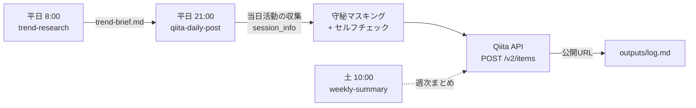

> このシリーズは、Claude Cowork を社内AXの常駐エンジンとして運用する実践ログです。社内固有名・個人名等は伏せています。

「毎日Qiitaを書きたいけど続かない」を、Claude Cowork のスケジュールタスクに肩代わりしてもらう仕組みを当日中に組みました。本記事は、設計判断・トークン管理・守秘ポリシー・記事生成プロンプトまで全部公開します。**そして、この記事自体が、その自動投稿botから配信されています**。

## なぜ作ったか

3つの動機がありました。

1. **継続性を仕組み化したい**: メディア運用は質より「続ける」ことが効く。人間の気合では1ヶ月で折れる
2. **当日のClaude/AX活動が記事ネタの宝庫だった**: せっかく毎日 Cowork で社内Slack監視やカレンダー同期を回しているのに、その学びが個人の頭の中に閉じていた
3. **「自動でQiitaに投稿するbotを作る」というネタ自体が記事になる**: メタ的に成立する一石二鳥

## 全体設計



**3つのスケジュールタスク**で構成しています。

- `trend-research-morning`(平日 8:00): Qiita/GitHub/HN/Anthropic公式から当日のホットトピックを集めてブリーフ生成
- `qiita-daily-post`(平日 21:00): 当日のClaude活動を収集 → 戦略反映で記事生成 → Qiita投稿
- `qiita-weekly-summary`(土 10:00): 当週のまとめ記事を生成 → Qiita投稿

## ステップ1: スケジュールタスクの作り方

Cowork のスケジュールタスクは、cron ライクな指定で「Claude にプロンプトを定期実行させる」仕組みです。MCP 経由で `create_scheduled_task` を呼ぶだけで作れます。

```
taskId: "qiita-daily-post"
cronExpression: "0 21 * * 1-5"   # 平日21:00
prompt: <記事生成と投稿の全手順>
```

ポイントは **cron は実行されるユーザーのローカルタイムゾーン**で評価されること。UTC ではないので、JST で 21:00 に実行したいなら `0 21 * * 1-5` でそのまま書けます。

## ステップ2: Qiita API トークンの取得と保存

Qiita の個人用アクセストークンを `read_qiita` + `write_qiita` スコープで発行します。発行画面は https://qiita.com/settings/applications

トークンの保存場所には少し工夫が要ります。スケジュールタスクは独立セッションで起動するため、別セッションで作った設定ファイルが見えないことがあります。

**採用した方法**: タスクのプロンプト本文に `CONFIG` ブロックとして直接埋め込む。プレーンテキストで残るリスクはありますが、ファイルはユーザーローカルにのみ存在し、シンプルで確実です。

```
QIITA_TOKEN = "xxxxxxxxxxxxxxxxxxxxxxxxxxxxxxxxxxxxxxxx"
SLACK_CHANNELS = []
DEFAULT_TAGS = ["Claude", "AI", "AX", "生成AI"]
POST_MODE = "draft"   # publish / draft 切替
```

最初は `POST_MODE = "draft"` で動かし、生成内容を数日見てから `publish` に切り替える運用をおすすめします。

## ステップ3: 当日活動の集約

Cowork の `session_info` MCP を使えば、自分のセッション履歴を読めます。

```
1. mcp__session_info__list_sessions で直近20セッションを取得
2. 本日のローカル日付に活動があるものを抽出
3. 自分自身(スケジュール実行)のセッションは除外
4. mcp__session_info__read_transcript で会話履歴を取得
5. ユーザーの依頼/Claude のアクション/学びを抽出
```

`list_sessions` は最終アクティビティ降順で返るので、当日分だけ拾うのは簡単です。

## ステップ4: 守秘ポリシーのセルフチェック

Public 公開 = 取り返しがつかないので、ここに一番投資しました。プロンプトに以下のマスキングルールを明記しています。

- 個人名(社内・社外問わず) → 「Aさん」「担当者」
- 会社名・取引先名・プロジェクトコードネーム → 「取引先A社」「弊社」
- Slackチャンネル名(`#xxx-yyy`) → 「タスク管理ch」等の機能名
- 個別契約・金額・請求関連 → 抽象化
- Slack permalink ・社内URL → 含めない

そのうえで「投稿前セルフチェック」を必ず1ステップ入れます。

```
1. 守秘ポリシー違反語の有無を1行ずつスキャン
2. 違反があれば自動マスキング
3. 不安が残れば POST_MODE を draft に強制降格
4. ログに「守秘判断により draft 降格」と明記
```

判断に迷ったら厳しい方を選ぶのが鉄則です。

## ステップ5: Qiita API へ投稿

Qiita API の POST はシンプルです。

```python
import json, datetime, subprocess

payload = {
    "title": title,
    "body": body_markdown,
    "tags": [{"name": t, "versions": []} for t in tags[:5]],
    "private": False,   # Public公開
    "tweet": False,
    "coediting": False,
}
with open("payload.json", "w", encoding="utf-8") as f:
    json.dump(payload, f, ensure_ascii=False)
```

```bash
curl -sS -X POST https://qiita.com/api/v2/items \
  -H "Authorization: Bearer $TOKEN" \
  -H "Content-Type: application/json" \
  -d @payload.json
```

成功すると HTTP 201 + レスポンス JSON に `url` が入っています。

## ハマったところ(7つ)

実際は単純じゃありませんでした。当日中に踏んだ穴を列挙します。

### 1. スケジュールタスク間で状態を共有する手段がない

「朝のトレンドリサーチ」と「夜の記事生成」を別タスクに分けたら、**朝の生成物を夜のタスクが読めません**。各スケジュールタスクは独立セッションで起動し、`outputs/` ディレクトリもセッションごとに分離されます。

→ 解決: 各タスクで都度リサーチを走らせる。重複は許容(リアルタイム性も上がるので結果オーライ)。

### 2. トークン用 config ファイルを `Documents\Claude\Scheduled\<task>\` に置けない

「設定ファイルを作って読ませよう」と思ったらツールが拒否:

```
"outside this session's connected folders"
```

→ 解決: `CONFIG` ブロックをタスクのプロンプト本文に直書き。プレーンテキスト保存はリスクだが、ローカル環境で完結し挙動が安定する。

### 3. Qiita のトレンドページが HTML スクレイピング不能

`https://qiita.com/popular-items` `https://qiita.com/tags/claude/items` は web_fetch で `Redirect was cancelled` を返します(SPA + ボット対策)。

→ 解決: **Qiita API v2** に切り替え。`https://qiita.com/api/v2/items?query=tag:Claude&per_page=10` で JSON が普通に取れます。

### 4. Hacker News のフロントは JS レンダリング、HTML を取っても空

HN Algolia(`https://hn.algolia.com/?q=claude`)は HTML を取得しても JS アプリのシェルだけで本文ゼロ。

→ 解決: HN Algolia の検索 API を直接叩く。

```
https://hn.algolia.com/api/v1/search_by_date?query=claude&tags=story&hitsPerPage=20
```

GitHub Trending と Anthropic 公式 News は逆に **HTML が巨大すぎて token 制限超え**(各 400KB-800KB)。一旦ファイル保存して bash + jq + Python で必要部分だけ抜くフローに変えました。

### 5. Slack チャンネル検索が常にゼロ件

`slack_search_channels` に "ai" "claude" "dev" "general" を入れても全部 `No results found.`。MCP 接続はあるのにチャンネルが見えない状態。権限スコープか参加状況の問題と推測。

→ 解決: 当面 Slack ソースは外し、Claude セッション履歴のみで運用開始。チャンネル名を直指定する設定は残しておく。

### 6. ファイルパスの2重マップに気付くまで時間がかかった

Read/Write ツールは Windows パス(`C:\Users\...\outputs\...`)、bash ツールは Linux マウント(`/sessions/.../mnt/outputs/...`)。**同じファイルなのにツールごとにパスが違います**。Read で見えてるのに bash で `find` しても出てこない、で混乱しました。

→ 解決: 環境のマッピング表を最初に把握。bash には常にマウント側のパスを渡す。

### 7. AI が「ハマったところ」を過小に書きがち(メタ)

最初に書いたこの記事の「ハマったところ」セクションは、タイトルテンプレの話だけ1つでした。レビューしてくれた人から「他にもあったよね?」と指摘され、実は7つあったと気付いて書き直したのが今のセクションです。

**AI に書かせる記事は「困難を平準化して見せる」傾向がある**ので、人間レビューで「もっとハマってない?」と問い直すのが品質を上げます。これも自動化と相性のいいレビュー設計の論点。

## ちなみにタイトルでもハマっています

最初のタイトル案は `【2026-05-04】Claude Coworkで自動投稿してみた` でしたが、Qiita では日付始まりは検索弱く非推奨。「数字 + 具体技術名 + 動詞」テンプレに切り替えました。文字数は **20-28字目安、30字超は検索結果で切れる**ので避ける。

## まとめ

- Claude Cowork のスケジュールタスクは「cron + プロンプト」だけで毎日の自動投稿botに化ける
- ただしタスク間の状態共有は不可なので、**各タスクが独立して完結する設計**にする
- 外部データ取得は **API 直叩きが圧倒的に安定**(SPA/JS-rendered ページのスクレイピングは茨の道)
- ファイルパスのツール間マッピングを先に把握しておくと無駄な迷路に入らない
- 守秘ポリシーとセルフチェックを必ず入れる(自動 draft 降格が安全網)
- AI に書かせた記事は「ハマり」を平準化しがち。**人間が「他にもあったよね?」と問い直す**レビューが効く

明日もこの仕組みで投稿される予定です。次は「コンテンツ4本柱の曜日ローテと、トレンドリサーチタスクの中身」を書く予定。続きも自動投稿で。

---

毎日 21:00 に Claude Cowork × 社内AX の実践ログを更新しています。
シリーズ: Claude Cowork で社内AXを回す
