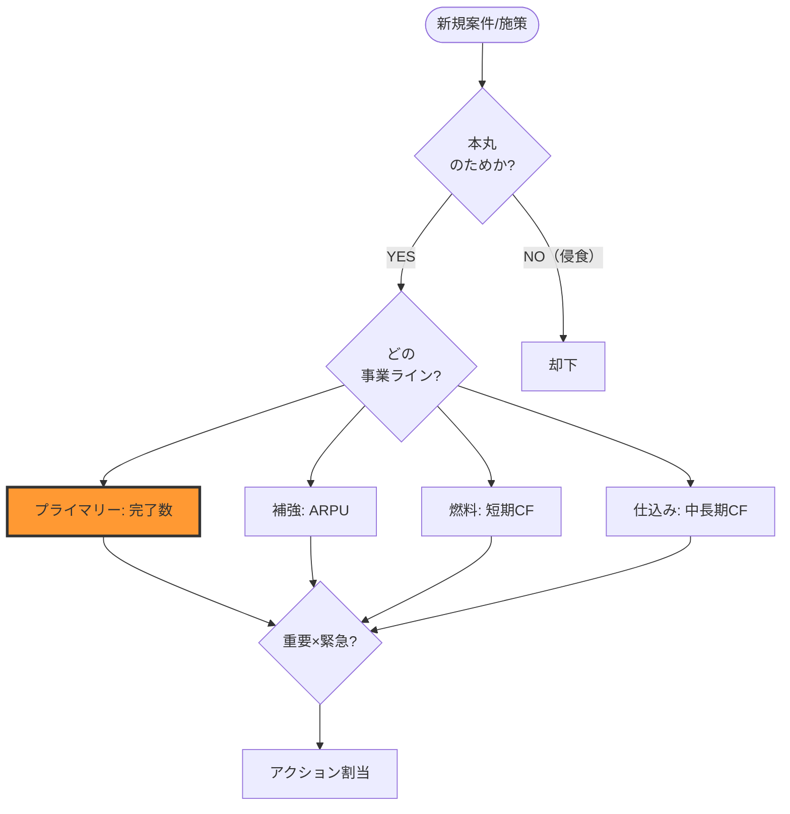

> Claude Cowork を社内AXに使っている私の実践ログです。社内固有名・個人名は伏せています。

最初、私は「予算 × 重要度 × 緊急度」の3層モデルで事業判断フレームを組もうとしていた。Claudeにmermaidで書かせて、3週間運用した。結論から言うと、全部捨てた。

理由は1つ。**本丸が見えなくなる**。

代わりに「プライマリー＋3支援ライン」型に書き直して、迷う時間が体感1/3になった。今日はその比較の話を、雛形プロンプトつきで残しておく。

## 最初に組んだ「3層モデル」のどこがダメだったか

3層モデル、見た目は綺麗だった。重要度と緊急度を軸にして、予算ステータスをレイヤーに重ねる。Claudeに頼んだら30分でmermaidが出てきた。

ただ、これがまた癖が強くて——案件を分類する段階で、本丸の事業と支援的な事業（受託、PoC、社内プロダクト開発）が**全部フラットに同じ土俵で並ぶ**。

そうすると何が起きるか。本丸を侵食する受託案件が「予算的に魅力」と分類されて、本丸の動きが止まりかける、という事件を私は2件踏みかけた。

正直しんどかった。フレーム自体が「本丸を守る装置」になっていない。これに気付くまで3週間かかった。

## 書き直した「プライマリー＋3支援ライン」型

切り替えたフレームはこう。

| ライン | 役割 | 指標 | 本丸との関係 |
|---|---|---|---|
| プライマリー（本丸） | 価値創出の中心 | 完了アウトプット数 | 本体 |
| 補強 | 既存顧客のARPU拡大 | 契約数 | 本丸クライアントへの追加 |
| 燃料 | 短期CF（90日以内回収） | キャッシュ | 本丸を続けるための即金 |
| 仕込み | 中長期CF（6〜12ヶ月） | 開発投資/サブスク | 複利で効く基盤 |

意思決定の最初の問いは、たった1つ。

「これは本丸のためか？」

YESなら通す。NOなら、支援3ラインのどれかに該当するか見る。どこにも入らないなら、その案件は受けない。

シンプル。でも、これが効く。

## 真似できるテンプレ：Claudeに渡すmermaid雛形

私はこれをコピペで使い回している。白紙からClaudeに書かせるより、雛形を渡して「これを我々の事業に合わせて穴埋めして」と頼むほうが圧倒的に早い。



Claudeに渡す指示は1行で十分:

```
上の雛形を、私の事業（本丸=◯◯、支援=◯◯/◯◯/◯◯）に合わせて埋め直して。
指標と上下限ラインも提案して。
```

これでドラフトが5分で返ってくる。あとは現場感で1〜2回触り直すだけ。

## ハマったところ

3週間でやらかしたやつ、共有しておく。

1. **「予算」を一発目の関門に置くと本丸が侵食される**: 最初の問いを「予算は取れるか」にしていたら、本丸を食う案件を弾けず2件踏みかけた。「本丸のためか?」に変えたら止まった。
2. **支援ラインの指標を全部CFで揃えると比較不能になる**: 補強・燃料・仕込みを全部CFで並べたら、回収サイクルが違いすぎて比較できない。短期CFと中長期CFで分けて、補強だけはARPU基準にしたら整理できた。
3. **mermaidを白紙からClaudeに書かせると、最初は階層が深すぎる**: いきなり7〜8ノードのフローを返してくる。「3〜4ノードで」と先に明示するか、雛形を渡すのが正解。
4. **「重要×緊急」を最初に置くと現場ノイズに引っ張られる**: 重要度判定を先にやると、目の前のSlack案件の温度感だけで判定が動く。本丸関門→ライン分類→重要×緊急、の順が固い。
5. **支援ラインの上限を決めなかった**: 燃料ライン（短期受託）に時間を取られて、本丸が動かなくなる事故。「燃料は週X時間まで」と上限キャップを置く必要があった。
6. **mermaidの色分けを後回しにした**: 色なしのフローは「全ノードが同格」に見える。本丸ノードだけ太枠オレンジ、と決めたら一目で構造が出る。これ、地味に効く。
7. **ランウェイ判定を最初の関門にしてしまった**: 「CF危機モードなら全部止める」を最初に置いたら、フレームが守り一色になって、攻めの判定に使えなくなった。ランウェイ判定はフレーム外（毎月の定例で別途）に追い出して解決。

## 私の判断

賛否あると思いますが、私は **「3層モデル」より「プライマリー＋支援」型を強く推します**。理由は2つ。

ひとつめ。3層モデルは「全案件が同じ土俵で比較される前提」だけど、現実の事業は本丸と支援が同格じゃない。土俵を分けるほうが体力に合う。

ふたつめ。判断スピード。最初の問い1つで弾けるかが決まるので、Slackで投げられた相談に5分で返せる。3層だと指標計算が要るので、雑談ベースの判断には乗らなかった。

ただし。初期の小さなチーム（1〜3人）でまだ本丸が固まってないなら、3層から入って本丸が見えた時点で書き直すのが現実的。私もそうやって辿り着いた。

## まとめ

- 意思決定フレームは「本丸かどうか?」の関門を最初に置く
- 支援ラインの指標は全部同じにしない（短期CF / 中長期CF / ARPU など性格別に分ける）
- 支援ラインには必ず上限キャップ（時間 or 件数）を置く
- mermaid雛形をClaudeに渡して埋めさせるのが最速、白紙から書かせない
- ランウェイ判定はフレーム外、毎月の定例で別途見る

みなさんの事業では、判断フレームの最初の関門に何を置いていますか？「ランウェイから入る派」「OKR起点派」もいると思うので、コメントで教えてもらえると嬉しいです。

---

Claude Cowork を社内AXの相棒として毎日使っているエンジニアの実践ログです。

私が日中見ている事業は「N限（Ngen）インターン」── 新卒の実務試験型（ワークサンプル型）インターンを企業に提供しています。AI時代の新卒採用に関心がある方は、下記からどうぞ。
- サービス概要（企業向け）: https://ngen-intern.jp/company
- 使い方ガイド: https://ngen-intern.jp/company/guide
- お問い合わせ: https://ngen-intern.jp/contact

シリーズ: Claude Cowork で社内AXを回す
