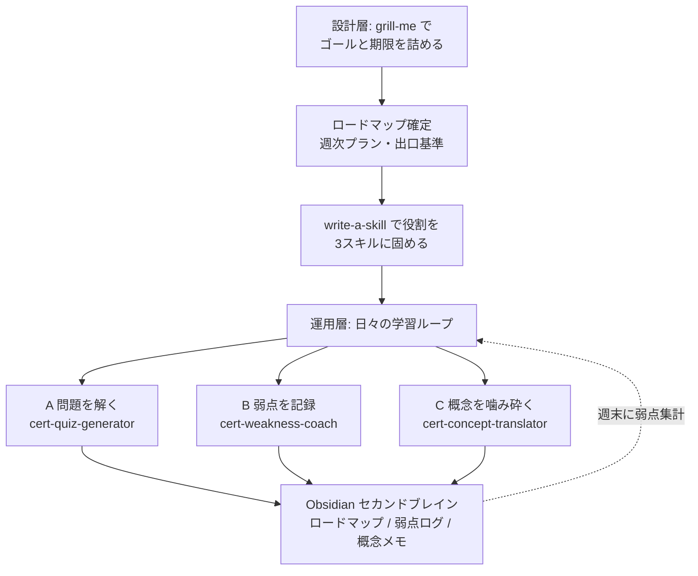

## はじめに

筆者はクラウドインフラの経験が薄い開発者で、AWS の資格学習をこれから始める立場です。「とりあえず教材の 1 ページ目から読む」というよくある独学の入り方は、過去に何度も三日坊主で終わらせてきました。**読む順番が決まっていない・どこまでやれば次へ進んでいいか分からない・学んだことがメモに散らばって見返さない**、というやつです。

そこで今回は、AWS Certified Cloud Practitioner（CLF-C02）の学習を「ふんわりした勉強」ではなく **設計された学習システムとして回す** ことにしました。具体的には、(1) `grill-me` でゴールと期限を詰めてロードマップを確定し、(2) そこで洗い出した「毎日やる役割」を `write-a-skill` で 3 つのスキルに固め、(3) 日々の学習をそのスキルと Obsidian で運用する、という 3 段構えです。本稿はそのシステムの設計記録です。

### 前提知識・環境

- Claude（Code または Cowork）を触ったことがある
- Obsidian で Markdown ノートを書ける
- AWS の知識は不要です（筆者自身が未経験の立場で書いています）

## 背景・課題：独学が続かないのは「設計」と「運用」が無いから

ソフトウェア開発では、いきなりコードを書かずに「ゴールを詰める → 計画する → 小さく回す」という工程を踏みます。ところが独学になると、多くの人（筆者を含む）が **いきなり教材を開く** という、設計工程をすべて飛ばした進め方をしてしまいます。

今回はこの反省から、学習を 2 層に分けました。

- **設計層**：何を・いつまでに・どこまでやれば合格なのかを最初に確定する（＝ロードマップ）
- **運用層**：毎日の「問題を解く・弱点を記録する・分からない概念を噛み砕く」を仕組み化する



## ステップ0：受験日を先に予約し、ゴールを詰める

最初にやったのは **受験日の予約** です。締切ドリブンの前提が崩れると、未経験者の学習はずるずる伸びます。日付を先に固めてから逆算しました。

ゴールと前提の言語化には、Matt Pocock 氏のスキル集にある [`grill-me`](https://github.com/mattpocock/skills) を使いました。本来は「実装前の設計を全方位から詰問する」スキルですが、これを学習ゴールの詰めに転用すると、Claude 側から次々に質問を浴びせてくれます。「最終ゴールは合格か実務か」「期限は」「1 日に確保できる時間は」――答えていくうちに、次の前提が固まりました。

| 項目 | 内容 |
| --- | --- |
| 位置づけ | **CLF は通過点。本命は SAA（Solutions Architect Associate）。CLF は最短で抜ける** |
| 現在地 | 開発者・クラウドインフラは薄い → 想定 40〜60 時間 |
| 期限 | 3〜4 週間（週 12 時間 × 4 = 48 時間想定） |
| 教材 | Udemy 講座 ＋ 所有テキスト ＋ Udemy 付属模試 ＋ Claude 併用 |
| 出口基準 | **模試で 80% を 2 回連続** → 受験 |

ここで重要なのは「**CLF を深追いしない**」と最初に決めたことです。AWS は 200 以上のサービスがあり、未経験者がスコープを切らないと確実に溺れます。料金やサポートプランの暗記など SAA で不要になる部分に時間を使いすぎない、と先に線を引きました。

## ロードマップ：週次プラン（CLF-C02）

確定したロードマップは、4 週間の週次プランに落としました。

### 第1週：土台固め

Udemy 動画を 1.5〜2 倍速で「クラウド概念・IAM・EC2・S3・VPC 基礎」まで通します。テキストは最初から精読せず辞書的に並走させます。分からないサービスは後述の概念翻訳機で開発者目線の例えに変換し、Obsidian の弱点ログもこの週から開始します。

### 第2週：サービス網羅

頻出領域を一気に広げます。DB 各種・ネットワーク・監視・料金/請求・サポートプラン・セキュリティ/コンプライアンス・Well-Architected Framework まで。章ごとに後述の問題製造機で本番形式の 4 択を作らせ、即採点・解説で回します。

### 第3週：アウトプット転換

Udemy 模試を 1 本通しで受験します。間違いを弱点コーチ経由で Obsidian に記録し、弱点サービスを炙り出してから、そこに集中ドリルをかけます。

### 第4週：ゲート突破

模試を回して **80% × 2 回連続** を達成します。弱点ログを最終総ざらいして受験、合格後は SAA 教材へ即移行します。

## ロードマップの「役割」を write-a-skill でスキルに固める

`grill-me` でロードマップを詰める過程で、Claude に毎日やらせたい作業が 3 つの役割（問題を作る・弱点を記録する・概念を噛み砕く）に整理されました。これらは毎回同じ指示を書くのが面倒なので、同じく Matt Pocock 氏のスキル集にある [`write-a-skill`](https://github.com/mattpocock/skills) で **3 つの独立したスキルとして実体化** しました。

`write-a-skill` は「どんなタスクか・起動トリガーは何か・スクリプトは要るか」を順に確認しながら `SKILL.md` を組み立ててくれます。これで作ったのが次の 3 つで、AWS に限らず IT 資格試験全般で使い回せる粒度にしてあります。

- `cert-quiz-generator`（役割A：問題製造機）
- `cert-weakness-coach`（役割B：弱点コーチ）
- `cert-concept-translator`（役割C：概念翻訳機）

`grill-me` が「計画を詰める」スキルなら、`write-a-skill` は「計画に何度も出てくる作業を、その場で再利用可能なスキルにする」スキルです。**計画づくりと、計画を回す道具づくりを地続きにできた**のが、この仕組みの肝でした。

## 日々の運用：Claude の 3 つの役割

前節で作った 3 つのスキルを、日々こう回します。会話で「問題出して」「弱点まとめて」「これ要するに何？」と言うと自動で起動します。

### A）問題製造機 — 本番形式の演習量を稼ぐ

章や動画の単元ごとに、本番と同じ難易度・形式の 4 択を作らせ、1 問ずつ即採点・解説させます。プロンプトはこんな形です。

```text
CLF-C02 の「S3 のストレージクラス」について、本番と同じ難易度・形式の
4択問題を5問作って。1問ずつ出題し、解答後に正解・なぜ他が誤りかを解説して。
```

### B）弱点コーチ — 間違いを構造化して蓄積する

間違えた問題と「なぜ間違えたか」を構造化して Obsidian に貯めます。これにより、週末に「どのサービスで何回つまづいたか」を集計でき、苦手 TOP5 を炙り出して集中ドリルに繋げられます。

```text
いま間違えた問題を「サービス名 / 問われた論点 / 誤答理由 / 正しい理解」の
形式で1行にまとめて。週末に苦手サービスTOP5を集計したい。
```

### C）概念翻訳機 — 暗記ではなく理解で定着させる

未経験者がつまづくのは、知らないサービス名の洪水です。AWS サービスを、開発者が既に知っている概念に例えて 1〜2 文で説明させ、暗記ではなく理解で定着させます。

```text
このAWSサービスを、Java/Webアプリ開発者が既に知っている概念に例えて
1〜2文で説明して。要するに何か、いつ使うかだけ。
```

> 注意点として、**Claude が生成する問題は本番と傾向が微妙にズレる**ことがあります。答え合わせの基準は必ず Udemy 付属模試に置き、Claude の問題は「演習量を稼ぐ補助」と割り切るのがコツです。

## Obsidian をセカンドブレインにする構成

3 つの役割の出力先が散らばると意味がないので、Obsidian の `IT学習/AWS/` 配下に集約しました。

- **学習ハブ（README）**：ロードマップ・弱点ログ・概念メモへのリンクを束ねる目次（MOC）
- **ロードマップ**：前提・週次プラン・出口基準・チェックリスト
- **弱点ログ**：弱点コーチが追記する表
- **概念メモ**：概念翻訳機の出力を 1 サービス = 1 ノートで蓄積

弱点ログは表で持ちます。週末にトピック列で並べ替えれば、苦手が一目で分かります。

```markdown
| 日付 | トピック | 論点 | 誤答理由 | 正しい理解 | 復習済 |
| --- | --- | --- | --- | --- | --- |
| 06-16 | S3 | ストレージクラスの使い分け | Glacier の取り出し時間を混同 | 即時取り出しは S3 Standard-IA | |
```

概念メモは 1 サービス 1 ノートで、テンプレートを固定しておくと迷いません。

```markdown
# Amazon SQS
- 要するに：アプリ間を疎結合にするマネージドなメッセージキュー
- いつ使う：処理のピークを吸収したい／非同期で投げっぱなしにしたいとき
- 例え：Java の BlockingQueue を、運用込みでクラウドが面倒見てくれる版
- 誤解注意：SNS は「配る（Pub/Sub）」、SQS は「貯めて1人が取り出す」
```

`[[ ]]` リンクでハブから各ノートに辿れるので、学んだことが散逸せず、後から「セキュリティグループって何だっけ」を 1 クリックで引けます。これが運用層を支えるセカンドブレインになります。

## まとめ

- 独学が続かない原因の多くは「設計と運用が無い」ことです。学習を **設計層（ロードマップ）と運用層（日々のループ）に分ける** と、その両方を取り戻せます。
- 設計層では受験日を先に予約し、`grill-me` でゴール・期限・出口基準を詰めて、**CLF は最短で抜けて本命の SAA へ** という方針を最初に確定しました。
- 詰めたロードマップに出てきた「毎日やる役割」は、`write-a-skill` で **再利用可能な 3 スキルに固め**、計画づくりと道具づくりを地続きにしました。
- 運用層では Claude を **問題製造機・弱点コーチ・概念翻訳機** の 3 役に分け、出力を Obsidian の **ロードマップ・弱点ログ・概念メモ** に集約しました。
- 題材は AWS 認定でしたが、この「設計と運用に分け、AI を役割で分担し、セカンドブレインに集約する」型は、**あらゆる資格学習・新分野の習得にそのまま流用できます**。

「教材を開く前に、まず学習を設計する」。当たり前のようで未経験者ほど飛ばしがちな工程を仕組みで踏ませる、というのが筆者にとって一番の収穫でした。

## 参考

- [AWS Certified Cloud Practitioner（CLF-C02）公式 — AWS](https://aws.amazon.com/certification/certified-cloud-practitioner/)
- [AWS Certified Solutions Architect – Associate（SAA-C03）公式 — AWS](https://aws.amazon.com/certification/certified-solutions-architect-associate/)
- [AWS Well-Architected Framework — AWS](https://aws.amazon.com/architecture/well-architected/)
- [mattpocock/skills（grill-me・write-a-skill を含むスキル集）— GitHub](https://github.com/mattpocock/skills)
- [Claude Skills 公式ドキュメント — Anthropic](https://docs.claude.com/en/docs/build-with-claude/skills)
